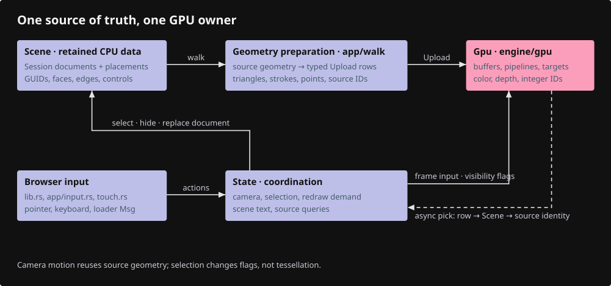
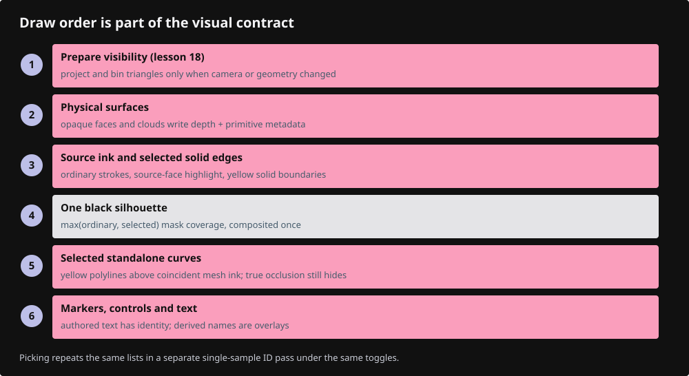
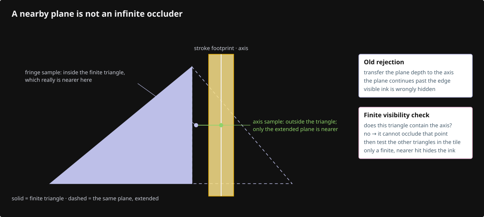

# Session Viewer architecture

Session Viewer is one browser application: Rust compiles to WebAssembly, winit delivers input, and wgpu draws through browser WebGPU. The native offscreen executable uses the same renderer for tests. Start the learning sequence at [Build the viewer](docs/README.md).

## Read the application in this order

1. `src/lib.rs` owns the application and receives events and asynchronous messages.
2. `src/state.rs` coordinates camera, selection, scene changes and requested frames.
3. `src/app/scene.rs` retains source documents and stable identities. `app/walk/` converts each geometry family into display data.
4. `src/engine/gpu/upload.rs` is the typed handoff to GPU storage.
5. `src/engine/gpu/render.rs` lists the drawing passes in their actual order.
6. Read the resource owner for the feature being changed, then its WGSL shader.

GPU code knows how to draw an object row; Scene knows which source object that row represents. A shader never owns CAD topology. An input handler asks State to select or hide an object; it does not reach into a GPU buffer.

## Why these files exist

The split follows ownership and lifetime. A drawing module owns its buffers, pipelines, changed-data upload, drawing and release. It borrows the shared device and compatible frame targets. Keeping these operations together makes it possible to change one representation without searching through unrelated geometry types.

| Owner | Responsibility |
|---|---|
| `lib.rs::App` | Window/event loop, application messages, redraw delivery |
| `state.rs::State` | Camera and ordinary selection transitions, frame invalidation |
| `state/text.rs` | Derive selection labels, present source text and fit shaped bounds |
| `state/cloud_query.rs` | Coordinate source-query pages, GPU answers and original-ID resolution |
| `app/scene.rs::Scene` | Retain `Rc<Session>` documents, placements and source row mappings |
| `app/scene_text.rs` | Stable authored-text/document-title rows and hidden state |
| `app/selection.rs` | Selection modes and original source control identities |
| `app/walk/` | Produce display triangles, strokes, points and source maps using shared geometry |
| `engine/gpu/mod.rs::Gpu` | One device/queue, frame resources and drawing modules |
| `gpu/arena.rs` | Mesh vertex/index/object columns and their capacity |
| `gpu/faces.rs` | Physical triangle/source-face pipelines and face identity rows |
| `gpu/segments.rs` | Joined boundary pipes and standalone ribbons |
| `gpu/surface_outline.rs` | Ordinary/selected coverage masks and one black compositor |
| `gpu/triangle_tiles.rs` | Projected finite triangles, compact screen-tile lists and their cache |
| `gpu/text.rs` | Prepared glyph runs, Glyphon resources and text drawing |
| `gpu/pick.rs` | ID targets, bounded asynchronous readback windows and cancellation |
| `app/loader.rs`, `live.rs`, `stream.rs` | Validated loading, replacement and bounded source ranges |

State has companion modules because text presentation and multi-page source queries have distinct transitions. They remain methods on one State. The GPU text file includes substantial regression tests, so total line count overstates runtime size. `triangle_tiles.rs` keeps its resource owner and pipeline descriptors together; four shaders implement projection, shared equations, binning and prefix sums. There is no generic render graph or speculative service framework.

## Three representations of an object

| Representation | Example | Lifetime and precision |
|---|---|---|
| Source geometry | One BRep face, trim uses and original edge IDs | Retained Session data; f64 coordinates |
| Display geometry | Many triangles and ordered boundary node chains | Rebuilt on geometry changes; source mappings retained |
| GPU representation | Packed vertices, object rows and draw ranges | Object-relative f32 values plus rebased transforms |

One source face may produce thousands of triangles. Ctrl+Shift selects that source face, not an arbitrary tessellation triangle. Every segment of one BRep edge keeps its original edge ID. Standalone polylines remain objects; subdivisions do not become invented CAD edges. F10 reads original vertices or control points.

The kernel supplies matching face/boundary samples and independent face normals. Planar BRep faces do not share smoothed normals across boundaries. Curved interiors use analytic normals with explicit singular fallbacks and crease splits. See [the CAD design record](docs/cad-design.md) for trims, pcurves, provenance and the OCCT comparison.

Projected triangles are a temporary visibility representation of the exact uploaded triangles. They are not another CAD tessellator or shared geometry API.

## A displayed frame

`Gpu::encode_frame` coordinates these operations:

1. Prepare clouds and, when camera or geometry changed, finite triangle visibility.
2. Draw background, grid, opaque faces and cloud resolve into physical depth and metadata.
3. Draw selected and ordinary solid coverage masks against that depth.
4. Draw source-face highlights, print geometry and ordinary strokes.
5. Draw selected **solid boundary** strokes, then composite the black silhouette.
6. Draw selected **standalone** curves, so coincident mesh edges cannot erase their yellow highlight.
7. Draw markers, imported outline text, controls and authored/derived labels.
8. When requested, draw the separate ID pass and schedule its small asynchronous readback.

Steps 5 and 6 have different ordering requirements. A yellow solid edge must not paint over its black silhouette. A selected standalone polyline must remain visible over coincident mesh ink. Both obey physical occlusion: a genuinely nearer solid hides the covered line.

Ordinary outlines describe the union of visible opaque solids. Selected and ordinary masks use **maximum coverage**, not two alpha blends; selected interiors suppress the ordinary contour. The selected radius is 3.375 CSS pixels; ordinary is 2.25 CSS pixels. Multisample mask coverage and a one-pixel transition soften the border. `O` toggles the effect, independently of source BRep seams and mesh edges.

## Why the wrong triangle can hide an edge

Physical depth is reversed: near is larger, depth clears to zero, and opaque surfaces compare `Greater`. A thick line covers samples beside its mathematical axis. Testing a nearby surface at that offset sample can incorrectly hide a line on the surface. The first test transfers the surface's depth to the line axis using the rasterized primitive's gradient.

That test alone has a finite-geometry problem. A neighboring triangle's plane may intersect the axis even when the triangle ends before it. This caused interrupted seams at concavities and touching solids.

The fallback now checks finite triangles:

1. Keep the inexpensive physical-depth test when it accepts the line.
2. If it rejects, test the actual winning triangle and nearby primitive witnesses. A finite, nearer hit confirms real occlusion.
3. Otherwise examine every triangle intersecting the line-axis screen tile, including triangles that won no physical sample.
4. Reject only when a finite triangle contains the axis and is nearer there.

Physical `Rgba16Float` metadata stores the gradient in xy and an exact packed primitive identity in zw. Non-triangle geometry writes zero identity and retains the conservative visibility rule. Picking has its own single-sample depth and matching metadata; it never mixes sample locations with display MSAA.

The fallback uses a 96-byte projected record per triangle. Tiles start at four framebuffer pixels and grow to keep at most 262,144 headers. A pooled budget of 32 references per viewport tile lets dense tiles borrow spare space; it is not a per-tile cap. Count, prefix scan and fill construct contiguous lists. Oversized, overflowing or incomplete lists retain depth rejection, so workloads beyond the budget can still have missing ink rather than hidden-line leaks.

Camera, hiding, placement, rebasing and geometry changes invalidate projection. Selection/color changes do not. Buffer replacement rebinds readers. Scene release drops the tile texture and leaves 128 bytes of placeholders. [Chapter 18](docs/18-finite-visibility.md) reconstructs these contracts and the counterexample.

## Selection, text and asynchronous answers

| Action | Result |
|---|---|
| Left click | Select/toggle one source object |
| Ctrl+left click | Select an original mesh/BRep/NURBS edge |
| Ctrl+Shift+left click | Select an original face; nearby eligible edges retain precedence |
| F10 | Show one parent's original controls; repeat without duplication |
| Escape | Leave component/control mode keeping the parent; next Escape clears it |
| H / S | Hide the selection / show hidden objects, including authored text |
| T | Toggle derived selected-object names; authored text remains an object |
| O | Toggle black solid silhouettes |

Camera-facing and fixed-plane text both have source rows. Selecting a source text object gives it black glyphs on a yellow backing; deselecting restores its authored ink and black backing. `TextLabel::ink_color()` supplies the same selection color to both rendering paths. The centered rounded selection name remains white on black: it is a derived annotation without a source row, so it cannot intercept its parent's click. `engine/text.rs` owns shaping and metrics; GPU code places/draws the result without advancing the pen by bitmap width.

Every scene text backing uses fully rounded corners, with each end cap outside the shaped glyph box. World-plane text evaluates its rounded coverage in perspective-correct UV coordinates and uses the same shape for picking. Camera-facing plates use physical pixel coordinates. Both use antialiased coverage, including while selected.

Default mesh/BRep/NURBS edges and standalone lines/polylines use a 1 CSS-pixel pen (`View.thickness_px`, `?thickness=` or `VIEWER_THICKNESS`). Explicit authored world-space widths retain their dimensions. This pen setting is independent of the black silhouette radii.

Picking returns revision-local GPU addresses that Scene maps to source identity. Camera/scene/mode changes retire stale readbacks. Streamed F10 queries every eligible source page independently of display LOD, then applies the final visible original ID. A delayed page cannot replace a newer selection.

## What invalidates what

| Change | Required work | Reused work |
|---|---|---|
| Camera or DPR/resize | Uniforms, placement, visibility projection/targets; cancel stale picks | Source documents, tessellation, shaped text |
| Selection/color | Object flags/style, selected labels, redraw/masks | Mesh buffers, projected triangle cache |
| Hide/show | Visibility flags, projection invalidation, text visibility, redraw | Source geometry and identity |
| Geometry/document replacement | Source mapping, display data, bounds, caches; cancel stale work | Device and compatible pipelines |
| Text content/font | Shape changed runs, raster data and bounds | Unchanged glyph resources |
| Idle with no pending work | No submitted color frame | All retained resources |

`reset` can retain capacity for an edit rebuild. `release` returns scene-sized storage on replacement. Source-cache weak references do not retain old documents. Owned GPU capacity, estimated texture payload, source payload and WASM memory capacity are different measurements; see [results and limits](docs/measurements.md).

## Add a feature without spreading it through the renderer

For a geometry family, add a Scene/walk producer emitting the existing typed Upload representation where possible. Preserve bounds and source identity. Add a GPU owner only if storage or drawing behavior differs. Wire lifecycle and drawing position in Gpu, then exercise selection, hide/show, replacement and release.

For a layer panel, read Scene hierarchy and issue the same selection/visibility actions as keyboard input. For future editing, replace the affected immutable source document or explicitly invalidate geometry/bounds/source caches. Mutating a vertex buffer behind Scene loses the source of truth needed by controls, picking and undo.

For a shader change, inspect its Rust mirror, bindings, color/ID entry points, sample count and release path together. `instance.rs` checks sizes/offsets and assembled WGSL. Native/browser fixtures check pixels and identities; a WASM compile alone does not validate a WebGPU shader.

## Archive feature map

The archive is a reference, not a runtime dependency. Gumball, snapping, command history, layer and graph UIs remain future work, with no placeholder implementations. Current scope preserves drawing, shading controls, source selection and text. Inspected archive paths are in [the coverage table](docs/coverage.md#archive-reference).

## Build and documentation owners

`Cargo.lock` pins Rust dependencies; `Trunk.toml` builds the browser app and watches the kernel. Native examples are test tools checked on the native target. The browser check uses `wasm32-unknown-unknown --lib`.

The documentation uses Markdown, Material for MkDocs and explicit language lexers. Small Python build/replay tools assemble exact lesson sources and verify checksums; they do not infer Rust APIs from Python signatures. Rust, WGSL and TOML listings use their own syntax rules. The course's final checkpoint is compared byte-for-byte with the frozen runtime inventory.
