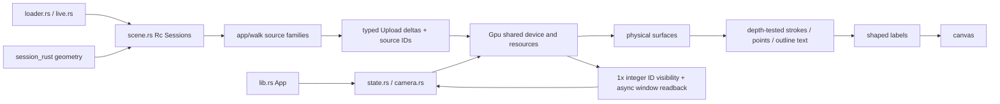
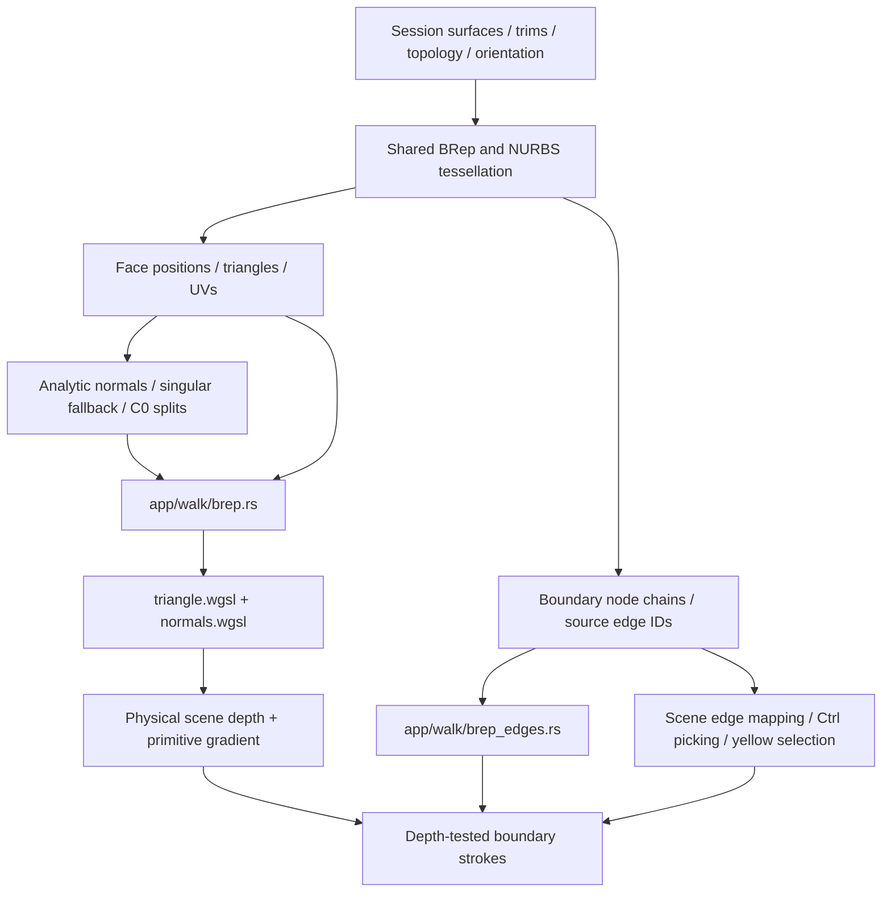

# Session Viewer

Rust 2024 → `wasm32-unknown-unknown` → browser WebGPU. Trunk serves port **8770**. The existing native offscreen harness is for regression measurements; it is not another viewer product.

The first Stage 1 checkpoint passed on 8 September 2026 at source-tree SHA-256 `f1762b8afd3158920d587906a257c8c495ea322fcb01ca6cc544edaf119c9971`, without a commit. The exact inventory is preserved in `docs/reconstruction/baseline.json`. Production verification has reopened for the user's perspective seam, planar apex shading and centered white-on-black annotation cases. Tutorial completion is paused until these additions pass and a replacement baseline is recorded; the current working tree is ahead of the first checkpoint.

## Ownership

| Responsibility | Actual owner | Contract |
|---|---|---|
| Canvas, focus, redraw delivery | `src/lib.rs::App` | Own one winit loop/window; async work returns `Msg`; focused canvas receives shortcuts. |
| Interaction and camera | `src/state.rs`, `src/camera.rs`, `app/input.rs`, `app/touch.rs` | Changes invalidate a frame and retire stale picks; camera motion does not regenerate geometry. |
| Documents and identity | `app/scene.rs::Scene` | Retain `Rc<Session>` and placement; `(document index, GUID)` identifies an instance; GPU row addresses are revision-local. |
| Source controls | `app/selection.rs::Controls` | Read original mesh vertices, topology, NURBS controls, line endpoints and polyline vertices. Never reverse-engineer controls from render triangles. |
| Geometry preparation | `app/walk/` | Geometry-family producers append typed `Upload` rows and source mappings. `WalkCx` carries the parent row. |
| Device, frame state, resources | `engine/gpu/mod.rs::Gpu` | One device/queue, object table, frame uniforms and shared targets. Lanes never create a second device. |
| Pass coordination | `engine/gpu/render.rs` | Dispatch prepared lanes; do not decode or tessellate in a draw call. |
| Loading and replacement | `app/{route,manifest,fetch,decode,loader,live,stream}.rs` | TOML/YAML/JSON manifests, protobuf geometry, bounded range requests, generations and last-valid-scene retention. |
| Publication | `../bash/{view_put,view_live}.sh`, `../bash/lib/view*` | Local authorization, verified geometry before manifest, immutable revisions with stable aliases. |
| Measurement | `app/inspection.rs`, `engine/performance.rs`, `tests/` | `?inspect=1` adds a read-only canvas snapshot; normal product flows do not expose diagnostics. |

The app's scene coordinator explicitly calls the renderer's upload interface. The engine reuses Session math and the shared `RenderVertex` layout; it does not own source topology or document identity.

Text alternative: loading creates retained source documents; geometry preparation produces upload deltas; one GPU coordinator dispatches physical surfaces, visible ink and text; asynchronous picks map GPU addresses back to the active source parent.

## Visualization modules

| Source family | Preparation | GPU owner and shader | Picking identity |
|---|---|---|---|
| Mesh faces | `walk/mesh.rs` | `gpu/arena.rs`, `triangle.wgsl`, `normals.wgsl` | Parent row; original polygon edges supplied separately. |
| Mesh/BRep boundary strokes | `walk/mesh_ink.rs`, `walk/brep*.rs` | `gpu/segments.rs`, `ribbon.wgsl` | Parent + source edge; every segment of one CAD edge keeps that ID. |
| Lines/polylines/curves | `walk/curves.rs` | Shared segment rasterization | Parent object; tessellation segments do not become CAD edges. |
| Plane/OBB frames | `walk/frames.rs` | Shared segment rasterization | Original frame object; existing axis/box display is retained. |
| Element mesh/BRep payloads | `walk_geometry` → existing mesh/BRep producer | Same face/stroke lanes as the contained geometry | Element parent row; an empty Element is explicitly skipped before row allocation. |
| Mesh vertices and points | `walk/mesh_ink.rs`, `walk/points.rs` | `gpu/glyphs.rs`, `sphere.wgsl`, `glyph.wgsl` | Parent; temporary F10 dots map to source `ControlId`. |
| Point clouds | `walk/cloud.rs`, `app/stream.rs` | `gpu/{cloud,splat,lod}.rs`, `splat*.wgsl` | Cloud/chunk mapping → original source row and point ID. |
| Imported PDF outlines | Existing triangulated glyph/fill positions | `gpu/text_outline.rs`, `text_outline.wgsl`; borrows Arena buffers | Original mesh object; no invented text string/font replacement. |
| New text/labels | `engine/text.rs` | `gpu/text.rs`, `gpu/text_plate.rs`, `gpu/text_plane.rs`, pinned Glyphon shader/atlas | Label ID + explicit Screen/Anchor/Nameplate/WorldBillboard/WorldPlane placement. |

Each lane owns creation, changed-data upload, compatible target changes, display/ID drawing, and `reset`/`release`. `GrowBuf` keeps capacity on an edit rebuild; scene replacement releases grown resources. Source geometry is f64; object-relative GPU positions and rebased transforms are f32. Boundary endpoints and face vertices use the same precision conversion.

## Visibility and normal conventions

The camera uses reversed depth: near approaches 1, far is 0, physical depth clears to 0 and compares `Greater`. Perspective near distance retains the user's `1e-4 × focus distance` change. Orthographic extent covers scene bounds without the former arbitrary 100× depth slab.

The physical pass writes opaque mesh/cloud depth and the rasterized primitive’s depth gradient into a matching `Rg16Float` attachment. Strokes carry that primitive’s depth to their axis, including when a grazing triangle covers only one sample. This avoids fitting across unrelated triangles. Gradients outside the finite encoding range retain the bounded neighboring-plane fallback. Point markers keep their verified two-gradient/diagonal guard. No global depth offset or depth-test disable is used. The 54 hidden-ink cases, 21 original floor views and nine-edge/seven-vertex close-up box pass after this change.

Integer picking uses its own **single-sample** physical depth. Its second pass reads that same depth and its own matching single-sample primitive gradient with a neighboring-pixel halo. Sheet IDs preserve the underlying depth and gradient; point IDs write zero gradient. The extra attachment costs four bytes per physical sample and four bytes per picking pixel; `Gpu::allocated_bytes` includes both and their opposite-sample placeholders. Sampling physical MSAA sample zero from a single-sample ID pass was a separate subpixel mismatch and is removed. ID targets are `Rg32Uint`, without blending or color conversion; only a circular CSS-tolerance window is read asynchronously.

`normals.wgsl` applies the cofactor inverse transpose and normalizes, including negative determinants. Triangle front/back interpretation accounts for mirrored instances. Singular transforms return a zero normal sentinel; mesh shading uses a finite face fallback. Smooth normals interpolate and normalize per fragment; source creases retain separate shading vertices.

## Interaction and invalidation

Plain left click selects/toggles one object; an empty click clears ordinary selection. A press moving at least 4 CSS pixels is a drag. RMB orbits; MMB or Ctrl+RMB pans; wheel zooms toward the cursor. Number keys 1–7 choose views; Space changes projection; F fits; C resets; Q/W/E retain point/line/edge toggles; D/B retain lighting/backface controls; H/S hide/show; brackets change cloud size.

Ctrl+left click resolves eligible source edges and establishes their parent. F10 enables that one parent's controls idempotently; zero selection produces status feedback. Plain click in control mode selects a source point. Esc retires pending picks, clears specialized targets and keeps the parent ordinarily selected; the next Esc clears the parent. Focus loss retires incomplete gestures. Replacing or hiding a parent clears invalid selection.

```mermaid
stateDiagram-v2
    [*] --> Object
    Object --> Edge: Ctrl+click eligible source edge
    Object --> Controls: F10 with one parent
    Edge --> Edge: Ctrl+click; replace parent if needed
    Edge --> Controls: F10
    Controls --> Edge: Ctrl+click eligible edge
    Controls --> Controls: select source point / repeated F10
    Edge --> Object: Esc; keep parent
    Controls --> Object: Esc; hide controls; keep parent
```

Text alternative: all specialized selection has one parent; entering another parent's mode replaces the old state; Esc returns to ordinary selection and invalidates asynchronous results.

The resident cloud budget is a display policy, not a source-selection cutoff. In F10, `app/cloud_query.rs` examines every source-node range intersecting the click, in bounded pages; candidate visibility uses the existing GPU ID pass. Results are applied only after all eligible ranges finish, with original IDs read from the source payload. Camera/scene/mode changes cancel the query. Optional display LOD continues; no duplicate full cloud is created for selection.

## Text contracts

Pinned Glyphon 0.11.0 is compatible with wgpu 29. The bundled OFL Noto fonts load explicitly in WASM. Cosmic-text shapes source text into glyph IDs, advances, offsets and clusters; fractional placement is preserved. Actual canvas CSS→framebuffer scale controls raster size and placement once. A single font/layout stack and bounded glyph cache serve all labels; unchanged camera-only placement does not reshape text.

Selected object names use a 13.5 CSS pixel white `Nameplate`, with an opaque black background, maximum rounded corners and 12.75×3 CSS pixel padding, centered on the object's world bounds. This is 75% of the original 18 pixel label size. The horizontal padding keeps both end letters inside the rounded caps. `T` toggles these names, initially on, independently of document and fixed-plane text; the preference survives selection changes and scene replacement. The selected name hides during F10 control selection so a control at the object center remains visible, then returns on Escape if enabled. This explicit annotation mode overlays scene depth because the center can lie inside a solid; `Anchor` and `WorldBillboard` retain physical occlusion. Geometry selection remains yellow. CAD document titles retain the 18 pixel size and square background in the same annotation mode and are prepared when their document is appended. These titles are derived viewer annotations, not additional serialized Session geometry or pickable source objects. Their layout IDs are separate from object rows. The text lane owns and accounts for the background vertex buffer.

`WorldPlane` uses authored world origin, orthonormal right/up axes and an em height in world units. It reuses the shaped text, caches bounded R8 glyph coverage, and projects a textured black rectangle with perspective-correct UVs against physical scene depth. Resolution grows in powers of two from 32 to 256 pixels per em; textures are limited to 4096 pixels per side and 32 MiB total. Camera motion reuses layout and coverage unless the resolution bucket grows. Manifest `texts` records are validated before replacing the current scene and participate in camera fitting. `view_mixed` includes `text_not_oriented_to_camera` at `[23400,-420,60]`, beside the BRep cube, with world-X/right, world-Y/up and height 32.

Selected surface silhouettes follow the archive's coverage-mask approach: replay the exact selected face geometry against read-only reverse-Z depth, resolve R8 coverage at the scene's sample count, then draw a black outer border 1.5 CSS pixels wide. Yellow fill, source vertices and picking remain unchanged. Lines, clouds and control markers do not enter this surface mask. Coverage textures are allocated only with an active selection and released when it clears: one byte per pixel at 1x, five at 4x including resolve; the radius uniform is 16 bytes. The native GPU regression verifies full occlusion, black border, unchanged IDs, sample-count changes and release. The main browser regression also checks the selected labels and persistent `T` preference at DPR 1 and 2.

PDF source text in existing assets has already become positioned outline meshes. Reconstructing strings or substituting Noto would change their typography. The separate unlit outline lane preserves those positions and source styles. Legacy sheets combine lettering and fills in the print run; both runs participate in coverage quality selection. Four samples restore partial thin-stroke coverage within the existing pixel budget. At large canvases where the budget selects one sample, outline-text coverage quality is reduced; shaped overlay text uses its own raster coverage.

## Archive feature map

Paths below are inspected source evidence, not claims that the archived application was run successfully during consolidation.

| Feature | Current status | Archive evidence | Required now / future | Owner / validation |
|---|---|---|---|---|
| Picking and yellow source selection | Implemented and verified | `src/state_pick.rs`, `src/edit_points.rs` | Required | `State`, `selection.rs`, `gpu/pick.rs`; browser interaction fixture. |
| Gumball / transform editing | Archive only | `src/gumball_state.rs`, `state_update.rs::Gumball::new` | Future | Interaction emits an edit transaction; Scene rebuilds changed geometry. No placeholder module. |
| Snapping and move tools | Archive only | `tool_state.rs::snap_cache`, `snap_edges`, `src/snap.rs` | Future | Source query cache keyed by document/geometry revision; overlay lane for feedback. |
| Command line/history | Archive only | `state_ui.rs` command TextEdit/history; `state_cmd.rs` | Future | Browser shell commands call interaction actions; text inputs retain keyboard focus. |
| Buttons/undo toolbar | Archive only | `state_ui.rs::arrow_button`, `src/undo_state.rs` | Future | Browser shell and edit transaction history. |
| Right-side layer tree | Archive only | `tree_ui.rs::render_tree_node`; `web/src/tree-panel.ts` | Future | Read Scene hierarchy/identity; issue selection and visibility actions. |
| Graph UI | Archive only | `web/src/graph-panel.ts::renderGraph`, `web/src/main.ts` | Future | Browser presentation over retained Session graph. |
| Shading and visibility toggles | Existing viewer behavior retained | `state_ui.rs`, `state_update.rs` | Preserve now | `gpu/view.rs`, triangle/splat shading; keyboard regression. |
| Overlays / dimensions / annotations | Shaped labels present; richer annotations future | `state_ui.rs::draw_snap_marker`, archived `src/text.rs` | Text required; other tools future | Explicit text placements and typed source IDs; text-quality fixture. |

## Allocation and lifecycle boundaries

`Gpu::allocated_bytes` sums actual owned buffer capacities and separately estimates depth/color/picking/splat texture payloads. These figures exclude driver overhead, browser swapchain allocation and Glyphon's private atlas/instance capacities. Glyphon starts with separate 256² coverage/color atlases; its private growth is bounded by device limits and the integration's cache-reset policy, but is not reported as measured VRAM.

`engine/performance.rs::heap_mb` is WASM linear-memory capacity in the browser, not live CPU ownership or JavaScript heap. Browser tests record `performance.memory` separately when available. `Rc<Session>` avoids document/loader copies; upload staging rows are dropped after submission. Memory retained by the WASM allocator does not by itself prove a live-object leak.

Winit owns browser input callbacks. Fetch deadline callbacks and live EventSource registrations own their handles and detach on drop. GPU errors/device loss produce a recoverable page message and Reload action. Default WebGPU limits plus a capped 256 MiB storage binding (where supported) cover the measured 158 MB point-cloud table; no optional features, native-only feature, WebGL fallback or production experimental flag is required.

## CAD tessellation, boundary identity and smooth shading

Session's producer is the independent C++/Rust/Python NURBS and constrained-Delaunay implementation in the sibling geometry packages; it does not call an OCCT runtime. The source comparison used the actual **OCCT V8_0_1** implementation below. This is an implementation reference, not a claim of pixel comparison against an OCCT renderer.

| Actual OCCT reference | Relevant contract | Session implementation |
|---|---|---|
| [`StdPrs_ShadedShape.cxx`, `fillFaceBoundaries` and `fillTriangles`](https://github.com/Open-Cascade-SAS/OCCT/blob/V8_0_1/src/Visualization/TKV3d/StdPrs/StdPrs_ShadedShape.cxx) | Use topological edges and ordered polygon nodes belonging to the face triangulation; coordinate winding, face orientation and mirrored placement. | `session_{cpp,rust,py}` BRep `face_meshes_q`; viewer `app/walk/brep_edges.rs`, `brep_orient.rs`, `brep.rs`; `shaders/normals.wgsl` and `triangle.wgsl`. |
| [`BRepLib_ToolTriangulatedShape.cxx`, `ComputeNormals`](https://github.com/Open-Cascade-SAS/OCCT/blob/V8_0_1/src/ModelingAlgorithms/TKTopAlgo/BRepLib/BRepLib_ToolTriangulatedShape.cxx) | Preserve valid normals; derive them from the supporting surface and UVs, with a triangulation fallback when necessary. | Shared `remesh_nurbssurface_grid` and `nurbssurface_trimmed`: analytic normals, deterministic incident-face fallback at singularities, one-sided C0 normals and separate shading vertices. |

`TrimLoops` carries outer and inner UV polygons, optional corresponding XYZ positions in surface coordinates, and optional interior seeds. Original nodes keep `boundary/{loop}/{sample}` provenance. Added knot intersections keep `boundary_interval/{loop}/{segment}` fractions; these are polygon intervals, **not** CAD curve parameters. BRep converts that provenance to edge-table indices and repeated-use identities. Both shading copies at a true crease retain their boundary provenance. The viewer uses exact face-mesh nodes for boundary strokes, and every subdivision of one edge keeps its source edge ID through `SegRows.pipe_ids` and `Scene::edge_at`. Unavailable provenance stays unavailable; an explicitly warned analytic fallback does not manufacture a topology ID.

The first incident grid provides the canonical shared-edge polygon. A later grid with differing boundary samples is rebuilt through the constrained mesher using that polygon and its previous interior UV seeds, sorted to remove map-order dependence. Before curved constrained faces refine their interiors, shared boundaries receive local angular/chord refinement where needed; all incident faces then receive the same polygon. Original samples remain exact. The producing face retains its pcurve parameters. An adjoining face first maps shared XYZ onto its actual pcurve, then validates the lifted position against edge/face tolerances. When surface inversion reaches the wrong periodic branch, a bounded one-dimensional search on that particular lifted pcurve supplies the mapping. Interior C0 knot lines remain constrained inside the trim; their shading normals come from each incident side.

This addresses a geometry defect visible on the teapot: interior centroids refined onto the curved surface crowded fixed coarse boundary chords and buried them. Merely sharing endpoint vertices was insufficient. `teapot_front_meridian_is_not_self_occluded` casts rays to the authored exposed meridian independently of a mesh-derived visibility mask; it fails against the previous kernel at the buried lower-body chord and passes with the fix. The source teapot bytes, GUID, 32 patches and 512 controls remain unchanged. The asset is the existing Newell/GLUT Utah NURBS teapot; a 3ds Max export provenance has not been established.

The additional [COMPAS OCC tessellation comparison](https://github.com/compas-dev/compas_occ/blob/8dc35a32e447bb053b236f0836c2a92d8900f784/src/compas_occ/brep/brep.py#L1232) confirms the same polygon-on-triangulation contract: boundary indices reuse face triangulation nodes. The viewer’s facing test now reads exact incident triangle normals, including both uses of a periodic seam; it does not substitute a shading normal at a singular pole. Planar BRep face normals remain independent across faces. Raw derivative validity is checked before accepting an analytic normal, so a fallback +Z sentinel cannot masquerade as a valid cone/sphere pole derivative.

Quality uses a normal-angle target in degrees and a chord factor relative to the surface bounding-box diagonal: the viewer requests `(5°, 0.001)`, while the shared default is `(20°, 0.005)`. Interior refinement is bounded to eight passes and 200000 vertices. BRep boundary refinement is separately bounded to eight split levels and 4096 added nodes per edge; original caller samples remain exact. These criteria are bounded quality heuristics, not a certified global chord bound. `mesh_loops` returns an empty mesh for invalid input, lost original boundary provenance or an unconstrained C0 crossing. The curved shared-grid regression starts with 7 versus 11 boundary nodes and finishes with identical 7-node XYZ chains on both faces; measured midpoint sag is `0.00694444`, below its `0.0075` model-unit threshold. The finer `(5°, 0.001)` variant retains the first grid’s original nodes, shares every new sample and checks the local normal-angle limit. Equivalent Rust, C++ and Python suites pass 53/61/53 checks, covering curved/planar holes, singular normals, grid and trimmed C0 creases, and shared-grid compatibility.

Text alternative: one shared tessellation supplies the visible surface and its edge chains; analytic normals and crease splits govern shading; instance normal transforms and shared physical depth keep both drawing paths aligned; retained source IDs connect the displayed edges to picking.

Final native CAD verification uses `examples/cad_fixture.rs`, `examples/check_cad_fixture.rs` and `tests/cad-quality.py`. Twelve 700×520 frames were inspected on Intel RPL-S/Vulkan with 4× MSAA: cylinders and spheres shade smoothly; source and rotated/mirrored/nonuniform instances retain correct facing; outer and inner hole boundaries remain attached; the C0 patch retains its sharp geometric fold and crease stroke. Fill-only and unlit pairs separate normals from linework. The sphere interior scanline has a maximum adjacent-channel change of 1/255, while its unlit counterpart is constant. Post-upload source mappings are identical for source/affine pairs: cylinder 147 segments/3 edges, sphere 36/1, hole 159/15. No missing-boundary fallback or GPU validation error occurred. C0 lighting contrast is modest under the default headlight; the separate one-sided-normal tests establish the discontinuity directly.

The follow-up boundary/annotation checks use the updated public mixed scene with the teapot and fixed-plane text. The exact incidence audit covers 13 BReps, including the user’s mixed-scene solids and teapot: no missing f64/f32 segments or empty faces. The current suite passes 77 native unit tests and eight explicit GPU tests; browser source/edge/control gestures, labels/T and fixed-plane text pass at DPR 1/2. The public mixed scene reports the authored world-plane axes and teapot title, with no browser errors and zero idle redraws. Its observed cold/warm settled times are 11.061/9.701 seconds; these are single runs of the changed scene, not a matched loading improvement claim.

The gradient attachment has a measurable cost. Three interleaved native debug runs, each 120 offscreen frames including readback at 1400×900 and 4x MSAA on Intel RPL-S/Vulkan, give median-frame observations of 3.6–3.8 ms before versus 3.8 ms after for the unchanged box, and 4.0–4.2 ms before versus 4.2–4.6 ms after for the teapot. These are CPU wall-clock/readback measurements, not GPU timestamps or browser frame rates. The teapot’s geometry also changed as part of the boundary repair. The earlier broader consolidation measurements below retain their original scene revisions and scope.

## Measured browser results — 8 September 2026

`tests/scenes.cjs` ran all seven public scenes once in a fresh browser context and once by reloading that context: these are the **cold/warm** labels below, not proof of a cold CDN or OS cache. Both builds used visible Chrome 152 on Linux, a 1400×900 CSS canvas at DPR 1, and the same navigation sequence. The host has an Intel i9-13900HX; the browser reports an anonymized BrowserWebGpu adapter. Chrome's Vulkan-enabling launch switches belong to this Linux test setup, not to application requirements. The controlled baseline reconstructs viewer `8ca5e78` and kernel `a59c412`, preserving the user's initial camera change, changing only the incompatible adapter preference, and adding read-only inspection. Its original untracked dependency lock was unavailable: the reconstruction reuses the resolved dependency versions and records the pruned lock. This is a controlled source comparison, not a recovered historical binary.

Raw evidence lives under `/tmp/viewer-astra-y8kd1hog/`: `controlled-baseline/provenance.json` records source, patches and build hashes; `scenes-before/` and `scenes-final/` contain all 28 captures; `scene-revisions.json` records 36 successful source HEAD responses with ETags and lengths. Their latest Last-Modified is 7 September 2026 23:42:25 UTC, before these runs. The current seven-scene captures precede the final bounded metadata-window optimization described below. The final source freeze and subsequent verification are recorded in `docs/reconstruction/baseline.json` and `docs/16-verification.md`.

Times are seconds, **baseline → current**. “First geometry” is the navigation-clock rAF observation of the first inspected color submission containing an object; it is not GPU completion or measured presentation. “Settled” includes the harness's 200 ms readiness polling and deliberate 700 ms settling delay after the scene-posted signal.

| Scene (`view_` prefix omitted) | First geometry, cold | First geometry, warm | Settled, cold | Settled, warm |
|---|---:|---:|---:|---:|
| lines | 2.05 → 2.06 | 1.81 → 2.10 | 20.31 → 21.84 | 20.58 → 20.93 |
| lines_rotated | 2.15 → 1.97 | 1.78 → 1.78 | 7.41 → 7.22 | 6.71 → 6.97 |
| meshes | 1.20 → 1.27 | 1.02 → 1.04 | 7.24 → 7.28 | 7.55 → 6.74 |
| mixed | 0.71 → 0.86 | 0.68 → 0.68 | 7.12 → 7.66 | 7.22 → 7.30 |
| mixed_solids | 1.02 → 1.14 | 0.59 → 0.77 | 1.74 → 1.94 | 1.39 → 1.60 |
| pointclouds | 3.76 → 5.28 | 3.93 → 5.01 | 23.23 → 31.88 | 23.79 → 29.04 |
| live | 1.03 → 1.00 | 0.57 → 0.71 | 1.75 → 1.73 | 1.39 → 1.61 |

The following sums use the actual `loaded` and `appended` log messages for the six scenes other than `pointclouds`. They are logged phases, not a complete partition of elapsed time: streamed range fetch/parse work, browser scheduling and setup are not all included. Identical source scenes do not imply identical generated geometry or coverage: `mixed` and `mixed_solids` each gained five generated vertices, and `lines` restored four-sample coverage.

| Logged phase / observation | Cold baseline → current | Warm baseline → current |
|---|---:|---:|
| Fetch sum | 27.735 → 27.871 s | 27.804 → 27.042 s |
| Parse sum | 5.440 → 6.598 s | 5.414 → 6.074 s |
| Walk sum | 2.507 → 1.985 s | 2.374 → 1.864 s |
| Upload sum | 0.285 → 0.310 s | 0.260 → 0.302 s |
| Settled sum | 45.570 → 47.659 s | 44.843 → 45.151 s |
| Long tasks: count / summed duration | 37 / 8.194 → 38 / 8.970 s | 40 / 8.297 → 44 / 8.804 s |

The observed walk reduction is 20.8% cold and 21.5% warm. These runs do **not** establish a broad loading or frame-time improvement: parse time and retained memory increased, and total settled time did not improve. Long tasks cover loading through the end of scripted navigation. Across all 28 runs, navigation rAF median was 16.7 ms and p95 rounded to 16.7–16.8 ms; every final 1.2 s idle window submitted zero additional frames. rAF cadence is a main-thread scheduling proxy, not a GPU timestamp measurement or proof of a 16.7 ms GPU-frame budget. One cold and one warm run per scene do not establish statistical significance.

Current submitted inventories below come from the inspection snapshot, after navigation. These are actual uploaded rows and recorded draw calls, not source file sizes or theoretical batching counts. Baseline draw-call instrumentation was unavailable, so no draw-call reduction is claimed.

| Scene | Objects | Triangle vertices | Pipe segments | Ribbon segments | Resident cloud points | Draw calls |
|---|---:|---:|---:|---:|---:|---:|
| lines | 744,035 | 4,206,207 | 0 | 1,393,487 | 0 | 4 |
| lines_rotated | 155,465 | 1,585,686 | 36 | 345,602 | 0 | 8 |
| meshes | 4 | 682,513 | 207,962 | 0 | 0 | 5 |
| mixed | 107,186 | 691,468 | 8,528 | 282,039 | 741,989 | 9 |
| mixed_solids | 14 | 9,725 | 680 | 304 | 0 | 6 |
| pointclouds | 10 | 0 | 0 | 0 | 10,781,672 | 3 |
| live | 237 | 8,644 | 12,833 | 0 | 0 | 5 |

Memory is MiB after navigation, with matching cold/warm capacity observations. **WASM capacity, known source CPU payload, and GPU allocation are different measurements; do not add WASM capacity to its owned source payload.** The source payload column is available only in the current build and excludes private nested caches, allocator/map overhead and transient staging. GPU buffers are owned capacities; textures are estimated payloads with the exclusions in “Allocation and lifecycle boundaries.”

| Scene | WASM baseline → current | Current known source CPU payload | GPU buffers baseline → current | GPU textures baseline → current |
|---|---:|---:|---:|---:|
| lines | 559.4 → 1197.4 | 434.1 | 396.8 → 403.1 | 4.8 → 38.5 |
| lines_rotated | 214.6 → 379.2 | 136.8 | 144.8 → 146.5 | 38.5 → 38.5 |
| meshes | 465.1 → 469.8 | 274.7 | 55.9 → 56.7 | 38.5 → 38.5 |
| mixed | 304.0 → 339.6 | 121.0 | 99.5 → 101.2 | 48.1 → 48.1 |
| mixed_solids | 11.4 → 14.8 | 0.1 | 1.3 → 1.3 | 38.5 → 38.5 |
| pointclouds | 261.7 → 248.9 | 158.7 | 204.3 → 204.3 | 14.4 → 14.4 |
| live | 8.8 → 12.3 | 2.8 | 2.1 → 2.1 | 38.5 → 38.5 |

The lines scene's 559 → 1197 MiB WASM-capacity increase is a material tradeoff of retaining source geometry for F10 and the current allocation path, not a memory optimization; the 434 MiB known live source payload does not account for every byte of linear-memory growth. Its larger texture estimate reflects restored four-sample outline coverage. Default `pointclouds` resident rows differ (10,431,672 baseline versus 10,781,672 current) because existing asynchronous budget timing changes the loaded remainder. Its default frame and memory observations are therefore **not a same-geometry performance comparison**. The baseline also recorded one HTTP 416 per cloud run; current runs recorded none. Static-server live-reload/WebSocket and favicon noise are excluded by the harness and are not renderer validation results.

`tests/streamed-controls.cjs` separately verifies the final metadata read window at DPR 1 and 2: one 16-byte color header plus one 64 KiB cached tail range locates all seven small LOD arrays and the ID header, replacing the serial header/body requests. Larger arrays keep the existing 64 MiB individual/128 MiB total bounds; skipped large geometry/ID fields never cause whole-payload reads. Exact exposed ETag validation remains. The fixture still queries all relevant source pages, selects original ID `0xfedcba98` beyond row six million, verifies occlusion across pages and the actual yellow source marker, and cancels delayed reads while retaining only 250,000 displayed points. The optional `?points=0` setting selects the minimum 250,000-point display prefix per streamed file; it does not restrict F10 source queries.

The final matched cloud benchmark (`points-controlled-before/` and `points-controlled-final/`) uses that same display-prefix setting and confirms **4,931,672 resident points in both versions**, including whole-file clouds. Cold settled time falls from **21.132 to 16.732 s (20.8%)**; warm falls from **20.771 to 15.740 s (24.2%)**. Observed first-geometry time falls from 3.685 to 2.633 s cold and 3.020 to 1.905 s warm. Source HTTP resource requests, including the manifest, fall from **118 to 51** in each cache condition (117 → 50 protobuf requests). WASM capacity rises slightly, 265.375 → 268.813 MiB; GPU buffer capacities are effectively unchanged at 95,778,728 → 95,779,024 bytes, with identical 15,120,016-byte texture estimates. The current known source CPU payload is 158.739 MiB; that measurement is unavailable for the baseline. Navigation rAF remains 16.7 ms median / 16.8 ms p95. This is an observed loading improvement at matched point density, not evidence of faster GPU frames. The baseline retains its one HTTP 416 per run; the current build has none.

`tests/picking-performance.cjs` verifies visible yellow pixels after ten trusted pointer-up inputs in each of seven geometry families. Current results are 70/70; baseline is 50/70 because lines and clouds never produced the required highlight. Current per-family p95 input-to-selected-color-submission is 32.3–33.3 ms; the next-rAF presentation proxy is 48.3–49.5 ms. Screenshot completion provides only a 134.1–150.3 ms upper bound including capture/RPC overhead, not photon timing. The 50 ms interaction target is met for submission and the next-rAF proxy in this fixture, not established for physical display presentation or network-backed exhaustive F10 queries. The five working baseline families have submission p95 31.6–33.2 ms, so these measurements demonstrate repaired selection coverage, not a convincing speed improvement.

The final default-density cloud run after the metadata-window change settles in **17.282 s cold / 17.131 s warm**, with all ten objects and 10,781,672 resident points, no recorded errors and zero idle frames. These are current-build observations; the original default run had a different display density. The matched native offscreen depth workload measures 8.0 → 8.5 ms median over 30 frames including readback (about 6% cost); it establishes a correctness tradeoff, not a browser GPU speedup.

## Publication, replacement and verification scope

The existing `view_put.sh out/scan.pb` root `view_` naming contract remains. `view_live.sh scene.toml scan.pb` preserves placements/styles, publishes verified immutable `pb/revisions/<sha256>.pb` data first, updates the stable `pb/view_live.pb` alias using server-side CopyObject, then publishes the mutable TOML and compatible YAML manifests. Unchanged content verifies and reuses its revision; browsers reuse decoded immutable geometry when only placements change. Mutable resources revalidate, bounded failures retain the last valid scene, and later request generations supersede earlier ones. Local credentials stay in owned temporary curl configuration; no write secret enters browser assets. Notifications are sent only after verified publication.

Four maintained mock publication tests pass: ordering and placement preservation, failed upload, failed verification, and repeated unchanged revision without another geometry PUT. An authorized end-to-end probe used unique synthetic R2 keys and a 9,815-byte geometry fixture. Geometry upload/verification took 1,119 ms, stable alias copy/verification 1,234 ms, manifest upload/verification 1,219 ms: **3,572 ms total**. Initial cold browser readiness was 955 ms; publication start to the inspected new color submission was 4,113 ms, with 4 ms from final publication verification to that submission. Screenshot completion was a separate 44 ms upper bound. The final object count changed from seven to fourteen; these small-fixture timings do not predict large scan uploads.

A subsequent visible placement-only revision reused the same geometry: revision HEAD verification 516 ms plus manifest upload/verification 1,206 ms, **1,722 ms total, zero geometry PUT bytes and zero new browser protobuf requests**. With one-second polling, publication start to inspected submission was 2,429 ms; final publication verification to submission was 656 ms, and capture completion 710 ms. The normal-size fourteen-object capture was inspected. All four owned remote probe keys were removed and their absence verified; user live keys were untouched and no real notification was sent. Public CORS responses expose Content-Range, Content-Length, Accept-Ranges and ETag. Raw timing, request and cleanup evidence is outside the repository under the measurement directory's `publication/` subdirectory.

`tests/loading.cjs` passes malformed replacement, older delayed response after newer completion, and six alternating scene replacements. Repeated equal workloads retain exactly equal owned GPU capacity; WASM capacity remains 5,505,024 bytes across those cycles. `tests/lifecycle.cjs` passes text-input focus, mouse pointer cancellation, hidden-canvas idle and changed CSS size/DPR with unchanged physical framebuffer dimensions.

The verified toolchain is Rust/Cargo 1.97.1, viewer edition 2024, shared Rust edition 2021, Trunk 0.21.14, locked wgpu 29.0.4 / winit 0.30.13 / Glyphon 0.11.0 / TOML 0.8.23. Browser evidence uses Ubuntu 26.04.1, Chrome 152.0.7977.82 and Playwright 1.58.2; native GPU evidence identifies Intel RPL-S/Vulkan. The strict WASM/native Clippy gates and viewer-only formatting pass. The initial consolidation passed 68 native unit tests, five explicit GPU tests and 51 Rust / 59 C++ / 51 independent Python CAD tests. The completed boundary and annotation follow-ups increased these to 77 native, eight GPU and 53/61/53 shared tests, all passing; C++ includes eight additional preexisting cases. Depth verification passes 54 hidden-line views and 21 fully covered floor-ID census views with zero hidden leakage, preserves nine close-up red edges/seven dark vertices at 1× and 4×, and leaves 242,720 mixed close-up pixels unchanged.

The same-font white-on-black fixture was checked at 12/14/16/18/24 CSS px, DPR 1/1.25/2 and actual Chrome page zoom 100/125/150/200%; maximum line-width drift was 0.0026 CSS px and no glyph was missing. Native tests cover depth, clipping, motion, cache eviction after 4,096 distinct raster keys and release. Real PDF outline text retains source geometry: automatic 4× coverage restores partial edge pixels for normal-size words while word bounds stay within one pixel and ink mass changes by only 1–2%.

Firefox, Safari, physical monitor migration, mobile/touch hardware, physical display latency and a separate weak browser GPU are **unverified**. The native integrated adapter result does not identify the anonymized browser adapter. `scenes/view_drawings.toml` is absent from the authorized R2 inventory and returns 404; it is not counted as passed. The seven available YAML scenes and local PDF fixtures were tested. Requested TOML aliases currently return 404 and resolve through the maintained YAML fallback. No claim is made about inaccessible source scenes or unsupported environments.

## Final reconstruction and cleanup verification

All 17 clean tutorial prefixes build and run in the recorded Chrome environment. The final prefix matches all 82 runtime Rust/WGSL files and 283 frozen files overall; differences are limited to documented local input packaging. The maintained records are `docs/reconstruction/{baseline,verification,convergence}.json`.

Final validation after scoped cleanup repeats the native/WASM lint and build gates, 77 unit/eight GPU tests, 53/61/53 shared parity, four publication tests, 54 hidden-line views, 21 floor views, 12 CAD captures, 13 exact BRep incidence audits and the close-up box. Seven public scenes pass both cold and warm runs with no browser errors or idle redraws. Selection, streamed original controls, fixed-plane and selected-name text, T, teapot identity, replacement/lifecycle, actual text zoom and the original PDF coverage also pass. The complete clean reconstruction includes 28 further tutorial CAD views and 12 detailed chapter behavior gates.

Cleanup removed the unused empty npm lock and generated Python caches, corrected stale guidance and preserved fonts, reference fixtures and user datasets. The obsolete `docs_archive` directory was subsequently removed at the user’s request. Active ignored build outputs are retained for the running viewer. No commit was created. This final scope does not extend the browser/hardware claims above.
