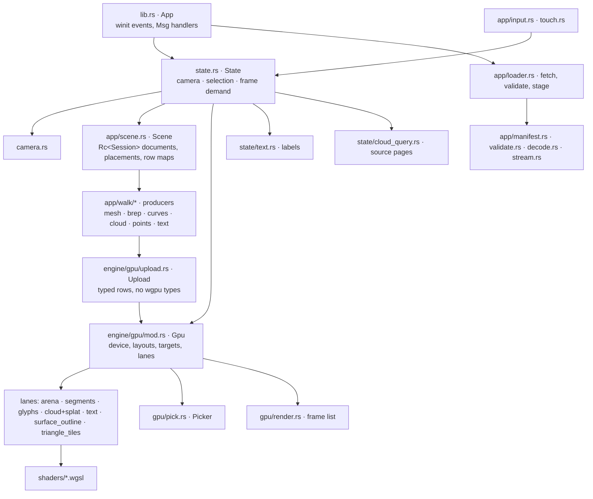
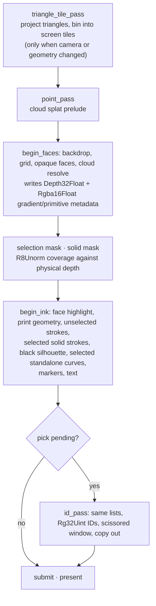

# Session Viewer architecture

Reference for the finished viewer: one browser application, Rust compiled to WebAssembly, winit for input, wgpu over browser WebGPU. The [course](docs/README.md) builds it from an empty crate; this page describes the result.

## Module graph

The one upward flow is a pick answer: `Picker` returns a row and sub-ID, `Scene` maps them to a source identity, `State` selects.

Higher layers drive lower ones, never the reverse: a shader knows an object row, `Scene` knows which source object that row is, and input asks `State` to select rather than touching a buffer.

## Owners

| Owner | Responsibility |
|---|---|
| `lib.rs::App` | Window and event loop, `Msg` handlers, the one place a redraw is requested |
| `state.rs::State` | Camera and selection transitions, `needs_frame` / `dirty`, pick requests |
| `state/text.rs` | Selected-object names, source text presentation |
| `state/cloud_query.rs` | Streamed-cloud source queries across pages, original-ID resolution |
| `state/sheet_query.rs`, `app/sheet_query.rs` | Sheet entity metadata: two ranged reads of the side table on selection |
| `app/walk/sheet.rs` | A sheet slice into ribbon segments with per-segment source ids |
| `app/scene.rs::Scene` | Retained `Rc<Session>` documents, placements, row → source maps |
| `app/scene_text.rs` | Stable rows for authored text and document titles |
| `app/selection.rs` | `SelectionMode`, `ControlId`, `Controls` |
| `app/modeling.rs`, `app/edit.rs` | Validated source transactions and placed control edits |
| `app/hierarchy.rs`, `state/panel.rs` | Bounded tree/graph index and shared select/hide actions |
| `app/ui.rs`, `gpu/ui.rs` | egui input/widget state, then GPU buffers and font textures |
| `app/gizmo.rs`, `gpu/widget.rs` | Handle hit tests and one reusable unlit mesh with a temporary antialiasing tile |
| `app/walk/` | Source geometry → typed `Upload` rows with source identity and bounds |
| `engine/gpu/mod.rs::Gpu` | One device and queue, layouts, frame uniforms, targets, every lane |
| `gpu/arena.rs` | Mesh vertex, index and object columns; `faces.rs` source-face rows; `triangle_tiles.rs` finite-visibility cache |
| `gpu/segments.rs` | Joined boundary pipes and standalone ribbons with source-edge IDs |
| `gpu/glyphs.rs`, `cloud.rs`, `splat.rs` | Markers and control dots; cloud LOD nodes; point splat prelude and resolve |
| `gpu/surface_outline.rs` | Ordinary and selected coverage masks rasterized in one pass, block maxima of each, one black compositor that skips every pixel no covered texel can reach; the masks are reused while camera, geometry and selection stand still |
| `gpu/text.rs`, `text_plate.rs`, `text_plane.rs`, `text_outline.rs` | Shaped glyph runs, plates, fixed-plane text, imported outlines |
| `gpu/pick.rs::Picker` | ID targets, bounded readback windows, generations and cancellation |
| `app/loader.rs`, `fetch.rs`, `live.rs`, `stream.rs` | Fetching, validation, staged replacement, bounded ranged reads |

## Three representations of an object

| Representation | Example | Lifetime and precision |
|---|---|---|
| Source | One BRep face, its trim uses, original edge IDs | Retained `Session` data, f64 |
| Display | Triangles, ordered boundary node chains, markers | Rebuilt on geometry change; source maps kept |
| GPU | Packed vertices, `Instance` rows, draw ranges | Object-relative f32 plus rebased translations |

Selecting a source face (Ctrl+Shift) selects the face, not a tessellation triangle. Every segment of one BRep edge carries the original edge ID. F10 shows original vertices or control points, not display subdivisions.

## A frame

`Gpu::encode_frame` in `gpu/render.rs`:

Order matters twice in the ink pass: selected solid strokes go below the silhouette so their yellow fringe cannot narrow its black border, and selected standalone curves go above it so a coincident mesh edge cannot erase them. Both obey physical occlusion.

The gumball tile is rendered and composited after scene ink; egui draws the final interface. Both overlays use their own layouts and avoid writing scene depth. Their sample counts do not depend on scene MSAA.

## Memory

Per-pixel attachments dominate: at 4x MSAA the colour, depth and `Rgba16Float` metadata targets cost 64 bytes per physical pixel, at 1x 12. `Targets::samples_for` chooses 4x only for solid geometry, inside the adapter's pixel budget (9 Mpx discrete, 2.5 Mpx integrated, 4.2 Mpx unknown), and below two physical pixels per CSS pixel, where the pixel density already halves the stair-steps; `?msaa=4` and `?msaa=1` force it. `?dpr=1.5` caps the device pixel ratio the canvas is rendered at, for people who prefer memory over crispness; nothing caps it by default. Every size-bound texture is an `Attachment`, whose drop calls `destroy()`: wgpu's WebGPU backend frees nothing on drop, so the old attachments of every resize would otherwise wait for the JavaScript garbage collector - a window drag (one resize a frame, 64 bytes per pixel each at 4x) lost the device on a scene of twelve objects. `replace_buffer` does the same for a table that grew or a pool that was resized, and `State::resize` applies at most one resize per 100 ms while a drag lasts. Thirty slow drag frames in a row, or the page a device loss reloaded into, set `view::reduce`: device scale 1, no antialiasing, in memory only. On a lost device the page reloads itself once with the browser's reason in `?recovered=`; `adopt_recovery` on the reloaded page reduces, takes the parameter back out of the address, and the status line names the reason; a second loss shows the error panel. `?inspect=1` publishes `gpu_texture_estimate_bytes` and `gpu_buffer_capacity_bytes`; these estimates exclude browser overhead and renderer-private allocations.

## Depth and visible ink

- Depth is reversed: near is larger, the clear value is zero, opaque faces compare `Greater`.
- A stroke covers samples beside its axis. The ink shader transfers the winning primitive's depth to the axis through the stored gradient before comparing, so a line on a surface is not hidden by the surface beside it.
- A neighbouring triangle's plane can cross the axis outside the triangle. The finite fallback in `triangle_tiles.rs` then tests the actual triangles that intersect the axis's screen tile: projected records (six `vec4<f32>` each), per-tile counts, a prefix scan, and filled `(primitive, max depth)` lists. Overflowing or incomplete lists keep the conservative rejection. The list pool is sized for the scene, two references per tile plus eight per triangle, and the scan writes the words it needed into the first record; the CPU reads that back a frame later and grows the pool before the next projection, so a small scene never pays the 64 MB ceiling of a 262 144-tile grid.

## Rust ↔ WGSL interfaces

Bind group scheme for every draw (`engine/pipelines/layouts.rs`):

| Group | Binding | Rust layout | WGSL |
|---|---|---|---|
| 0 | 0 | `Layouts::mvp`, uniform | `@group(0) @binding(0) var<uniform> mvp: mat4x4<f32>` |
| 1 | 0 | `Layouts::line`, uniform | `@group(1) @binding(0) var<uniform> line: LineUniform` |
| 2 | 0 | `Layouts::instance`, storage | `@group(2) @binding(0) var<storage, read> instances: array<Instance>` |
| 2 | 1 | anchored translations, storage | `@group(2) @binding(1) var<storage, read> translations: array<vec4<f32>>` |
| 2 | 2–5 | `Layouts::ink_instance`: physical depth and gradient, single and multisampled | depth and float textures sampled by the ink fragment stage |
| 2 | 6–7 | projected triangles and tile lists | finite-visibility storage read by `ink_visibility.wgsl` |
| 3 | n | the lane's own rows (`ink_rows`, `segment_rows`, `points`) | e.g. `@group(3) @binding(0) var<storage, read> segments: array<StrokeSegment>` |

`Instance` (`gpu/instance.rs`) is one 96-byte row: `model: [f32;16]`, `color: [f32;4]`, `flags: u32`, `thickness`, `spacing`, `_pad`. The translation column is zero; the rebased translation is the 16-byte row at group 2 binding 1, so a re-anchor rewrites 16 bytes per object. Flag bits: selected, hidden, inside, print, open, sheet, smooth. Layout tests in `instance.rs` compare the Rust size and offsets with the WGSL declaration.

Meshes are vertex-pulled: `triangle.wgsl` reads `face_vertices`, `face_objects`, `face_indices` from storage at group 3 instead of a vertex buffer. Textures: color surface format, `Depth32Float` physical depth, `Rgba16Float` metadata (gradient in xy, packed primitive ID in zw), `R8Unorm` coverage masks, `Rg32Uint` pick IDs with their own `Depth32Float` and metadata.

## Flows

**Camera.** Pointer delta → `Input` → `Camera::orbit / pan / zoom_at` (f64, target + distance + quaternion) → `view_proj_anchored(aspect, anchor)` with reversed depth and a near plane at a fraction of the focus distance → `FrameUniforms` (`mvp`, eye, ortho half-height) → group 0.

**Geometry.** `Msg::File` → `Scene` retains the document → `app/walk/*` produce `Upload` rows (arena, segments, glyphs, cloud, object rows, bounds) with source maps → `Gpu::set_scene` appends rows to lane buffers and rebinds → `render.rs` draws ranges.

**Picking.** Pointer up without a drag → `State::request_selection` records mode, generation, camera → `id_pass` renders IDs into an attachment the size of the window around the cursor plus a three-texel halo, not the canvas: the pick pass sees the scene through the sub-frustum of that window (`PickView::clip_transform`), with the projection factors scaled so pens and markers keep their pixel size, and the visibility test addresses the canvas-wide tiles through `LineUniform::origin` → `Picker` maps a bounded copy asynchronously → row and sub-ID → `Scene::object_at / edge_at / face_at` → `SelectionMode` → `Instance::FLAG_SELECTED` uploaded → redraw. A camera, scene or mode change retires answers from an older generation. The ID, depth and metadata targets therefore cost a few kilobytes instead of 20 bytes per canvas pixel.

**Document history.** The kernel `Session` keeps a `History` of transactions: a removal's record is the tombstone undo restores from, `replace` is the recorded edit, and every save purges the buffer. The viewer commits modeling operations through `Session` transactions and rebuilds display rows through `Scene::rebuild`; pointer movement previews GPU rows and commits once on release.

**Sheets.** A drawing publishes as one `Sheet` message (`Objects.sheets`, field 17): packed fixed-width `coords`, `colors`, `widths` and `source_ids`, so `stream.rs` locates the arrays from the first kilobytes and the loader streams segments by byte range under a segment budget. The whole sheet is one object row and one ribbon draw; every segment carries its entity id through `SegRows.ribbon_ids`. A pick resolves row plus segment to the entity, and `sheet_query.rs` reads its GUID, name and kind from the `.meta` side table in two ranged reads, cached per sheet with the table's ETag. The kernel never decodes a sheet.

**Controls.** F10 → `Controls` collects original vertices or control points of the selected parent → marker rows uploaded with `ControlId` → a control pick returns the original identity, not the marker slot. Streamed clouds query every eligible source page (`state/cloud_query.rs`) independently of display LOD and apply the final visible original ID.

**Text.** String, font, size → `engine/text.rs` shapes glyph runs with the bundled Noto fonts → `TextPlacement` (Screen, Anchor, Nameplate, WorldPlane, WorldBillboard) → `TextLane::prepare` chooses the physical raster size once per DPR → coverage atlas → plate pass and glyph pass; fixed-plane text uses `text_plane.wgsl` with perspective-correct rounded plates that also serve the ID pass.

**Loading.** Route → manifest (TOML, YAML or JSON) → `validate.rs` checks counts, indices, transforms → protobuf decode → `PendingDocument` staged with a request generation → `Msg::File` in manifest order. Stale generations are dropped; a malformed document keeps the last valid scene.

## Lifecycles

| Change | Required work | Reused work |
|---|---|---|
| Camera, DPR or resize | Uniforms, placement, finite-visibility projection, targets; cancel stale picks | Documents, tessellation, shaped text, the visibility pool's grown size |
| Selection or color | Object flags, selected labels, masks, redraw | Mesh buffers, projected-triangle cache |
| Hide or show | Visibility flags, projection invalidation, text visibility | Source geometry and identity |
| Document replacement | Source maps, display data, bounds, caches; cancel stale work | Device and pipelines |
| Text content or font | Reshape changed runs, raster, bounds | Unchanged glyph resources |
| Idle | Nothing submitted | Everything |

`reset` keeps capacity for an edit rebuild; `release` returns scene-sized storage on replacement. `SourceCache` (`app/inspection/source_memory.rs`) holds `Weak<Session>` identities, so measuring retained source payload never extends a document's lifetime.

| Retained data | Invalidate or release |
|---|---|
| Hierarchy row index | `row_revision` changes or scene clears; at most 200,000 nodes / 1,000,000 row references |
| Gumball mesh and uniform | Fixed 371,616 bytes until renderer destruction |
| Gumball tile | Replaced on tile-size change; destroyed on deselect; at most 36 MiB |
| egui command state | 2,048 input characters, eight history entries; no source geometry |
| egui fonts and draw buffers | Process texture frees between frames; remaining textures free with renderer; private capacity is outside inspection counters |
| Source history | Kernel transactions retain undo data; no whole-document memory cap is claimed |

Loader routing state, live polling and the small UI model have one-page lifetimes. The application does not offer repeated mount/unmount in one page. Releasing allocations also does not shrink WebAssembly linear memory back to the operating system. Resource counters measure named allocations, not total browser memory.

## Input

| Input | Result |
|---|---|
| Left drag on handle / right drag / middle drag / wheel | Edit / orbit / pan / zoom toward the cursor |
| Left click | Select or toggle one source object |
| Ctrl + left click | Select an original mesh, BRep or NURBS edge |
| Ctrl + Shift + left click | Select an original face; a nearby eligible edge wins |
| F10 / Escape | Show the parent's original controls / leave the mode, then clear |
| 1–7, C, F, Space | Standard views, reset, fit, projection toggle |
| Q, W, E, O, P, D, B | Points, lines, mesh edges, silhouettes, x-ray, lighting, back faces |
| H / S / T | Hide selection / show all / toggle selected names |

## Editing overlays

`app/ui.rs` owns the egui context and translates winit input into panel actions and commands. `engine/gpu/ui.rs` owns its renderer and font textures and draws after the scene. Text input takes keyboard focus while the command window is open; scene shortcuts resume after closing it. The white/black visuals follow the archive customization. The old DOM command and layer listeners are removed.

The gumball owns one fixed mesh and 96-byte uniform, plus a selected-only antialiasing tile capped at 1024×1024. Its shader uses unlit colors; the tile uses 4× MSAA and 2× resolution before compositing. Deselect destroys the tile. Neither overlay owns document geometry. UI hit-box snapshots are opt-in with `?inspect=1`.

## Adding a feature

For a new geometry family: a `walk/` producer that emits existing `Upload` rows with bounds and source identity; a new lane only when storage or drawing differs; one line in `render.rs`; then exercise select, hide, replace and release. For a shader change: read its Rust mirror, bindings, color and ID entry points, sample count and release path together, and check the layout test in `instance.rs`. Never mutate a vertex buffer behind `Scene`: it is the source of truth for picking, controls and undo.

The CAD geometry contract (shared boundaries, trims, pcurves, provenance) is in the [CAD design record](docs/cad-design.md).
