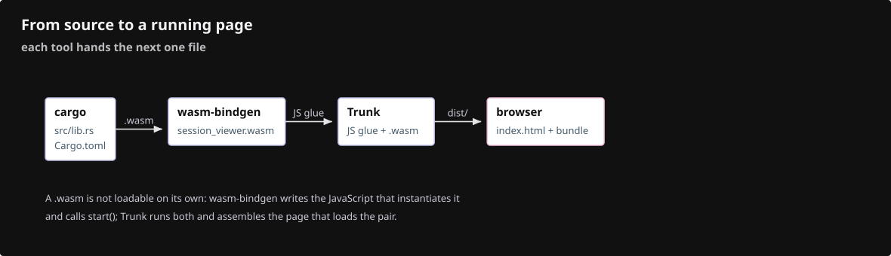
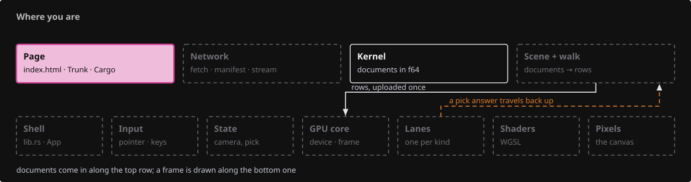
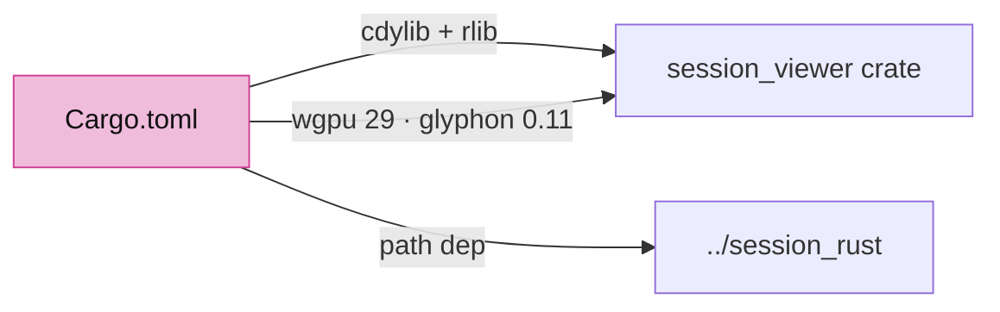
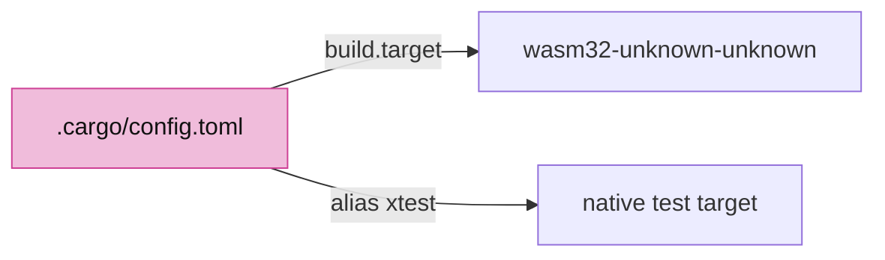
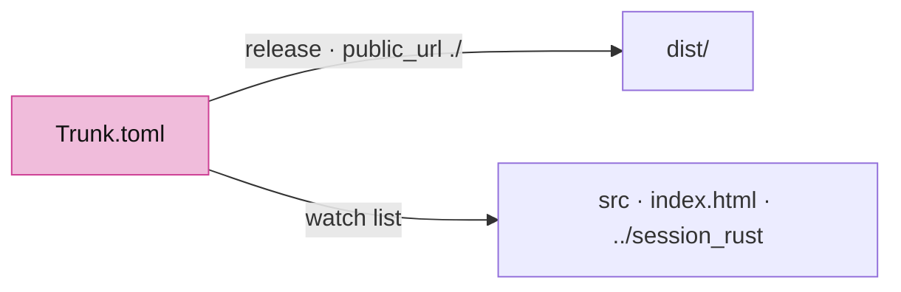
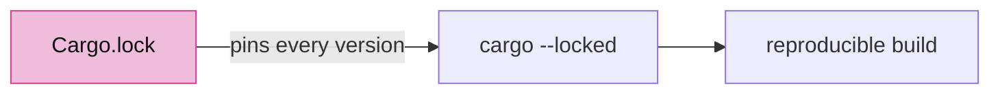
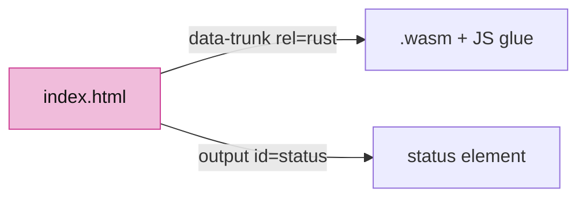
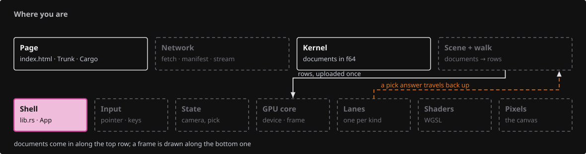
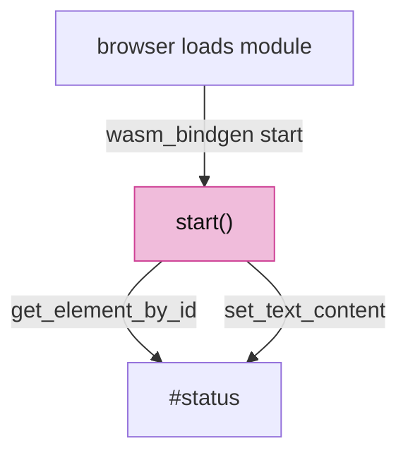
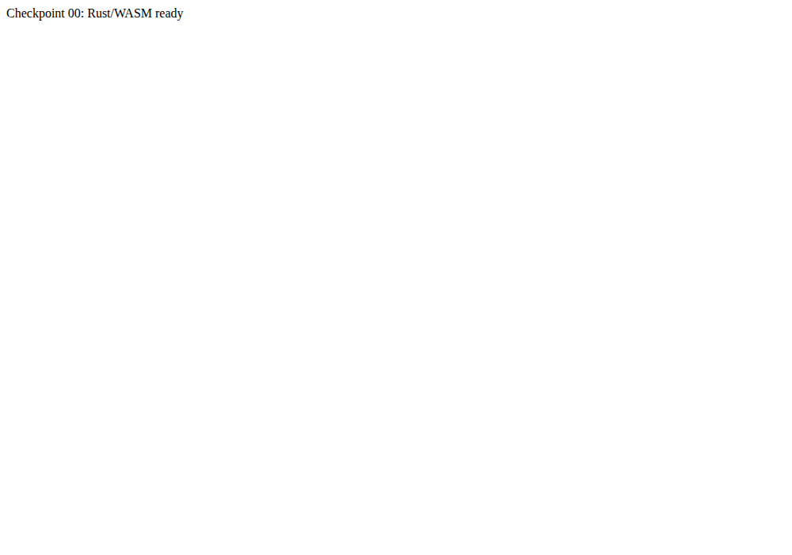

# 00 · Empty project to a WASM message

## You are building




## Starting point

- `$COURSE_WORK/session_rust`, `session_cpp`, `session_py`, `session_proto`: the pinned kernel, extracted by the [setup](README.md#prepare-one-workspace).
- `$COURSE_WORK/session_viewer`: does not exist yet. Create it:

```sh
mkdir -p "$COURSE_WORK/session_viewer/src"
cd "$COURSE_WORK/session_viewer"
```

<!-- step-status: start -->

**Does it compile yet?** `cargo check` passes after step 6, and fails after 1–5: a file is written across several steps, and a check can only pass once its last piece is in. Concretely, steps 1–5 build again at step 6. This is measured at the end of every step rather than guessed. And where a check passes while your new files are not yet named by a `mod` line, it is telling you only that you have not broken the previous checkpoint — the checkpoint build at the end of the lesson is the real test.

<!-- step-status: end -->

## Step 1 · Declare the crate

{ .locator data-strip="illustrations/strip-e9e7fd14c7.svg" }

- `cdylib` is what wasm-bindgen turns into a browser module; `rlib` lets native tools link the same crate.
- Every version here is pinned by `Cargo.lock` in step 4; `wgpu = "29.0"` and `glyphon = "=0.11.0"` must move together.
- The `[target.'cfg(not(wasm32))']` table stays at the end: a target table in the middle silently swallows every `[dependencies]` line after it.



<!-- file: 00 session_viewer/Cargo.toml copy -->

## Step 2 · Make wasm32 the default target

{ .locator data-strip="illustrations/strip-e9e7fd14c7.svg" }

One line makes every `cargo` command build for the browser, so the code needs no `#[cfg(target_arch = "wasm32")]` gates. `xtest` is the native alias that runs the tests.



<!-- file: 00 session_viewer/.cargo/config.toml type -->

## Step 3 · Tell Trunk what to bundle

{ .locator data-strip="illustrations/strip-e9e7fd14c7.svg" }

Release builds, no subresource hashes, and a watch list that includes the kernel next door.



<!-- file: 00 session_viewer/Trunk.toml copy -->

## Step 4 · Pin the dependency graph

Dependency data, not code. The course was verified against exactly these versions, so install the lockfile with the supplied-files command instead of typing it.



<!-- supplied: 00 -->

## Step 5 · The page

{ .locator data-strip="illustrations/strip-e9e7fd14c7.svg" }

One element with `id="status"`; Rust looks it up by that name.



<!-- file: 00 session_viewer/index.html copy -->

## Step 6 · The first Rust function

{ .locator data-strip="illustrations/strip-7cbb7f3a48.svg" }

- `#[wasm_bindgen(start)]` runs this function when the browser finishes loading the module.
- `web_sys` is the browser DOM seen from Rust; `expect` aborts with a readable message if an element is missing.
- The `data-checkpoint` attribute is what the automatic checkpoint test reads, so a static HTML message cannot pass for Rust.



<!-- file: 00 session_viewer/src/lib.rs type -->

## Check

<!-- checkpoint: 00 -->

Expected:

- `cargo check` finishes with no errors and no warnings.
- The page shows **Checkpoint 00: Rust/WASM ready**.
- No canvas: this checkpoint is one line of text written by Rust.



If Cargo cannot find `../session_rust`, the setup ran in a different `$COURSE_WORK`. If the status never changes, open the browser console and check that you opened the Trunk address, not the file from disk.

## What changed

<!-- tree: 00 session_viewer -->

- New crate that compiles to WebAssembly and runs in the browser.
- Data flow: `lib.rs::start` → DOM.

**Production equivalent:** `Cargo.toml`, `.cargo/config.toml`, `Trunk.toml` are the production files. Production keeps its entry point in `src/lib.rs`.

## Try

- Change the status text in `start()` and reload: Trunk rebuilds on save, and the page shows your text. That is the whole edit loop of the course.
- Misspell the element id in `get_element_by_id("status")`: the page stays on "Loading WASM" and the browser console shows the `expect` message. Put it back.

## Questions and answers

Every question is worked through: first how to reason to the answer, then the answer itself. Nothing is hidden.

**Two crate types are declared. Who consumes each?**

*How to work it out.* Ask who reads the build output. Two things read it: the browser, through wasm-bindgen and Trunk, and `cargo test`/`cargo run --example` on your own machine. A browser module and a Rust library are different artefacts, so if both consumers exist, both artefacts must be declared.

*The answer.* `cdylib` is the dynamic library wasm-bindgen turns into a browser module — what Trunk bundles. `rlib` is the ordinary Rust library that native tools, tests and examples link against. Drop `rlib` and `cargo xtest` has nothing to link; drop `cdylib` and there is no page.

**What does one line in `.cargo/config.toml` buy you?**

*How to work it out.* Notice what the alternative looks like. Without it, `cargo build` targets your machine, so every browser-only item needs `#[cfg(target_arch = "wasm32")]` and every build command needs `--target wasm32-unknown-unknown`. Ask which case is the common one: in this crate, almost all the code is browser code.

*The answer.* `build.target = "wasm32-unknown-unknown"` makes the browser the default for every `cargo` command, so the source needs no per-item gates — the rule becomes "the default is the browser, native is the exception". The `xtest` alias is how the tests still run natively when you want them to.

**The page is stuck on *Loading WASM* and the console is empty. Name two candidates before you touch the Rust.**

*How to work it out.* Split the chain into stages and ask which stage produced the symptom. "Loading WASM" is the HTML's own text, so the page loaded but the module never replaced it. That rules out everything after `start()` runs, and points at the two stages before it: was a module served at all, and was it rebuilt? An empty console is the clue — a Rust panic would have printed.

*The answer.* Either you opened the file from disk instead of the Trunk address, so nothing ever loaded the module, or the crate did not rebuild. An id typo is the third candidate and is easy to tell apart: it panics, and the console shows the `expect` message.

**What you should be able to do now**

Delete `src/lib.rs` and write it again — the start attribute, the document lookup, the two writes — then `cargo check`. Correct looks like: `#[wasm_bindgen(start)]` on a `pub fn start()`, `web_sys::window().unwrap().document().unwrap()`, `get_element_by_id("status")` with an `expect`, and `set_text_content(Some(...))` plus the `data-checkpoint` attribute. Under ten lines, and typing them once from memory is the difference between having read the entry point and knowing it.

## Next

[01 · First WebGPU frame](01-first-frame.md): adapter, device, surface, one pipeline, one triangle.
