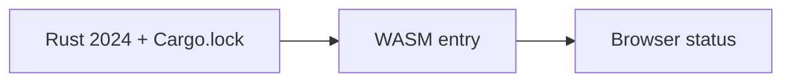

# 00 — Pinned environment and the browser entry

Starting state: an empty `/tmp/viewer-course`; [the reconstruction driver](reconstruction/replay.py) supplies the exact dependency lock and original shared-kernel source archives.



Text alternative: Pinned Rust and Cargo inputs compile a WASM entry that updates browser status.

1. Create the environment and the first browser entry.

**COPY/PASTE — setup and complete configuration.** Run from the maintained viewer checkout; checkpoint [00.patch](reconstruction/patches/00.patch) supplies the complete `Cargo.toml`, `Cargo.lock`, `.cargo/config.toml`, `Trunk.toml` and `index.html`.

```sh
export COURSE_REPO="$PWD"
export RUSTUP_TOOLCHAIN=1.97.1
rustc --version
cargo --version
trunk --version
rustup target add wasm32-unknown-unknown
python3 "$COURSE_REPO/docs/reconstruction/replay.py" --output /tmp/viewer-course --through 00 --verify --target-dir "$COURSE_REPO/target"
```

Use the [verified environment](reconstruction/baseline.json): Rust 2024, Trunk 0.21.14, wgpu 29.0.4, glyphon 0.11.0 and the shipped lock; installing an unbounded newer dependency is not part of this reconstruction.

**TYPE BY HAND — create `session_viewer/src/lib.rs` in the manual route, replacing the whole file.** This is the complete browser entry; its only output is an explicit WASM-ready status.

```rust
//! First browser entry: report that the pinned Rust/WASM toolchain is running.
use wasm_bindgen::prelude::*;
/// Mark successful WASM initialization without requesting a GPU yet.
#[wasm_bindgen(start)]
pub fn start() {
    console_error_panic_hook::set_once();
    let document = web_sys::window()
        .expect("browser window")
        .document()
        .expect("document");
    let status = document
        .get_element_by_id("status")
        .expect("status element");
    status.set_text_content(Some("Checkpoint 00: Rust/WASM ready"));
    status
        .set_attribute("data-checkpoint", "00")
        .expect("status attribute");
}
```

For manual completion, initialize the pinned shared source archives first, then take the configuration additions from 00.patch and type `src/lib.rs` above; use `--adopt --verify` to check the complete checkpoint.

**COPY/PASTE — initialize an empty manual workspace before typing.**

```sh
python3 "$COURSE_REPO/docs/reconstruction/replay.py" --output /tmp/viewer-course-manual --initialize-only
```

Use `/tmp/viewer-course-manual` consistently as `--output` for that manual route.

**COPY/PASTE — run.**

```sh
cd /tmp/viewer-course/session_viewer
REGEN_PROTO=0 NO_COLOR=true trunk serve
```

Open <http://127.0.0.1:8770/>: `Checkpoint 00: Rust/WASM ready`; no GPU has been requested yet. The checkpoint browser assertion requires `[data-checkpoint="00"]`, so a static HTML page does not pass.
