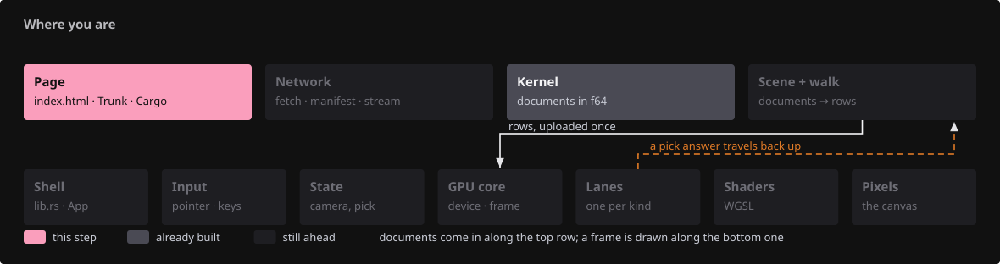
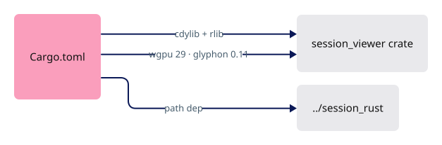
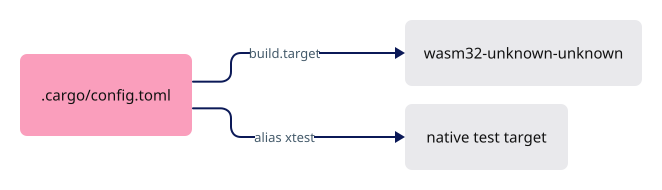
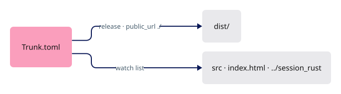
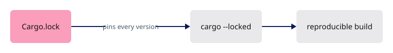
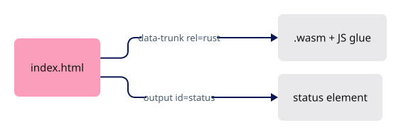
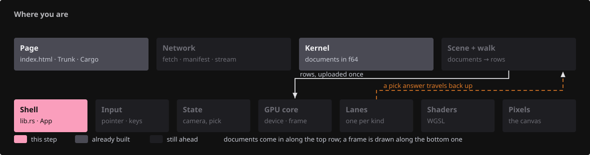
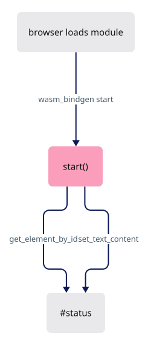

# 00 · Empty project to a WASM message

## You are building


## Starting point

- `$COURSE_WORK/session_rust`, `session_cpp`, `session_py`, `session_proto`: the pinned kernel, extracted by the [setup](README.md#prepare-one-workspace).
- `$COURSE_WORK/session_viewer`: does not exist yet. Create it:

```sh
mkdir -p "$COURSE_WORK/session_viewer/src"
cd "$COURSE_WORK/session_viewer"
```

<!-- step-status: start -->

**Does it compile yet?** `cargo check` passes after step 6; steps 1–5 fail and build again at step 6.

<!-- step-status: end -->

## Step 1 · Declare the crate

{ .locator data-strip="illustrations/strip-40d1f63564.svg" }

- wasm-bindgen turns `cdylib` into the browser module; `rlib` lets native tools link the same crate.
- `Cargo.lock` in step 4 pins every version; `wgpu = "29.0"` and `glyphon = "=0.11.0"` must move together.
- Keep `[target.'cfg(not(target_arch = "wasm32"))'.dependencies]` after every `[dependencies]` entry: a target table mid-file silently swallows every `[dependencies]` line after it. (Only a `[dependencies]` line is at risk, so `[dev-dependencies]` may follow it here.)



<span class="zone-mark" data-strip="illustrations/strip-40d1f63564.svg" data-zone="Page"></span>

<!-- file: 00 session_viewer/Cargo.toml copy -->

## Step 2 · Make wasm32 the default target

{ .locator data-strip="illustrations/strip-40d1f63564.svg" }

One line points every `cargo` command at the browser, so nothing has to be gated to `#[cfg(target_arch = "wasm32")]` to reach it. The gates that appear from lesson 04a on run the other way: they keep browser-only calls out of the native build, or give them a native fallback. The `xtest` alias runs the tests natively.



<span class="zone-mark" data-strip="illustrations/strip-40d1f63564.svg" data-zone="Page"></span>

<!-- file: 00 session_viewer/.cargo/config.toml type -->

## Step 3 · Tell Trunk what to bundle

{ .locator data-strip="illustrations/strip-40d1f63564.svg" }

Release builds, no subresource hashes, relative asset URLs, dev server on 127.0.0.1:8770 — every Check in this course passes `--port 8780` on the command line instead, so the course and a production viewer can run at once. Lesson 14 adds the watch list reaching the kernel next door.



<span class="zone-mark" data-strip="illustrations/strip-40d1f63564.svg" data-zone="Page"></span>

<!-- file: 00 session_viewer/Trunk.toml copy -->

## Step 4 · Pin the dependency graph

Dependency data, not code. Verified against exactly these versions, so install the lockfile with the supplied-files command instead of typing it.



<!-- supplied: 00 -->

## Step 5 · The page

{ .locator data-strip="illustrations/strip-40d1f63564.svg" }

One element with `id="status"`; Rust looks it up by that name.



<span class="zone-mark" data-strip="illustrations/strip-40d1f63564.svg" data-zone="Page"></span>

<!-- file: 00 session_viewer/index.html copy -->

## Step 6 · The first Rust function

{ .locator data-strip="illustrations/strip-d765e907c1.svg" }

- `#[wasm_bindgen(start)]` runs this function when the browser finishes loading the module.
- `web_sys` is the browser DOM from Rust.
- `expect` aborts with a readable message when an element is missing.
- The checkpoint test reads `data-checkpoint`, so a static HTML message cannot pass for Rust.



<span class="zone-mark" data-strip="illustrations/strip-d765e907c1.svg" data-zone="Shell"></span>

<!-- file: 00 session_viewer/src/lib.rs type -->

## Check

<!-- checkpoint: 00 -->

Expected:

- `cargo check` finishes with no errors and no warnings.
- The page shows **Checkpoint 00: Rust/WASM ready**.
- No canvas: this checkpoint is one line of text written by Rust.


If Cargo cannot find `../session_rust`, the setup ran in a different `$COURSE_WORK`. If the status never changes, open the browser console and check that you opened the Trunk address, not the file from disk.

## What changed

<!-- tree: 00 session_viewer -->

- New crate that compiles to WebAssembly and runs in the browser.
- Data flow: `lib.rs::start` → DOM.

**Production equivalent:** `Cargo.toml`, `.cargo/config.toml`, `Trunk.toml`; production keeps its entry point in `src/lib.rs`.

## Try

- Change the status text in `start()` and reload: Trunk rebuilds on save and the page shows your text — the whole edit loop of the course.
- Misspell the element id in `get_element_by_id("status")`: the page stays on "Loading WASM" and the browser console shows the `expect` message. Put it back.

## Questions and answers


**Two crate types are declared. Who consumes each?**

*How to work it out.* Two consumers read the build output: the browser, through wasm-bindgen and Trunk, and `cargo test` / `cargo run --example` natively. Those are different artefacts, so both must be declared.

*The answer.* `cdylib` is the dynamic library wasm-bindgen turns into a browser module — what Trunk bundles. `rlib` is the ordinary Rust library that native tools, tests and examples link against. Drop `rlib` and `cargo xtest` has nothing to link; drop `cdylib` and there is no page.

**What does one line in `.cargo/config.toml` buy you?**

*How to work it out.* Without it, `cargo build` targets your machine: every browser-only item needs `#[cfg(target_arch = "wasm32")]` and every build command needs `--target wasm32-unknown-unknown`. Almost all of this crate is browser code — the common case.

*The answer.* `build.target = "wasm32-unknown-unknown"` makes the browser the default for every `cargo` command, so the source needs no per-item gates. The `xtest` alias still runs the tests natively.

**The page is stuck on *Loading WASM* and the console is empty. Name two candidates before you touch the Rust.**

*How to work it out.* "Loading WASM" is the HTML's own text, so the page loaded but the module never replaced it. That rules out everything after `start()` runs and points at the two stages before it: was a module served at all, and was it rebuilt? An empty console is the clue — a Rust panic would have printed.

*The answer.* Either you opened the file from disk instead of the Trunk address, so nothing loaded the module, or the crate did not rebuild. An id typo is a third candidate, easy to tell apart: it panics, and the console shows the `expect` message.

**What you should be able to do now**

Delete `src/lib.rs` and write it again — the start attribute, the document lookup, the two writes — then `cargo check`. Correct looks like: `#[wasm_bindgen(start)]` on a `pub fn start()`, `console_error_panic_hook::set_once()` first, `web_sys::window().expect(…).document().expect(…)`, `get_element_by_id("status")` with an `expect`, and `set_text_content(Some(...))` plus the `data-checkpoint` attribute. Under twenty lines.

## Next

[01 · First WebGPU frame](01-first-frame.md): adapter, device, surface, one pipeline, one triangle.
