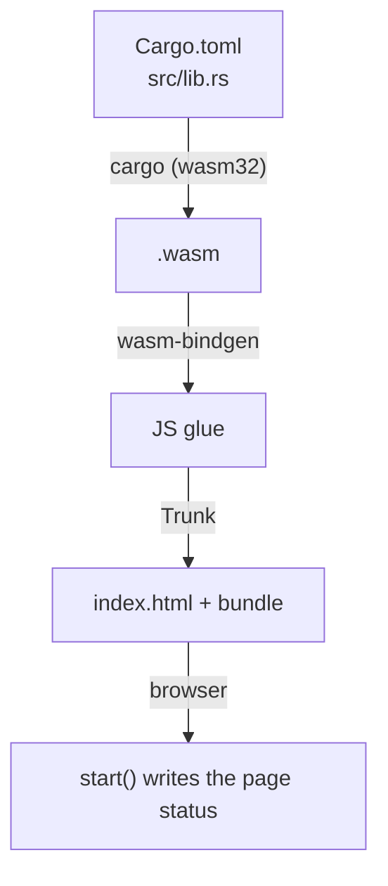
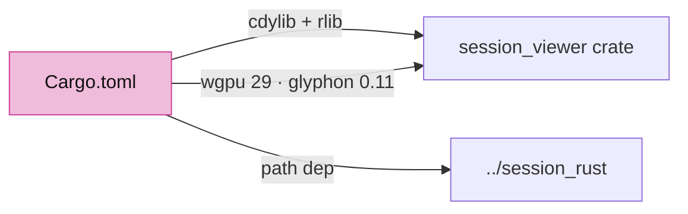
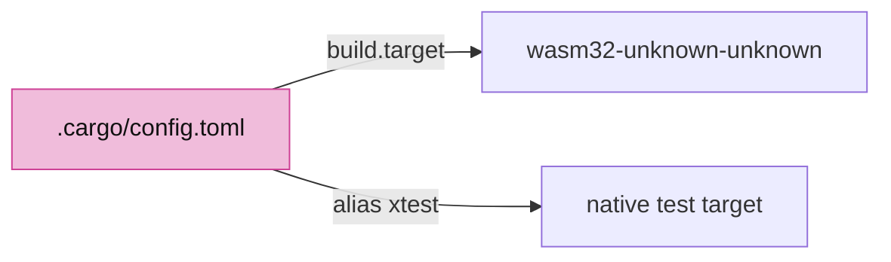
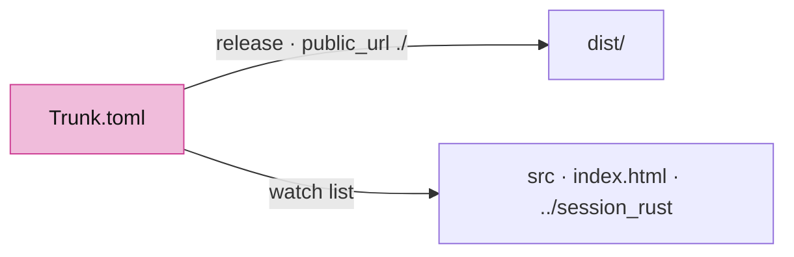
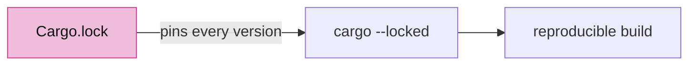
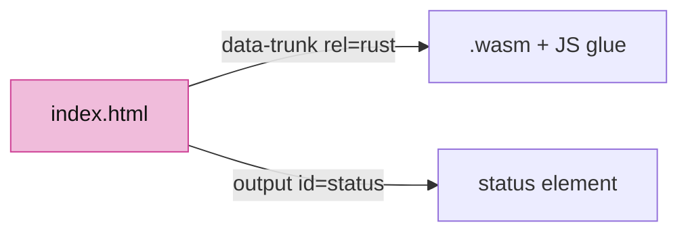
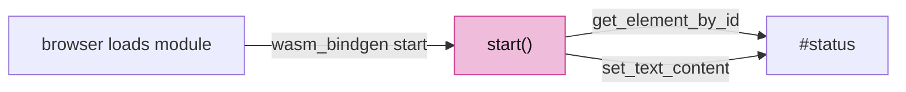

# 00 · Empty project to a WASM message

## You are building



## Starting point

- `$COURSE_WORK/session_rust`, `session_cpp`, `session_py`, `session_proto`: the pinned kernel, extracted by the [setup](README.md#prepare-one-workspace).
- `$COURSE_WORK/session_viewer`: does not exist yet. Create it:

```sh
mkdir -p "$COURSE_WORK/session_viewer/src"
cd "$COURSE_WORK/session_viewer"
```

## Step 1 · Declare the crate

- `cdylib` is what wasm-bindgen turns into a browser module; `rlib` lets native tools link the same crate later.
- Every version here is pinned by `Cargo.lock` in step 4; `wgpu = "29.0"` and `glyphon = "=0.11.0"` must move together.
- The `[target.'cfg(not(wasm32))']` table stays at the end: a target table in the middle silently swallows every `[dependencies]` line after it.



<!-- file: 00 session_viewer/Cargo.toml copy -->

## Step 2 · Make wasm32 the default target

One line makes every `cargo` command build for the browser, so the code needs no `#[cfg(target_arch = "wasm32")]` gates. `xtest` is the native alias tests will use.



<!-- file: 00 session_viewer/.cargo/config.toml type -->

## Step 3 · Tell Trunk what to bundle

Release builds, no subresource hashes, and a watch list that includes the kernel next door.



<!-- file: 00 session_viewer/Trunk.toml copy -->

## Step 4 · Pin the dependency graph

Dependency data, not code. The course was verified against exactly these versions, so install the lockfile with the supplied-files command instead of typing it.



<!-- supplied: 00 -->

## Step 5 · The page

One element with `id="status"`; Rust looks it up by that name.



<!-- file: 00 session_viewer/index.html copy -->

## Step 6 · The first Rust function

- `#[wasm_bindgen(start)]` runs this function when the browser finishes loading the module.
- `web_sys` is the browser DOM seen from Rust; `expect` aborts with a readable message if an element is missing.
- The `data-checkpoint` attribute is what the automatic checkpoint test reads, so a static HTML message cannot pass for Rust.



<!-- file: 00 session_viewer/src/lib.rs type -->

## Check

<!-- checkpoint: 00 -->

Expected:

- `cargo check` finishes with no errors and no warnings.
- The page shows **Checkpoint 00: Rust/WASM ready**.
- No canvas yet. That is the next lesson.


If Cargo cannot find `../session_rust`, the setup ran in a different `$COURSE_WORK`. If the status never changes, open the browser console and check that you opened the Trunk address, not the file from disk.

## What changed

<!-- tree: 00 session_viewer -->

- New crate that compiles to WebAssembly and runs in the browser.
- Data flow: `lib.rs::start` → DOM.

**Production equivalent:** `Cargo.toml`, `.cargo/config.toml`, `Trunk.toml` are already the production files. `src/lib.rs` is replaced in lesson 01 and again in lesson 12.

## Try

- Change the status text in `start()` and reload: Trunk rebuilds on save, and the page shows your text. That is the whole edit loop of the course.
- Misspell the element id in `get_element_by_id("status")`: the page stays on "Loading WASM" and the browser console shows the `expect` message. Put it back.

## Next

[01 · First WebGPU frame](01-first-frame.md): adapter, device, surface, one pipeline, one triangle.
