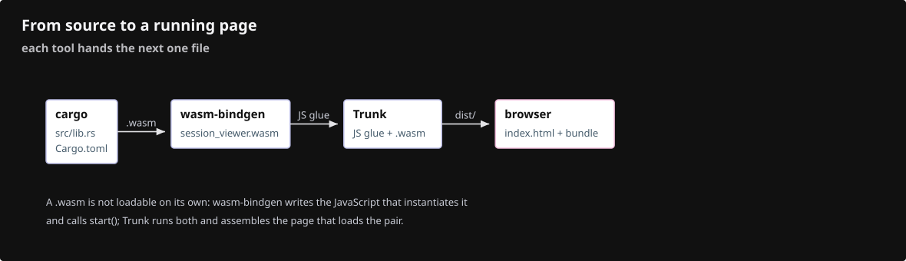

# 00 · Load Rust in the browser

**Estimated study time: about 4–9 hours.** Includes reading, typing, tracing, testing and experiments. [How to use this estimate](map.md#time-estimates).

**This section:** Create the browser page and the Rust entry point.

**In the whole viewer:** This is the outer shell. It must load successfully before a renderer can present pixels.

**Follow the data:** HTML → Trunk’s JavaScript bridge → WebAssembly → run_web.

**Start with these files:** [`index.html`](00-environment.md#code-00-005), [`src/lib.rs`](00-environment.md#code-00-006).

**Aim to explain:** Why does a successful Rust build not yet give us a picture?

[Whole-viewer map and course milestones](map.md)

Before we draw, let us make sure the browser can call Rust. Rust produces a WebAssembly file: a compact program the browser can run. Trunk builds that file and the small JavaScript bridge that starts it. Today, success is a program that loads without an error; we have not asked it to draw anything yet.



First finish [computer setup](README.md#prepare-your-computer) and [Rust foundations](foundations.md). From `session_viewer`, create your empty project:

```sh
npm --prefix ../session_tests run course -- reference-init
```

**One buildable step:** type the additions below in `workspace/handwritten`, then build and test. This step adds 405 lines across 6 files and may take several sittings. Individual listings are parts of this step, not separate build checkpoints.

<span id="code-00-001"></span>

## `.gitignore`

Git records the files needed to reproduce your program. Compiled output can be rebuilt, while a scene you created cannot. A line beginning with ! makes an exception to an ignore rule.

Create this file. Type the complete listing, including comments and blank lines.

```text
--8<-- "typing/code/00-001.txt"
```

<span id="code-00-002"></span>

## `.cargo/config.toml`

The same Rust source can be compiled for different machines. wasm32 targets the browser; the native target can access files and GPU drivers directly. The xtest alias selects the native target for tests.

Create this file. Type the complete listing, including comments and blank lines.

```toml
--8<-- "typing/code/00-002.toml"
```

<span id="code-00-003"></span>

## `Cargo.toml`

A manifest names our package and its dependencies. A feature turns on a dependency capability; it does not run that capability. Cargo.lock records the exact versions selected from these requirements. The path dependency points to the separate geometry kernel.

Create this file. Type the complete listing, including comments and blank lines.

```toml
--8<-- "typing/code/00-003.toml"
```

<span id="code-00-004"></span>

## `Trunk.toml`

Rust produces WebAssembly, but a browser also needs HTML, JavaScript glue and assets. Trunk builds and serves these together. Paths are relative to this project, so keep your handwritten project in the documented folder.

Create this file. Type the complete listing, including comments and blank lines.

```toml
--8<-- "typing/code/00-004.toml"
```

<span id="code-00-005"></span>

## `index.html`

The canvas is the rectangle the GPU presents into. CSS decides its display size; the renderer must separately choose its pixel size. Event handlers distinguish viewer gestures from browser scrolling. data-trunk links tell the build tool which files to package.

Create this file. Type the complete listing, including comments and blank lines.

```html
--8<-- "typing/code/00-005.html"
```

<span id="code-00-006"></span>

## `src/lib.rs`

A Rust library begins at lib.rs. A module declaration makes another source file part of this library. The wasm-bindgen start attribute gives the browser bridge an entry point. Declaring a module does not, by itself, run its functions.

`use` makes a name available in this scope. `crate` starts at our library root; `super` starts at the parent module.

`pub` makes an item visible outside its module. `pub(crate)` limits that visibility to this library.

`fn` introduces a function. Parameters have types after colons. `->` names the returned type. A final expression without a semicolon supplies the return value.

`Result<T, E>` is either `Ok(value)` or `Err(error)`. It makes success and failure part of the function interface.

`#[...]` is metadata for the compiler or a code-generating macro. `cfg` selects code for a target; `derive` generates standard implementations.

Create this file. Type the complete listing, including comments and blank lines.

```rust
--8<-- "typing/code/00-006.rs"
```

## Check the completed chapter

From `session_viewer`, compare everything you have typed:

```sh
npm --prefix ../session_tests run course -- reference-check 00
```

From `workspace/handwritten`:

```sh
cargo build --lib --locked -j4
```

Run `trunk serve --port 8780` after the check, then open http://localhost:8780/. Look for a successful WASM request in the Network panel and no startup error in the Console. The canvas is not drawing yet.

If Rust cannot find the WebAssembly target, run the target-install command in the course introduction. If the browser reports a panic, open its Console and read the first error.

**Before moving on:** explain what changed, check the expected result above, and fix any build or test failure.

<details>
<summary>Check your explanation of the opening question</summary>

The entry point starts Rust, but we have not created a GPU device, recorded drawing commands or presented a frame.

</details>

[Next step: 01](01-first-frame.md)
