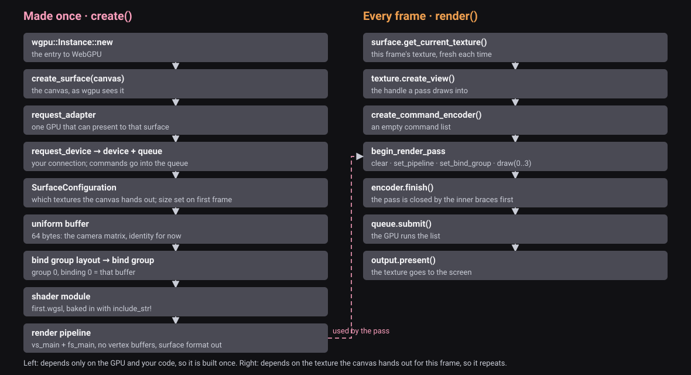

# 01 · First WebGPU frame

<!-- locator: off -->

One triangle on a dark canvas. `src/lib.rs` is rewritten in five pieces, then one shader file and one page.

Left column: made once, in `create`. Right column: repeated in every `render`. Everything on the right depends on the texture the canvas hands out for this frame, so it cannot be built earlier.

Where this sits in the whole viewer: the top row of the map is how a document comes in, the bottom row is how a frame is drawn. The solid arrow is the rows uploaded to the GPU once; the dashed arrow is the pick answer, the one thing that comes back. This lesson lives in **Shell** (the struct and the frame) and **Shaders**.

<!-- step-status: start -->

**Does it compile yet?** `cargo check` passes after steps 6 and 7; steps 1–5 fail and build again at step 6.

<!-- step-status: end -->

## Step 1 · `src/lib.rs`, part 1: the struct

Replace the whole file with this beginning. `Tutorial` owns every GPU object. `#[wasm_bindgen]` exports `create`, `render`, `drag` and `zoom` to the page; `drag` and `zoom` stay empty until lesson 02.

<!-- file: 01 session_viewer/src/lib.rs type whole lines=1-38 -->

## Step 2 · part 2: instance, surface, adapter, device

Append at the end of the file. This opens a second `impl Tutorial` block, without `#[wasm_bindgen]`. Rust allows any number of `impl` blocks for one type; the attribute on the first one exports every method in it to JavaScript, which forces JS-shaped signatures (`Result<_, JsValue>`). The private helpers `open` and `render_frame` return Rust error types (`anyhow::Result`, `wgpu::SurfaceError`) that wasm-bindgen cannot export, so they live in this plain block and the public methods convert their errors with `js_error`, a four-line helper at the end of the file in step 5. Four objects, each made from the previous one: the instance is the entry to WebGPU, the surface is the canvas, the adapter is one GPU that can present to that surface, the device is your connection to it and the queue is where commands go. `on_uncaptured_error` turns a shader error into a panic you can read instead of a black canvas.

<!-- file: 01 session_viewer/src/lib.rs type whole lines=39-62 -->

## Step 3 · part 3: surface configuration and the camera uniform

Append. The configuration says which textures the canvas hands out; `width: 1` means not configured yet, and the first frame sets the real size. The uniform is one 64-byte buffer every vertex reads, an identity matrix for now. The layout says: group 0, binding 0 is a uniform buffer the vertex stage reads. The bind group puts this buffer in that slot.

<!-- file: 01 session_viewer/src/lib.rs type whole lines=63-102 -->

## Step 4 · part 4: shader module and pipeline

Append. `include_str!` bakes the shader text into the binary, so a missing file is a compile error. The pipeline is the frozen recipe for one kind of draw: these two shader functions, no vertex buffers, the surface format as output. Built and validated once.

<!-- file: 01 session_viewer/src/lib.rs type whole lines=103-148 -->

## Step 5 · part 5: one frame

Append. Resize the canvas and reconfigure the surface only when the size changed. Then the right column of the diagram: this frame's texture, a view, an encoder, one pass that clears and draws three vertices, finish, submit, present. The pass sits in inner braces so its borrow of the encoder ends before `finish`.

<!-- file: 01 session_viewer/src/lib.rs type whole lines=149-213 -->

## Step 6 · `src/shaders/first.wgsl`

New file. `vs_main` runs three times, with `vertex_index` 0, 1 and 2, and returns a clip-space position and a colour. `fs_main` runs once per covered pixel and returns the colour, interpolated between the three corners. Three names must agree with the Rust: `@group(0) @binding(0)` with the bind group layout, `vs_main` and `fs_main` with the entry points, and the `@location(0)` output with the surface format. `cargo check` cannot see inside WGSL, so a mismatch shows up in the browser as a validation error.

<!-- file: 01 session_viewer/src/shaders/first.wgsl type -->

<!-- check: 01 -->

## Step 7 · `index.html`

Replace the whole file. The page now has a canvas. Its script calls `Tutorial.create` once, then `render` after every resize and pointer event, and writes the returned size into the status line.

<!-- file: 01 session_viewer/index.html copy -->

## Check

<!-- checkpoint: 01 -->

Expected: a red, green and blue triangle on a dark canvas, and a status line **Checkpoint 01 · 1 objects · W×H**. Resize the window: the triangle stretches with it, because nothing corrects for aspect ratio until the camera in lesson 02.

If it fails:

- Dark canvas, no triangle: one of the three names in step 6 does not match the Rust, or `draw(0..3, 0..1)` was mistyped.
- Status shows an error instead of the size: read it. It is the adapter or device request failing, and the browser has no WebGPU.
- Canvas stays empty and the console shows *tutorial WebGPU error*: a validation error; the message names the descriptor field.

## What changed

<!-- tree: 01 session_viewer/src -->

Every file at this point: [source at checkpoint 01](../lessons/01/index.md). In the maintained viewer the same code is split into `engine/gpu/device.rs` (adapter and device), `present.rs` (surface) and `render.rs` (the frame).

## Next

[02 · Camera](02-camera.md): orbit, pan and zoom.

## Expected viewer result

Checkpoint 01: the first triangle, colors interpolated from the three vertices.

