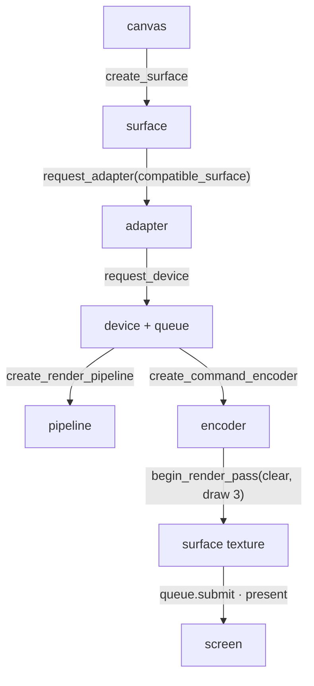

# 01 · First WebGPU frame

## You are building



## Starting point

- Checkpoint 00: Rust runs in the page, no GPU.
- `src/lib.rs` is replaced in full during this lesson, in five appended pieces. Each piece is one idea; the file compiles when the last piece is in.

## Step 1 · One struct owns the GPU

- `Tutorial` is a temporary teaching shell; lesson 12 replaces it with the production `App`/`State`.
- `#[wasm_bindgen]` on the struct and its `impl` exports `create`, `render`, `drag`, `zoom` to JavaScript.
- `drag` and `zoom` are placeholders until the camera lesson.

<!-- file: 01 session_viewer/src/lib.rs type whole lines=1-36 -->

## Step 2 · Instance, surface, adapter, device

- `Backends::BROWSER_WEBGPU`: only the browser's WebGPU, never WebGL.
- The adapter must be `compatible_surface`; otherwise the device may not be able to present to this canvas.
- `on_uncaptured_error` turns a shader validation failure into a visible panic instead of a silent black canvas.

<!-- file: 01 session_viewer/src/lib.rs type whole lines=37-58 -->

## Step 3 · Surface configuration and the camera uniform

- `width: 1, height: 1` marks "not configured yet"; `render_frame` resizes on first use.
- A **uniform** is one small buffer every vertex reads. Today it holds an identity matrix; the camera lesson writes a real one.

```text
[f32; 16]  ──bytemuck::cast_slice──▶  wgpu::Buffer (UNIFORM | COPY_DST)
                                           │ bind group 0, binding 0
                                           ▼
                            @group(0) @binding(0) var<uniform> mvp: mat4x4<f32>
```

<!-- file: 01 session_viewer/src/lib.rs type whole lines=59-98 -->

## Step 4 · Shader module, pipeline layout, render pipeline

- `include_str!` bakes the WGSL into the binary; a missing shader file is a compile error, not a runtime one.
- Entry-point names `vs_main`/`fs_main` and the color target `format` are the contract with the shader and the surface.
- `buffers: &[]`: this triangle is generated from `vertex_index`, no vertex buffer yet.

<!-- file: 01 session_viewer/src/lib.rs type whole lines=99-144 -->

## Step 5 · One frame

- Resize once when the CSS size or device scale changed; configure the surface only then.
- A render pass borrows the encoder; the inner braces end the borrow before `encoder.finish()`.
- Reversed-depth and depth attachments come in lesson 05; this pass has color only.

<!-- file: 01 session_viewer/src/lib.rs type whole lines=145-205 -->

## Step 6 · The shader

Rust and WGSL agree on three things:

```text
Rust                                             WGSL
bind_group_layouts: [group 0 { binding 0 }]  ↔  @group(0) @binding(0) var<uniform> mvp
entry_point: "vs_main" / "fs_main"           ↔  @vertex fn vs_main / @fragment fn fs_main
targets: [surface format]                    ↔  @location(0) vec4<f32> return
```

- `@builtin(vertex_index)` is 0, 1, 2 for `draw(0..3, 0..1)`.
- `@location(0) color` leaves the vertex stage and is interpolated into the fragment stage.

<!-- file: 01 session_viewer/src/shaders/first.wgsl type -->

<!-- check: 01 -->

## Step 7 · The page drives the shell

JavaScript owns the canvas and pointer events; it calls the four exported methods. Replace the page in full.

<!-- file: 01 session_viewer/index.html copy -->

## Check

<!-- checkpoint: 01 -->

Expected:

- A red/green/blue triangle on a dark canvas.
- Status reads **Checkpoint 01 · 1 objects · W×H** where W×H is the physical framebuffer size.
- Resize the window: the triangle keeps its shape.

If the background appears without the triangle, compare the entry-point names, `draw(0..3, ..)` and the uniform binding. If initialization fails, read the adapter/device error in the status text before touching shaders.

## What changed

<!-- tree: 01 session_viewer/src -->

- `Tutorial` owns surface, device, queue, one pipeline, one bind group.
- Data flow: identity `[f32;16]` → uniform buffer → `mvp` in the vertex shader → clip position.

**Production equivalent:** `src/engine/gpu/device.rs` (adapter and device), `src/engine/gpu/present.rs` (surface), `src/engine/gpu/render.rs` (the frame). The shell you just wrote is temporary.

## Next

[02 · Camera](02-camera.md): the production camera and math, wired to orbit, pan and zoom.
