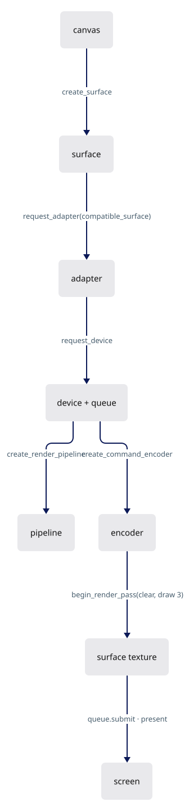
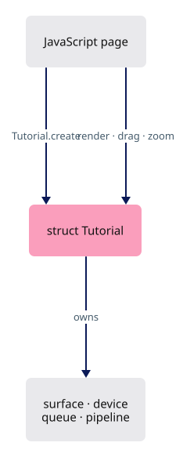
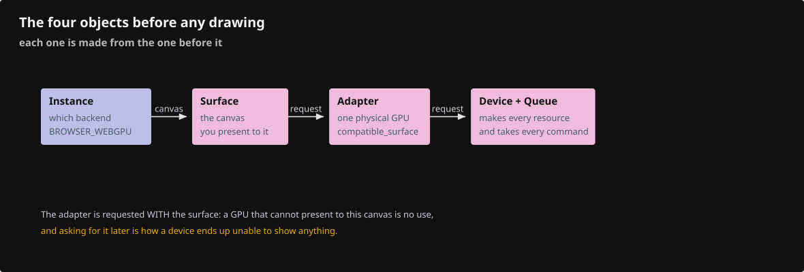
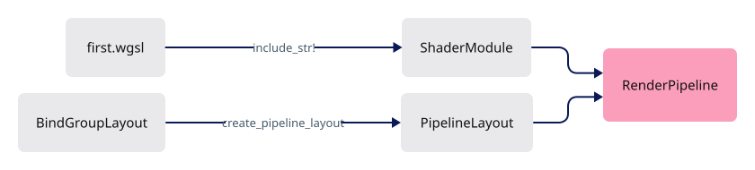
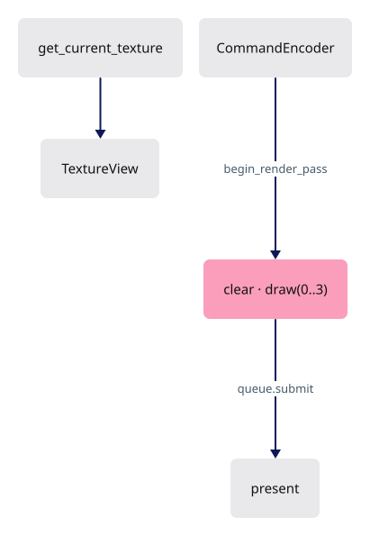
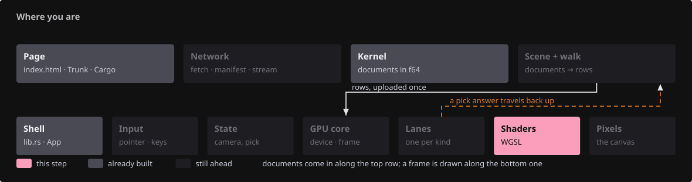
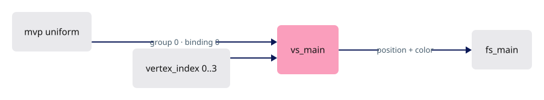
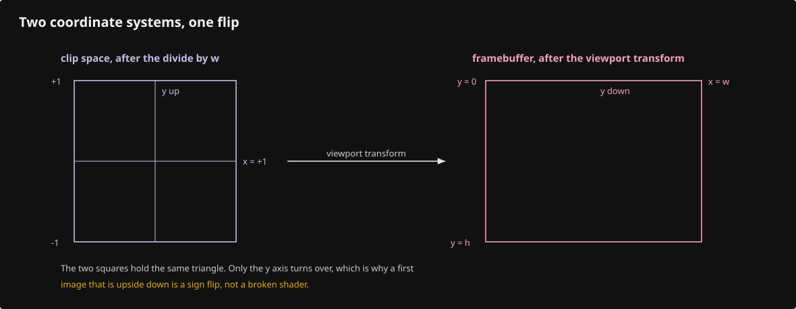
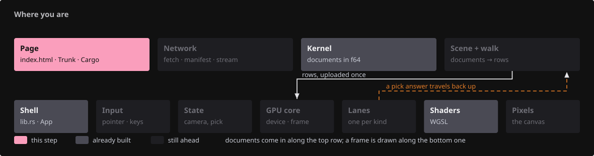
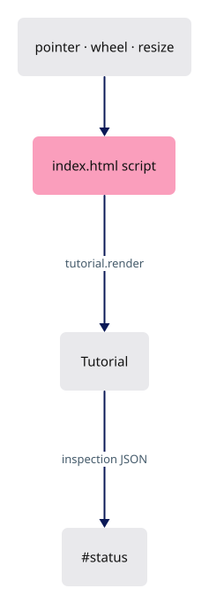

# 01 · First WebGPU frame

## You are building




## Starting point

- Checkpoint 00: Rust runs in the page, no GPU.
- `src/lib.rs` is replaced in full, in five appended pieces, one idea each.

<!-- step-status: start -->

**Does it compile yet?** `cargo check` passes after steps 6 and 7; steps 1–5 fail and build again at step 6.

<!-- step-status: end -->

## Step 1 · One struct owns the GPU

{ .locator data-strip="illustrations/strip-d765e907c1.svg" }

- `Tutorial` is the shell: one struct owning the GPU objects, exported to the page.
- `#[wasm_bindgen]` on the struct and its `impl` exports `create`, `render`, `drag`, `zoom` to JavaScript.
- `drag` and `zoom` are exported with empty bodies, so the page wires all four methods at once.



<span class="zone-mark" data-strip="illustrations/strip-d765e907c1.svg" data-zone="Shell"></span>

<!-- file: 01 session_viewer/src/lib.rs type whole lines=1-36 -->

## Step 2 · Instance, surface, adapter, device

{ .locator data-strip="illustrations/strip-d765e907c1.svg" }

- `Backends::BROWSER_WEBGPU`: only the browser's WebGPU, never WebGL.
- The adapter must be `compatible_surface`, or the device may not present to this canvas.
- `on_uncaptured_error` turns a shader validation failure into a visible panic instead of a silent black canvas.



<span class="zone-mark" data-strip="illustrations/strip-d765e907c1.svg" data-zone="Shell"></span>

<!-- file: 01 session_viewer/src/lib.rs type whole lines=37-58 -->

## Step 3 · Surface configuration and the camera uniform

{ .locator data-strip="illustrations/strip-d765e907c1.svg" }

- `width: 1, height: 1` marks "not configured yet"; `render_frame` resizes on first use.
- A **uniform** is one small buffer every vertex reads.
- It holds identity here, so clip position equals the vertex position.

```text
[f32; 16]  ──bytemuck::cast_slice──▶  wgpu::Buffer (UNIFORM | COPY_DST)
                                           │ bind group 0, binding 0
                                           ▼
                            @group(0) @binding(0) var<uniform> mvp: mat4x4<f32>
```

![Diagram: SurfaceConfiguration · Surface · identity [f32; 16] · uniform buffer · BindGroup](illustrations/01-03.svg)

<span class="zone-mark" data-strip="illustrations/strip-d765e907c1.svg" data-zone="Shell"></span>

<!-- file: 01 session_viewer/src/lib.rs type whole lines=59-98 -->

## Step 4 · Shader module, pipeline layout, render pipeline

{ .locator data-strip="illustrations/strip-d765e907c1.svg" }

- `include_str!` bakes the WGSL in: a missing shader file is a compile error, not a runtime one.
- `vs_main`/`fs_main` and the color target `format` are the contract with the shader and the surface.
- `buffers: &[]`: this triangle is generated from `vertex_index`, so no vertex buffer is bound.



<span class="zone-mark" data-strip="illustrations/strip-d765e907c1.svg" data-zone="Shell"></span>

<!-- file: 01 session_viewer/src/lib.rs type whole lines=99-144 -->

## Step 5 · One frame

{ .locator data-strip="illustrations/strip-d765e907c1.svg" }

- Resize once when the CSS size or device scale changed; configure the surface only then.
- A render pass borrows the encoder; the inner braces end the borrow before `encoder.finish()`.
- This pass has a color attachment only, no depth.



<span class="zone-mark" data-strip="illustrations/strip-d765e907c1.svg" data-zone="Shell"></span>

<!-- file: 01 session_viewer/src/lib.rs type whole lines=145-205 -->

## Step 6 · The shader

{ .locator data-strip="illustrations/strip-a3e7270ec6.svg" }

Rust and WGSL agree on three things:

```text
Rust                                             WGSL
bind_group_layouts: [group 0 { binding 0 }]  ↔  @group(0) @binding(0) var<uniform> mvp
entry_point: "vs_main" / "fs_main"           ↔  @vertex fn vs_main / @fragment fn fs_main
targets: [surface format]                    ↔  @location(0) vec4<f32> return
```

- `@builtin(vertex_index)` is 0, 1, 2 for `draw(0..3, 0..1)`.
- `@location(0) color` leaves the vertex stage and is interpolated into the fragment stage.



<span class="zone-mark" data-strip="illustrations/strip-a3e7270ec6.svg" data-zone="Shaders"></span>

<!-- file: 01 session_viewer/src/shaders/first.wgsl type -->

<!-- check: 01 -->



## Step 7 · The page drives the shell

{ .locator data-strip="illustrations/strip-cdcbec521d.svg" }

JavaScript owns the canvas and pointer events; it calls the four exported methods.



<span class="zone-mark" data-strip="illustrations/strip-cdcbec521d.svg" data-zone="Page"></span>

<!-- file: 01 session_viewer/index.html copy -->

## Check

<!-- checkpoint: 01 -->

Expected:

- A red/green/blue triangle on a dark canvas.
- Status reads **Checkpoint 01 · 1 objects · W×H** where W×H is the physical framebuffer size.
- Resize the window: the triangle keeps its shape.


Background but no triangle: compare the entry-point names, `draw(0..3, ..)` and the uniform binding. If initialization fails, read the adapter/device error in the status text before touching shaders.

## What changed

<!-- tree: 01 session_viewer/src -->

- `Tutorial` owns surface, device, queue, one pipeline, one bind group.
- Data flow: identity `[f32;16]` → uniform buffer → `mvp` in the vertex shader → clip position.

**Production equivalent:** `src/engine/gpu/device.rs` (adapter and device), `src/engine/gpu/present.rs` (surface), `src/engine/gpu/render.rs` (the frame).

## Try

- Change the clear color in `render_frame` and watch the background follow.
- Swap two entries of the `points` array in `first.wgsl`: the outline is unchanged and two corners trade colours, because `color` is indexed by the same `index` and nothing culls the reversed winding.
- Change `draw(0..3, 0..1)` to `draw(0..2, 0..1)`: nothing is drawn, because two vertices make no triangle.

## Questions and answers

These four are the frame; the rest of the course assumes them.

**Name every object between an empty page and a cleared canvas, in order.**

*How to work it out.* Follow the dependencies: each object is made from one that already exists. No GPU without an entry point; none that can draw to your canvas without the canvas; no buffers without an open connection to it. Then separate what is made once from what one frame needs.

*The answer.* Instance → surface (from the canvas) → adapter (requested with `compatible_surface`, or it may not present here) → device + queue → surface configuration. Then, per frame: `get_current_texture` → a texture view → a command encoder → a render pass with its attachments → `encoder.finish()` → `queue.submit` → `present`.

**Which of those happen once, and which happen every frame?**

*How to work it out.* Anything that depends only on the GPU and your own code cannot change between frames, so it can be built once. Anything that depends on *this* frame's surface texture — handed out fresh each time — cannot be.

*The answer.* Once: instance, adapter, device, queue, shader module, pipeline layout, pipeline, bind group, buffers. Every frame: the surface texture, its view, the encoder, the pass, the submit. That split is the point of a pipeline — validation paid once so each frame is cheap. Reconfiguring the surface is neither; it happens only when the size changes.

**Three things Rust and WGSL must agree on here. What are they?**

*How to work it out.* Walk the pipeline descriptor field by field and ask where the shader says the same thing.

*The answer.* The bind-group layout against `@group(0) @binding(0)`; the entry-point names `vs_main` / `fs_main`; the colour target format against the `@location(0)` return. Every validation error in this lesson is one of the three, because `cargo check` cannot see inside WGSL.

**Why is `buffers: &[]` allowed when a triangle clearly has vertices?**

*How to work it out.* Read `vs_main`: it never reads an input attribute, so nothing is fetched from memory and a vertex buffer would be a slot nobody reads.

*The answer.* The shader computes the three positions from `@builtin(vertex_index)`, so no buffer is bound. `draw(0..3, 0..1)` makes that builtin count 0, 1, 2.

**What you should be able to do now**

Write `render_frame` on paper — acquire, view, encoder, pass, set pipeline, set bind group, draw, finish, submit, present — then compare. Correct looks like: the pass in an inner scope so its borrow of the encoder ends before `encoder.finish()`, and `present()` as the last statement. Missing `present` is the classic: the frame is drawn and never shown.

## Next

[02 · Camera](02-camera.md): the production camera and math, wired to orbit, pan and zoom.
