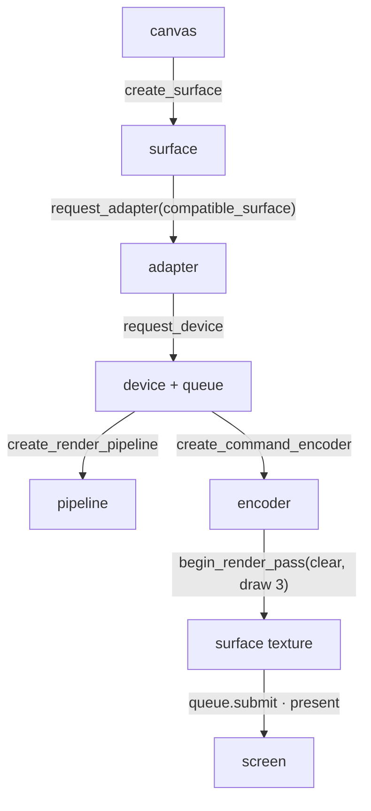
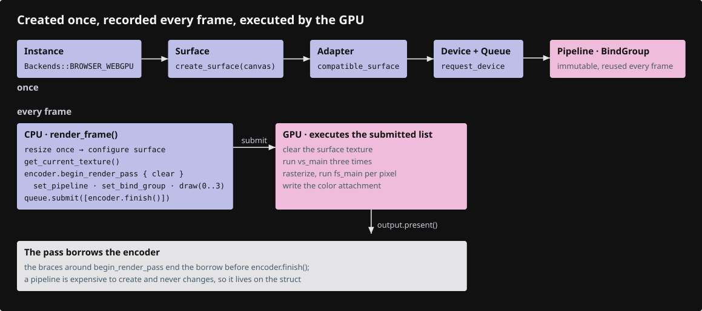
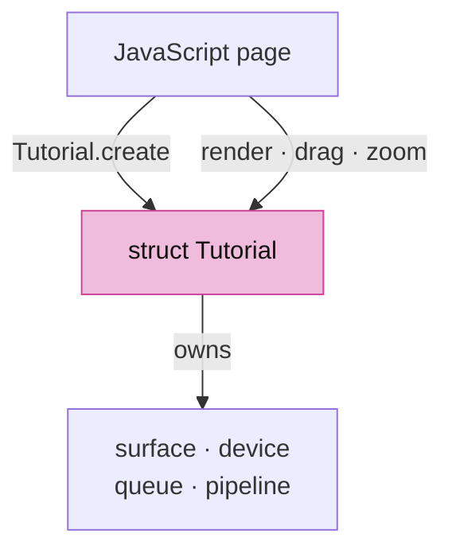
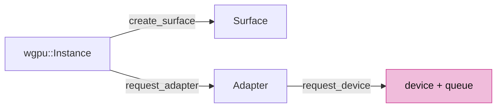
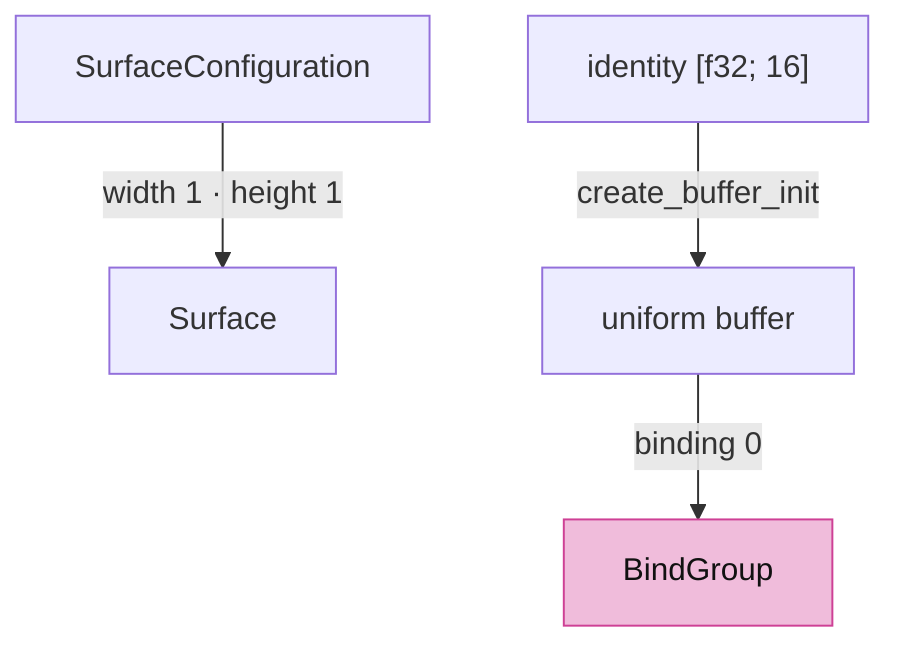
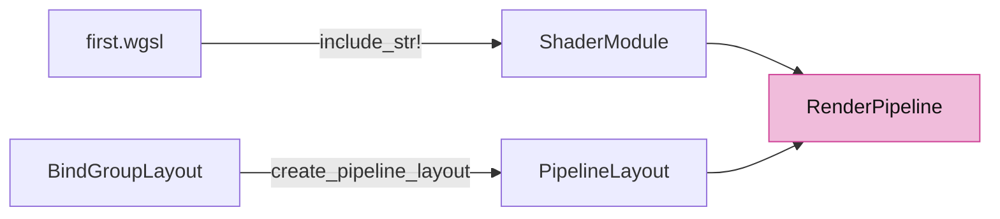
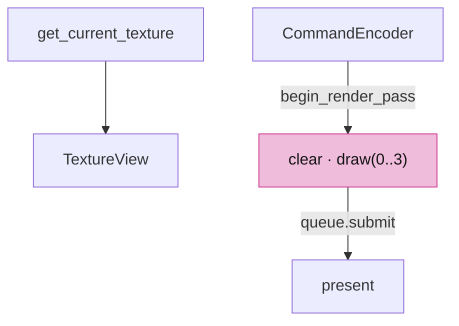
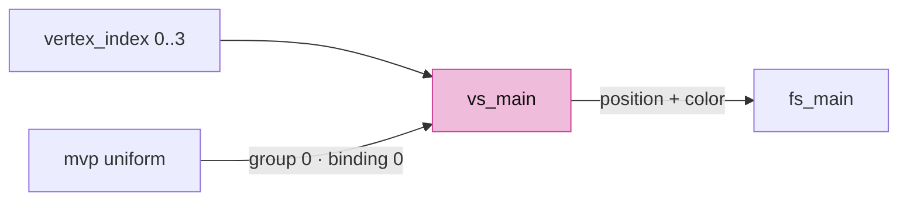
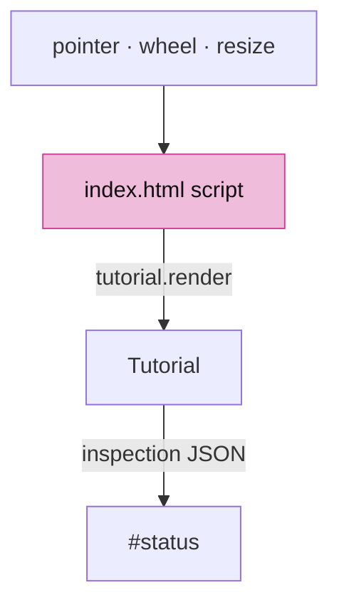
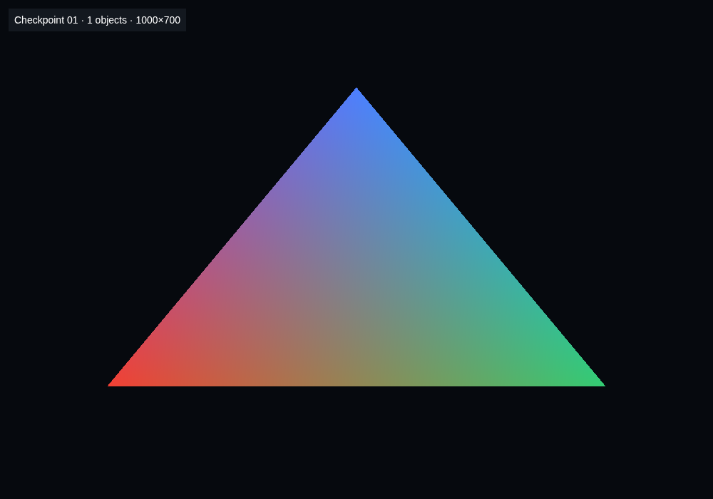

# 01 · First WebGPU frame

## You are building





## Starting point

- Checkpoint 00: Rust runs in the page, no GPU.
- `src/lib.rs` is replaced in full during this lesson, in five appended pieces. Each piece is one idea; the file compiles when the last piece is in.

## Step 1 · One struct owns the GPU

- `Tutorial` is the shell: one struct that owns the GPU objects and is exported to the page.
- `#[wasm_bindgen]` on the struct and its `impl` exports `create`, `render`, `drag`, `zoom` to JavaScript.
- `drag` and `zoom` are exported with empty bodies, so the page wires all four methods at once.



<!-- file: 01 session_viewer/src/lib.rs type whole lines=1-36 -->

## Step 2 · Instance, surface, adapter, device

- `Backends::BROWSER_WEBGPU`: only the browser's WebGPU, never WebGL.
- The adapter must be `compatible_surface`; otherwise the device may not be able to present to this canvas.
- `on_uncaptured_error` turns a shader validation failure into a visible panic instead of a silent black canvas.



<!-- file: 01 session_viewer/src/lib.rs type whole lines=37-58 -->

## Step 3 · Surface configuration and the camera uniform

- `width: 1, height: 1` marks "not configured yet"; `render_frame` resizes on first use.
- A **uniform** is one small buffer every vertex reads. It holds an identity matrix, so clip position equals the shader's vertex position.

```text
[f32; 16]  ──bytemuck::cast_slice──▶  wgpu::Buffer (UNIFORM | COPY_DST)
                                           │ bind group 0, binding 0
                                           ▼
                            @group(0) @binding(0) var<uniform> mvp: mat4x4<f32>
```



<!-- file: 01 session_viewer/src/lib.rs type whole lines=59-98 -->

## Step 4 · Shader module, pipeline layout, render pipeline

- `include_str!` bakes the WGSL into the binary; a missing shader file is a compile error, not a runtime one.
- Entry-point names `vs_main`/`fs_main` and the color target `format` are the contract with the shader and the surface.
- `buffers: &[]`: this triangle is generated from `vertex_index`, so no vertex buffer is bound.



<!-- file: 01 session_viewer/src/lib.rs type whole lines=99-144 -->

## Step 5 · One frame

- Resize once when the CSS size or device scale changed; configure the surface only then.
- A render pass borrows the encoder; the inner braces end the borrow before `encoder.finish()`.
- This pass has a color attachment only, no depth.



<!-- file: 01 session_viewer/src/lib.rs type whole lines=145-205 -->

## Step 6 · The shader

Rust and WGSL agree on three things:

```text
Rust                                             WGSL
bind_group_layouts: [group 0 { binding 0 }]  ↔  @group(0) @binding(0) var<uniform> mvp
entry_point: "vs_main" / "fs_main"           ↔  @vertex fn vs_main / @fragment fn fs_main
targets: [surface format]                    ↔  @location(0) vec4<f32> return
```

- `@builtin(vertex_index)` is 0, 1, 2 for `draw(0..3, 0..1)`.
- `@location(0) color` leaves the vertex stage and is interpolated into the fragment stage.



<!-- file: 01 session_viewer/src/shaders/first.wgsl type -->

<!-- check: 01 -->

## Step 7 · The page drives the shell

JavaScript owns the canvas and pointer events; it calls the four exported methods. Replace the page in full.



<!-- file: 01 session_viewer/index.html copy -->

## Check

<!-- checkpoint: 01 -->

Expected:

- A red/green/blue triangle on a dark canvas.
- Status reads **Checkpoint 01 · 1 objects · W×H** where W×H is the physical framebuffer size.
- Resize the window: the triangle keeps its shape.



If the background appears without the triangle, compare the entry-point names, `draw(0..3, ..)` and the uniform binding. If initialization fails, read the adapter/device error in the status text before touching shaders.

## What changed

<!-- tree: 01 session_viewer/src -->

- `Tutorial` owns surface, device, queue, one pipeline, one bind group.
- Data flow: identity `[f32;16]` → uniform buffer → `mvp` in the vertex shader → clip position.

**Production equivalent:** `src/engine/gpu/device.rs` (adapter and device), `src/engine/gpu/present.rs` (surface), `src/engine/gpu/render.rs` (the frame).

## Try

- Change the clear color in `render_frame` and watch the background follow.
- Swap two entries of the `points` array in `first.wgsl`: the triangle flips, because the vertex order is what the rasterizer sees.
- Change `draw(0..3, 0..1)` to `draw(0..2, 0..1)`: nothing is drawn, because two vertices make no triangle.

## Questions and answers

These four are the frame, and the rest of the course assumes them. Reasoning first, then the answer.

**Name every object between an empty page and a cleared canvas, in order.**

*How to work it out.* Follow the dependencies: each object can only be made from something that already exists. You cannot ask for a GPU without an entry point; you cannot pick a GPU that can draw to your canvas without the canvas; you cannot create buffers without an open connection to that GPU. Then separate what is made once from what one frame needs.

*The answer.* Instance → surface (from the canvas) → adapter (requested with `compatible_surface`, or it may not be able to present here) → device + queue → surface configuration. Then, per frame: `get_current_texture` → a texture view → a command encoder → a render pass with its attachments → `encoder.finish()` → `queue.submit` → `present`.

**Which of those happen once, and which happen every frame?**

*How to work it out.* Ask what each object depends on. Anything that depends only on the GPU and your own code cannot change between frames, so it can be built once. Anything that depends on *this* frame's surface texture — which the browser hands out fresh each time — cannot be.

*The answer.* Once: instance, adapter, device, queue, shader module, pipeline layout, pipeline, bind group, buffers. Every frame: the surface texture, its view, the encoder, the pass, the submit. That split is the point of a pipeline — validation is paid once so each frame is cheap. Reconfiguring the surface is neither: it happens only when the size changes.

**Three things Rust and WGSL must agree on here. What are they?**

*How to work it out.* Look for every place the same fact is written twice, once in each language. Walk the pipeline descriptor field by field and ask "where does the shader say this too?"

*The answer.* The bind-group layout against `@group(0) @binding(0)`; the entry-point names `vs_main` / `fs_main`; the colour target format against the `@location(0)` return. Every validation error in this lesson is one of the three, because `cargo check` cannot see inside WGSL.

**Why is `buffers: &[]` allowed when a triangle clearly has vertices?**

*How to work it out.* Ask where the vertex positions actually come from. Read `vs_main`: if it never reads an input attribute, nothing has to be fetched from memory, and a vertex buffer would only be a slot nobody reads.

*The answer.* The three positions are computed inside the shader from `@builtin(vertex_index)`, so no buffer is bound. `draw(0..3, 0..1)` is what makes that builtin count 0, 1, 2.

**What you should be able to do now**

Write `render_frame` on paper — acquire, view, encoder, pass, set pipeline, set bind group, draw, finish, submit, present — then compare. Correct looks like: the pass created inside an inner scope so its borrow of the encoder ends before `encoder.finish()`, and `present()` as the last statement. Missing `present` is the classic: the frame is drawn and never shown.

## Next

[02 · Camera](02-camera.md): the production camera and math, wired to orbit, pan and zoom.
