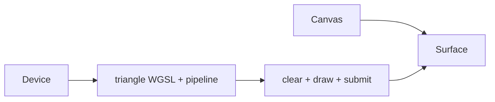

# 01 — One WebGPU frame

Starting checkpoint: 00. Add one presentation-compatible adapter, one device/queue, one surface and a complete triangle lane.



Text alternative: The device builds a shader pipeline; a cleared draw pass is submitted to the canvas surface.

1. Replace the setup-only entry with a rendered browser frame.

**COPY/PASTE — complete mechanical additions and exact reconstruction.** Starting at checkpoint 00, [the complete patch](reconstruction/patches/01.patch) identifies every file and unique replacement context; it contains all imports, shader entries and descriptors.

```sh
python3 "$COURSE_REPO/docs/reconstruction/replay.py" --output /tmp/viewer-course --through 01 --advance --verify --target-dir "$COURSE_REPO/target"
```

For the manual route, use the patch's complete file changes, substitute the following **TYPE BY HAND** blocks for their corresponding additions, then record the exact result with `--adopt --verify` instead of `--advance --verify`; `--adopt` checks every source byte against this checkpoint.

**TYPE BY HAND — create `src/shaders/first.wgsl`, replacing its entire file.** Vertex index supplies local positions; the fragment stage interpolates their colors.

```wgsl
// The first lane: three vertices generated from the vertex index, then a camera transform.
@group(0) @binding(0) var<uniform> mvp: mat4x4<f32>;
struct VertexOut { @builtin(position) position: vec4<f32>, @location(0) color: vec3<f32> };
@vertex fn vs_main(@builtin(vertex_index) index: u32) -> VertexOut {
    let points = array<vec3<f32>,3>(vec3<f32>(-0.7,-0.55,0.0),vec3<f32>(0.7,-0.55,0.0),vec3<f32>(0.0,0.65,0.0));
    var output: VertexOut;
    output.position = mvp * vec4<f32>(points[index],1.0);
    output.color = array<vec3<f32>,3>(vec3<f32>(0.95,0.25,0.2),vec3<f32>(0.2,0.8,0.45),vec3<f32>(0.3,0.5,1.0))[index];
    return output;
}
@fragment fn fs_main(input: VertexOut) -> @location(0) vec4<f32> { return vec4<f32>(input.color,1.0); }
```
**TYPE BY HAND — in `src/lib.rs`, `Tutorial::open`, replace the complete `let pipeline = device.create_render_pipeline(...)` statement with this pipeline contract.** Its entries must match the shader; this first lane has no vertex buffer or depth attachment.

```rust
let pipeline = device.create_render_pipeline(&wgpu::RenderPipelineDescriptor {
            label: Some("first triangle"),
            layout: Some(&pipeline_layout),
            vertex: wgpu::VertexState {
                module: &shader,
                entry_point: Some("vs_main"),
                buffers: &[],
                compilation_options: Default::default(),
            },
            fragment: Some(wgpu::FragmentState {
                module: &shader,
                entry_point: Some("fs_main"),
                targets: &[Some(wgpu::ColorTargetState {
                    format: config.format,
                    blend: None,
                    write_mask: wgpu::ColorWrites::ALL,
                })],
                compilation_options: Default::default(),
            }),
            primitive: Default::default(),
            depth_stencil: None,
            multisample: Default::default(),
            multiview_mask: None,
            cache: None,
        });
```

**COPY/PASTE — browser ownership and repetitive descriptors.** The remaining exact `src/lib.rs` additions in 01.patch define `Tutorial`, `create`, `open`, `render_frame`, `js_error` and `gpu_error`; `index.html` registers named resize/pointer adapters and publishes read-only `data-tutorial-inspection`.

**COPY/PASTE — run this completed checkpoint.**

```sh
cd /tmp/viewer-course/session_viewer
REGEN_PROTO=0 NO_COLOR=true trunk serve
```

Open <http://127.0.0.1:8770/>. A red/green/blue triangle appears on the dark canvas; the status reports one object. Camera gestures are deliberately inert until checkpoint 02.

The maintained `--verify` check builds WASM and captures actual browser pixels at DPR 1 and 2; it rejects page/GPU errors and framebuffer scaling mismatches. Checkpoint 01 deliberately retains the temporary direct-canvas shell, which chapter 12 replaces with the final winit/State ownership.
