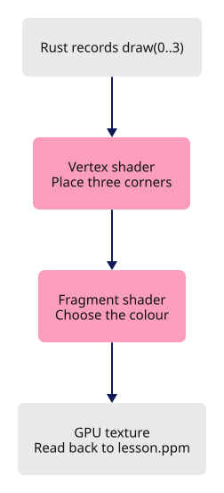
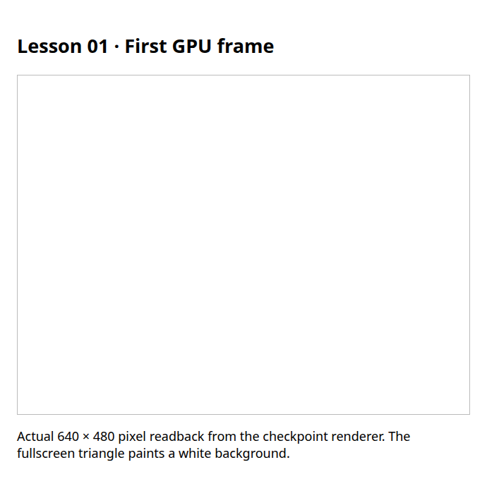
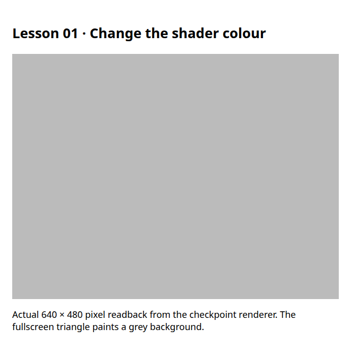

# 01 · First WebGPU frame

**Estimated study time: about 65–125 hours.** Includes reading, typing, tracing, testing and experiments. [How to use this estimate](map.md#time-estimates).

**This section:** Connect the GPU, allocate its shared resources and draw the first offscreen frame.

**In the whole viewer:** This is the drawing foundation used by every later geometry type. The browser event loop comes later.

**Follow the data:** Device → shader and pipeline → recorded draw → queue submission → texture pixels.

**Start with these files:** [`src/engine/gpu/device.rs`](01-first-frame.md#code-01-007), [`src/engine/gpu/render.rs`](01-first-frame.md#code-01-016), [`src/shaders/background.wgsl`](01-first-frame.md#code-01-025).

**Aim to explain:** Why should changing the background shader change lesson.ppm, while changing a camera target need not change a uniform background?

[Whole-viewer map and course milestones](map.md)

Imagine stretching one paper triangle beyond the edges of a picture frame. Only the part inside the frame is visible. The GPU uses the same trick to paint our background with three vertices. A vertex shader places the corners; a fragment shader chooses the colour at covered samples. This is real drawing, even when the finished image is plain white.



Follow the drawing from left to right in your mind: Rust creates a **device**, which makes the resources, and a **queue**, which receives the work. A **pipeline** connects our shader to the texture format. An **encoder** records a render pass; the queue submits the finished commands. Writing a shader by itself does not send any work to the GPU.

Our small native example draws into an offscreen texture, then reads its pixels into a file. The browser later presents a texture on its canvas. Both paths use the same background shader.

Start from the working result of [step 00](00-environment.md).

**One buildable step:** type the additions below in `workspace/handwritten`, then build and test. This step adds 6,020 lines across 28 files and may take several sittings. Individual listings are parts of this step, not separate build checkpoints.

<span id="code-01-001"></span>

## `src/lib.rs`

A lifetime such as `'a` describes how long a reference must remain valid. It does not make data live longer. `'static` cannot borrow from a short-lived local value.

Insert **after line 11** of your current file.

Keep these preceding lines:

```rust
#[wasm_bindgen(start)]
pub fn run_web() -> Result<(), wasm_bindgen::JsValue> {
    // a panic then prints its message to the browser console instead of a bare `unreachable`
    console_error_panic_hook::set_once();
```

Keep these following lines:

```rust
    Ok(())
}
```

Type these new lines:

```rust
--8<-- "typing/code/01-001.rs"
```

<span id="code-01-002"></span>

## `src/lib.rs`

`mod name;` includes a module from another file. `mod name { ... }` defines one here. Files are not compiled merely because they exist.

`as` performs a cast. Converting to a smaller integer can discard information; do not assume a cast validates a range.

Append **after line 14** of your current file.

Blank lines before: **1**; after: **0**. End with a newline.

```rust
--8<-- "typing/code/01-002.rs"
```

<span id="code-01-003"></span>

## `build.rs`

Our shader files share declarations through #include lines. WGSL itself does not provide this include mechanism: this Rust build script expands it. The seen list prevents a shared file from being expanded twice in one shader.

`let` gives a value a name. Add `mut` only when that binding needs to change; `const` defines a compile-time constant.

`&mut value` lends exclusive permission to change a value. The borrower must finish before another access can conflict with it.

`&value` borrows access without taking ownership. The original owner remains responsible for the value. A type such as `&[T]` borrows a slice of elements.

`Option<T>` is either `Some(value)` or `None`. Match the cases before using the value; absence is represented explicitly.

`Vec<T>` owns a growable list. A slice borrows a run of elements. An array such as `[f32; 4]` has a fixed length that is part of its type.

`match` chooses a branch from the shape of a value. Patterns can also give names to values inside variants such as `Some(point)`.

`|value| expression` is a small function passed as a value. `move` transfers captured ownership into the closure, useful when it will run later.

An iterator produces values one at a time. `map` describes a transformation; `collect` consumes the iterator to construct a result collection.

An assertion states an expected fact and fails the test when it is false. Read the setup, action and expected result as three separate parts.

Create this file. Type the complete listing, including comments and blank lines.

```rust
--8<-- "typing/code/01-003.rs"
```

<span id="code-01-004"></span>

## `examples/course_frame.rs`

An example creates a particular scene or rendered output. Its explicit inputs make a defect easier to reproduce than an arbitrary working dataset. Trace the geometry construction, the viewer call, and the final output separately.

`?` unwraps a successful Result or present Option. On failure or absence it returns early from the current function; it does not ignore the problem.

Create this file. Type the complete listing, including comments and blank lines.

```rust
--8<-- "typing/code/01-004.rs"
```

<span id="code-01-005"></span>

## `src/engine/gpu/backdrop.rs`

A full-screen triangle covers the viewport with only three generated vertices. The background is still a real draw call: Rust selects a pipeline, the vertex shader places the triangle, and the fragment shader chooses each covered sample colour.

`struct` groups named fields into one type. A value such as `Size { width: 4, height: 3 }` is one instance of that type.

`impl Type` groups methods for a type. `Self` names the type; `self` is the particular value a method receives.

Create this file. Type the complete listing, including comments and blank lines.

```rust
--8<-- "typing/code/01-005.rs"
```

<span id="code-01-006"></span>

## `src/engine/gpu/buffers.rs`

A buffer is storage, not an automatically synchronized Rust vector. Uploads put bytes into it. A layout describes the kind of resource expected at each binding number, and a bind group supplies the actual resources. Those numbers must agree with the shader.

A trait describes behavior a type provides. `impl Trait for Type` supplies that behavior, allowing callers to use a common interface.

`repr(C)` fixes C-compatible field layout. `Pod` permits byte copying only when its safety conditions hold. WGSL alignment must still be checked separately.

Create this file. Type the complete listing, including comments and blank lines.

```rust
--8<-- "typing/code/01-006.rs"
```

<span id="code-01-007"></span>

## `src/engine/gpu/device.rs`

An instance discovers adapters. An adapter describes a GPU and its limits. A device creates resources; its queue receives work. A surface connects those resources to a window. Headless rendering omits the surface and draws into an ordinary texture.

`if let` handles one matching case. `let Some(value) = ... else { ... };` exits the nonmatching case before the following code uses value.

An `async` function returns a future describing work. `.await` lets it wait without blocking the browser thread; the result still needs normal error handling.

`Arc<T>` shares ownership through a reference count. Cloning an Arc shares the same allocation; it does not make an independent copy of the object inside.

`Mutex<T>` permits one holder at a time to access shared mutable data. The lock guard releases access when it leaves scope.

Create this file. Type the complete listing, including comments and blank lines.

```rust
--8<-- "typing/code/01-007.rs"
```

<span id="code-01-008"></span>

## `src/engine/gpu/frame.rs`

A frame gathers the attachments and work needed for one image. Think of its lifetime as a boundary: acquire the target, record commands, submit them, and present when a surface exists. CPU return does not necessarily mean the GPU has finished.

Create this file. Type the complete listing, including comments and blank lines.

```rust
--8<-- "typing/code/01-008.rs"
```

<span id="code-01-009"></span>

## `src/engine/gpu/hull.rs`

Before using detailed geometry, we often need a conservative bound. A bound may include empty space, but it must not exclude visible geometry. This trade-off allows cheap rejection before expensive work.

Create this file. Type the complete listing, including comments and blank lines.

```rust
--8<-- "typing/code/01-009.rs"
```

<span id="code-01-010"></span>

## `src/engine/gpu/instance.rs`

Geometry and placement are separate. An instance supplies a transform and display information for geometry that may be reused. The CPU record is copied as bytes, so field order, sizes and padding are part of the shader interface.

Create this file. Type the complete listing, including comments and blank lines.

```rust
--8<-- "typing/code/01-010.rs"
```

<span id="code-01-011"></span>

## `src/engine/gpu/lane.rs`

A lane collects work that can use the same drawing arrangement. Grouping compatible objects reduces repeated setup while preserving the per-object information the shader still needs. Trace where the lane receives data and where it emits draw ranges.

Create this file. Type the complete listing, including comments and blank lines.

```rust
--8<-- "typing/code/01-011.rs"
```

<span id="code-01-012"></span>

## `src/engine/gpu/mod.rs`

The engine exposes drawing operations while its GPU modules own resources and passes. A module registration connects those implementations to the crate. Keep application decisions, such as which document object is selected, outside low-level resource setup.

Create this file. Type the complete listing, including comments and blank lines.

```rust
--8<-- "typing/code/01-012.rs"
```

<span id="code-01-013"></span>

## `src/engine/gpu/objects.rs`

The document stores meaningful objects; shaders need compact arrays. Object records connect identity, placement, style and geometry ranges. A draw can then fetch the information it needs using a stable mapping.

Create this file. Type the complete listing, including comments and blank lines.

```rust
--8<-- "typing/code/01-013.rs"
```

<span id="code-01-014"></span>

## `src/engine/gpu/pass.rs`

A pass draws into a set of attachments. Its load operation decides whether old pixels are kept or cleared, and its store operation decides whether later work can use the result. Pipelines and bindings are selected inside the pass before drawing.

Create this file. Type the complete listing, including comments and blank lines.

```rust
--8<-- "typing/code/01-014.rs"
```

<span id="code-01-015"></span>

## `src/engine/gpu/present.rs`

Rendering and presentation are separate operations. Offscreen work leaves pixels in a texture; surface presentation makes a completed surface image available to the window. Error handling matters because a window can resize or lose its surface.

Create this file. Type the complete listing, including comments and blank lines.

```rust
--8<-- "typing/code/01-015.rs"
```

<span id="code-01-016"></span>

## `src/engine/gpu/render.rs`

A later pass may need data produced by an earlier one. Depth must exist before a pass can use it to hide ink; an image must be drawn before it is copied for readback. Follow the attachments and buffers to understand the order.

Create this file. Type the complete listing, including comments and blank lines.

```rust
--8<-- "typing/code/01-016.rs"
```

<span id="code-01-017"></span>

## `src/engine/gpu/targets.rs`

A texture stores a grid of samples. Colour, depth and picking targets have different formats because they store different meanings. On resize, attachments must agree on dimensions and sample counts. A texture view selects how a pass accesses the texture.

Create this file. Type the complete listing, including comments and blank lines.

```rust
--8<-- "typing/code/01-017.rs"
```

<span id="code-01-018"></span>

## `src/engine/gpu/upload.rs`

The CPU prepares packed geometry and record arrays. Upload code reserves space and transfers bytes to GPU buffers. Memory belonging to a temporary Rust slice need not survive after a queue write has copied it, but the GPU buffer must survive its use.

Create this file. Type the complete listing, including comments and blank lines.

```rust
--8<-- "typing/code/01-018.rs"
```

<span id="code-01-019"></span>

## `src/engine/gpu/view.rs`

Camera transforms, viewport dimensions and display settings apply to many objects at once. A uniform buffer supplies these shared values to shaders. The bytes written by Rust must match the shader declarations exactly.

Create this file. Type the complete listing, including comments and blank lines.

```rust
--8<-- "typing/code/01-019.rs"
```

<span id="code-01-020"></span>

## `src/engine/mod.rs`

Create this file. Type the complete listing, including comments and blank lines.

```rust
--8<-- "typing/code/01-020.rs"
```

<span id="code-01-021"></span>

## `src/engine/performance.rs`

Counters explain which work a frame performed. They are useful only when their units and reset points are clear. Distinguish allocated capacity, live data and work submitted this frame.

Create this file. Type the complete listing, including comments and blank lines.

```rust
--8<-- "typing/code/01-021.rs"
```

<span id="code-01-022"></span>

## `src/engine/pipelines/bindings.rs`

A pipeline fixes shader stages and drawing rules. Bind-group layouts describe resource slots without choosing particular buffers. Actual bind groups fill those slots. Sharing layout construction reduces the chance that two passes disagree about the same interface.

Create this file. Type the complete listing, including comments and blank lines.

```rust
--8<-- "typing/code/01-022.rs"
```

<span id="code-01-023"></span>

## `src/engine/pipelines/layouts.rs`

Create this file. Type the complete listing, including comments and blank lines.

```rust
--8<-- "typing/code/01-023.rs"
```

<span id="code-01-024"></span>

## `src/engine/pipelines/mod.rs`

Create this file. Type the complete listing, including comments and blank lines.

```rust
--8<-- "typing/code/01-024.rs"
```

<span id="code-01-025"></span>

## `src/shaders/background.wgsl`

WGSL executes on the GPU. Its inputs come from built-in values, vertex attributes and numbered resource bindings. A function may run for many vertices, fragments or compute invocations at once; it cannot assume ordinary sequential CPU execution.

Vertex stage: one invocation produces a vertex position. The rasterizer uses these positions to determine covered samples.

Fragment stage: an invocation computes output for a covered sample. It does not necessarily run just once per display pixel.

A `vec3<f32>` has 12 bytes of components but 16-byte alignment. Compute the following field offset from its own alignment; do not blindly pack Rust fields.

Create this file. Type the complete listing, including comments and blank lines.

```wgsl
--8<-- "typing/code/01-025.wgsl"
```

<span id="code-01-026"></span>

## `src/shaders/clip.wgsl`

`discard` rejects this fragment. It does not remove the source object from the document or create a new section cap.

Create this file. Type the complete listing, including comments and blank lines.

```wgsl
--8<-- "typing/code/01-026.wgsl"
```

<span id="code-01-027"></span>

## `src/shaders/normals.wgsl`

A surface normal is a direction perpendicular to its tangents. Nonuniform scaling changes those tangents, so applying the same matrix to the normal is generally wrong. The inverse transpose gives the correct direction; this code constructs its scaled form from cross products and handles mirrored or degenerate transforms before normalization.

Create this file. Type the complete listing, including comments and blank lines.

```wgsl
--8<-- "typing/code/01-027.wgsl"
```

<span id="code-01-028"></span>

## `src/shaders/physical.wgsl`

A fragment can write several render targets. PhysicalColor writes visible colour and a triangle identifier; PhysicalId writes object/sub-object identity and that triangle identifier. The triangle number is split into two 16-bit halves because the selected multisample target format cannot simply store one 32-bit channel.

Create this file. Type the complete listing, including comments and blank lines.

```wgsl
--8<-- "typing/code/01-028.wgsl"
```

<span id="code-01-029"></span>

## `src/shaders/scene.wgsl`

Instance occupies 96 bytes: the matrix starts at byte 0, colour at 64, flags at 80, AO radius at 84, spacing at 88 and edge colour at 92. Translation lives in a separate array. A shader finds a row through its instance index and reads both records under the same mapping.

Resource bindings: `@group(g) @binding(b)` names a slot. Find the matching Rust layout and actual bind group before assuming what bytes it contains.

Create this file. Type the complete listing, including comments and blank lines.

```wgsl
--8<-- "typing/code/01-029.wgsl"
```

## Check the completed chapter

From `session_viewer`, compare everything you have typed:

```sh
npm --prefix ../session_tests run course -- reference-check 01
```

From `workspace/handwritten`:

```sh
cargo build --lib --locked -j4
cargo xtest --lib --locked -j4
```

Run `cargo run --example course_frame --target x86_64-unknown-linux-gnu -j4` to save `lesson.ppm`. Open the image: it should be white. The browser shell arrives in lesson 12 and startup is connected in lesson 14; this small example lets us inspect the renderer immediately.

For a quick experiment, change the first `1.0` in `select(1.0,0.94,...)` to `0.5` and rerun the example. The frame should turn grey. Restore `1.0` afterwards. This checks that you changed the shader actually used by the renderer.

If the shader fails, read the first WGSL error, not the later pipeline errors. The shared `PhysicalColor` and `line` declarations come from the shader support you typed; do not delete those files.





**Before moving on:** explain what changed, check the expected result above, and fix any build or test failure.

<details>
<summary>Check your explanation of the opening question</summary>

The shader chooses each background pixel’s colour. A uniform background contains no positioned object for the camera to move relative to.

</details>

[Next step: 02](02-camera.md)
