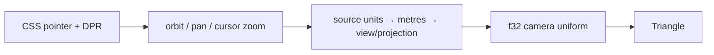

# 02 — Coordinate spaces and the real camera

Starting checkpoint: 01. Install the retained f64 camera/math module; only the final GPU matrix crosses to f32.



Text alternative: CSS pointer coordinates and DPR drive the camera; source-to-view transforms become the GPU matrix.

1. Replace the identity transform with the production camera.

**COPY/PASTE — complete mechanical additions and exact reconstruction.** Starting at checkpoint 01, [the complete patch](reconstruction/patches/02.patch) identifies every file and unique replacement context; it contains all imports, shader entries and descriptors.

```sh
python3 "$COURSE_REPO/docs/reconstruction/replay.py" --output /tmp/viewer-course --through 02 --advance --verify --target-dir "$COURSE_REPO/target"
```

For the manual route, use the patch's complete file changes, substitute the following **TYPE BY HAND** blocks for their corresponding additions, then record the exact result with `--adopt --verify` instead of `--advance --verify`; `--adopt` checks every source byte against this checkpoint.

**COPY/PASTE — complete source and shell changes.** 02.patch creates `src/camera.rs` and `src/math.rs`, then updates `Tutorial` in `src/lib.rs` with camera ownership, initialization, `drag`, `zoom` and the uniform write; every camera method is included, including its near-plane and finite-zoom policy.

**TYPE BY HAND — in `src/math.rs`, replace the complete `mat_mul` function.** Matrices use column-major indexing; the multiplication order remains `projection × view × model`.

```rust
pub fn mat_mul(a: &Mat4, b: &Mat4) -> Mat4 {
    let mut out = [0.0f64; 16];
    for i in 0..4 {
        for j in 0..4 {
            let mut sum = 0.0;
            for k in 0..4 {
                sum += a[k * 4 + i] * b[j * 4 + k];
            }
            out[j * 4 + i] = sum;
        }
    }
    out
}
```

**TYPE BY HAND — in `src/camera.rs`, replace the complete `Camera::orbit` method inside its existing `impl Camera`.** The quaternion is the orientation source of truth, and the eye is derived after every update.

```rust
pub fn orbit(&mut self, dx: f32, dy: f32) {
        let wu = Vector::new(self.world_up[0], self.world_up[1], self.world_up[2]);
        let right = self.orientation.rotate_vector(Vector::x_axis());
        let yaw_q = Quaternion::from_axis_angle(wu, (-dx * 0.005) as f64);
        let pitch_q = Quaternion::from_axis_angle(right, (-dy * 0.005) as f64);

        self.orientation = (yaw_q * (pitch_q * self.orientation.duplicate())).normalized();
        self.update_position();
    }
```

**TYPE BY HAND — in `src/lib.rs`, replace the complete `Tutorial::zoom` method.** The browser wheel adapter passes `-event.deltaY / 100`; cursor and viewport both cross from CSS to physical pixels exactly once.

```rust
pub fn zoom(&mut self, delta: f32, x: f64, y: f64) {
        self.camera.zoom_at(
            delta,
            (x * self.scale, y * self.scale),
            (self.config.width as f64, self.config.height as f64),
        );
    }
```

**COPY/PASTE — inspect the exact uniform write in `Tutorial::render_frame`.** The teaching triangle is still at world origin, so this stage supplies an explicit zero anchor; checkpoint 04 will share the camera anchor with the production instance table.

```rust
let mvp = self.camera.view_proj_anchored(
    width as f64 / height as f64,
    &session_rust::Point::new(0.0, 0.0, 0.0),
);
self.queue.write_buffer(&self.uniform, 0, bytemuck::cast_slice(&mvp.to_f32()));
```
**COPY/PASTE — run this completed checkpoint.**

```sh
cd /tmp/viewer-course/session_viewer
REGEN_PROTO=0 NO_COLOR=true trunk serve
```

Open <http://127.0.0.1:8770/>. Drag to orbit, Shift-drag to pan, and wheel over a triangle corner to zoom toward it. Resize the window and change browser zoom: the framebuffer follows CSS size × actual DPR.

The maintained `--verify` check builds WASM and captures actual browser pixels at DPR 1 and 2; it rejects page/GPU errors and framebuffer scaling mismatches. Checkpoint 02 deliberately retains the temporary direct-canvas shell, which chapter 12 replaces with the final winit/State ownership.
