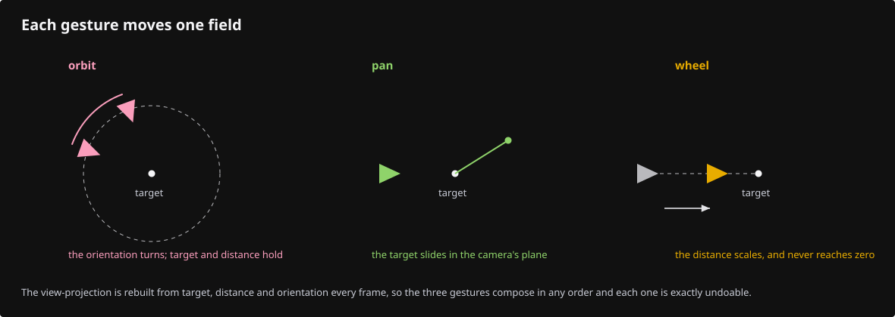
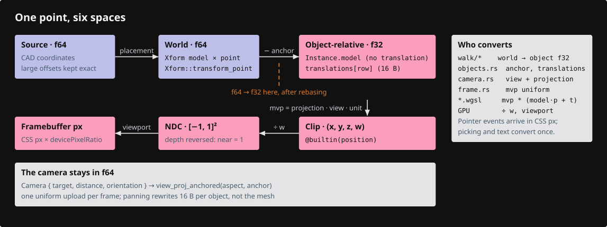
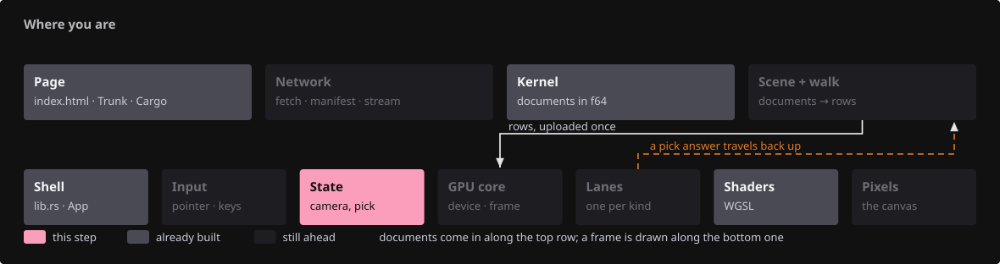
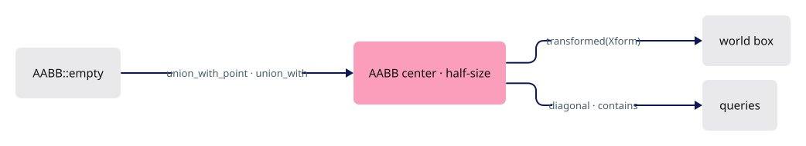
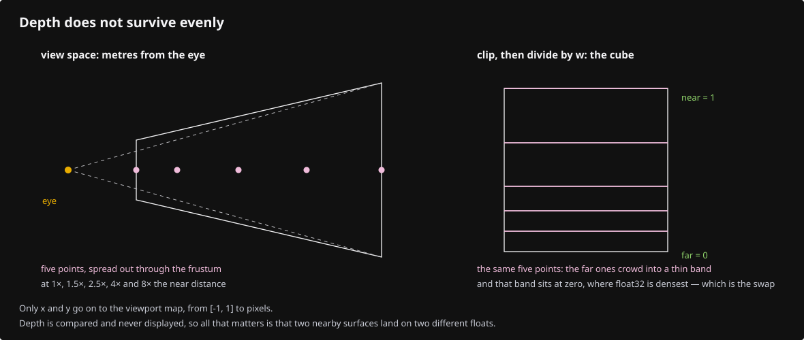
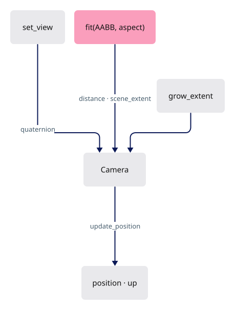
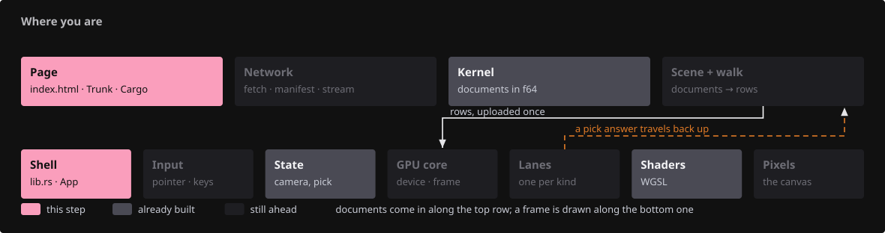
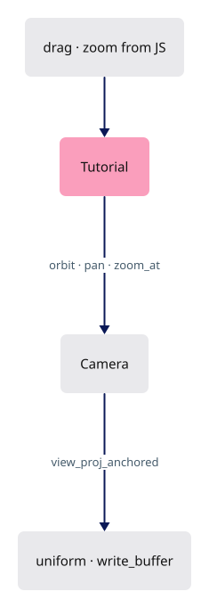
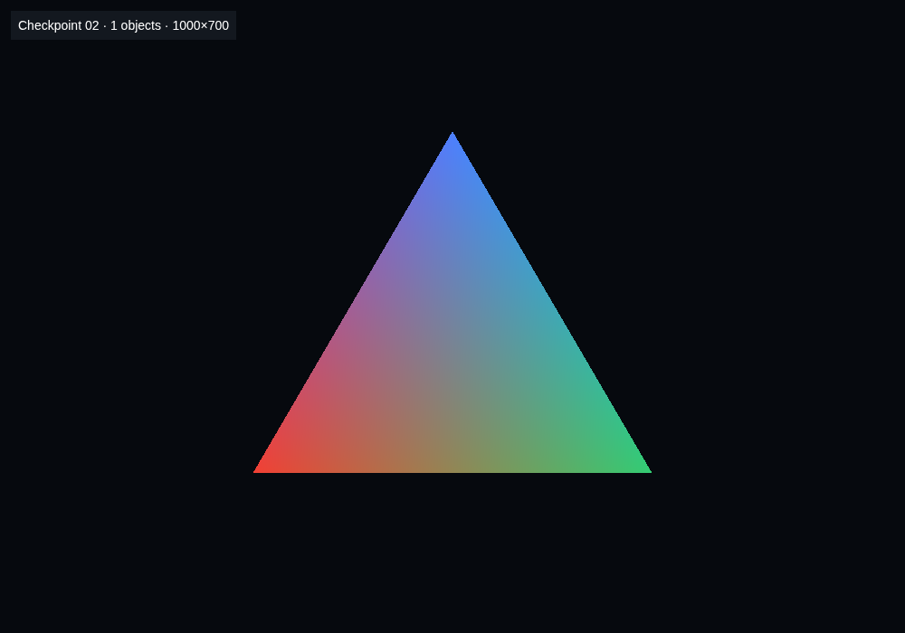

# 02 · Camera

## You are building



Four spaces, one conversion each:

```text
local (mm, f64) → world → camera (view) → clip (x, y, z, w) → ÷w → NDC → viewport × DPR → pixels
```



## Starting point

- Checkpoint 01: one triangle, identity matrix in the uniform, `drag` and `zoom` do nothing.
- This lesson adds the production `camera.rs` and `math.rs` in full, then wires the shell to them.

<!-- step-status: start -->

**Does it compile yet?** Yes — `cargo check` was run at the end of every step of this lesson.

<!-- step-status: end -->

## Step 1 · Matrix helpers

{ .locator data-strip="illustrations/strip-2150f410c0.svg" }

- A placement is 16 column-major doubles: `index = col * 4 + row`. Every multiply here follows that rule, and so does the kernel's `Xform`.
- The f64 → f32 edge is one function, `mat_to_f32`, so it is easy to find when a large model jitters.

![Diagram: Mat4 · [f64; 16] · Mat4 · placed point · [f32; 16] for the GPU](illustrations/02-01.svg)

<span class="zone-mark" data-strip="illustrations/strip-2150f410c0.svg" data-zone="State"></span>

<!-- file: 02 session_viewer/src/math.rs type lines=1-71 -->

## Step 2 · A box that can be empty

{ .locator data-strip="illustrations/strip-2150f410c0.svg" }

- `Aabb::empty()` is inverted (min > max), so a scene can start with no box and `grow` one point at a time.
- `placed` transforms the eight corners; conservative for rotations, exact for translations.



<span class="zone-mark" data-strip="illustrations/strip-2150f410c0.svg" data-zone="State"></span>

<!-- file: 02 session_viewer/src/math.rs type lines=72-123 -->

- `placed` transforms all eight corners rather than the two extremes, because a rotation moves a corner that was not extreme into a position that is.

<span class="zone-mark" data-strip="illustrations/strip-2150f410c0.svg" data-zone="State"></span>

<!-- file: 02 session_viewer/src/math.rs type lines=124-154 -->

## Step 3 · Recover camera facts from the matrix

{ .locator data-strip="illustrations/strip-2150f410c0.svg" }

Draw lanes receive only the view-projection, never the camera. The eye is where clip x, y and w vanish together (one 3×3 solve); orthographic has no eye, so the fallback is the view direction pushed far back.

<span class="zone-mark" data-strip="illustrations/strip-2150f410c0.svg" data-zone="State"></span>

<!-- file: 02 session_viewer/src/math.rs type lines=155-220 -->

## Step 4 · Camera state

{ .locator data-strip="illustrations/strip-2150f410c0.svg" }

- `orientation` is a quaternion, the single source of truth; `position` and `up` are derived from it.
- Internal units are metres; `Unit` converts scene millimetres at the matrix edge.
- `scene_extent` floors the far plane so zooming into one detail cannot clip the rest of the scene.

<span class="zone-mark" data-strip="illustrations/strip-2150f410c0.svg" data-zone="State"></span>

<!-- file: 02 session_viewer/src/camera.rs type lines=1-52 -->

## Step 5 · Construction and gestures

{ .locator data-strip="illustrations/strip-2150f410c0.svg" }

- Orbit is yaw about `world_up`, then pitch about the current right axis; no Euler singularity.
- `zoom_at` keeps the world point under the cursor fixed: the target moves toward it by the zoom factor. Cursor and viewport are physical pixels, the same space as the framebuffer.

<span class="zone-mark" data-strip="illustrations/strip-2150f410c0.svg" data-zone="State"></span>

<!-- file: 02 session_viewer/src/camera.rs type lines=53-111 -->


<span class="zone-mark" data-strip="illustrations/strip-2150f410c0.svg" data-zone="State"></span>

<!-- file: 02 session_viewer/src/camera.rs type lines=112-138 -->

## Step 6 · Projection swap that keeps the content

{ .locator data-strip="illustrations/strip-2150f410c0.svg" }

Orthographic shows content off-axis and nearer than the target plane; a naive flip to perspective would present sky. The framed toggle clips the bounds to the rectangle the orthographic view was showing and refits.



<span class="zone-mark" data-strip="illustrations/strip-2150f410c0.svg" data-zone="State"></span>

<!-- file: 02 session_viewer/src/camera.rs type lines=139-195 -->

## Step 7 · The view-projection

{ .locator data-strip="illustrations/strip-2150f410c0.svg" }

- **Reversed depth:** near and far are swapped in `perspective(...)`, so near is 1 and far approaches 0. The depth pass clears to 0 and compares `Greater`; all three must agree.
- **Anchor:** eye and target are expressed relative to a caller anchor in world units before any f32 exists, so a model far from the origin does not cancel to noise.
- Near is a ten-thousandth of the focus distance: the cut opens a millimetre ahead of the eye, not a beam's width.

<span class="zone-mark" data-strip="illustrations/strip-2150f410c0.svg" data-zone="State"></span>

<!-- file: 02 session_viewer/src/camera.rs type lines=196-269 -->

## Step 8 · Named views, fit, extent

{ .locator data-strip="illustrations/strip-2150f410c0.svg" }

- `fit` measures the box along the camera's own axes with `tan`, not a bounding sphere with `sin`; elongated scenes no longer sit twice as far as needed.
- Every mutation ends in `update_position`.



<span class="zone-mark" data-strip="illustrations/strip-2150f410c0.svg" data-zone="State"></span>

<!-- file: 02 session_viewer/src/camera.rs type lines=270-298 -->

- Fitting is the one gesture that reads the scene: it centres the target on the box.

<span class="zone-mark" data-strip="illustrations/strip-2150f410c0.svg" data-zone="State"></span>

<!-- file: 02 session_viewer/src/camera.rs type lines=299-347 -->

- The far plane has a floor rather than a value. Geometry streams in after the first fit, so the camera keeps the widest extent it has ever been told about instead of refitting and cutting the scene it already showed.

<span class="zone-mark" data-strip="illustrations/strip-2150f410c0.svg" data-zone="State"></span>

<!-- file: 02 session_viewer/src/camera.rs type lines=348-399 -->

## Step 9 · Wheel response

{ .locator data-strip="illustrations/strip-2150f410c0.svg" }

- `zoom_distance` is exponential per detent and clamps a single event to ten detents, so coalesced wheel events compose and never cross zero.
- The two `#[cfg(test)]` modules are native-only unit checks; they are not part of the browser build.

<span class="zone-mark" data-strip="illustrations/strip-2150f410c0.svg" data-zone="State"></span>

<!-- file: 02 session_viewer/src/camera.rs copy lines=400-513 -->

<!-- check: 02 -->

## Step 10 · Wire the shell

{ .locator data-strip="illustrations/strip-8dfd0a40d7.svg" }

- The uniform buffer is kept in the struct, and each frame writes a fresh matrix into it.
- The anchor passed to `view_proj_anchored` is the world origin, where the triangle sits.
- Gestures arrive in CSS pixels and are scaled by `self.scale` before the camera sees them.



<span class="zone-mark" data-strip="illustrations/strip-8075c7cb7f.svg" data-zone="Shell"></span>

<!-- file: 02 session_viewer/src/lib.rs type -->

<span class="zone-mark" data-strip="illustrations/strip-6e1de1d35a.svg" data-zone="Page"></span>

<!-- file: 02 session_viewer/index.html copy -->

## Check

<!-- checkpoint: 02 -->

Expected:

- Status reads **Checkpoint 02 · 1 objects**.
- Drag orbits the triangle; Shift-drag pans; the wheel zooms toward the cursor and the point under it stays put.
- Resize the page and repeat: no stretching, no jump.

If dragging moves twice as far on a high-DPI display, look at the `self.scale` conversion, not at the camera speeds. If a large translated model jitters, look for an f64 → f32 conversion that happens before rebasing.



## What changed

<!-- tree: 02 session_viewer/src -->

- `Camera` owns view state; `math.rs` owns the matrix and box helpers both sides of the crate use.
- Data flow: gesture → `Camera` → `Xform` → `[f32; 16]` → uniform → `mvp` in the shader.

**Production equivalent:** `src/camera.rs` and `src/math.rs` are the production files.

## Try

- Change `FOVY_DEG` in `math.rs` and reload: the triangle grows or shrinks without moving the camera; a wider field of view compresses the middle of the picture.
- Set `perspective: false` in `Camera::new` and orbit: the far edge no longer shrinks, and zoom scales the whole picture instead of walking towards it.
- Pan with Shift held and release far from the origin, then zoom with the wheel: the point under the cursor stays under the cursor.

## Questions and answers

**`index = col * 4 + row`. Why does the convention matter more than the formula?**

*How to work it out.* Indexing the other way gives you the transpose — still a perfectly valid 4×4 matrix, so nothing errors. Then ask who else has an opinion: the kernel's `Xform`, this file, and WGSL's `m * v`. Three parties, one convention, no runtime check.

*The answer.* The risk is that the wrong one is silent: a transposed matrix multiplies without complaint and produces a picture wrong in a plausible way — the object rotates about the wrong point, or translates when it should scale. `math.rs`, the kernel and WGSL all agree on column-major, so the rule is written once and never renegotiated.

**Reverse-Z needs three things to agree. Which three?**

*How to work it out.* Depth is a comparison, and a comparison has three inputs you control: what the projection produces, what the buffer starts at, and which direction counts as "closer". Change any one and the other two are now describing a different convention.

*The answer.* Near and far are swapped in the projection (near becomes 1, far approaches 0); the depth attachment clears to `0.0`; the compare is `Greater`. Two right out of three is the interesting failure: everything vanishes (nothing beats the clear) or nothing is ever occluded (everything beats it).

**Where does f64 become f32, and why exactly there?**

*How to work it out.* f32 has about seven significant digits. A model a kilometre from the origin, measured in millimetres, needs seven digits before the decimal point — so the conversion has to happen when the numbers are *small*. Ask what makes them small: subtracting an anchor near the camera.

*The answer.* In `mat_to_f32`, after the anchor has been subtracted. Convert before rebasing and the low bits are gone, and the symptom is jitter you cannot debug from inside the shader because the shader was handed bad numbers. One function is the whole matrix f64 → f32 boundary, so there is one place to look when a placement jitters.

**Why must `zoom_at` be given physical pixels rather than CSS pixels?**

*How to work it out.* The function's job is to keep the world point under the cursor fixed. That means it has to agree with whatever drew that point — and the framebuffer is in physical pixels. Then ask when the two units differ: whenever `devicePixelRatio` is not 1.

*The answer.* Because the cursor position and the rendered pixel must be in the same space. On a 1× display the bug is invisible; on a 2× laptop every gesture moves twice as far. That is why the conversion happens once, at the input layer, rather than being remembered at each call site.

**What you should be able to do now**

State the orbit gesture in one sentence and say why the alternatives fail. Correct: yaw about the world up axis, then pitch about the camera's *current* right axis. Doing it in the other order, or storing Euler angles, eventually lines two rotation axes up and the camera loses a degree of freedom — gimbal lock. The quaternion is the single source of truth here precisely so that cannot happen.

## Next

[03 · Object rows and identity](03-identity.md): a storage buffer of per-object rows, and why a GPU row is not a source identity.
