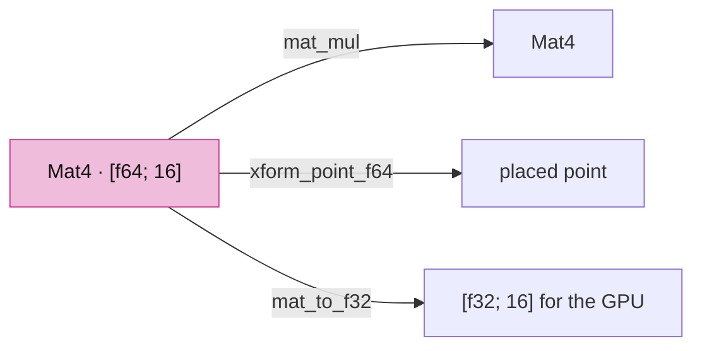
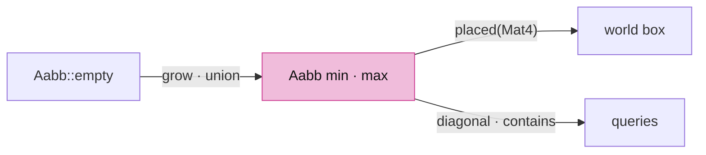
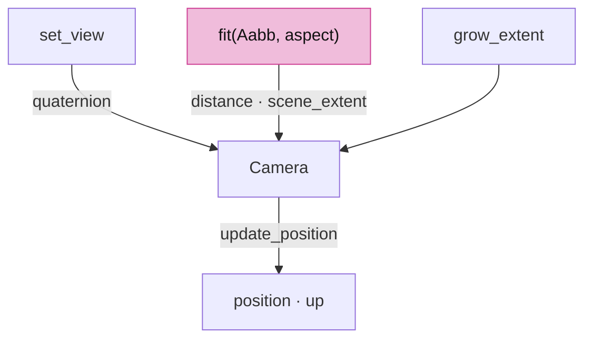
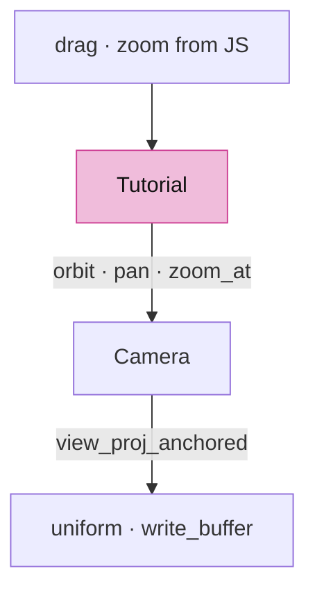

# 02 · Camera

## You are building


Four spaces, one conversion each:

```text
local (mm, f64) → world → camera (view) → clip (x, y, z, w) → ÷w → NDC → viewport × DPR → pixels
```


## Starting point

- Checkpoint 01: one triangle, identity matrix in the uniform, `drag` and `zoom` do nothing.
- This lesson adds the production `camera.rs` and `math.rs` in full, then wires the shell to them.

## Step 1 · Matrix helpers

- A placement is 16 column-major doubles: `index = col * 4 + row`. Every multiply here follows that rule, and so does the kernel's `Xform`.
- The f64 → f32 edge is one function, `mat_to_f32`, so it is easy to find when a large model jitters.



<!-- file: 02 session_viewer/src/math.rs type lines=1-71 -->

## Step 2 · A box that can be empty

- `Aabb::empty()` is inverted (min > max), so a scene can start with no box and `grow` one point at a time.
- `placed` transforms the eight corners; conservative for rotations, exact for translations.



<!-- file: 02 session_viewer/src/math.rs type lines=72-162 -->

## Step 3 · Recover camera facts from the matrix

Draw lanes receive only the view-projection, never the camera. The eye is where clip x, y and w vanish together (one 3×3 solve); orthographic has no eye, so the fallback is the view direction pushed far back.


<!-- file: 02 session_viewer/src/math.rs type lines=163-220 -->

## Step 4 · Camera state

- `orientation` is a quaternion, the single source of truth; `position` and `up` are derived from it.
- Internal units are metres; `Unit` converts scene millimetres at the matrix edge.
- `scene_extent` floors the far plane so zooming into one detail cannot clip the rest of the scene.


<!-- file: 02 session_viewer/src/camera.rs type lines=1-52 -->

## Step 5 · Construction and gestures

- Orbit is yaw about `world_up`, then pitch about the current right axis; no Euler singularity.
- `zoom_at` keeps the world point under the cursor fixed: the target moves toward it by the zoom factor. Cursor and viewport are physical pixels, the same space as the framebuffer.


<!-- file: 02 session_viewer/src/camera.rs type lines=53-138 -->

## Step 6 · Projection swap that keeps the content

Orthographic shows content off-axis and nearer than the target plane; a naive flip to perspective would present sky. The framed toggle clips the bounds to the rectangle the orthographic view was showing and refits.


<!-- file: 02 session_viewer/src/camera.rs type lines=139-197 -->

## Step 7 · The view-projection

- **Reversed depth:** near and far are swapped in `perspective(...)`, so near is 1 and far approaches 0. The depth pass clears to 0 and compares `Greater`; all three must agree.
- **Anchor:** eye and target are expressed relative to a caller anchor in world units before any f32 exists, so a model far from the origin does not cancel to noise.
- Near is a ten-thousandth of the focus distance: the cut opens a millimetre ahead of the eye, not a beam's width.


<!-- file: 02 session_viewer/src/camera.rs type lines=198-271 -->

## Step 8 · Named views, fit, extent

- `fit` measures the box along the camera's own axes with `tan`, not a bounding sphere with `sin`; elongated scenes no longer sit twice as far as needed.
- `grow_extent` widens only the far-plane floor when more geometry streams in.
- Every mutation ends in `update_position`.



<!-- file: 02 session_viewer/src/camera.rs type lines=272-400 -->

## Step 9 · Wheel response

- `zoom_distance` is exponential per detent and clamps a single event to ten detents, so coalesced wheel events compose and never cross zero.
- The two `#[cfg(test)]` modules are native-only unit checks; they are not part of the browser build.


<!-- file: 02 session_viewer/src/camera.rs copy lines=401-512 -->

<!-- check: 02 -->

## Step 10 · Wire the shell

- The uniform buffer is kept in the struct, and each frame writes a fresh matrix into it.
- The anchor passed to `view_proj_anchored` is the world origin, where the triangle sits.
- Gestures arrive in CSS pixels and are scaled by `self.scale` before the camera sees them.



<!-- file: 02 session_viewer/src/lib.rs type -->

<!-- file: 02 session_viewer/index.html copy -->

## Check

<!-- checkpoint: 02 -->

Expected:

- Status reads **Checkpoint 02 · 1 objects**.
- Drag orbits the triangle; Shift-drag pans; the wheel zooms toward the cursor and the point under it stays put.
- Resize the page and repeat: no stretching, no jump.

If dragging moves twice as far on a high-DPI display, look at the `self.scale` conversion, not at the camera speeds. If a large translated model jitters, look for an f64 → f32 conversion that happens before rebasing.


## What changed

<!-- tree: 02 session_viewer/src -->

- `Camera` owns view state; `math.rs` owns the matrix and box helpers both sides of the crate use.
- Data flow: gesture → `Camera` → `Xform` → `[f32; 16]` → uniform → `mvp` in the shader.

**Production equivalent:** `src/camera.rs` and `src/math.rs` are the production files.

## Try

- Change `FOVY_DEG` in `math.rs` and reload: the triangle grows or shrinks without moving the camera; a wider field of view compresses the middle of the picture.
- Set `perspective: false` in `Camera::new` and orbit: the far edge no longer shrinks, and zoom scales the whole picture instead of walking towards it.
- Pan with Shift held and release far from the origin, then zoom with the wheel: the point under the cursor stays under the cursor.

## Next

[03 · Object rows and identity](03-identity.md): a storage buffer of per-object rows, and why a GPU row is not a source identity.
