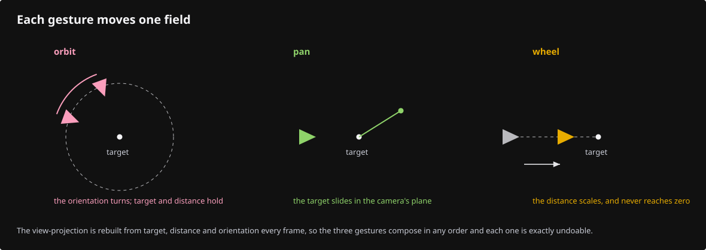

# 02 · Camera

**Estimated study time: about 15–25 hours.** Includes reading, typing, tracing, testing and experiments. [How to use this estimate](map.md#time-estimates).

**This section:** Implement orbit, pan and zoom, and turn a camera into a projection.

**In the whole viewer:** The camera changes the view of the scene. It supplies frame data to the renderer without editing source geometry.

**Follow the data:** Pointer movement → camera values → view-projection matrix → screen position.

**Start with these files:** [`src/camera.rs`](02-camera.md#code-02-002), [`src/engine/gpu/frame.rs`](01-first-frame.md#code-01-008).

**Aim to explain:** Which data should change when you orbit, and which should remain unchanged?

[Whole-viewer map and course milestones](map.md)

Hold a small model on the table. Walking around it changes your view, but not its shape. Our camera works the same way. Orbit changes its orientation, pan shifts its target, and zoom changes its distance. The geometry stays in its own coordinates.



Start from the working result of [step 01](01-first-frame.md).

**One buildable step:** type the additions below in `workspace/handwritten`, then build and test. This step adds 819 lines across 5 files and may take several sittings. Individual listings are parts of this step, not separate build checkpoints.

<span id="code-02-001"></span>

## `src/lib.rs`

Append **after line 27** of your current file.

Blank lines before: **1**; after: **0**. End with a newline.

```rust
--8<-- "typing/code/02-001.rs"
```

<span id="code-02-002"></span>

## `src/camera.rs`

The camera converts world positions into a view and then a projection. Orbit changes the eye around a target; pan moves the eye and target together. Perspective makes distant objects appear smaller. An inverse transform lets a screen position become a world-space ray.

Create this file. Type the complete listing, including comments and blank lines.

```rust
--8<-- "typing/code/02-002.rs"
```

<span id="code-02-003"></span>

## `src/engine/gpu/backdrop.rs`

Insert **after line 10** of your current file.

Keep these preceding lines:

```rust

/// Shader sources the tests compare against the files.
#[cfg(test)]
pub const SHADERS: &[(&str, &str)] = &[
```

Keep these following lines:

```rust
    ("background.wgsl", shader!("background.wgsl")),
];

/// Grid vertex count: 44 floor lines plus 6 axis lines.
```

Type these new lines:

```rust
--8<-- "typing/code/02-003.rs"
```

<span id="code-02-004"></span>

## `src/engine/gpu/backdrop.rs`

Insert **after line 20** of your current file.

Keep these preceding lines:

```rust

/// Draws the background color and the floor grid.
pub struct BackdropLane {
    background_shader: Shader, // fullscreen background shader
```

Keep these following lines:

```rust
    background: Pipeline,      // background pipeline
}

impl BackdropLane {
```

Type these new lines:

```rust
--8<-- "typing/code/02-004.rs"
```

<span id="code-02-005"></span>

## `src/engine/gpu/backdrop.rs`

Insert **after line 22** of your current file.

Keep these preceding lines:

```rust
pub struct BackdropLane {
    background_shader: Shader, // fullscreen background shader
    grid_shader: Shader,       // floor grid shader; register:camera
    background: Pipeline,      // background pipeline
```

Keep these following lines:

```rust
}

impl BackdropLane {
    /// Compile both shaders and build the pipelines.
```

Type these new lines:

```rust
--8<-- "typing/code/02-005.rs"
```

<span id="code-02-006"></span>

## `src/engine/gpu/backdrop.rs`

Insert **after line 30** of your current file.

Keep these preceding lines:

```rust
    /// Compile both shaders and build the pipelines.
    pub fn new(ctx: &GpuCtx, l: &Layouts, target: Target) -> Self {
        // `scene_module` appends the shared scene code; nothing compiles until a pass first sets the pipeline
        let background_shader = scene_module(ctx, "background.shader", shader!("background.wgsl"));
```

Keep these following lines:

```rust
        let background = build_background(ctx, l, &background_shader, target);

        Self {
            background_shader,
```

Type these new lines:

```rust
--8<-- "typing/code/02-006.rs"
```

<span id="code-02-007"></span>

## `src/engine/gpu/backdrop.rs`

Insert **after line 32** of your current file.

Keep these preceding lines:

```rust
        // `scene_module` appends the shared scene code; nothing compiles until a pass first sets the pipeline
        let background_shader = scene_module(ctx, "background.shader", shader!("background.wgsl"));
        let grid_shader = scene_module(ctx, "grid.shader", shader!("grid.wgsl")); // register:camera
        let background = build_background(ctx, l, &background_shader, target);
```

Keep these following lines:

```rust

        Self {
            background_shader,
            background,
```

Type these new lines:

```rust
--8<-- "typing/code/02-007.rs"
```

<span id="code-02-008"></span>

## `src/engine/gpu/backdrop.rs`

Insert **after line 36** of your current file.

Keep these preceding lines:

```rust
        let grid = build_grid(ctx, l, &grid_shader, target); // register:camera

        Self {
            background_shader,
```

Keep these following lines:

```rust
            background,
        }
    }
```

Type these new lines:

```rust
--8<-- "typing/code/02-008.rs"
```

<span id="code-02-009"></span>

## `src/engine/gpu/backdrop.rs`

Insert **after line 38** of your current file.

Keep these preceding lines:

```rust
        Self {
            background_shader,
            grid_shader, // register:camera
            background,
```

Keep these following lines:

```rust
        }
    }

    /// Rebuild both pipelines for a new sample count.
```

Type these new lines:

```rust
--8<-- "typing/code/02-009.rs"
```

<span id="code-02-010"></span>

## `src/engine/gpu/backdrop.rs`

Insert **after line 45** of your current file.

Keep these preceding lines:

```rust

    /// Rebuild both pipelines for a new sample count.
    pub fn retarget(&mut self, ctx: &GpuCtx, l: &Layouts, target: Target) {
        self.background = build_background(ctx, l, &self.background_shader, target);
```

Keep these following lines:

```rust
    }

    /// Draw the background as one fullscreen triangle.
    pub fn draw_background(&self, pass: &mut wgpu::RenderPass<'_>, b: &Binds) -> u32 {
```

Type these new lines:

```rust
--8<-- "typing/code/02-010.rs"
```

<span id="code-02-011"></span>

## `src/engine/gpu/backdrop.rs`

Append **after line 79** of your current file.

Blank lines before: **1**; after: **0**. End with a newline.

```rust
--8<-- "typing/code/02-011.rs"
```

<span id="code-02-012"></span>

## `src/engine/gpu/render.rs`

Insert **after line 59** of your current file.

Keep these preceding lines:

```rust
    /// Draws of the backdrop: background and grid.
    pub(super) fn backdrop_list(&self, pass: &mut wgpu::RenderPass<'_>, b: &Binds) -> u32 {
        let mut draws = self.backdrop.draw_background(pass, b);
```

Keep these following lines:

```rust
        draws
    }

    /// Draws of the first pass after the backdrop and caps: faces, clouds.
```

Type these new lines:

```rust
--8<-- "typing/code/02-012.rs"
```

<span id="code-02-013"></span>

## `src/engine/gpu/render.rs`

Append **after line 71** of your current file.

Blank lines before: **1**; after: **0**. End with a newline.

```rust
--8<-- "typing/code/02-013.rs"
```

<span id="code-02-014"></span>

## `src/shaders/grid.wgsl`

Create this file. Type the complete listing, including comments and blank lines.

```wgsl
--8<-- "typing/code/02-014.wgsl"
```

## Check the completed chapter

From `session_viewer`, compare everything you have typed:

```sh
npm --prefix ../session_tests run course -- reference-check 02
```

From `workspace/handwritten`:

```sh
cargo build --lib --locked -j4
cargo xtest --lib --locked -j4
```

Run the native camera tests. They check projection and navigation numerically. Trace one call to each of orbit, pan and zoom; a model vertex should not be changed by any of them.

If a method is missing, use the cumulative source checker to find the first difference in `src/camera.rs`. Check that methods are inside the intended `impl Camera` block and that every brace you typed is still present.

**Before moving on:** explain what changed, check the expected result above, and fix any build or test failure.

<details>
<summary>Check your explanation of the opening question</summary>

Camera orientation and the view-projection matrix change. The document’s vertices and the stored geometry remain unchanged.

</details>

[Next step: 03](03-identity.md)
