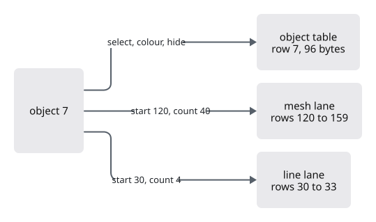

# 03 · Object rows and identity

A click selects object 7. How much must the GPU change? Object 7 owns one 96-byte row in the object table, and from lesson 04a on it also owns runs of rows in the lanes: say mesh rows 120 to 159 and line rows 30 to 33.

Selecting, colouring and hiding change only the 96-byte row: one bit of its flags, or its colour. So selecting a mesh of a million triangles is one small write. Changing the object's shape is different: we must find its runs in every lane. A span records exactly that, per lane: the first row and the row count.



This lesson writes the span types and the row edits a click will call.

## Where an object's rows sit

### Add the module

`lessons/03/src/engine/gpu/mod.rs` · add the line tagged `register:patch`

`pub(crate)` makes the module visible inside this crate only.

```rust
--8<-- "lessons/03/src/engine/gpu/mod.rs:modules"
```

### Name each lane's table

`lessons/03/src/engine/gpu/patch.rs` · new file

A lane table is identified by a `LaneId`. There are two kinds: fixed lanes, which lessons 04a to 04c add to this enum, and registered lanes from `REGISTRY`, found by their index. Today both lists are empty, and `stride` gives the bytes of one row, so we can count memory.

```rust
--8<-- "lessons/03/src/engine/gpu/patch.rs:lane-ids"
```

### Count rows per lane

`lessons/03/src/engine/gpu/patch.rs` · append at the end of the file

`Counts` holds one number per lane table. With no lanes yet, it holds an empty array, `[u32; 0]`; each lane lesson adds its field. The methods add, subtract and compare two counts lane by lane, which is all the arithmetic an edit needs.

```rust
--8<-- "lessons/03/src/engine/gpu/patch.rs:counts"
```

### A span: where and how many

`lessons/03/src/engine/gpu/patch.rs` · append at the end of the file

Two counts make a span: the first row in each lane, and how many rows. Object 7 above has start 120 and count 40 in the mesh lane.

```rust
--8<-- "lessons/03/src/engine/gpu/patch.rs:span"
```

## Count what an edit leaves behind

When an edit gives object 7 a new shape with more rows, its old rows are hidden and new ones appended. The hidden rows are dead: they take memory until the scene is packed again. The `Gpu` counts them.

### Keep a dead count

`lessons/03/src/engine/gpu/mod.rs` · add the line tagged `register:patch`

One field: the dead rows per lane, as a `Counts`.

```rust
--8<-- "lessons/03/src/engine/gpu/mod.rs:gpu-struct"
```

### Start at zero

`lessons/03/src/engine/gpu/mod.rs` · add the line tagged `register:patch`

```rust
--8<-- "lessons/03/src/engine/gpu/mod.rs:gpu-build"
```

### Clear it with the rows

`lessons/03/src/engine/gpu/mod.rs` · add the lines tagged `register:patch`, one in each function

A reset or a release forgets every row, the dead ones too.

```rust
--8<-- "lessons/03/src/engine/gpu/mod.rs:reset"

--8<-- "lessons/03/src/engine/gpu/mod.rs:release"
```

## Edit one object

### Grow the box, move the anchor, count the dead

`lessons/03/src/engine/gpu/mod.rs` · append at the end of the file

Three edits for the whole scene: grow the scene box to take in one object, move the anchor when the camera travelled, and take the dead count. The empty `if rebase.moved { }` and the unused `points` are hooks: the point clouds of lesson 04d fill them with one line each.

```rust
--8<-- "lessons/03/src/engine/gpu/mod.rs:scene-edits"
```

### Select, colour and hide

`lessons/03/src/engine/gpu/mod.rs` · append at the end of the file

Each is one flag or colour in object `row`'s 96-byte row. Hiding keeps the row on the GPU, so showing the object again is one more small write. Selecting also bumps a counter, so anything that depends on the selection knows to update.

```rust
--8<-- "lessons/03/src/engine/gpu/mod.rs:row-edits"
```

## Checkpoint

Run `cargo check`: it compiles. Run `cargo xtest`: still `36 passed; 0 failed; 2 ignored`. Nothing new shows on screen; the first objects appear in lesson 04a, and these edits answer your clicks from lesson 12 on.

## Recap

Select, colour and hide rewrite one 96-byte row, however large the object. A span says where an object's rows sit in each lane, so a shape edit can find and replace them; the dead count remembers what it left behind. Next, meshes arrive as the first lane with rows of their own.

Next: [04a · Meshes on the GPU](04a-meshes.md)
