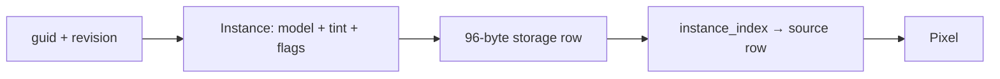

# 03 — Source identity and render instances

Starting checkpoint: 02. Two source identities share one local triangle while keeping independent placements and colors.



Text alternative: Source GUID and revision identify a 96-byte render instance row used by the vertex stage.

1. Add explicit source records and the first instance table.

**COPY/PASTE — complete mechanical additions and exact reconstruction.** Starting at checkpoint 02, [the complete patch](reconstruction/patches/03.patch) identifies every file and unique replacement context; it contains all imports, shader entries and descriptors.

```sh
python3 "$COURSE_REPO/docs/reconstruction/replay.py" --output /tmp/viewer-course --through 03 --advance --verify --target-dir "$COURSE_REPO/target"
```

For the manual route, use the patch's complete file changes, substitute the following **TYPE BY HAND** blocks for their corresponding additions, then record the exact result with `--adopt --verify` instead of `--advance --verify`; `--adopt` checks every source byte against this checkpoint.

**TYPE BY HAND — create the complete `src/scene.rs` module.** A source GUID/revision is neither a triangle index nor a transient GPU buffer offset.

```rust
//! Stable source identity stays separate from a GPU row or triangle index.
use crate::engine::gpu::instance::Instance;
/// One source revision and the render instance derived from it.
pub struct SourceObject {
    pub guid: &'static str,
    pub revision: u64,
    pub row: Instance,
}
/// Two independently placed/tinted copies of the same local triangle.
pub fn objects() -> [SourceObject; 2] {
    let mut left = Instance::placeholder();
    left.model[12] = -0.8;
    left.color = [1.0, 0.35, 0.2, 1.0];
    let mut right = Instance::placeholder();
    right.model[12] = 0.8;
    right.color = [0.2, 0.7, 1.0, 1.0];
    [
        SourceObject {
            guid: "triangle-left",
            revision: 1,
            row: left,
        },
        SourceObject {
            guid: "triangle-right",
            revision: 1,
            row: right,
        },
    ]
}
```

**TYPE BY HAND — in `src/engine/gpu/instance.rs`, add the complete `Instance` record below the existing `use session_rust::Xform;` import.** Keep `#[repr(C)]` and the derives immediately above it; the following size assertion is part of the layout contract.

```rust
#[repr(C)]
#[derive(Clone, Copy, bytemuck::Pod, bytemuck::Zeroable)]
pub struct Instance {
    pub model: [f32; 16],
    pub color: [f32; 4],
    pub flags: u32,
    /// Retained thickness metadata, in world units. Visibility no longer spends a depth
    /// offset based on this value; keeping the field preserves the shared instance layout.
    pub thickness: f32,
    /// Vertex spacing, world units; markers thin once it projects small. 0 = unknown.
    pub spacing: f32,
    pub _pad: u32,
}

const _: () = assert!(std::mem::size_of::<Instance>() == 96);
```

**COPY/PASTE — complete GPU integration.** 03.patch adds the module registrations and instance constants, adds storage binding 1 to the teaching camera layout, uploads the two records, and changes `first.wgsl` to index the matching WGSL `Instance` by `@builtin(instance_index)`.

The temporary `SourceObject`/single-group table is replaced by production `ObjectRow`/`InstanceTable` in 04; source geometry ownership then becomes explicit in the CAD producer chapters and final `Scene`.

**COPY/PASTE — run this completed checkpoint.**

```sh
cd /tmp/viewer-course/session_viewer
REGEN_PROTO=0 NO_COLOR=true trunk serve
```

Open <http://127.0.0.1:8770/>. Two flat-colored triangles appear: orange on the left and blue on the right. Orbiting moves both consistently; their model translations and tint rows remain independent.

The maintained `--verify` check builds WASM and captures actual browser pixels at DPR 1 and 2; it rejects page/GPU errors and framebuffer scaling mismatches. Checkpoint 03 deliberately retains the temporary direct-canvas shell, which chapter 12 replaces with the final winit/State ownership.
