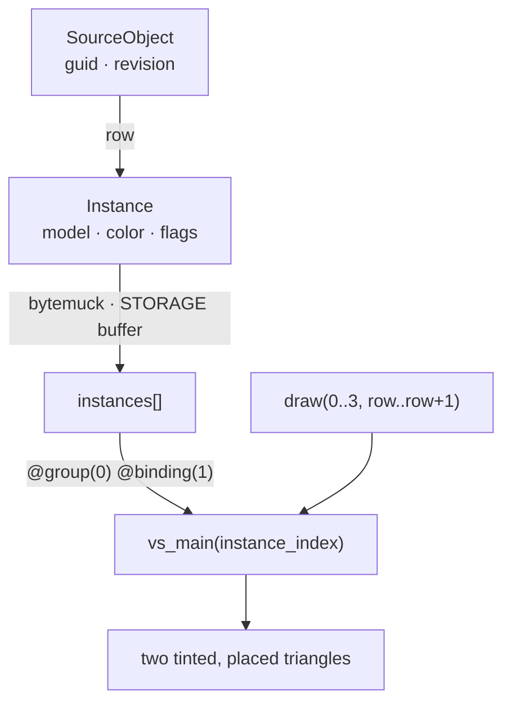
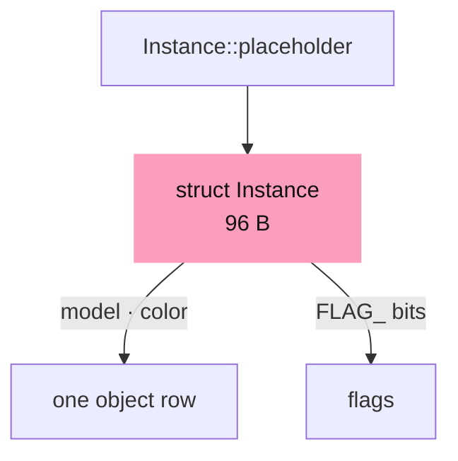
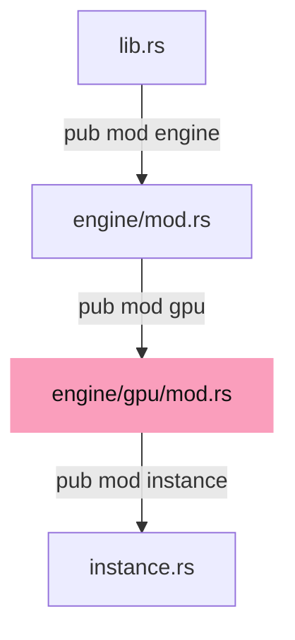
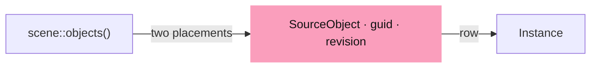
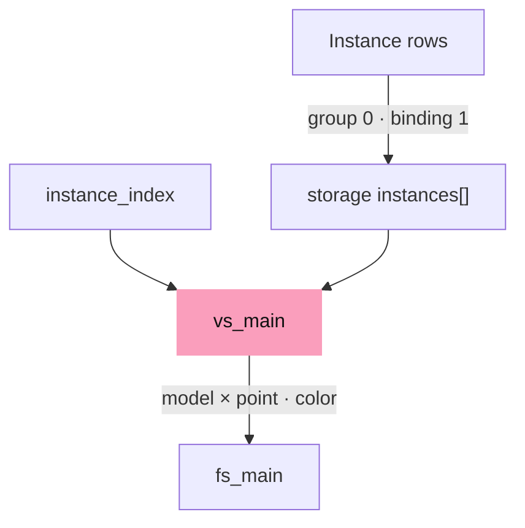
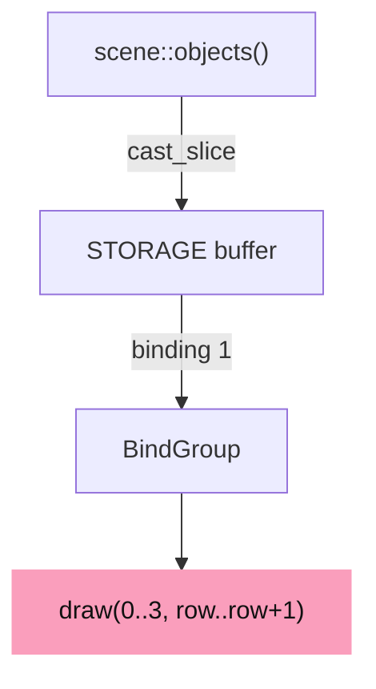

# 03 · Object rows and identity

## You are building




## Starting point

- Checkpoint 02: one triangle, one camera uniform.
- Same geometry drawn twice with different placement and tint. Identity lives on the CPU; the GPU only sees rows.

<!-- step-status: start -->

**Does it compile yet?** Yes, after every step of this lesson — `cargo check` was run at the end of each one to make sure. A step that writes a file Rust has not been told about yet compiles without checking any of it, so keep going to the checkpoint: that build is the real test.

<!-- step-status: end -->

## Step 1 · The object row

{ .locator data-strip="illustrations/strip-10d43625b6.svg" }

- One 96-byte record per object, indexed by `instance_index` in every instance-reading shader. Flags are bits: selecting sets bit 0 and keeps the rest.
- The translation column of `model` is zero; the anchored translation belongs to its own table (group 2, binding 1).
- The size assertion is compile-time: a wrong stride fails `cargo check`, not the picture.



<span class="zone-mark" data-strip="illustrations/strip-10d43625b6.svg" data-zone="GPU core"></span>

<!-- file: 03 session_viewer/src/engine/gpu/instance.rs type lines=1-57 -->

The rest of the file is `#[cfg(test)]` only: it parses every lane shader with naga and checks that WGSL member offsets equal the Rust ones; the browser build never compiles this block.

<span class="zone-mark" data-strip="illustrations/strip-10d43625b6.svg" data-zone="GPU core"></span>

<!-- file: 03 session_viewer/src/engine/gpu/instance.rs copy lines=58-236 -->

## Step 2 · Declare the engine module tree

{ .locator data-strip="illustrations/strip-10d43625b6.svg" }



<span class="zone-mark" data-strip="illustrations/strip-10d43625b6.svg" data-zone="GPU core"></span>

<!-- file: 03 session_viewer/src/engine/gpu/mod.rs type -->

<span class="zone-mark" data-strip="illustrations/strip-10d43625b6.svg" data-zone="GPU core"></span>

<!-- file: 03 session_viewer/src/engine/mod.rs type -->

- One line per module: until a `mod` names a file, Rust does not compile it, so this is the moment the row you typed enters the build.

## Step 3 · Source identity is separate from the row

{ .locator data-strip="illustrations/strip-3589a2f087.svg" }

- A `guid` and `revision` identify what the object *is*; the row says how it is drawn this revision.
- Picking returns a row; the scene maps it back. Never search for an object by matching triangle positions.



<span class="zone-mark" data-strip="illustrations/strip-3589a2f087.svg" data-zone="Scene + walk"></span>

<!-- file: 03 session_viewer/src/scene.rs type -->

<!-- check: 03 -->

## Step 4 · Rust layout ↔ WGSL layout

{ .locator data-strip="illustrations/strip-9d7fcc8d70.svg" }

Same bytes on both sides, read through different type systems:

```text
Rust `Instance`            offset   WGSL `struct Instance`
model: [f32; 16]              0     model: mat4x4<f32>
color: [f32; 4]              64     color: vec4<f32>
flags: u32                   80     flags: u32
_pad0: f32                   84     _pad0: f32
spacing: f32                 88     spacing: f32
_pad: u32                    92     pad: u32
size                         96     array stride
```

- `@builtin(instance_index)` is the `row` of `draw(0..3, row..row + 1)`.
- `@group(0) @binding(1) var<storage, read>` mirrors the `BufferBindingType::Storage { read_only: true }` entry added in the next step.



<span class="zone-mark" data-strip="illustrations/strip-9d7fcc8d70.svg" data-zone="Shaders"></span>

<!-- file: 03 session_viewer/src/shaders/first.wgsl type -->

## Step 5 · Bind the rows and draw each one

{ .locator data-strip="illustrations/strip-e2a9d1f0c8.svg" }

- The layout gains binding 1; the bind group supplies the storage buffer; one draw per row.
- `objects` stays on the CPU side of the shell, so the status can report a count that comes from source data rather than from the GPU.



<span class="zone-mark" data-strip="illustrations/strip-3d2a8d385e.svg" data-zone="Shell"></span>

<!-- file: 03 session_viewer/src/lib.rs type -->

<span class="zone-mark" data-strip="illustrations/strip-7b9fa61633.svg" data-zone="Page"></span>

<!-- file: 03 session_viewer/index.html copy -->


## Check

<!-- checkpoint: 03 -->

Expected:

- Two triangles, one orange on the left, one blue on the right.
- Status reads **Checkpoint 03 · 2 objects**.
- Orbit and zoom: the two keep their relative placement.

A wrong stride shows as a correct first object and a corrupt second one. A wrong source map looks fine until selection returns the other object.


## What changed

<!-- tree: 03 session_viewer/src -->

- `engine::gpu::instance::Instance` is the row contract between scene and shaders.
- Data flow: `SourceObject.row` → storage buffer → `instances[instance_index]` → placed, tinted vertex.

**Production equivalent:** `src/engine/gpu/instance.rs`. Production keeps the scene in `src/app/scene.rs`.

## Try

- Change the second row's `color` in `scene.rs`: only that triangle changes, because tint lives in the row, not in the geometry.
- Set the same `model[12]` for both rows: they overlap exactly, proving the geometry buffer is shared.
- Draw with `draw(0..3, 0..1)` only: the second row vanishes, because `instance_index` never reaches 1.

## Questions and answers

**`Instance` has a matrix, a colour, some flags and a spacing. Why does it occupy 96 bytes?**

*How to work it out.* Add the fields: 64 for the matrix, 16 for the colour, 4 + 4 + 4 for the rest — 92. Then ask what rounds it up. A `mat4x4` requires 16-byte alignment, and an element of a storage array must start at a multiple of the struct's largest alignment, so the stride is rounded to the next multiple of 16.

*The answer.* 96, because 92 rounds up to 96. The explicit padding field on the Rust side makes the round-up deliberate instead of accidental, and the size assertion turns a mistake into a `cargo check` failure rather than a correct first object and a corrupt second one.

**A GPU row is not a source identity. What is the difference, and why keep both?**

*How to work it out.* Ask what each one survives. Rows are rebuilt and renumbered whenever the scene reloads. A guid is written in the document and must mean the same thing next week. Anything a user is told about has to be the second kind.

*The answer.* A row is 96 bytes of drawing state at some index in a buffer; an identity is the guid and revision of a thing in the document. The GPU can only answer with a row, so `Scene` exists to turn that row back into something nameable. Collapse them into one and either your rows must never move, or your identities are not stable — both unacceptable.

**Which index reaches the shader's `instances[]`, and what sets it?**

*How to work it out.* Look at what the draw call takes: a vertex range and an instance range. The shader reads two builtins. One counts vertices; by elimination the other counts instances.

*The answer.* `@builtin(instance_index)`, set by the instance range of the draw: `draw(0..3, 1..2)` runs the vertex stage with `instance_index == 1`. Nothing is bound per object — one buffer, one index — which is why drawing a thousand objects costs one bind and a thousand indices.

**What you should be able to do now**

Write the `#[repr(C)]` row and its size assertion in an empty file without looking, then compare with `instance.rs`. Correct: `model: [f32; 16]`, `color: [f32; 4]`, `flags: u32`, a padding field, `spacing: f32`, `#[repr(C)]`, `Pod`/`Zeroable`, and `assert_eq!(size_of::<Instance>(), 96)`. If your field order differs, ask whether the shader would still work — and notice that `#[repr(C)]` is exactly what makes that question answerable, because without it Rust may reorder the fields.

## Next

[04a · Meshes on the GPU](04a-meshes.md): vertex and index buffers, the mesh arena, and the first real drawing module.
