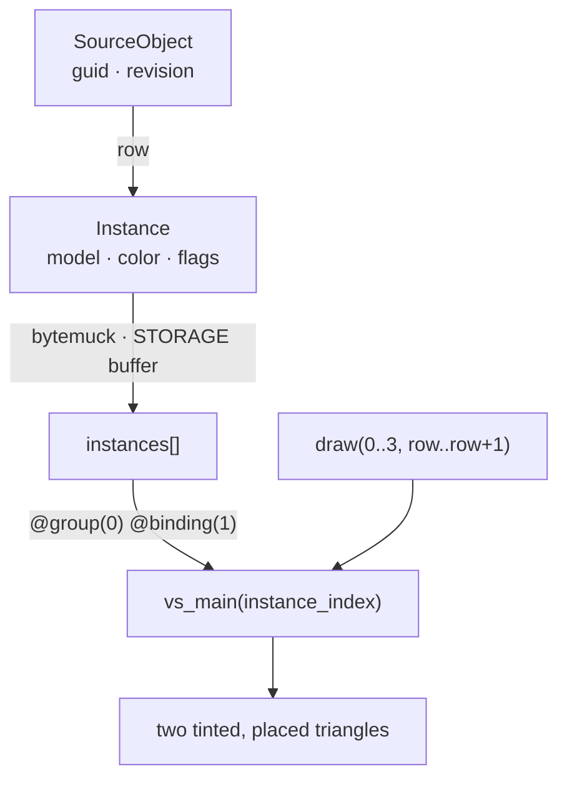

# 03 · Object rows and identity

## You are building




## Starting point

- Checkpoint 02: one triangle, one camera uniform.
- Same geometry drawn twice with different placement and tint. Identity lives on the CPU; the GPU only sees rows.

## Step 1 · The object row

- One 96-byte record per object, indexed by `instance_index` in every instance-reading shader. Flags are bits: selecting sets bit 0 and keeps the rest.
- The translation column of `model` is zero; the anchored translation gets its own table later (group 2, binding 1).
- The size assertion is compile-time: a wrong stride fails `cargo check`, not the picture.

<!-- file: 03 session_viewer/src/engine/gpu/instance.rs type lines=1-57 -->

The rest of the file is `#[cfg(test)]` only: it parses every lane shader with naga and checks that WGSL member offsets equal the Rust ones. Those lanes arrive in the next lessons; the browser build never compiles this block.

<!-- file: 03 session_viewer/src/engine/gpu/instance.rs copy lines=58-234 -->

## Step 2 · Declare the engine module tree

<!-- file: 03 session_viewer/src/engine/gpu/mod.rs type -->

<!-- file: 03 session_viewer/src/engine/mod.rs type -->

## Step 3 · Source identity is separate from the row

- A `guid` and `revision` identify what the object *is*; the row says how it is drawn this revision.
- Picking will return a row; the scene must map it back. Never search for an object by matching triangle positions.

<!-- file: 03 session_viewer/src/scene.rs type -->

<!-- check: 03 -->

## Step 4 · Rust layout ↔ WGSL layout

Same bytes on both sides, read through different type systems:

```text
Rust `Instance`            offset   WGSL `struct Instance`
model: [f32; 16]              0     model: mat4x4<f32>
color: [f32; 4]              64     color: vec4<f32>
flags: u32                   80     flags: u32
thickness: f32               84     thickness: f32
spacing: f32                 88     spacing: f32
_pad: u32                    92     pad: u32
size                         96     array stride
```

- `@builtin(instance_index)` is the `row` of `draw(0..3, row..row + 1)`.
- `@group(0) @binding(1) var<storage, read>` mirrors the `BufferBindingType::Storage { read_only: true }` entry added in the next step.

<!-- file: 03 session_viewer/src/shaders/first.wgsl type -->

## Step 5 · Bind the rows and draw each one

- The layout gains binding 1; the bind group supplies the storage buffer; one draw per row.
- `objects` stays on the CPU side of the shell, so the status can report a count that comes from source data rather than from the GPU.

<!-- file: 03 session_viewer/src/lib.rs type -->

<!-- file: 03 session_viewer/index.html copy -->

## Check

<!-- checkpoint: 03 -->

Expected:

- Two triangles, one orange on the left, one blue on the right.
- Status reads **Checkpoint 03 · 2 objects**.
- Orbit and zoom: the two keep their relative placement.

A wrong stride shows as a correct first object and a corrupt second one. A wrong source map looks fine until selection returns the other object.

## What changed

<!-- tree: 03 session_viewer/src -->

- `engine::gpu::instance::Instance` is the row contract between scene and shaders.
- Data flow: `SourceObject.row` → storage buffer → `instances[instance_index]` → placed, tinted vertex.

**Production equivalent:** `src/engine/gpu/instance.rs` is production. `src/scene.rs` is a teaching stand-in for `src/app/scene.rs`, which replaces it in lesson 12.

## Next

[04a · Meshes on the GPU](04a-meshes.md): vertex and index buffers, the mesh arena, and the first real drawing module.
