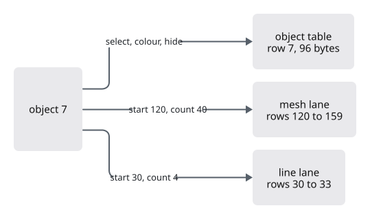

# 03 · Object rows and identity

**Estimated study time: about 3–6 hours.** Includes reading, typing, tracing, testing and experiments. [How to use this estimate](map.md#time-estimates).

**This section:** Give displayed objects stable rows, placement and identity.

**In the whole viewer:** Rows connect compact GPU records with the original source objects. Rendering and picking must agree about that connection.

**Follow the data:** Source object → display row → GPU object record → source lookup.

**Start with these files:** [`src/engine/gpu/instance.rs`](01-first-frame.md#code-01-010), [`src/engine/gpu/objects.rs`](01-first-frame.md#code-01-013).

**Aim to explain:** Why is a triangle number insufficient to identify the object you selected?

[Whole-viewer map and course milestones](map.md)

A triangle, an edge and a dot may all belong to the same object. We must remember that relationship when drawing or selecting them. A lane names one kind of GPU data; a row is one record in that lane. The size of a row tells us how many bytes a group of records occupies.



Start from the working result of [step 02](02-camera.md).

**One buildable step:** type the additions below in `workspace/handwritten`, then build and test. This step adds 170 lines across 2 files and may take several sittings. Individual listings are parts of this step, not separate build checkpoints.

<span id="code-03-001"></span>

## `src/engine/gpu/mod.rs`

Insert **after line 12** of your current file.

Keep these preceding lines:

```rust
pub mod objects;

pub mod lane; // register:lane
pub mod pass; // register:pass
```

Keep these following lines:

```rust
pub mod present; // register:present
pub mod render; // register:render
pub mod targets; // register:targets
pub mod upload; // register:upload
```

Type these new lines:

```rust
--8<-- "typing/code/03-001.rs"
```

<span id="code-03-002"></span>

## `src/engine/gpu/mod.rs`

Insert **after line 53** of your current file.

Keep these preceding lines:

```rust
    pub selection_revision: u64,                 // bumps on every selection change
    pub logical_size: [f64; 2],                  // canvas size in CSS pixels
    registered: Vec<Box<dyn RowLane>>,           // lanes from lane::REGISTRY
    passes: Vec<Box<dyn Pass>>,                  // passes from pass::PASSES, in frame order
```

Keep these following lines:

```rust
    pub performance: Performance, // frame timing
    pub bounds: AABB,                     // world box of everything uploaded
    device_type: wgpu::DeviceType,        // discrete, integrated or CPU
    pub failure: std::sync::Arc<std::sync::Mutex<Option<String>>>, // first GPU error
```

Type these new lines:

```rust
--8<-- "typing/code/03-002.rs"
```

<span id="code-03-003"></span>

## `src/engine/gpu/mod.rs`

Insert **after line 177** of your current file.

Keep these preceding lines:

```rust
            selection_revision: 0,
            logical_size: [size.0 as f64, size.1 as f64],
            registered,
            passes,
```

Keep these following lines:

```rust
            performance: Performance::new(),
            bounds: AABB::empty(),
            device_type,
            failure,
```

Type these new lines:

```rust
--8<-- "typing/code/03-003.rs"
```

<span id="code-03-004"></span>

## `src/engine/gpu/mod.rs`

Insert **after line 293** of your current file.

Keep these preceding lines:

```rust
        for pass in &mut self.passes {
            pass.on_reset(ctx);
        }
        self.bounds = AABB::empty();
```

Keep these following lines:

```rust
    }

    /// Forget every row and free the buffers.
    pub fn release(&mut self) {
```

Type these new lines:

```rust
--8<-- "typing/code/03-004.rs"
```

<span id="code-03-005"></span>

## `src/engine/gpu/mod.rs`

Insert **after line 310** of your current file.

Keep these preceding lines:

```rust
        for pass in &mut self.passes {
            pass.on_release(ctx, layouts);
        }
        self.bounds = AABB::empty();
```

Keep these following lines:

```rust
        self.retarget(false);
    }
}
```

Type these new lines:

```rust
--8<-- "typing/code/03-005.rs"
```

<span id="code-03-006"></span>

## `src/engine/gpu/mod.rs`

Append **after line 322** of your current file.

Blank lines before: **1**; after: **0**. End with a newline.

```rust
--8<-- "typing/code/03-006.rs"
```

<span id="code-03-007"></span>

## `src/engine/gpu/patch.rs`

Editing a colour or transform should not require rebuilding all geometry. A patch records the affected range and writes the new bytes. Correct offsets and sizes matter as much as the new value.

Create this file. Type the complete listing, including comments and blank lines.

```rust
--8<-- "typing/code/03-007.rs"
```

## Check the completed chapter

From `session_viewer`, compare everything you have typed:

```sh
npm --prefix ../session_tests run course -- reference-check 03
```

From `workspace/handwritten`:

```sh
cargo build --lib --locked -j4
cargo xtest --lib --locked -j4
```

Run the native tests and locate one upload that carries both object rows and geometry rows. Point to the field that joins them.

If the compiler cannot find `Upload`, keep the import at the top of the listing. A `use` line brings an existing name into this file; it does not create another copy of the data.

**Before moving on:** explain what changed, check the expected result above, and fix any build or test failure.

<details>
<summary>Check your explanation of the opening question</summary>

One source object can produce many display triangles. We need the owning row and its source mapping to recover the original object.

</details>

[Next step: 04a](04a-meshes.md)
