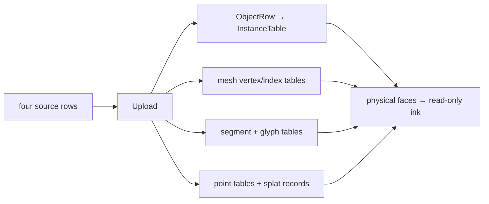

# 04 — Independent mesh, stroke, marker and cloud lanes

Starting checkpoint: 03. Replace the temporary triangle lane with the retained production buffer ownership and four geometry lanes.



Text alternative: An Upload feeds independent object, mesh, ink and cloud lanes, then ordered physical and ink passes.

1. Assemble the modular draw contract and one complete buffer module.

**COPY/PASTE — complete mechanical additions and exact reconstruction.** Starting at checkpoint 03, [the complete patch](reconstruction/patches/04.patch) identifies every file and unique replacement context; it contains all imports, shader entries and descriptors.

```sh
python3 "$COURSE_REPO/docs/reconstruction/replay.py" --output /tmp/viewer-course --through 04 --advance --verify --target-dir "$COURSE_REPO/target"
```

For the manual route, use the patch's complete file changes, substitute the following **TYPE BY HAND** blocks for their corresponding additions, then record the exact result with `--adopt --verify` instead of `--advance --verify`; `--adopt` checks every source byte against this checkpoint.

**TYPE BY HAND — create/replace the complete `src/engine/gpu/buffers.rs` module.** This module owns growth, copy and release; a lane's `append` result says whether bindings must follow a replaced allocation.

```rust
//! The GPU floor every lane stands on: `GpuCtx` (device + queue), `GrowBuf` (a table that
//! grows by appending, its live prefix copied GPU-side), `Template` (a unit mesh drawn N
//! times) and the two buffer helpers. No lane, no shader and no per-frame state lives here.

use bytemuck::Pod;
use wgpu::util::DeviceExt;

/// The device/queue pair every resource is made with and every write goes through.
pub struct GpuCtx {
    pub device: wgpu::Device,
    pub queue: wgpu::Queue,
}

/// Storage rows that grow by appending and can be copied GPU-side.
pub const ROWS: wgpu::BufferUsages = wgpu::BufferUsages::STORAGE
    .union(wgpu::BufferUsages::COPY_DST)
    .union(wgpu::BufferUsages::COPY_SRC);

/// Vertex rows that grow by appending.
pub const VERTS: wgpu::BufferUsages = wgpu::BufferUsages::VERTEX
    .union(wgpu::BufferUsages::COPY_DST)
    .union(wgpu::BufferUsages::COPY_SRC);

/// Index rows that grow by appending.
pub const INDICES: wgpu::BufferUsages = wgpu::BufferUsages::INDEX
    .union(wgpu::BufferUsages::COPY_DST)
    .union(wgpu::BufferUsages::COPY_SRC);

/// A growable GPU table under ONE growth policy: capacity becomes `max(need, cap * 3 / 2)`,
/// the live prefix is copied GPU-side and only the new rows are written.
pub struct GrowBuf {
    pub buf: wgpu::Buffer,
    len: u32,
    cap: u64,
    stride: u64,
    usage: wgpu::BufferUsages,
    label: &'static str,
}

impl GrowBuf {
    /// One zeroed row: wgpu cannot bind a 0-byte buffer, and `len` starts at 0 so nothing
    /// draws from it.
    pub fn new(ctx: &GpuCtx, label: &'static str, stride: u64, usage: wgpu::BufferUsages) -> Self {
        let buf = zeroed_buffer(&ctx.device, label, stride, usage);

        Self {
            buf,
            len: 0,
            cap: 1,
            stride,
            usage,
            label,
        }
    }

    /// Append rows. Returns `true` when the buffer was replaced, so the caller rebuilds the
    /// bind group pointing at it.
    pub fn append<T: Pod>(&mut self, ctx: &GpuCtx, data: &[T]) -> bool {
        debug_assert_eq!(std::mem::size_of::<T>() as u64, self.stride);
        if data.is_empty() {
            return false;
        }

        let need = self.len as u64 + data.len() as u64;
        let grew = need > self.cap;
        if grew {
            self.grow(ctx, need.max(self.cap * 3 / 2));
        }
        ctx.queue.write_buffer(
            &self.buf,
            self.len as u64 * self.stride,
            bytemuck::cast_slice(data),
        );
        self.len += data.len() as u32;
        grew
    }

    /// Replace the buffer with one of `new_cap` rows, moving the live prefix GPU-side.
    fn grow(&mut self, ctx: &GpuCtx, new_cap: u64) {
        let nb = zeroed_buffer(&ctx.device, self.label, new_cap * self.stride, self.usage);
        if self.len > 0 {
            let mut enc = ctx.device.create_command_encoder(&Default::default());
            enc.copy_buffer_to_buffer(&self.buf, 0, &nb, 0, self.len as u64 * self.stride);
            ctx.queue.submit([enc.finish()]);
        }
        self.buf = nb;
        self.cap = new_cap;
    }

    /// Overwrite rows `[at, at + data.len())`, which must already exist.
    pub fn write_at<T: Pod>(&self, ctx: &GpuCtx, at: u32, data: &[T]) {
        debug_assert!(at as u64 + data.len() as u64 <= self.cap);
        ctx.queue.write_buffer(
            &self.buf,
            at as u64 * self.stride,
            bytemuck::cast_slice(data),
        );
    }

    /// Forget the rows; the buffer and its capacity stay, so a rebuild costs no allocation.
    pub fn reset(&mut self) {
        self.len = 0;
    }

    /// Forget the rows AND the buffer: back to one zeroed row, so a cleared scene holds no
    /// GPU memory. The caller rebuilds any bind group over it.
    pub fn release(&mut self, ctx: &GpuCtx) {
        self.buf = zeroed_buffer(&ctx.device, self.label, self.stride, self.usage);
        self.len = 0;
        self.cap = 1;
    }

    /// Rows on the GPU - the base for the next append and the instance count of a draw.
    pub fn len(&self) -> u32 {
        self.len
    }

    /// No rows: the draw that reads this table is skipped.
    pub fn is_empty(&self) -> bool {
        self.len == 0
    }
}

/// A unit mesh drawn N times by an instanced lane (the marker quad).
pub struct Template {
    pub vbo: wgpu::Buffer,
    pub ibo: wgpu::Buffer,
    pub index_count: u32,
}

impl Template {
    /// Upload positions and indices once.
    pub fn new(ctx: &GpuCtx, label: &str, verts: &[[f32; 3]], idx: &[u32]) -> Self {
        let vbo = ctx
            .device
            .create_buffer_init(&wgpu::util::BufferInitDescriptor {
                label: Some(&format!("{label}.vbo")),
                contents: bytemuck::cast_slice(verts),
                usage: wgpu::BufferUsages::VERTEX,
            });
        let ibo = ctx
            .device
            .create_buffer_init(&wgpu::util::BufferInitDescriptor {
                label: Some(&format!("{label}.ibo")),
                contents: bytemuck::cast_slice(idx),
                usage: wgpu::BufferUsages::INDEX,
            });

        Self {
            vbo,
            ibo,
            index_count: idx.len() as u32,
        }
    }

    /// Bind the template as vertex slot 0 and the index buffer.
    pub fn bind(&self, pass: &mut wgpu::RenderPass<'_>) {
        pass.set_vertex_buffer(0, self.vbo.slice(..));
        pass.set_index_buffer(self.ibo.slice(..), wgpu::IndexFormat::Uint32);
    }
}

/// A fresh buffer of `size` bytes, zero-initialized by WebGPU.
pub fn zeroed_buffer(
    device: &wgpu::Device,
    label: &str,
    size: u64,
    usage: wgpu::BufferUsages,
) -> wgpu::Buffer {
    device.create_buffer(&wgpu::BufferDescriptor {
        label: Some(label),
        size,
        usage,
        mapped_at_creation: false,
    })
}

/// A uniform buffer holding one `T`, writable every frame.
pub fn uniform_buffer<T: Pod>(device: &wgpu::Device, label: &str, value: &T) -> wgpu::Buffer {
    device.create_buffer_init(&wgpu::util::BufferInitDescriptor {
        label: Some(label),
        contents: bytemuck::bytes_of(value),
        usage: wgpu::BufferUsages::UNIFORM | wgpu::BufferUsages::COPY_DST,
    })
}

/// A bind group over `buffers` in binding order, one entry each.
pub fn bind_group(
    ctx: &GpuCtx,
    layout: &wgpu::BindGroupLayout,
    label: &str,
    buffers: &[&wgpu::Buffer],
) -> wgpu::BindGroup {
    let mut entries: Vec<wgpu::BindGroupEntry> = Vec::with_capacity(buffers.len());
    for (i, b) in buffers.iter().enumerate() {
        entries.push(wgpu::BindGroupEntry {
            binding: i as u32,
            resource: b.as_entire_binding(),
        });
    }
    ctx.device.create_bind_group(&wgpu::BindGroupDescriptor {
        label: Some(label),
        layout,
        entries: &entries,
    })
}
```

**TYPE BY HAND — in `src/engine/pipelines/mod.rs`, replace the complete `Target` record (with its derive) and `PipelineDesc` record (with its lifetime).** Their surrounding methods and shared descriptor builder are supplied completely by 04.patch.

```rust
#[derive(Clone, Copy, PartialEq, Eq)]
pub struct Target {
    pub format: wgpu::TextureFormat,
    pub samples: u32,
}
```
```rust
#[derive(Clone)]
pub struct PipelineDesc<'a> {
    pub label: &'a str,
    pub shader: &'a wgpu::ShaderModule,
    pub vs: &'a str,
    pub fs: &'a str,
    pub groups: &'a [&'a wgpu::BindGroupLayout],
    pub vertex_buffers: &'a [wgpu::VertexBufferLayout<'a>],
    pub topology: wgpu::PrimitiveTopology,
    pub color: ColorWrite,
    pub depth: DepthMode,
    pub scene_samples: Option<u32>,
}
```

**TYPE BY HAND — in `src/engine/gpu/mod.rs`, replace the complete `Gpu::set_scene` method.** Uploads are deltas and are consumed once; cloud bindings are rebuilt only when an append replaced a GPU buffer.

```rust
pub fn set_scene(&mut self, up: &Upload) {
        self.objects.append(&self.ctx, &self.layouts, &up.obj);
        self.arena.append(&self.ctx, &up.arena);
        self.segments.append(&self.ctx, &self.layouts, &up.seg);
        self.glyphs.append(&self.ctx, &self.layouts, &up.glyph);
        if self.cloud.append(&self.ctx, &up.cloud) {
            self.splat
                .rebind(&self.ctx, &self.layouts, self.cloud.buffers());
        }
        self.splat.invalidate();
        self.bounds.union(&up.bounds);
    }
```

**COPY/PASTE — complete lane implementations and their specific contracts.** Apply the remaining exact additions/deletions in 04.patch; `src/scene.rs`, `src/shaders/first.wgsl` and the first-triangle facade are removed by that patch.

| Files added/replaced | Input → output and ownership |
| --- | --- |
| `gpu/objects.rs`, `instance.rs`, `upload.rs` | Source placements/style → f32 instance rows plus separate rebased translations; Upload releases CPU staging. |
| `gpu/arena.rs`, `text_outline.rs`, `triangle.wgsl`, `text_outline.wgsl` | Interleaved RenderVertex + object IDs + index runs → shared mesh buffers; imported vector outlines preserve exact geometry. |
| `gpu/segments.rs`, `ribbon.wgsl` | Endpoint/source-row records → analytic finite-width strokes; pipes retain source-edge IDs independently of tessellation. |
| `gpu/glyphs.rs`, `glyph.wgsl`, `sphere.wgsl` | Point/source-row records → dot/sphere footprints; these are geometry markers, not font glyphs. |
| `gpu/cloud.rs`, `lod.rs`, `splat.rs`, `splat.wgsl`, `splat_resolve.wgsl` | Point arrays/chunks → bounded draw records → private color/depth → scene resolve. |
| `pipelines/mod.rs`, `layouts.rs`, `gpu/frame.rs`, `targets.rs`, `view.rs` | Shared bindings/typed pipeline descriptors → coherent frame inputs and attachments. |
| `gpu/mod.rs`, `fixture.rs`, `lib.rs`, `app/route.rs` | Append four local rows, rebase once, encode pass order, present; query knobs have a small temporary adapter. |
| `ink_visibility.wgsl`, `normals.wgsl` | Initial raw depth comparison and rigid normal transform; chapters 05/09 replace them with the final validated algorithms. |

All `gpu/` paths above are beneath `src/engine/`; shader paths are beneath `src/shaders/`. The complete patch also supplies `src/app/mod.rs`, `src/engine/mod.rs` and every registration/import.

The retained lane descriptors already include color/ID variants because they share one module; no picking request or readback is active yet. This stage uses fixed 1× coverage, and the first visibility helper is intentionally limited to the simple nonoverlapping fixture.

**COPY/PASTE — run this completed checkpoint.**

```sh
cd /tmp/viewer-course/session_viewer
REGEN_PROTO=0 NO_COLOR=true trunk serve
```

Open <http://127.0.0.1:8770/>. The canvas shows a blue mesh triangle, an orange polyline, an orange dot and 117 blue cloud points; the status reports four objects. Orbit/pan/zoom and DPR changes affect every lane through the same frame uniforms.

The maintained `--verify` check builds WASM and captures actual browser pixels at DPR 1 and 2; it rejects page/GPU errors and framebuffer scaling mismatches. Checkpoint 04 deliberately retains the temporary direct-canvas shell, which chapter 12 replaces with the final winit/State ownership.
