# 04a · Meshes on the GPU

## You are building

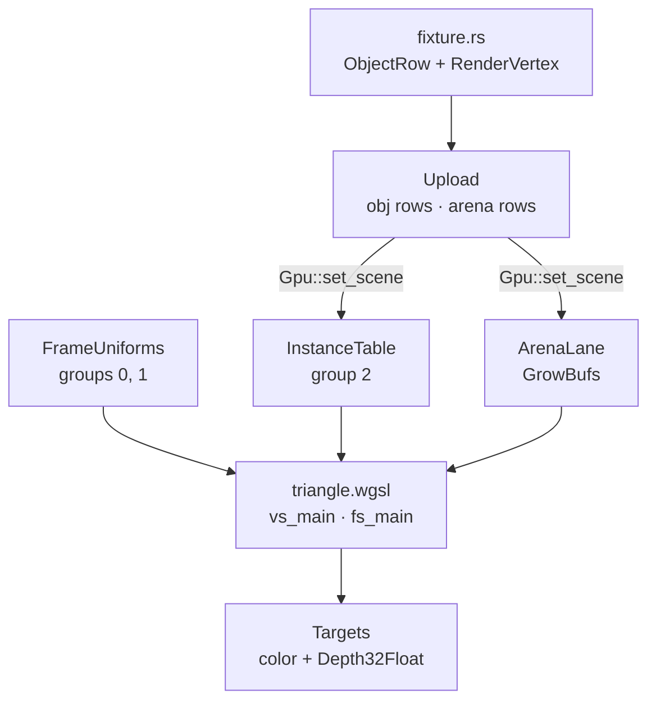

Rust vertex layout ↔ WGSL locations (`pipelines::vertex_layout`, `instance_id_layout`):

| Slot | Rust | WGSL |
|---|---|---|
| 0 | `RenderVertex::layout()` position, normal, color | `@location(0) position`, `@location(1) normal`, `@location(2) color` |
| 1 | `instance_id_layout()` one `u32` per vertex | `@location(3) inst_id` |

Bind groups every lane shares (`Layouts`):

| Group | Rust layout | WGSL |
|---|---|---|
| 0 | `Layouts::mvp` uniform | `@group(0) @binding(0) var<uniform> mvp: mat4x4<f32>` |
| 1 | `Layouts::line` uniform | `@group(1) @binding(0) var<uniform> line: LineUniform` |
| 2 | `Layouts::instance` two storage buffers | `@group(2) @binding(0) instances`, `@binding(1) translations` |

## Starting point

- Checkpoint 03: two instances drawn from one hard-coded triangle; the object row lives in `instance.rs`.
- This lesson builds the engine behind `lib.rs`: buffers, layouts, pipelines, targets, frame uniforms, the object table and the mesh lane. `scene.rs` and `first.wgsl` are deleted.
- New files first. Nothing references them until the wiring at the end, so the crate keeps compiling after each step.

<!-- step-status: start -->

**Does it compile yet?** Yes, after every step of this lesson — `cargo check` was run at the end of each one to make sure. A step that writes a file Rust has not been told about yet compiles without checking any of it, so keep going to the checkpoint: that build is the real test.

<!-- step-status: end -->

## Step 1 · The floor: device, growable buffers, helpers

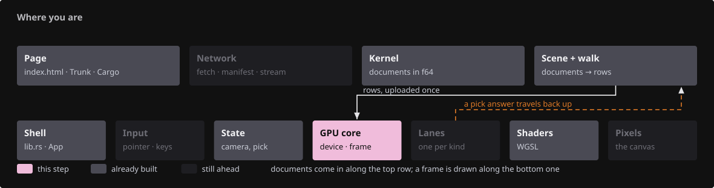{ .locator data-strip="illustrations/strip-22e4536687.svg" }

- `GpuCtx` is the device/queue pair every lane is made with.
- `GrowBuf` grows by appending: capacity `max(need, cap * 3 / 2)`, the live prefix copied GPU-side, only new rows written. It returns `true` when the buffer moved so the caller rebuilds its bind group.

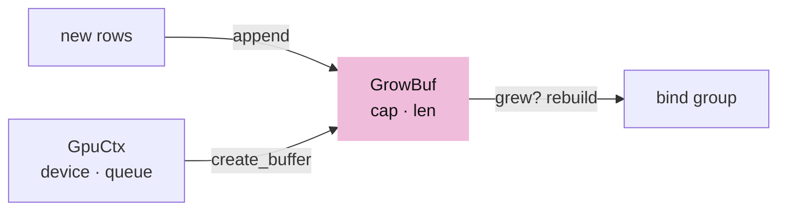

<!-- file: 04a session_viewer/src/engine/gpu/buffers.rs type lines=1-39 -->

<!-- file: 04a session_viewer/src/engine/gpu/buffers.rs type lines=40-99 -->

- Clearing keeps the allocation. A scene reload writes the same order of magnitude of rows again, so throwing the buffer away would only buy a second allocation of the same size.

<!-- file: 04a session_viewer/src/engine/gpu/buffers.rs type lines=100-123 -->

- `Template` is a unit mesh drawn N times, one instance per row.

<!-- file: 04a session_viewer/src/engine/gpu/buffers.rs type lines=124-186 -->

- One helper builds every bind group in this crate: buffers in binding order, no names to keep in sync. A layout mismatch then fails at one call site instead of eight.

<!-- file: 04a session_viewer/src/engine/gpu/buffers.rs type lines=187-206 -->

## Step 2 · Bind-group layouts

{ .locator data-strip="illustrations/strip-22e4536687.svg" }

- A layout is the shape of a bind group; the buffers live in the lanes.
- Group 2 splits rows (96 B) from anchored translations (16 B) so a re-anchor rewrites 16 bytes per object.

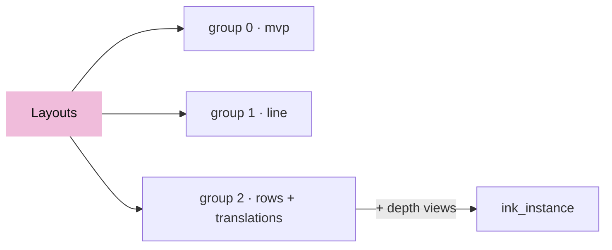

<!-- file: 04a session_viewer/src/engine/pipelines/layouts.rs type lines=1-52 -->

- The ink layout adds the physical depth at bindings 2 and 3, one single-sampled and one multisampled view; the one not in use is a 1×1 placeholder.

<!-- file: 04a session_viewer/src/engine/pipelines/layouts.rs type lines=53-106 -->

## Step 3 · Pipelines are data

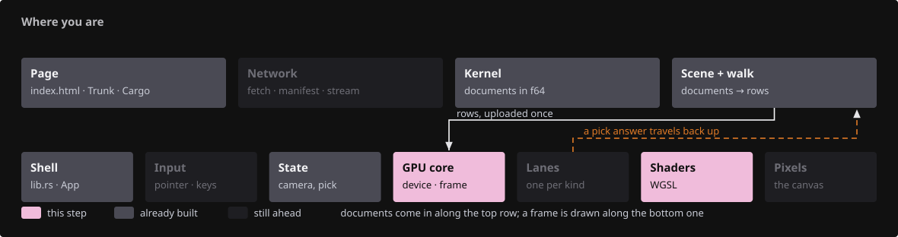{ .locator data-strip="illustrations/strip-05f8973a20.svg" }

- `Target` is where a pipeline draws; `DepthMode` and `ColorWrite` name the only depth and blend states the viewer uses.
- Every compare is reverse-Z: nearer is `Greater`.

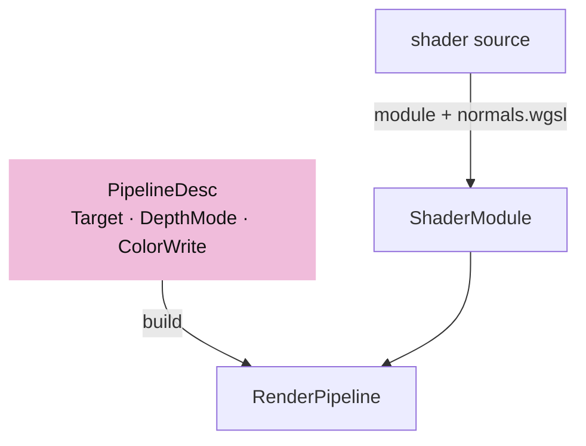

<!-- file: 04a session_viewer/src/engine/pipelines/mod.rs type lines=1-58 -->

- `PipelineDesc` is one base per shader; `with`, `vertex`, `color`, `depth` derive the variants.

<!-- file: 04a session_viewer/src/engine/pipelines/mod.rs type lines=59-117 -->

- The builders are what make one base description into a family: `with` renames and repoints the fragment entry, `vertex` swaps the vertex entry, `color` and `depth` set the two states that actually vary between the viewer's passes.

<!-- file: 04a session_viewer/src/engine/pipelines/mod.rs type lines=118-182 -->

- Two shader constants sit beside them. `SCENE` is the scene contract every lane is compiled with; `INK` is the visibility rule only ink lanes need. Keeping them here means a lane names a constant rather than repeating an `include_str!`.

<!-- file: 04a session_viewer/src/engine/pipelines/mod.rs type lines=183-205 -->

- `module` appends `normals.wgsl` to every shader source, so one normal transform serves all lanes; `scene_module` also appends `scene.wgsl`, so the camera, the line block and the object rows are declared once for every lane.

<!-- file: 04a session_viewer/src/engine/pipelines/mod.rs type lines=206-235 -->

- `build` is the only place wgpu is asked for a render pipeline: `Depth32Float`, no cull, fill mode, the desc supplies the rest.

<!-- file: 04a session_viewer/src/engine/pipelines/mod.rs type lines=236-285 -->

- `scene.wgsl` is the scene contract: groups 0 to 2, the `Instance` row, the `LineUniform` block, the `FLAG_*` bits and `place`. A lane shader never declares them itself, so a row field changes in one place.

<!-- file: 04a session_viewer/src/shaders/scene.wgsl type -->

- The mirror test reads that one declaration: the Rust field names against `SCENE`.

<!-- file: 04a session_viewer/src/engine/gpu/instance.rs type -->

<!-- file: 04a session_viewer/src/shaders/normals.wgsl type -->

- A teaching stage: rigid and uniform scales only. Lesson 09 replaces the body with the cofactor transform that survives a nonuniform scale, keeping the signature so no lane has to change.

<!-- check: 04a -->

## Step 4 · Targets and the two passes

{ .locator data-strip="illustrations/strip-22e4536687.svg" }

- The face pass clears color and depth (to `0.0`, reverse-Z) and writes both.
- The ink pass loads color, keeps depth read-only and samples it through group 2.

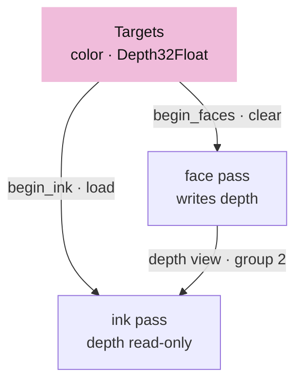

<!-- file: 04a session_viewer/src/engine/gpu/targets.rs type lines=1-70 -->

<!-- file: 04a session_viewer/src/engine/gpu/targets.rs type lines=71-135 -->

- The two passes in one place. `begin_faces` establishes the depth every later fragment is judged against; `begin_ink` keeps that depth read-only and hands it to the shader instead.

<!-- file: 04a session_viewer/src/engine/gpu/targets.rs type lines=136-165 -->

- `TextureSpec` is the whole description of an attachment - size, format, samples, usage. Keeping it as data is what lets every attachment be rebuilt from one place when the sample count flips.

## Step 5 · Frame uniforms

{ .locator data-strip="illustrations/strip-22e4536687.svg" }

- `FrameInput` is what one frame needs from the caller; `FrameCx` adds the knobs, the anchor and the framebuffer, with `pixel_scale` the framebuffer pixels per CSS pixel; `Binds` sets groups 0, 1, 2 before every lane draw.

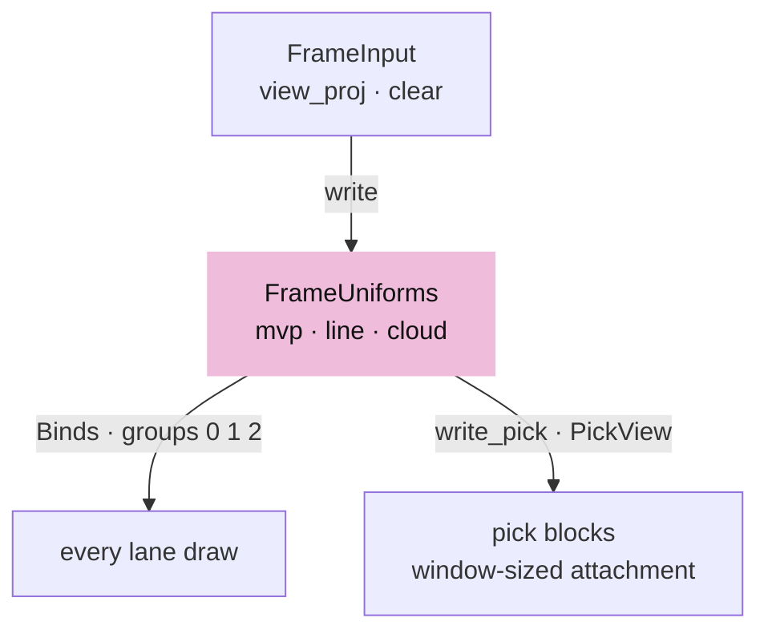

<!-- file: 04a session_viewer/src/engine/gpu/frame.rs type lines=1-44 -->

`LineUniform` is 80 bytes. The WGSL side is declared once, in `scene.wgsl`, so no lane shader repeats it and there is one list of offsets to keep true:

| Offset | Rust | WGSL |
|---|---|---|
| 0 | `thickness` | `thickness` |
| 4 | `proj_y` | `proj_y` |
| 8 | `ortho_h` | `ortho_h` |
| 12 | `vp_h` | `vp_h` |
| 16 | `vp_w` | `vp_w` |
| 20 | `eye: [f32; 3]` | `eye_x, eye_y, eye_z` |
| 32 | `anchor: [f32; 3]` | `anchor: vec3<f32>` |
| 44 | `feather` | `feather` |
| 48 | `lit` | `lit` |
| 52 | `backface` | `backface` |
| 56 | `origin: [f32; 2]` | `origin: vec2<f32>` |
| 64 | `frame: [f32; 2]` | `frame: vec2<f32>` |
| 72 | `opacity` | `opacity` |

- `vp_w`/`vp_h` are the pass's own attachment; `frame` is the canvas the scene was projected for and `origin` where the attachment's top-left sits in it. They differ only in the pick pass, which renders the window about the cursor into a window-sized target: pixel arithmetic stays in attachment coordinates, and only what was laid out for the whole canvas is addressed through `origin`.
- `CloudUniform` is the point lane's 48-byte block with the same `origin` and `frame` pair.

<!-- file: 04a session_viewer/src/engine/gpu/frame.rs type lines=45-105 -->

- `PickView` is a window of the canvas rendered into an attachment of its own size, so a pick costs the window, not the canvas. `clip_transform` maps the canvas projection onto the window's sub-frustum; `pick_transform_layout` is the one uniform the text ID pipelines bind, since the text lanes do not see `Layouts`.

<!-- file: 04a session_viewer/src/engine/gpu/frame.rs type lines=106-176 -->

- `FrameUniforms` owns the three frame blocks, the same three for the pick pass plus the bare transform, and the frame's solved camera facts: `mvp_f32`, `ortho_h`, `eye`.

<!-- file: 04a session_viewer/src/engine/gpu/frame.rs type lines=177-205 -->

<!-- file: 04a session_viewer/src/engine/gpu/frame.rs type lines=206-253 -->

- Construction makes the buffers and bind groups with no camera in them yet. A frame is a write into buffers that already exist and are already bound — allocating per frame is what this shape exists to avoid.

<!-- file: 04a session_viewer/src/engine/gpu/frame.rs type lines=254-329 -->

- `FrameUniforms` owns all three blocks — camera, line, cloud — because they are written together from one solved camera and must never disagree about which frame they describe.

<!-- file: 04a session_viewer/src/engine/gpu/frame.rs type lines=330-347 -->

- `write` solves the eye and the orthographic half-height once per frame from the camera matrix; every lane reads the result. The pen is `thickness_px * pixel_scale`, so it keeps its CSS width at every device scale; `origin` is zero and `frame` is the framebuffer.

<!-- file: 04a session_viewer/src/engine/gpu/frame.rs type lines=348-392 -->

- `write_pick` runs after `write` and derives the pick blocks from the frame's own solved values: the camera premultiplied by the window's clip transform, `proj_y` and `ortho_h` scaled by canvas height over attachment height so a marker or a pen is as wide in the window as on the canvas, and `origin` set to the window's top-left.

<!-- file: 04a session_viewer/src/engine/gpu/frame.rs type lines=393-410 -->

<!-- file: 04a session_viewer/src/engine/gpu/frame.rs copy lines=411-417 -->

## Step 6 · Runtime knobs and the query string

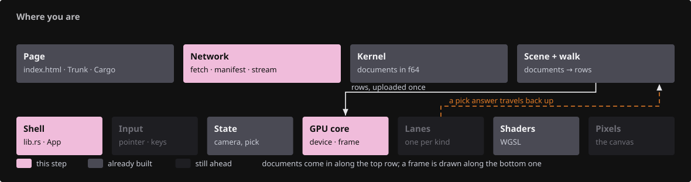{ .locator data-strip="illustrations/strip-442a1e5860.svg" }

- `View` is read once from `?name=` on wasm or `ENV` natively and consulted every frame.

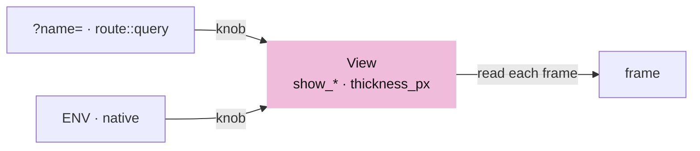

<!-- file: 04a session_viewer/src/engine/gpu/view.rs copy -->

<!-- file: 04a session_viewer/src/app/mod.rs type -->

- The app layer begins with one file: a query reader. Everything else it will own - loading, input, the scene - arrives later, and this module list is how you watch it grow.

<!-- file: 04a session_viewer/src/app/route.rs type -->

- Enough of a query parser to read `?name=value`. The routing policy waits for lesson 14; what matters now is that a knob is read in one place instead of being parsed wherever it is needed.

## Step 7 · The object table

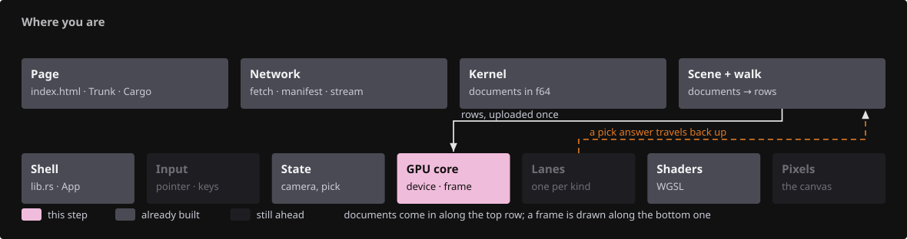{ .locator data-strip="illustrations/strip-56ead4dc76.svg" }

- `ObjectRow` is one object as the producer reports it: f64 placement, tint, flags, local box, spacing.
- `InstanceTable` owns the rows the GPU reads, the true f64 translations, and the two buffers behind group 2.

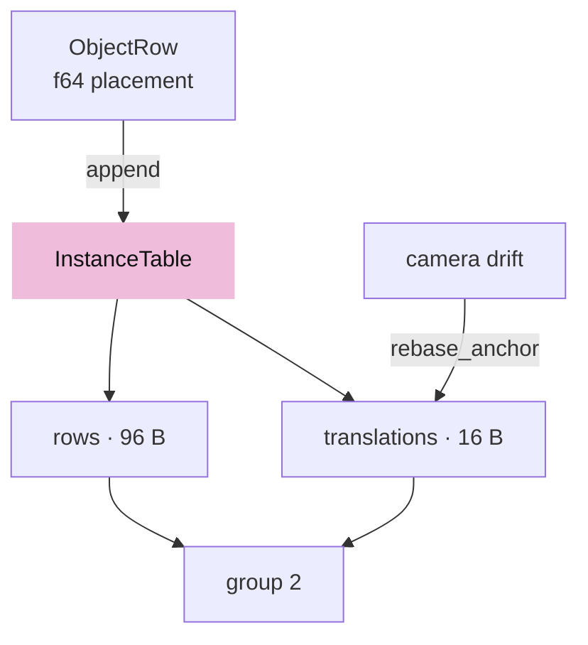

<!-- file: 04a session_viewer/src/engine/gpu/objects.rs type lines=1-26 -->

<!-- file: 04a session_viewer/src/engine/gpu/objects.rs type lines=27-65 -->

- Group 2 for ink binds the same two buffers plus the face pass's depth views.

<!-- file: 04a session_viewer/src/engine/gpu/objects.rs type lines=66-117 -->

<!-- file: 04a session_viewer/src/engine/gpu/objects.rs type lines=118-188 -->

- `append` converts each row to the 96-byte `Instance`, keeps the f64 translation aside, and records bounded rows for the inside test.

<!-- file: 04a session_viewer/src/engine/gpu/objects.rs type lines=189-255 -->

- `rebase_anchor` rewrites only the translation column when the camera target drifts a quarter of the view distance, throttled to one rebuild per interval.

<!-- file: 04a session_viewer/src/engine/gpu/objects.rs type lines=256-312 -->

<!-- file: 04a session_viewer/src/engine/gpu/objects.rs type lines=313-360 -->

- Re-anchoring lives here: when the camera drifts far from the anchor the f64 translations are rewritten and the f32 rows stay small. `anchored_model` spells out on the CPU the composition a shader performs, so a test can check it.

<!-- file: 04a session_viewer/src/engine/gpu/objects.rs type lines=361-416 -->

- Flags are set one row at a time and written back one row at a time: selecting an object must not re-upload the table.

<!-- file: 04a session_viewer/src/engine/gpu/objects.rs copy lines=417-469 -->

<!-- check: 04a -->

## Step 8 · The mesh shader

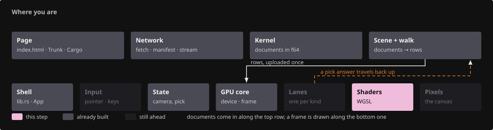{ .locator data-strip="illustrations/strip-2bb88680ac.svg" }

- Groups 0, 1, 2 and the `LineUniform` mirror; `place` applies the row's rotation/scale and the anchored translation.

<!-- file: 04a session_viewer/src/shaders/triangle.wgsl type lines=1-23 -->

- A hidden row's triangle is parked outside the clip volume; the ID pass shares this vertex stage, so a hidden object is unpickable too.

<!-- file: 04a session_viewer/src/shaders/triangle.wgsl type lines=24-61 -->

- Shading is separate from the vertex stage because both fragment entries need it and neither should reimplement it: a camera headlight with wrapped diffuse, so the darkest visible face is still its own colour rather than black. Back faces paint red unless the object is print.

<!-- file: 04a session_viewer/src/shaders/triangle.wgsl type lines=62-113 -->

- The two fragment entries end the file: `fs_id` writes the object row for picking, `fs_main` the shaded colour.

<!-- file: 04a session_viewer/src/shaders/triangle.wgsl type lines=114-122 -->

## Step 9 · The mesh lane

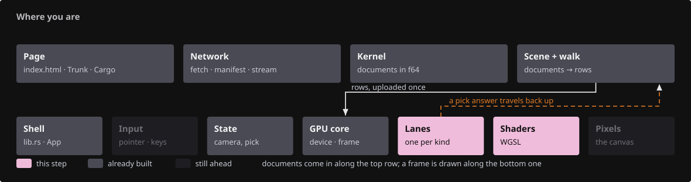{ .locator data-strip="illustrations/strip-aa8b72a46a.svg" }

- `ArenaRows` is one upload's delta; `ArenaLane` is five `GrowBuf`s under one growth policy and the pipelines over them.

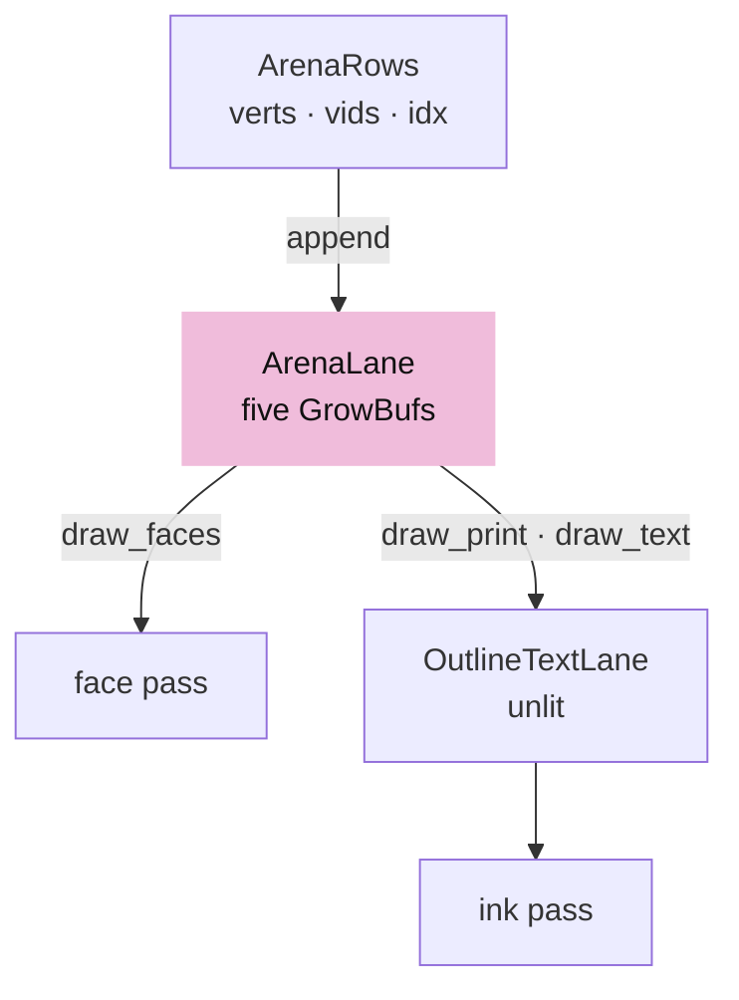

<!-- file: 04a session_viewer/src/engine/gpu/arena.rs type lines=1-63 -->

<!-- file: 04a session_viewer/src/engine/gpu/arena.rs type lines=64-114 -->

- Three index runs share one vertex table: solid faces, sheet fills, lettering. The last two go through the unlit outline lane below.

<!-- file: 04a session_viewer/src/engine/gpu/arena.rs type lines=115-160 -->

<!-- file: 04a session_viewer/src/engine/gpu/arena.rs type lines=161-226 -->

- The outline lane borrows the arena's buffers and draws imported PDF lettering unlit; it exists because the arena's print and text runs call it.

<!-- file: 04a session_viewer/src/shaders/text_outline.wgsl copy -->

<!-- file: 04a session_viewer/src/engine/gpu/text_outline.rs type lines=1-55 -->

- Imported outline text is geometry, not glyphs: it keeps exact object IDs and the sheet depth comparison, so it picks and occludes like the drawing it came from.

<!-- file: 04a session_viewer/src/engine/gpu/text_outline.rs type lines=56-67 -->

<!-- file: 04a session_viewer/src/engine/gpu/text_outline.rs type lines=68-114 -->

- Imported lettering borrows the arena's buffers rather than copying them: the glyphs are already geometry, and a second copy would be a second thing to keep in step.

<!-- file: 04a session_viewer/src/engine/gpu/text_outline.rs copy lines=115-246 -->

## Step 10 · Upload and the fixture

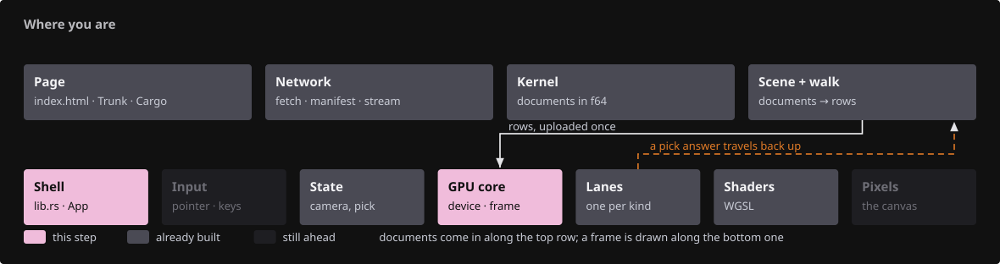{ .locator data-strip="illustrations/strip-cfc7417c93.svg" }

- `Upload` carries every lane's rows for one file and nothing GPU-typed. Deleting a lane means deleting its field here.

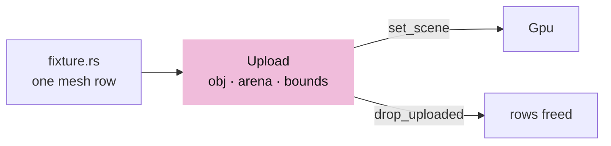

<!-- file: 04a session_viewer/src/engine/gpu/upload.rs type -->

- One local mesh row: three vertices, one triangle, no loader.

<!-- file: 04a session_viewer/src/fixture.rs copy -->

## Step 11 · Wire the coordinator

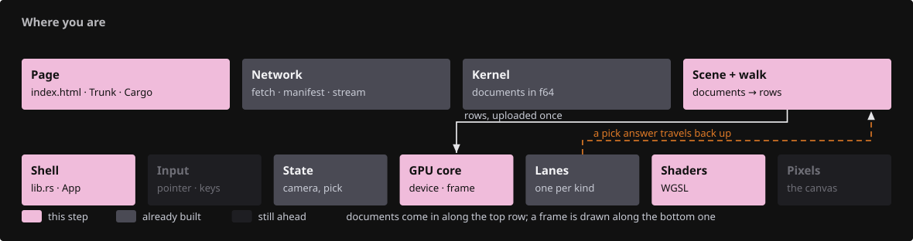{ .locator data-strip="illustrations/strip-1a8867d34a.svg" }

- `Gpu` owns the surface, one device, the layouts, frame uniforms, targets, the object table and the lanes; the lanes never see each other.

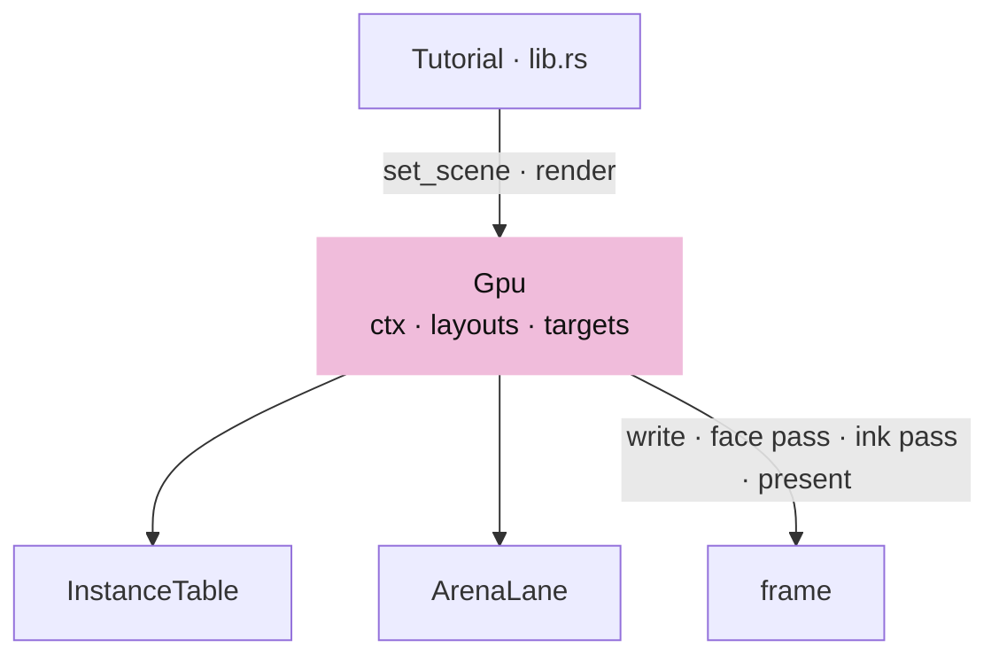

<!-- file: 04a session_viewer/src/engine/gpu/mod.rs type whole lines=1-33 -->

- `new` is the device setup, then every shared resource once.

<!-- file: 04a session_viewer/src/engine/gpu/mod.rs type whole lines=34-96 -->

- `set_scene` appends each lane's delta; `resize` rebuilds size-dependent targets and the ink bind group that samples them.

<!-- file: 04a session_viewer/src/engine/gpu/mod.rs type whole lines=97-139 -->

- The frame: write uniforms, face pass, ink pass, submit, present.

<!-- file: 04a session_viewer/src/engine/gpu/mod.rs type whole lines=140-172 -->

<!-- file: 04a session_viewer/src/engine/mod.rs type -->

- The shell keeps only the canvas, the camera and `Gpu`; the fixture upload is dropped after `set_scene`, so the GPU is its only holder.

<!-- file: 04a session_viewer/src/lib.rs type whole lines=1-52 -->

<!-- file: 04a session_viewer/src/lib.rs type whole lines=53-95 -->

- `render` is the frame: resize if needed, take one anchor for the whole frame, submit. Taking the anchor once is what stops two lanes disagreeing about where the world is.

<!-- file: 04a session_viewer/src/scene.rs -->

<!-- file: 04a session_viewer/src/shaders/first.wgsl -->

<!-- file: 04a session_viewer/index.html copy -->

- Now everything you typed is in the build. The two earlier checks only proved you had not broken checkpoint 03: an undeclared file is not compiled at all, and `engine/gpu/mod.rs` names the new modules only here. Read a compiler error now rather than a blank canvas in a moment.

<!-- check: 04a -->

## Check

<!-- checkpoint: 04a -->

Expected:

- One flat blue triangle, lit by the headlight, on the dark canvas.
- Status reads **Checkpoint 04a · 1 objects**.
- Orbit, pan and zoom still work; the triangle stays put while the camera moves.

If the canvas stays empty, compare `Gpu::new` against the checkpoint listing: the surface must be configured before the first frame and the arena must have rows.

## What changed

<!-- tree: 04a session_viewer/src -->

- Data flow: `fixture::scene()` → `Upload` → `InstanceTable` + `ArenaLane` → `triangle.wgsl` → color and depth targets.
- One growth policy for every GPU table; one `build` for every pipeline.

**Production equivalent:** every file in `src/engine/gpu/` and `src/engine/pipelines/` from this lesson. Production keeps the shell in `src/lib.rs` and `src/app/`.

## Try

- Append `?lit=1` to the URL (or press `D` later): the face gains its headlight shading; without it every face is its flat row color, which is what a color-based probe needs.
- Add a second `ObjectRow` in `fixture.rs` with a different `place`: the same vertex range draws twice, once per row.
- `?msaa=` is parsed here but has no consumer yet: `Targets::new` is called with one sample and the comment says so. Lesson 05 gives the knob its meaning, and that is the checkpoint where `?msaa=4` changes the picture.

## Questions and answers

This is the longest lesson in the course and the one the rest is built on.

**`GrowBuf` returns `true` when it grew. Why does a caller have to care?**

*How to work it out.* Ask what "grow" means on a GPU. There is no realloc: you create a *new*, larger buffer and copy the live prefix into it. Then ask what else in the system remembers the old buffer — a bind group holds a reference to a specific buffer, not to a name.

*The answer.* The old bind group now points at a buffer nobody writes to any more. The boolean is the signal to rebuild it. Ignore it and there is no validation error at all — the buffer it names is still perfectly valid, just not yours — so the symptom is stale geometry, which is failure 9 in [Reading failures](debugging.md).

**Group 2 holds rows in one buffer and translations in another. What does the split buy?**

*How to work it out.* Ask which of the two changes more often. The rows change when the scene changes; the translations change every time the anchor moves, which is while you are navigating. Then ask what each write costs per object: 96 bytes against 16.

*The answer.* A re-anchor rewrites only the translations — 16 bytes per object instead of 96. It is the write that happens during interaction, so it is the one worth making small. The general move: split a record when one half changes on a different clock than the other.

**`vp_w`/`vp_h` and `frame`/`origin` look like the same numbers. When do they differ, and why are both needed?**

*How to work it out.* Find a case where the thing being drawn into is not the whole canvas. There is exactly one: the pick pass renders a small window around the cursor into its own small attachment. Now ask, for each piece of pixel arithmetic in the shaders, whether it means "in this attachment" or "on the canvas the scene was laid out for".

*The answer.* `vp_w`/`vp_h` are the attachment actually being drawn into; `frame` is the whole canvas the scene was projected for, and `origin` is where the window's top-left sits in it. Pixel arithmetic uses the attachment; anything laid out against the full canvas must be addressed through `origin`. Collapse them and picking drifts as soon as the window is not the canvas.

**Why is a pipeline described by data (`PipelineDesc`) instead of a function per pipeline?**

*How to work it out.* Count the variants: one shader, several fragment entries, several colour modes, several depth rules. Then count the fields they share — around twenty. A function per variant duplicates the twenty and buries the one line that differs.

*The answer.* One base per shader plus `with`/`vertex`/`color`/`depth` makes each variant a single readable line, and keeps `build` as the only place wgpu is asked for a pipeline — so a format or sample-count mistake is caught in one place instead of eight. This is the "small number of strong abstractions" rule: the desc reduces repetition without hiding what wgpu is doing.

**What you should be able to do now**

Name the three bind groups every lane shares and what each holds, and say what the ink pass binds differently. Correct: group 0 the camera matrix, group 1 the per-frame `LineUniform`, group 2 the object rows plus anchored translations — and the ink variant of group 2 adds the physical depth views, so ink can test its own visibility. If you can say that, you can read any shader in this repository.

## Next

[04b · Strokes](04b-strokes.md): the segment lane, `ribbon.wgsl`, and the shared ink visibility rule.
