# 04a · Meshes on the GPU

## You are building

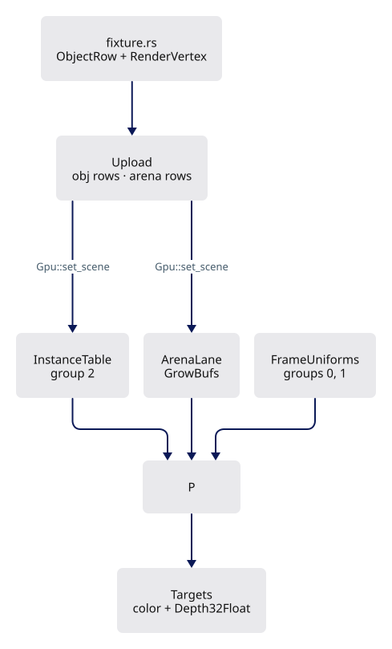

Rust vertex layout ↔ WGSL locations (`pipelines::vertex_layout`, `instance_id_layout`):

| Slot | Rust | WGSL |
|---|---|---|
| 0 | `RenderVertex::layout()` position, normal, color | `@location(0) position`, `@location(1) normal`, `@location(2) color` |
| 1 | `instance_id_layout()` one `u32` per vertex | `@location(3) inst_id` |

Bind groups every lane shares (`Layouts`):

| Group | Rust layout | WGSL |
|---|---|---|
| 0 | `Layouts::mvp` uniform | `@group(0) @binding(0) var<uniform> mvp: mat4x4<f32>` |
| 1 | `Layouts::line` uniform | `@group(1) @binding(0) var<uniform> line: LineUniform` |
| 2 | `Layouts::instance` two storage buffers | `@group(2) @binding(0) instances`, `@binding(1) translations` |

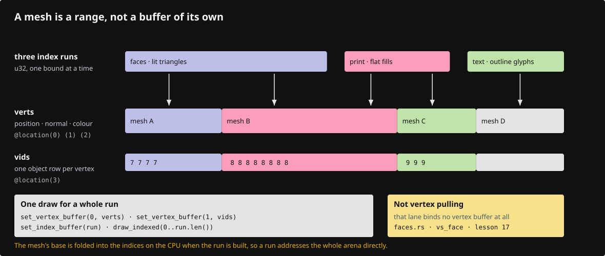

## Starting point

- Checkpoint 03: two instances drawn from one hard-coded triangle; the object row lives in `instance.rs`.
- This lesson builds the engine behind `lib.rs`: buffers, layouts, pipelines, targets, frame uniforms, the object table and the mesh lane. `scene.rs` and `first.wgsl` are deleted.

<!-- step-status: start -->

**Does it compile yet?** Yes — `cargo check` was run at the end of every step of this lesson.

<!-- step-status: end -->

## Step 1 · The floor: device, growable buffers, helpers

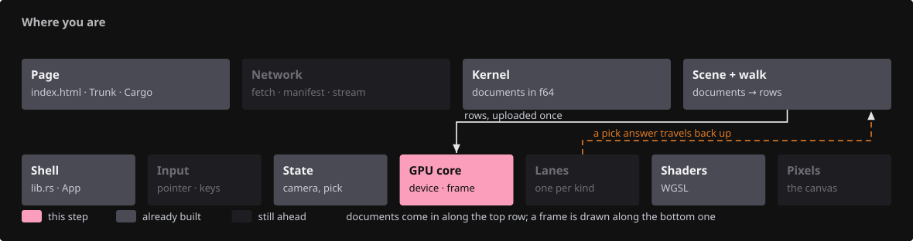{ .locator data-strip="illustrations/strip-1d6ef8d27c.svg" }

- `GrowBuf` grows by appending: capacity `max(need, cap * 3 / 2)`, the live prefix copied GPU-side, only new rows written.
- Returns `true` when the buffer moved, so the caller rebuilds its bind group.

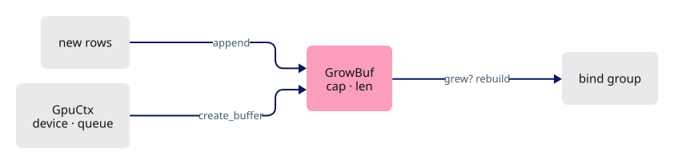

<!-- file: 04a session_viewer/src/engine/gpu/buffers.rs type lines=1-39 -->

<!-- file: 04a session_viewer/src/engine/gpu/buffers.rs type lines=40-99 -->

- `reset` keeps the allocation: a reload refills a buffer already the right size.
- `release` hands the buffer back, for a cleared scene that should hold no GPU memory.

<!-- file: 04a session_viewer/src/engine/gpu/buffers.rs type lines=100-123 -->

<!-- file: 04a session_viewer/src/engine/gpu/buffers.rs type lines=124-186 -->

- One helper builds every bind group: buffers in binding order, no names to keep in sync. A layout mismatch then fails at one call site instead of eight.

<!-- file: 04a session_viewer/src/engine/gpu/buffers.rs type lines=187-206 -->

## Step 2 · Bind-group layouts

{ .locator data-strip="illustrations/strip-1d6ef8d27c.svg" }

- Group 2 splits rows (96 B) from anchored translations (16 B) so a re-anchor rewrites 16 bytes per object.

Give the drawing a four-row column between them — "ink instance layout (04a)": object rows, anchored translations, depth · single-sampled, depth · multisampled (1 x 1 placeholder) — or relabel the six-row column "ink instance layout (04a-05)" and mark the two gradient rows as the lesson-05 additions.

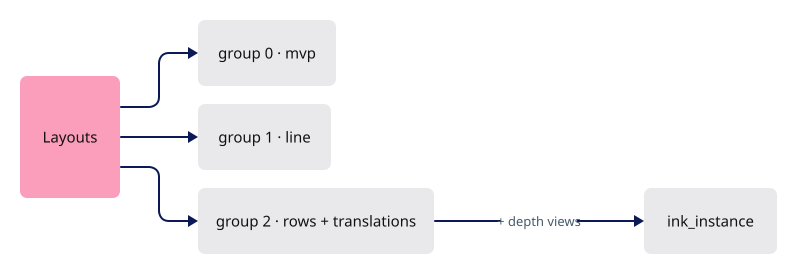

<!-- file: 04a session_viewer/src/engine/pipelines/layouts.rs type lines=1-52 -->

- The ink layout adds the physical depth at bindings 2 and 3 — one single-sampled view, one multisampled; the unused one is a 1×1 placeholder.

<!-- file: 04a session_viewer/src/engine/pipelines/layouts.rs type lines=53-106 -->

## Step 3 · Pipelines are data

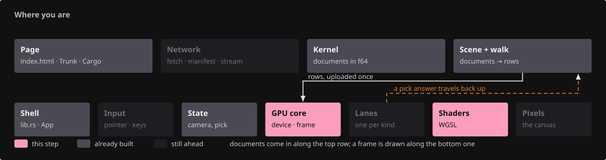{ .locator data-strip="illustrations/strip-7ad9324e80.svg" }

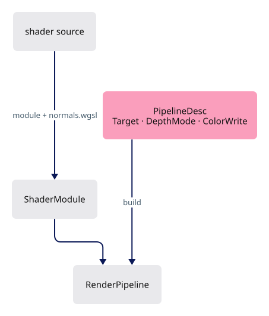

<!-- file: 04a session_viewer/src/engine/pipelines/mod.rs type lines=1-58 -->

<!-- file: 04a session_viewer/src/engine/pipelines/mod.rs type lines=59-117 -->

- One base description becomes a family: `with` renames and repoints the fragment entry, `vertex` swaps the vertex entry, `color` and `depth` set the two states that vary between passes.

<!-- file: 04a session_viewer/src/engine/pipelines/mod.rs type lines=118-182 -->

- `SCENE` is the contract every lane compiles with; `INK` the visibility rule only ink lanes need. A lane names a constant instead of repeating an `include_str!`.

<!-- file: 04a session_viewer/src/engine/pipelines/mod.rs type lines=183-205 -->

- `module` appends `normals.wgsl` to every shader source: one normal transform serves all lanes.
- `scene_module` also appends `scene.wgsl`, declaring the camera, the line block and the object rows once for every lane.

<!-- file: 04a session_viewer/src/engine/pipelines/mod.rs type lines=206-235 -->

- `build` is the only place wgpu is asked for a render pipeline: `Depth32Float`, no cull, fill mode, the desc supplies the rest.

<!-- file: 04a session_viewer/src/engine/pipelines/mod.rs type lines=236-285 -->

- `scene.wgsl` is the scene contract: groups 0 to 2, the `Instance` row, the `LineUniform` block, the `FLAG_*` bits, `place`. No lane declares them itself, so a row field changes in one place.

<!-- file: 04a session_viewer/src/shaders/scene.wgsl type -->

- The mirror test reads that one declaration: the Rust field names against `SCENE`.

<!-- file: 04a session_viewer/src/engine/gpu/instance.rs type -->

<!-- file: 04a session_viewer/src/shaders/normals.wgsl type -->

- A teaching stage: rigid and uniform scales only. Lesson 09 swaps in the cofactor transform that survives a nonuniform scale, same signature, so no lane changes.

<!-- check: 04a -->

## Step 4 · Targets and the two passes

{ .locator data-strip="illustrations/strip-1d6ef8d27c.svg" }

- The face pass clears color and depth (to `0.0`, reverse-Z) and writes both.
- The ink pass loads color, keeps depth read-only and samples it through group 2.

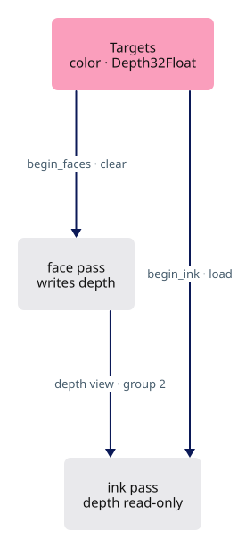

<!-- file: 04a session_viewer/src/engine/gpu/targets.rs type lines=1-70 -->

<!-- file: 04a session_viewer/src/engine/gpu/targets.rs type lines=71-135 -->

<!-- file: 04a session_viewer/src/engine/gpu/targets.rs type lines=136-165 -->

- `TextureSpec` is the whole description of an attachment - size, format, samples, usage. Keeping it as data lets every attachment rebuild from one place when the sample count flips.

## Step 5 · Frame uniforms

{ .locator data-strip="illustrations/strip-1d6ef8d27c.svg" }

- `FrameInput` is what one frame needs from the caller.
- `FrameCx` adds the knobs, the anchor and the framebuffer; `pixel_scale` is framebuffer pixels per CSS pixel.
- `Binds` sets groups 0, 1 and 2 before every lane draw.

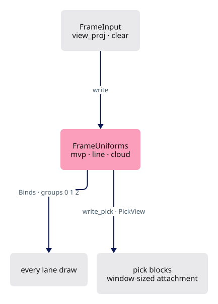

<!-- file: 04a session_viewer/src/engine/gpu/frame.rs type lines=1-44 -->

`LineUniform` is 80 bytes, declared once in `scene.wgsl` — one list of offsets to keep true:

| Offset | Rust | WGSL |
|---|---|---|
| 0 | `thickness` | `thickness` |
| 4 | `proj_y` | `proj_y` |
| 8 | `ortho_h` | `ortho_h` |
| 12 | `vp_h` | `vp_h` |
| 16 | `vp_w` | `vp_w` |
| 20 | `eye: [f32; 3]` | `eye_x, eye_y, eye_z` |
| 32 | `anchor: [f32; 3]` | `anchor: vec3<f32>` |
| 44 | `feather` | `feather` |
| 48 | `lit` | `lit` |
| 52 | `backface` | `backface` |
| 56 | `origin: [f32; 2]` | `origin: vec2<f32>` |
| 64 | `frame: [f32; 2]` | `frame: vec2<f32>` |
| 72 | `opacity` | `opacity` |

- `vp_w`/`vp_h` are the pass's own attachment; `frame` the canvas the scene was projected for, `origin` the attachment's top-left within it.
- They differ only in the pick pass.
- `CloudUniform` is the point lane's 48-byte block with the same `origin` and `frame` pair.

<!-- file: 04a session_viewer/src/engine/gpu/frame.rs type lines=45-105 -->

- `PickView` renders a window of the canvas into an attachment its own size: a pick costs the window, not the canvas.
- `clip_transform` maps the canvas projection onto the window's sub-frustum.
- `pick_transform_layout` is the one uniform the text ID pipelines bind, since text lanes never see `Layouts`.

<!-- file: 04a session_viewer/src/engine/gpu/frame.rs type lines=106-176 -->

- `FrameUniforms` owns the three frame blocks, the same three for the pick pass plus the bare transform, and the frame's solved camera facts: `mvp_f32`, `ortho_h`, `eye`.

<!-- file: 04a session_viewer/src/engine/gpu/frame.rs type lines=177-205 -->

<!-- file: 04a session_viewer/src/engine/gpu/frame.rs type lines=206-253 -->

- Construction makes the buffers and bind groups with no camera in them yet. A frame only writes into buffers that already exist and are already bound — no per-frame allocation.

<!-- file: 04a session_viewer/src/engine/gpu/frame.rs type lines=254-329 -->

- The three blocks are written together from one solved camera, so they cannot disagree about which frame they describe.

<!-- file: 04a session_viewer/src/engine/gpu/frame.rs type lines=330-347 -->

- `write` solves the eye and the orthographic half-height once per frame from the camera matrix; every lane reads the result.
- The pen is `thickness_px * pixel_scale`, keeping its CSS width at every device scale.
- `origin` is zero, `frame` the framebuffer.

<!-- file: 04a session_viewer/src/engine/gpu/frame.rs type lines=348-392 -->

- `write_pick` runs after `write`, deriving the pick blocks from the frame's own solved values.
- The camera is premultiplied by the window's clip transform; `origin` becomes the window's top-left.
- `proj_y` is multiplied and `ortho_h` divided by canvas height over attachment height, so a marker or pen is as wide in the window as on the canvas.

<!-- file: 04a session_viewer/src/engine/gpu/frame.rs type lines=393-410 -->

<!-- file: 04a session_viewer/src/engine/gpu/frame.rs copy lines=411-417 -->

## Step 6 · Runtime knobs and the query string

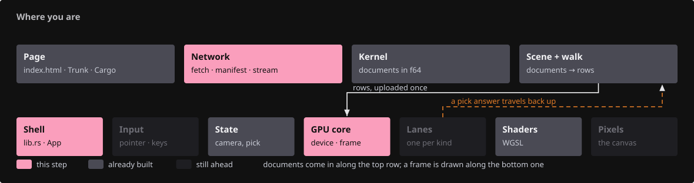{ .locator data-strip="illustrations/strip-91e31ad624.svg" }

- `View` is read once from `?name=` on wasm or `ENV` natively and consulted every frame.

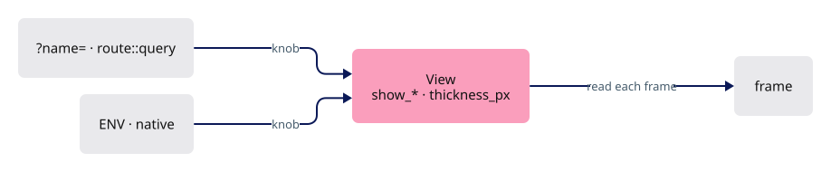

<!-- file: 04a session_viewer/src/engine/gpu/view.rs copy -->

<!-- file: 04a session_viewer/src/app/mod.rs type -->

<!-- file: 04a session_viewer/src/app/route.rs type -->

- Enough of a query parser to read `?name=value`; routing policy waits for lesson 14. A knob is read in one place, not wherever it is needed.

## Step 7 · The object table

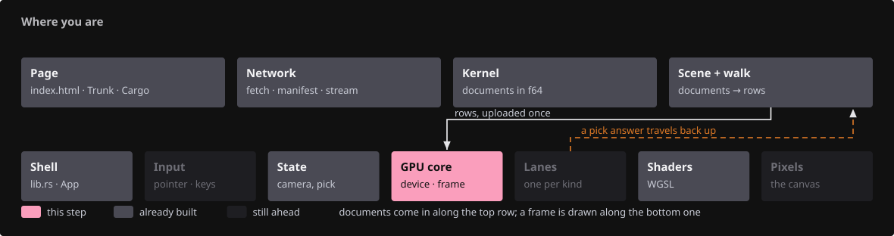{ .locator data-strip="illustrations/strip-62cf9167cc.svg" }

- `InstanceTable` owns the rows the GPU reads, the true f64 translations, and the two buffers behind group 2.

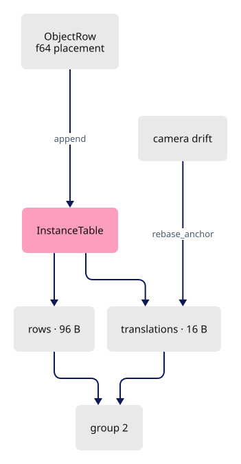

<!-- file: 04a session_viewer/src/engine/gpu/objects.rs type lines=1-26 -->

<!-- file: 04a session_viewer/src/engine/gpu/objects.rs type lines=27-65 -->

- Group 2 for ink binds the same two buffers plus the face pass's depth views.

<!-- file: 04a session_viewer/src/engine/gpu/objects.rs type lines=66-117 -->

<!-- file: 04a session_viewer/src/engine/gpu/objects.rs type lines=118-188 -->

- `append` converts each row to the 96-byte `Instance`, keeps the f64 translation aside, and records bounded rows for the inside test.

<!-- file: 04a session_viewer/src/engine/gpu/objects.rs type lines=189-255 -->

- `rebase_anchor` rewrites only the translation column when the camera target drifts a quarter of the view distance, throttled to one rebuild per interval.

<!-- file: 04a session_viewer/src/engine/gpu/objects.rs type lines=256-312 -->

<!-- file: 04a session_viewer/src/engine/gpu/objects.rs type lines=313-360 -->

- `anchored_model` spells out on the CPU the composition a shader performs, so a test can check it.

<!-- file: 04a session_viewer/src/engine/gpu/objects.rs type lines=361-416 -->

- Flags are set and written back one row at a time: selecting an object must not re-upload the table.

<!-- file: 04a session_viewer/src/engine/gpu/objects.rs copy lines=417-469 -->

<!-- check: 04a -->

## Step 8 · The mesh shader

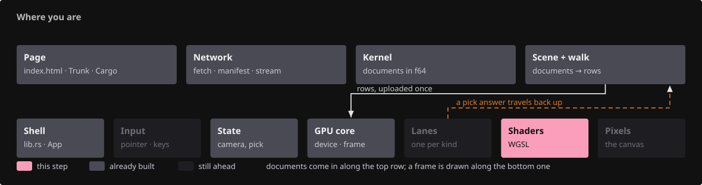{ .locator data-strip="illustrations/strip-dbc84dca37.svg" }

- Groups 0, 1, 2, the `LineUniform` and `place` all arrive from `scene.wgsl`; this file declares only its own vertex input and outputs.

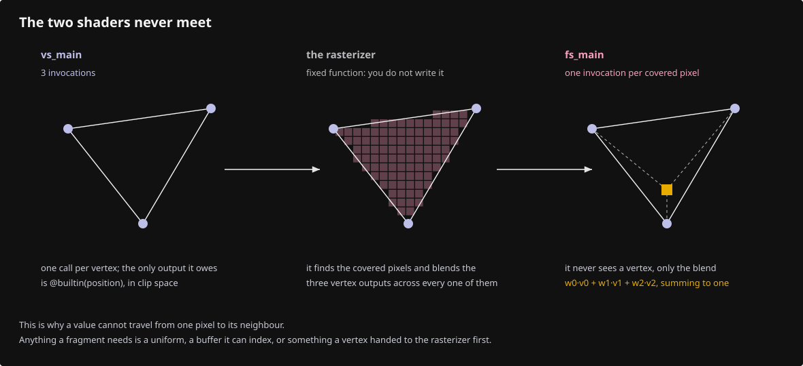

<!-- file: 04a session_viewer/src/shaders/triangle.wgsl type lines=1-23 -->

- A hidden row's triangle is parked outside the clip volume; the ID pass shares this vertex stage, so a hidden object is unpickable too.

<!-- file: 04a session_viewer/src/shaders/triangle.wgsl type lines=24-61 -->

- Shading is a function of its own: `fs_main` calls it, `fs_id` returns the row and never lights.
- A camera headlight with wrapped diffuse keeps the darkest visible face its own colour, not black.
- Back faces paint red once `B` (`?backface=1`) asks for it, unless the object is print.

<!-- file: 04a session_viewer/src/shaders/triangle.wgsl type lines=62-113 -->

- The two fragment entries end the file: `fs_id` writes the object row for picking, `fs_main` the shaded colour.

<!-- file: 04a session_viewer/src/shaders/triangle.wgsl type lines=114-122 -->

## Step 9 · The mesh lane

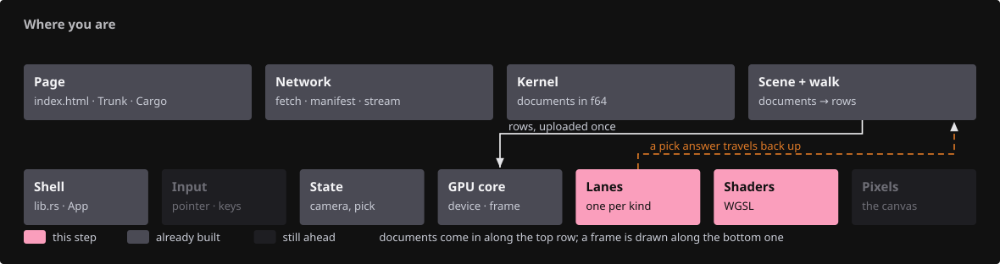{ .locator data-strip="illustrations/strip-5c9e80c7f0.svg" }

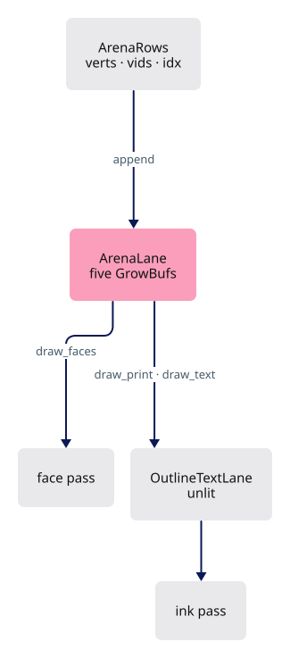

<!-- file: 04a session_viewer/src/engine/gpu/arena.rs type lines=1-63 -->

<!-- file: 04a session_viewer/src/engine/gpu/arena.rs type lines=64-114 -->

- Three index runs share one vertex table: solid faces, sheet fills, lettering. The last two go through the unlit outline lane below.

<!-- file: 04a session_viewer/src/engine/gpu/arena.rs type lines=115-160 -->

<!-- file: 04a session_viewer/src/engine/gpu/arena.rs type lines=161-226 -->

- The outline lane borrows the arena's buffers and draws imported PDF lettering unlit; the arena's print and text runs call it.

<!-- file: 04a session_viewer/src/shaders/text_outline.wgsl copy -->

<!-- file: 04a session_viewer/src/engine/gpu/text_outline.rs type lines=1-55 -->

- Imported outline text is geometry, not glyphs: it keeps exact object IDs and the sheet depth comparison, so it picks and occludes like the drawing it came from.

<!-- file: 04a session_viewer/src/engine/gpu/text_outline.rs type lines=56-67 -->

<!-- file: 04a session_viewer/src/engine/gpu/text_outline.rs type lines=68-114 -->

<!-- file: 04a session_viewer/src/engine/gpu/text_outline.rs copy lines=115-246 -->

## Step 10 · Upload and the fixture

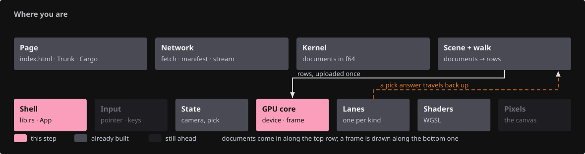{ .locator data-strip="illustrations/strip-3889827b9f.svg" }

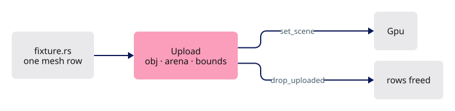

<!-- file: 04a session_viewer/src/engine/gpu/upload.rs type -->

- One local mesh row: three vertices, one triangle, no loader.

<!-- file: 04a session_viewer/src/fixture.rs copy -->

## Step 11 · Wire the coordinator

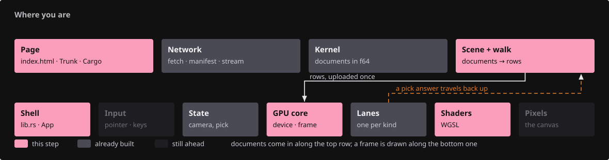{ .locator data-strip="illustrations/strip-18842fd6bf.svg" }

- `Gpu` owns the surface, one device, the layouts, frame uniforms, targets, the object table and the lanes; the lanes never see each other.

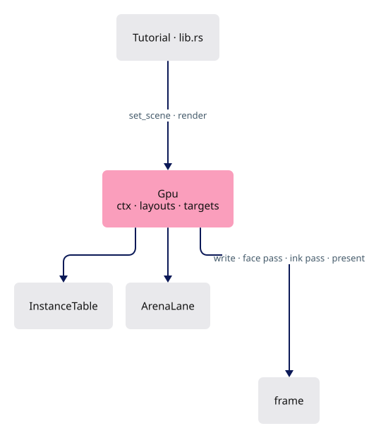

<!-- file: 04a session_viewer/src/engine/gpu/mod.rs type whole lines=1-33 -->

- `new` is the device setup, then every shared resource once.

<!-- file: 04a session_viewer/src/engine/gpu/mod.rs type whole lines=34-96 -->

- `set_scene` appends each lane's delta; `resize` rebuilds size-dependent targets and the ink bind group that samples them.

<!-- file: 04a session_viewer/src/engine/gpu/mod.rs type whole lines=97-139 -->

- The frame: write uniforms, face pass, ink pass, submit, present.

<!-- file: 04a session_viewer/src/engine/gpu/mod.rs type whole lines=140-172 -->

<!-- file: 04a session_viewer/src/engine/mod.rs type -->

- The shell keeps only the canvas, the camera and `Gpu`; the fixture upload is dropped after `set_scene`, so the GPU is its only holder.

<!-- file: 04a session_viewer/src/lib.rs type whole lines=1-52 -->

<!-- file: 04a session_viewer/src/lib.rs type whole lines=53-95 -->

- `render` is the frame: resize if needed, take one anchor for the whole frame, submit. One anchor stops two lanes disagreeing about where the world is.

<!-- file: 04a session_viewer/src/scene.rs -->

<!-- file: 04a session_viewer/src/shaders/first.wgsl -->

<!-- file: 04a session_viewer/index.html copy -->

- Everything you typed is now in the build: `engine/gpu/mod.rs` names the new modules only here, so read a compiler error now rather than a blank canvas in a moment.

<!-- check: 04a -->

## Check

<!-- checkpoint: 04a -->

Expected:

- One flat blue triangle, lit by the headlight, on the dark canvas.
- Status reads **Checkpoint 04a · 1 objects**.
- Orbit, pan and zoom still work; the triangle stays put while the camera moves.

If the canvas stays empty, compare `Gpu::new` against the checkpoint listing: the surface must be configured before the first frame and the arena must have rows.

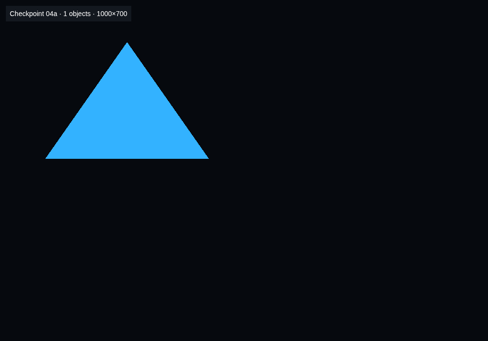

## What changed

<!-- tree: 04a session_viewer/src -->

- Data flow: `fixture::scene()` → `Upload` → `InstanceTable` + `ArenaLane` → `triangle.wgsl` → color and depth targets.
- One growth policy for every GPU table; one `build` for every pipeline.

**Production equivalent:** every file in `src/engine/gpu/` and `src/engine/pipelines/` from this lesson. Production keeps the shell in `src/lib.rs` and `src/app/`.

## Try

- Append `?lit=1` (or press `D` later): the face gains headlight shading. Without it every face is its flat row color — what a color-based probe needs.
- Add a second `ObjectRow` in `fixture.rs` with a different `place`: the same vertex range draws twice, once per row.
- `?msaa=` is parsed here with no consumer yet: `Targets::new` is called with one sample and the comment says so. Lesson 05 gives the knob its meaning; that checkpoint is where `?msaa=4` changes the picture.

## Questions and answers

**`GrowBuf` returns `true` when it grew. Why does a caller have to care?**

*How to work it out.* There is no realloc on a GPU: growing creates a *new*, larger buffer and copies the live prefix into it. Then ask what else remembers the old buffer — a bind group holds a reference to a specific buffer, not to a name.

*The answer.* The old bind group now points at a buffer nobody writes to any more. The boolean is the signal to rebuild it. Ignore it and there is no validation error — the buffer it names is still perfectly valid, just not yours — so the symptom is stale geometry, failure 9 in [Reading failures](debugging.md).

**Group 2 holds rows in one buffer and translations in another. What does the split buy?**

*How to work it out.* Ask which of the two changes more often. The rows change when the scene changes; the translations change every time the anchor moves, which is while you are navigating. Then price each write per object: 96 bytes against 16.

*The answer.* A re-anchor rewrites only the translations — 16 bytes per object instead of 96 — and that is the write that happens during interaction, so it is the one worth making small. The general move: split a record when one half changes on a different clock.

**`vp_w`/`vp_h` and `frame`/`origin` look like the same numbers. When do they differ, and why are both needed?**

*How to work it out.* Find a case where the thing being drawn into is not the whole canvas. There is exactly one: the pick pass renders a window around the cursor into its own attachment. Then ask of each piece of pixel arithmetic whether it means "in this attachment" or "on the canvas the scene was laid out for".

*The answer.* `vp_w`/`vp_h` are the attachment being drawn into; `frame` is the whole canvas the scene was projected for, and `origin` is where the window's top-left sits in it. Pixel arithmetic uses the attachment; anything laid out against the full canvas goes through `origin`. Collapse them and picking drifts as soon as the window is not the canvas.

**Why is a pipeline described by data (`PipelineDesc`) instead of a function per pipeline?**

*How to work it out.* Count the variants: one shader, several fragment entries, several colour modes, several depth rules. Then count the fields they share — around twenty. A function per variant duplicates the twenty and buries the one line that differs.

*The answer.* One base per shader plus `with`/`vertex`/`color`/`depth` makes each variant a single readable line, and keeps `build` as the only place wgpu is asked for a pipeline — so a format or sample-count mistake is caught in one place instead of eight. 

**What you should be able to do now**

Name the three bind groups every lane shares, what each holds, and what the ink pass binds differently. Correct: group 0 the camera matrix, group 1 the per-frame `LineUniform`, group 2 the object rows plus anchored translations — and the ink variant of group 2 adds the physical depth views, so ink can test its own visibility. 

## Next

[04b · Strokes](04b-strokes.md): the segment lane, `ribbon.wgsl`, and the shared ink visibility rule.
