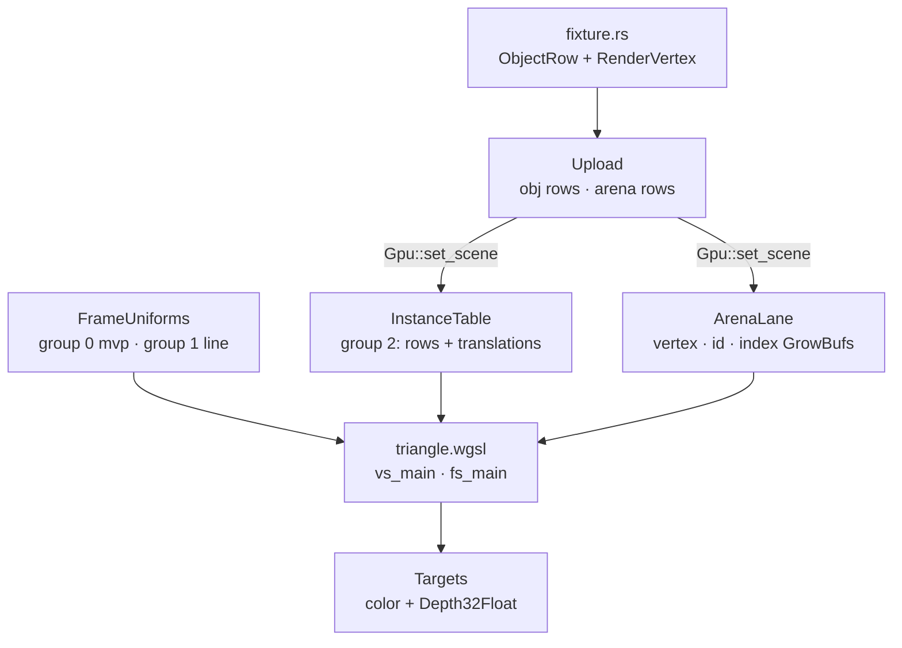

# 04a · Meshes on the GPU

## You are building

Rust vertex layout ↔ WGSL locations (`pipelines::vertex_layout`, `instance_id_layout`):

| Slot | Rust | WGSL |
|---|---|---|
| 0 | `RenderVertex::layout()` position, normal, color | `@location(0) position`, `@location(1) normal`, `@location(2) color` |
| 1 | `instance_id_layout()` one `u32` per vertex | `@location(3) inst_id` |

Bind groups every lane shares (`Layouts`):

| Group | Rust layout | WGSL |
|---|---|---|
| 0 | `Layouts::mvp` uniform | `@group(0) @binding(0) var<uniform> mvp: mat4x4<f32>` |
| 1 | `Layouts::line` uniform | `@group(1) @binding(0) var<uniform> line: LineUniform` |
| 2 | `Layouts::instance` two storage buffers | `@group(2) @binding(0) instances`, `@binding(1) translations` |

## Starting point

- Checkpoint 03: two instances drawn from one hard-coded triangle; the object row lives in `instance.rs`.
- This lesson replaces the ad-hoc shell in `lib.rs` with the production engine: buffers, layouts, pipelines, targets, frame uniforms, the object table and the mesh lane. The old `scene.rs` and `first.wgsl` are deleted.
- New files first. Nothing references them until the wiring at the end, so the crate keeps compiling after each step.

## Step 1 · The floor: device, growable buffers, helpers

- `GpuCtx` is the device/queue pair every lane is made with.
- `GrowBuf` grows by appending: capacity `max(need, cap * 3 / 2)`, the live prefix copied GPU-side, only new rows written. It returns `true` when the buffer moved so the caller rebuilds its bind group.

<!-- file: 04a session_viewer/src/engine/gpu/buffers.rs type lines=1-39 -->

<!-- file: 04a session_viewer/src/engine/gpu/buffers.rs type lines=40-123 -->

- `Template` is a unit mesh drawn N times; the marker lane uses it in lesson 04c.

<!-- file: 04a session_viewer/src/engine/gpu/buffers.rs type lines=124-206 -->

## Step 2 · Bind-group layouts

- A layout is the shape of a bind group; the buffers live in the lanes.
- Group 2 splits rows (96 B) from anchored translations (16 B) so a re-anchor rewrites 16 bytes per object.

<!-- file: 04a session_viewer/src/engine/pipelines/layouts.rs type lines=1-52 -->

- The ink layout adds the physical depth at bindings 2 and 3, one single-sampled and one multisampled view; the one not in use is a 1×1 placeholder.

<!-- file: 04a session_viewer/src/engine/pipelines/layouts.rs type lines=53-106 -->

## Step 3 · Pipelines are data

- `Target` is where a pipeline draws; `DepthMode` and `ColorWrite` name the only depth and blend states the viewer uses.
- Every compare is reverse-Z: nearer is `Greater`.

<!-- file: 04a session_viewer/src/engine/pipelines/mod.rs type lines=1-52 -->

- `PipelineDesc` is one base per shader; `with`, `vertex`, `color`, `depth` derive the variants.

<!-- file: 04a session_viewer/src/engine/pipelines/mod.rs type lines=53-147 -->

- `module` appends `normals.wgsl` to every shader source, so one normal transform serves all lanes.

<!-- file: 04a session_viewer/src/engine/pipelines/mod.rs type lines=148-177 -->

- `build` is the only place wgpu is asked for a render pipeline: `Depth32Float`, no cull, fill mode, the desc supplies the rest.

<!-- file: 04a session_viewer/src/engine/pipelines/mod.rs type lines=178-255 -->

<!-- file: 04a session_viewer/src/shaders/normals.wgsl type -->

<!-- check: 04a -->

## Step 4 · Targets and the two passes

- The face pass clears color and depth (to `0.0`, reverse-Z) and writes both.
- The ink pass loads color, keeps depth read-only and samples it through group 2.

<!-- file: 04a session_viewer/src/engine/gpu/targets.rs type lines=1-70 -->

<!-- file: 04a session_viewer/src/engine/gpu/targets.rs type lines=71-135 -->

<!-- file: 04a session_viewer/src/engine/gpu/targets.rs type lines=136-165 -->

## Step 5 · Frame uniforms

- `FrameInput` is what one frame needs from the caller; `Binds` sets groups 0, 1, 2 before every lane draw.

<!-- file: 04a session_viewer/src/engine/gpu/frame.rs type lines=1-47 -->

`LineUniform` is 64 bytes; the WGSL struct in `triangle.wgsl` declares the same offsets:

| Offset | Rust | WGSL |
|---|---|---|
| 0 | `thickness` | `thickness` |
| 4 | `proj_y` | `proj_y` |
| 8 | `ortho_h` | `ortho_h` |
| 12 | `vp_h` | `vp_h` |
| 16 | `vp_w` | `vp_w` |
| 20 | `eye: [f32; 3]` | `eye_x, eye_y, eye_z` |
| 32 | `anchor: [f32; 3]` | `anchor: vec3<f32>` |
| 44 | `feather` | `feather` |
| 48 | `lit` | `lit` |
| 52 | `backface` | `backface` |

<!-- file: 04a session_viewer/src/engine/gpu/frame.rs type lines=48-95 -->

- `write` solves the eye and the orthographic half-height once per frame from the camera matrix; every lane reads the result.

<!-- file: 04a session_viewer/src/engine/gpu/frame.rs type lines=96-178 -->

## Step 6 · Runtime knobs and the query string

- `View` is read once from `?name=` on wasm or `ENV` natively; key handlers flip it later.

<!-- file: 04a session_viewer/src/engine/gpu/view.rs copy -->

<!-- file: 04a session_viewer/src/app/mod.rs type -->

<!-- file: 04a session_viewer/src/app/route.rs type -->

## Step 7 · The object table

- `ObjectRow` is one object as the producer reports it: f64 placement, tint, flags, local box, spacing.
- `InstanceTable` owns the rows the GPU reads, the true f64 translations, and the two buffers behind group 2.

<!-- file: 04a session_viewer/src/engine/gpu/objects.rs type lines=1-61 -->

<!-- file: 04a session_viewer/src/engine/gpu/objects.rs type lines=62-104 -->

- Group 2 for ink binds the same two buffers plus the face pass's depth views.

<!-- file: 04a session_viewer/src/engine/gpu/objects.rs type lines=105-156 -->

<!-- file: 04a session_viewer/src/engine/gpu/objects.rs type lines=157-227 -->

- `append` converts each row to the 96-byte `Instance`, keeps the f64 translation aside, and records bounded rows for the inside test.

<!-- file: 04a session_viewer/src/engine/gpu/objects.rs type lines=228-296 -->

- `rebase_anchor` rewrites only the translation column when the camera target drifts a quarter of the view distance, throttled to one rebuild per interval.

<!-- file: 04a session_viewer/src/engine/gpu/objects.rs type lines=297-354 -->

<!-- file: 04a session_viewer/src/engine/gpu/objects.rs type lines=355-402 -->

<!-- file: 04a session_viewer/src/engine/gpu/objects.rs type lines=403-458 -->

<!-- file: 04a session_viewer/src/engine/gpu/objects.rs copy lines=459-483 -->

<!-- check: 04a -->

## Step 8 · The mesh shader

- Groups 0, 1, 2 and the `LineUniform` mirror; `place` applies the row's rotation/scale and the anchored translation.

<!-- file: 04a session_viewer/src/shaders/triangle.wgsl type lines=1-38 -->

- A hidden row's triangle is parked outside the clip volume; the ID pass shares this vertex stage, so a hidden object is unpickable too.

<!-- file: 04a session_viewer/src/shaders/triangle.wgsl type lines=39-100 -->

- A camera headlight with wrapped diffuse: the darkest visible face is its silhouette, never black. Back faces paint red unless the object is print.

<!-- file: 04a session_viewer/src/shaders/triangle.wgsl type lines=101-158 -->

## Step 9 · The mesh lane

- `ArenaRows` is one upload's delta; `ArenaLane` is five `GrowBuf`s under one growth policy and the pipelines over them.

<!-- file: 04a session_viewer/src/engine/gpu/arena.rs type lines=1-63 -->

<!-- file: 04a session_viewer/src/engine/gpu/arena.rs type lines=64-114 -->

- Three index runs share one vertex table: solid faces, sheet fills, lettering. The last two go through the unlit outline lane below.

<!-- file: 04a session_viewer/src/engine/gpu/arena.rs type lines=115-160 -->

<!-- file: 04a session_viewer/src/engine/gpu/arena.rs type lines=161-226 -->

- The outline lane borrows the arena's buffers and draws imported PDF lettering unlit; it exists now because the arena's print and text runs call it.

<!-- file: 04a session_viewer/src/shaders/text_outline.wgsl copy -->

<!-- file: 04a session_viewer/src/engine/gpu/text_outline.rs type lines=1-67 -->

<!-- file: 04a session_viewer/src/engine/gpu/text_outline.rs type lines=68-114 -->

<!-- file: 04a session_viewer/src/engine/gpu/text_outline.rs copy lines=115-246 -->

## Step 10 · Upload and the fixture

- `Upload` carries every lane's rows for one file and nothing GPU-typed. Deleting a lane means deleting its field here.

<!-- file: 04a session_viewer/src/engine/gpu/upload.rs type -->

- One local mesh row: three vertices, one triangle, no loader.

<!-- file: 04a session_viewer/src/fixture.rs copy -->

## Step 11 · Wire the coordinator

- `Gpu` owns the surface, one device, the layouts, frame uniforms, targets, the object table and the lanes; the lanes never see each other.

<!-- file: 04a session_viewer/src/engine/gpu/mod.rs type whole lines=1-33 -->

- `new` is lesson 01's device setup, then every shared resource once.

<!-- file: 04a session_viewer/src/engine/gpu/mod.rs type whole lines=34-96 -->

- `set_scene` appends each lane's delta; `resize` rebuilds size-dependent targets and the ink bind group that samples them.

<!-- file: 04a session_viewer/src/engine/gpu/mod.rs type whole lines=97-139 -->

- The frame: write uniforms, face pass, ink pass, submit, present.

<!-- file: 04a session_viewer/src/engine/gpu/mod.rs type whole lines=140-172 -->

<!-- file: 04a session_viewer/src/engine/mod.rs type -->

- The shell keeps only the canvas, the camera and `Gpu`; the fixture upload is dropped after `set_scene`, so the GPU is its only holder.

<!-- file: 04a session_viewer/src/lib.rs type whole lines=1-52 -->

<!-- file: 04a session_viewer/src/lib.rs type whole lines=53-95 -->

<!-- file: 04a session_viewer/src/scene.rs -->

<!-- file: 04a session_viewer/src/shaders/first.wgsl -->

<!-- file: 04a session_viewer/index.html copy -->

## Check

<!-- checkpoint: 04a -->

Expected:

- One flat blue triangle, lit by the headlight, on the dark canvas.
- Status reads **Checkpoint 04a · 1 objects**.
- Orbit, pan and zoom still work; the triangle stays put while the camera moves.

If the canvas stays empty, compare `Gpu::new` against the checkpoint listing: the surface must be configured before the first frame and the arena must have rows.

## What changed

<!-- tree: 04a session_viewer/src -->

- Data flow: `fixture::scene()` → `Upload` → `InstanceTable` + `ArenaLane` → `triangle.wgsl` → color and depth targets.
- One growth policy for every GPU table; one `build` for every pipeline.

**Production equivalent:** every file in `src/engine/gpu/` and `src/engine/pipelines/` from this lesson is the production file; `gpu/mod.rs` and `lib.rs` are still the teaching shell until lesson 12.

## Next

[04b · Strokes](04b-strokes.md): the segment lane, `ribbon.wgsl`, and the shared ink visibility rule.
