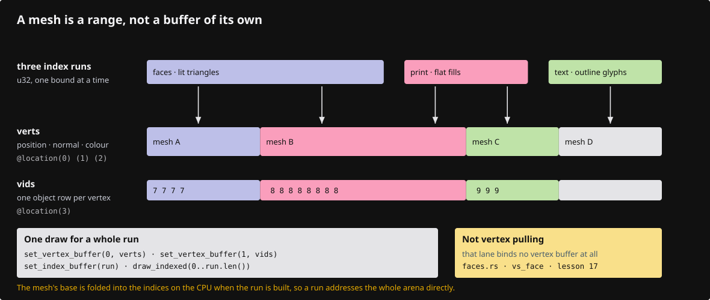

# 04a · Meshes on the GPU

**Estimated study time: about 45–90 hours.** Includes reading, typing, tracing, testing and experiments. [How to use this estimate](map.md#time-estimates).

**This section:** Pack meshes into shared GPU storage and draw indexed triangles.

**In the whole viewer:** This is the first major geometry drawing path, built on the device, camera and object rows.

**Follow the data:** Mesh vertices and indices → shared arena → triangle shader → surface pixels.

**Start with these files:** [`src/engine/gpu/arena.rs`](04a-meshes.md#code-04a-001), [`src/shaders/triangle.wgsl`](04a-meshes.md#code-04a-039).

**Aim to explain:** What must agree when Rust writes a vertex and the shader reads it?

[Whole-viewer map and course milestones](map.md)

A mesh is a set of vertices plus a list telling us which three vertices form each triangle. Reusing an index avoids storing a shared corner again and again. Here the shader follows an index into the shared vertex storage and reconstructs its position, normal and colour.



Keep three jobs separate. A buffer stores bytes. A bind-group layout describes the numbered resources a shader may read. A bind group supplies the actual buffers for that layout. The pipeline you typed connects these declarations to the shader; a draw call tells it how many vertices to process. Separately, the Rust writer and shader reader must agree on each record: if one writes five words per vertex and the other reads six, the picture cannot be trusted.

Start from the working result of [step 03](03-identity.md).

**One buildable step:** type the additions below in `workspace/handwritten`, then build and test. This step adds 4,064 lines across 18 files and may take several sittings. Individual listings are parts of this step, not separate build checkpoints.

<span id="code-04a-001"></span>

## `src/engine/gpu/arena.rs`

Creating a separate buffer for every small object would make management expensive. An arena stores many allocations together. Each allocation records a range; freeing one must not accidentally invalidate the ranges still used by other objects.

Create this file. Type the complete listing, including comments and blank lines.

```rust
--8<-- "typing/code/04a-001.rs"
```

<span id="code-04a-002"></span>

## `src/engine/gpu/faces.rs`

A face becomes triangles for the GPU. Positions determine coverage, normals affect shading, and object records connect the samples back to the scene. A shared geometric edge is not necessarily a visible triangulation edge.

Create this file. Type the complete listing, including comments and blank lines.

```rust
--8<-- "typing/code/04a-002.rs"
```

<span id="code-04a-003"></span>

## `src/engine/gpu/mod.rs`

Insert **after line 2** of your current file.

Keep these preceding lines:

```rust
// One line per file of this folder; `pub` lets code outside `gpu` reach it.
// A line tagged `register:<name>` is a registration: each later lesson adds its own line to lists like this one.
```

Keep these following lines:

```rust
pub mod backdrop; // register:backdrop
pub mod buffers; // register:buffers
pub mod device; // register:device
pub mod frame; // register:frame
```

Type these new lines:

```rust
--8<-- "typing/code/04a-003.rs"
```

<span id="code-04a-004"></span>

## `src/engine/gpu/mod.rs`

Insert **after line 6** of your current file.

Keep these preceding lines:

```rust
pub mod arena; // register:arena
pub mod backdrop; // register:backdrop
pub mod buffers; // register:buffers
pub mod device; // register:device
```

Keep these following lines:

```rust
pub mod frame; // register:frame
pub mod hull; // register:hull
pub mod instance; // register:instance
pub mod objects;
```

Type these new lines:

```rust
--8<-- "typing/code/04a-004.rs"
```

<span id="code-04a-005"></span>

## `src/engine/gpu/mod.rs`

Insert **after line 11** of your current file.

Keep these preceding lines:

```rust
pub mod frame; // register:frame
pub mod hull; // register:hull
pub mod instance; // register:instance
pub mod objects;
```

Keep these following lines:

```rust

pub mod lane; // register:lane
pub mod pass; // register:pass
pub(crate) mod patch; // register:patch
```

Type these new lines:

```rust
--8<-- "typing/code/04a-005.rs"
```

<span id="code-04a-006"></span>

## `src/engine/gpu/mod.rs`

Insert **after line 19** of your current file.

Keep these preceding lines:

```rust
pub(crate) mod patch; // register:patch
pub mod present; // register:present
pub mod render; // register:render
pub mod targets; // register:targets
```

Keep these following lines:

```rust
pub mod upload; // register:upload
pub mod view; // register:view

use crate::engine::performance::Performance;
```

Type these new lines:

```rust
--8<-- "typing/code/04a-006.rs"
```

<span id="code-04a-007"></span>

## `src/engine/gpu/mod.rs`

Insert **after line 28** of your current file.

Keep these preceding lines:

```rust
use crate::engine::performance::Performance;
use crate::engine::pipelines::{Layouts, Target};
use session_rust::{AABB, Point};
```

Keep these following lines:

```rust
use backdrop::BackdropLane;
use buffers::GpuCtx;
use device::DeviceSetup;
use frame::FrameUniforms;
```

Type these new lines:

```rust
--8<-- "typing/code/04a-007.rs"
```

<span id="code-04a-008"></span>

## `src/engine/gpu/mod.rs`

Insert **after line 55** of your current file.

Keep these preceding lines:

```rust
    pub targets: Targets,                        // depth and color textures
    pub view: View,                              // display settings
    pub objects: InstanceTable,                  // one row per object
    pub backdrop: BackdropLane,                  // background and grid
```

Keep these following lines:

```rust
    pub selection_revision: u64,                 // bumps on every selection change
    pub logical_size: [f64; 2],                  // canvas size in CSS pixels
    registered: Vec<Box<dyn RowLane>>,           // lanes from lane::REGISTRY
    passes: Vec<Box<dyn Pass>>,                  // passes from pass::PASSES, in frame order
```

Type these new lines:

```rust
--8<-- "typing/code/04a-008.rs"
```

<span id="code-04a-009"></span>

## `src/engine/gpu/mod.rs`

Insert **after line 75** of your current file.

Keep these preceding lines:

```rust
        $apply!($g;
            frame,             // register:frame
            objects,
            backdrop,          // register:backdrop
```

Keep these following lines:

```rust
        )
    };
}
```

Type these new lines:

```rust
--8<-- "typing/code/04a-009.rs"
```

<span id="code-04a-010"></span>

## `src/engine/gpu/mod.rs`

Insert **after line 155** of your current file.

Keep these preceding lines:

```rust

        let layouts = Layouts::new(&ctx.device);
        let frame = FrameUniforms::new(&ctx, &layouts, size);
        let targets = Targets::new(&ctx, size, config.format, target.samples);
```

Keep these following lines:

```rust
        let objects = InstanceTable::new(&ctx, &layouts);
        let backdrop = BackdropLane::new(&ctx, &layouts, target);
        // each registered lane builds itself through its `make` function
        let registered = lane::REGISTRY
```

Type these new lines:

```rust
--8<-- "typing/code/04a-010.rs"
```

<span id="code-04a-011"></span>

## `src/engine/gpu/mod.rs`

Insert **after line 182** of your current file.

Keep these preceding lines:

```rust
            targets,
            view: View::from_env(),
            objects,
            backdrop,
```

Keep these following lines:

```rust
            selection_revision: 0,
            logical_size: [size.0 as f64, size.1 as f64],
            registered,
            passes,
```

Type these new lines:

```rust
--8<-- "typing/code/04a-011.rs"
```

<span id="code-04a-012"></span>

## `src/engine/gpu/mod.rs`

Insert **after line 199** of your current file.

Keep these preceding lines:

```rust

    /// Append one upload to every lane.
    pub fn set_scene(&mut self, up: &Upload) {
        self.objects.append(&self.ctx, &self.layouts, &up.obj);
```

Keep these following lines:

```rust
        for lane in &mut self.registered {
            lane.on_append(&self.ctx, &self.layouts, up);
        }
```

Type these new lines:

```rust
--8<-- "typing/code/04a-012.rs"
```

<span id="code-04a-013"></span>

## `src/engine/gpu/mod.rs`

Insert **after line 266** of your current file.

Keep these preceding lines:

```rust

    /// MSAA samples for the current scene: 4x only with solid geometry.
    fn msaa_now(&self) -> u32 {
        let mut solid = false;
```

Keep these following lines:

```rust
        Targets::samples_for(
            solid,
            self.config.width * self.config.height,
            self.view.msaa_forced,
```

Type these new lines:

```rust
--8<-- "typing/code/04a-013.rs"
```

<span id="code-04a-014"></span>

## `src/engine/gpu/mod.rs`

Insert **after line 333** of your current file.

Keep these preceding lines:

```rust
#[cfg(test)]
pub(crate) fn lane_shaders() -> Vec<(&'static str, &'static str)> {
    let mut out = Vec::new();
    out.extend_from_slice(backdrop::SHADERS);
```

Keep these following lines:

```rust
    out
}

impl Gpu {
```

Type these new lines:

```rust
--8<-- "typing/code/04a-014.rs"
```

<span id="code-04a-015"></span>

## `src/engine/gpu/mod.rs`

Append **after line 385** of your current file.

Blank lines before: **1**; after: **0**. End with a newline.

```rust
--8<-- "typing/code/04a-015.rs"
```

<span id="code-04a-016"></span>

## `src/engine/gpu/patch.rs`

Insert **after line 7** of your current file.

Keep these preceding lines:

```rust
// An edit rewrites one object's rows where they already are; these types say which lane tables it touches and how many rows.
/// One row table of the editable lanes.
#[derive(Clone, Copy, PartialEq, Eq, PartialOrd, Ord, Debug, Hash)]
pub(crate) enum LaneId {
```

Keep these following lines:

```rust
    Registered(u8), // a lane of lane::REGISTRY
}

/// The fixed lanes, in table order.
```

Type these new lines:

```rust
--8<-- "typing/code/04a-016.rs"
```

<span id="code-04a-017"></span>

## `src/engine/gpu/patch.rs`

Insert **after line 17** of your current file.

Keep these preceding lines:

```rust
}

/// The fixed lanes, in table order.
const FIXED: &[LaneId] = &[
```

Keep these following lines:

```rust
];

impl LaneId {
    /// Every lane, fixed ones first.
```

Type these new lines:

```rust
--8<-- "typing/code/04a-017.rs"
```

<span id="code-04a-018"></span>

## `src/engine/gpu/patch.rs`

Insert **after line 36** of your current file.

Keep these preceding lines:

```rust

    /// Bytes one row holds, on the GPU and in the CPU mirrors.
    pub fn stride(self) -> u64 {
        match self {
```

Keep these following lines:

```rust
            LaneId::Registered(i) => REGISTRY[i as usize].stride,
        }
    }
}
```

Type these new lines:

```rust
--8<-- "typing/code/04a-018.rs"
```

<span id="code-04a-019"></span>

## `src/engine/gpu/patch.rs`

Insert **after line 48** of your current file.

Keep these preceding lines:

```rust

#[derive(Clone, Copy, Default, Debug, PartialEq, Eq)]
/// Row counts per lane, for placing one object's rows.
pub(crate) struct Counts {
```

Keep these following lines:

```rust
    pub lanes: [u32; REGISTERED], // rows of each registered lane
}

impl Counts {
```

Type these new lines:

```rust
--8<-- "typing/code/04a-019.rs"
```

<span id="code-04a-020"></span>

## `src/engine/gpu/patch.rs`

Insert **after line 66** of your current file.

Keep these preceding lines:

```rust
            *count = (lane.rows_in)(up);
        }

        Self {
```

Keep these following lines:

```rust
            lanes,
        }
    }
```

Type these new lines:

```rust
--8<-- "typing/code/04a-020.rs"
```

<span id="code-04a-021"></span>

## `src/engine/gpu/patch.rs`

Insert **after line 78** of your current file.

Keep these preceding lines:

```rust

    /// Rows of one lane.
    pub fn get(&self, lane: LaneId) -> u32 {
        match lane {
```

Keep these following lines:

```rust
            LaneId::Registered(i) => self.lanes[i as usize],
        }
    }
```

Type these new lines:

```rust
--8<-- "typing/code/04a-021.rs"
```

<span id="code-04a-022"></span>

## `src/engine/gpu/patch.rs`

Insert **after line 90** of your current file.

Keep these preceding lines:

```rust

    /// Set the rows of one lane.
    pub fn set(&mut self, lane: LaneId, value: u32) {
        let slot = match lane {
```

Keep these following lines:

```rust
            LaneId::Registered(i) => &mut self.lanes[i as usize],
        };
        *slot = value;
    }
```

Type these new lines:

```rust
--8<-- "typing/code/04a-022.rs"
```

<span id="code-04a-023"></span>

## `src/engine/gpu/present.rs`

Insert **after line 60** of your current file.

Keep these preceding lines:

```rust
        output.present();

        // startup marks; the GPU-side one also times the pipelines the first frames compiled
        let mut geometry = false;
```

Keep these following lines:

```rust

        if let Some(done) = self.performance.mark_startup(geometry) {
            self.ctx
                .queue
```

Type these new lines:

```rust
--8<-- "typing/code/04a-023.rs"
```

<span id="code-04a-024"></span>

## `src/engine/gpu/render.rs`

Insert **after line 68** of your current file.

Keep these preceding lines:

```rust
    fn face_list(&self, pass: &mut wgpu::RenderPass<'_>, b: &Binds) -> u32 {
        let clipped = self.passes.iter().any(|pass| pass.clips());
        let opaque = self.view.opacity >= 1.0; // at full opacity the blend returns the face color itself
        let mut draws = 0;
```

Keep these following lines:

```rust
        draws
    }
}
```

Type these new lines:

```rust
--8<-- "typing/code/04a-024.rs"
```

<span id="code-04a-025"></span>

## `src/engine/gpu/slots.rs`

A slot table maps logical records to reusable storage. When a slot is freed, another object may later occupy it. Updates must distinguish an old reference from the current owner and keep the active count separate from capacity.

Create this file. Type the complete listing, including comments and blank lines.

```rust
--8<-- "typing/code/04a-025.rs"
```

<span id="code-04a-026"></span>

## `src/engine/gpu/text_outline.rs`

Text layout produces glyph positions; rendering turns glyph data into samples. World placement, depth and the chosen background treatment decide whether the text behaves like a label, a plate or a scene object.

Create this file. Type the complete listing, including comments and blank lines.

```rust
--8<-- "typing/code/04a-026.rs"
```

<span id="code-04a-027"></span>

## `src/engine/gpu/triangle_tiles.rs`

Divide the screen into tiles and assign projected triangles to the tiles they overlap. A visibility query then examines candidates near its pixel. Conservative assignment avoids missing triangles at tile boundaries.

Create this file. Type the complete listing, including comments and blank lines.

```rust
--8<-- "typing/code/04a-027.rs"
```

<span id="code-04a-028"></span>

## `src/engine/gpu/upload.rs`

Insert **after line 7** of your current file.

Keep these preceding lines:

```rust

/// Everything one file adds to the GPU, collected on the CPU first, so the GPU sees one write per buffer.
pub struct Upload {
    pub obj: ObjectRows,
```

Keep these following lines:

```rust
    pub lanes: LaneRows,                 // rows of registered lanes, by type
    pub bounds: AABB,                    // world box: the camera fits to it
}
```

Type these new lines:

```rust
--8<-- "typing/code/04a-028.rs"
```

<span id="code-04a-029"></span>

## `src/engine/gpu/upload.rs`

Insert **after line 17** of your current file.

Keep these preceding lines:

```rust
impl Default for Upload {
    fn default() -> Self {
        Self {
            obj: ObjectRows::default(),
```

Keep these following lines:

```rust
            lanes: LaneRows::default(),
            bounds: AABB::empty(),
        }
    }
```

Type these new lines:

```rust
--8<-- "typing/code/04a-029.rs"
```

<span id="code-04a-030"></span>

## `src/engine/gpu/upload.rs`

Insert **after line 28** of your current file.

Keep these preceding lines:

```rust
impl Upload {
    /// Free the rows once the GPU holds them.
    pub fn drop_uploaded(&mut self) {
        drop_rows(&mut self.obj.rows);
```

Keep these following lines:

```rust
        self.lanes.clear();
        self.bounds = AABB::empty();
    }
```

Type these new lines:

```rust
--8<-- "typing/code/04a-030.rs"
```

<span id="code-04a-031"></span>

## `src/engine/gpu/upload.rs`

Insert **after line 36** of your current file.

Keep these preceding lines:

```rust

    /// Move `other`'s rows after these; its vertex 0 lands on vertex `vert_base`.
    /// `mut other: Upload` takes it by value: the caller gives it away, so its lists can be moved out.
    pub fn merge(&mut self, mut other: Upload, vert_base: u32) {
```

Keep these following lines:

```rust

        for lane in super::lane::REGISTRY {
            (lane.merge)(self, &mut other);
        }
```

Type these new lines:

```rust
--8<-- "typing/code/04a-031.rs"
```

<span id="code-04a-032"></span>

## `src/engine/gpu/upload.rs`

Append **after line 51** of your current file.

Blank lines before: **1**; after: **0**. End with a newline.

```rust
--8<-- "typing/code/04a-032.rs"
```

<span id="code-04a-033"></span>

## `src/engine/pipelines/mod.rs`

Append **after line 621** of your current file.

Blank lines before: **1**; after: **0**. End with a newline.

```rust
--8<-- "typing/code/04a-033.rs"
```

<span id="code-04a-034"></span>

## `src/shaders/project_triangles.wgsl`

Compute stage: invocations are arranged in workgroups. Check bounds against the logical data size because the dispatch can launch extra invocations.

Create this file. Type the complete listing, including comments and blank lines.

```wgsl
--8<-- "typing/code/04a-034.wgsl"
```

<span id="code-04a-035"></span>

## `src/shaders/projected_triangle.wgsl`

Create this file. Type the complete listing, including comments and blank lines.

```wgsl
--8<-- "typing/code/04a-035.wgsl"
```

<span id="code-04a-036"></span>

## `src/shaders/scan_triangle_tiles.wgsl`

Create this file. Type the complete listing, including comments and blank lines.

```wgsl
--8<-- "typing/code/04a-036.wgsl"
```

<span id="code-04a-037"></span>

## `src/shaders/slot_table.wgsl`

Texture reads differ: `textureLoad` addresses a specific texel and level, while sampling uses coordinates and sampler rules. Check which coordinate space the call expects.

Create this file. Type the complete listing, including comments and blank lines.

```wgsl
--8<-- "typing/code/04a-037.wgsl"
```

<span id="code-04a-038"></span>

## `src/shaders/text_outline.wgsl`

Create this file. Type the complete listing, including comments and blank lines.

```wgsl
--8<-- "typing/code/04a-038.wgsl"
```

<span id="code-04a-039"></span>

## `src/shaders/triangle.wgsl`

Atomic operations coordinate access to one shared value. They do not by themselves impose a useful order on all invocations or synchronize separate workgroups.

Create this file. Type the complete listing, including comments and blank lines.

```wgsl
--8<-- "typing/code/04a-039.wgsl"
```

<span id="code-04a-040"></span>

## `src/shaders/triangle_tiles.wgsl`

Create this file. Type the complete listing, including comments and blank lines.

```wgsl
--8<-- "typing/code/04a-040.wgsl"
```

## Check the completed chapter

From `session_viewer`, compare everything you have typed:

```sh
npm --prefix ../session_tests run course -- reference-check 04a
```

From `workspace/handwritten`:

```sh
cargo build --lib --locked -j4
cargo xtest --lib --locked -j4
```

Run the native tests, including the vertex packing tests. Read your triangle pipeline and find where this shader is connected to a draw call.

If colours or positions are scrambled, compare the five-word shader layout with `GpuVertex` in your arena file. Both sides must agree about every byte.

**Before moving on:** explain what changed, check the expected result above, and fix any build or test failure.

<details>
<summary>Check your explanation of the opening question</summary>

Field order, byte offsets, stride and the index addressing rule must agree. Valid bytes with the wrong interpretation can still produce a wrong image.

</details>

[Next step: 04b](04b-strokes.md)
