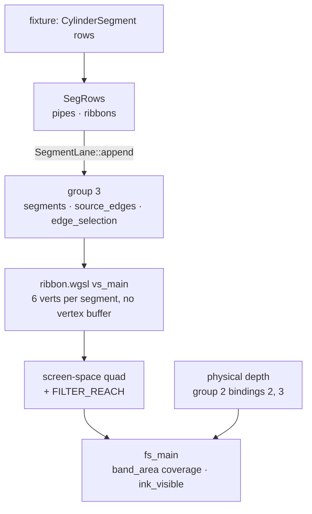
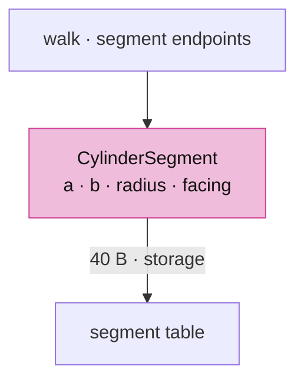
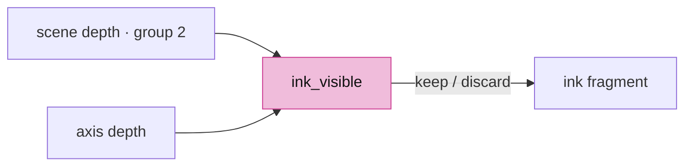
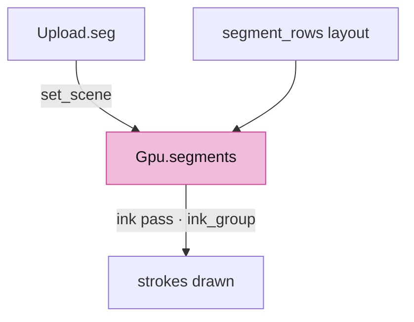

# 04b · Strokes

## You are building

Group 3 of the segment pipelines (`Layouts::segment_rows`):

| Binding | Rust buffer | WGSL |
|---|---|---|
| 0 | `SegTable.buf` 40-byte rows | `@group(3) @binding(0) var<storage, read> segments: array<CylinderSegment>` |
| 1 | `SegTable.ids` one `u32` per row | `@group(3) @binding(1) var<storage, read> source_edges: array<u32>` |
| 2 | `SegmentLane.selection` uniform | `@group(3) @binding(2) var<uniform> edge_selection: vec4<u32>` |

## Starting point

- Checkpoint 04a: one mesh drawn through the arena; the ink pass exists but draws nothing of its own.
- A stroke is a camera-facing quad per segment. The vertex stage pulls six vertices by index from the segment table; the fragment stage computes exact pixel coverage of a capsule and asks the physical depth whether the axis is visible.

## Step 1 · The segment row

- 40 bytes, ends as flat `f32`s: a `vec3` would pad the row to 48.
- `radius` 0 means the screen-constant pen; `facing` packs two face normals for the solid lane's back-edge cull.

<!-- file: 04b session_viewer/src/engine/gpu/segments.rs type lines=1-56 -->

## Step 2 · The lane

- Two tables of the same row: pipes (mesh edges, culled by facing) and ribbons (free linework, always drawn).

<!-- file: 04b session_viewer/src/engine/gpu/segments.rs type lines=57-115 -->

<!-- file: 04b session_viewer/src/engine/gpu/segments.rs type lines=116-180 -->

- Every draw is `RIBBON_VERTS * rows` vertices with no vertex buffer bound; the shader indexes the table.

<!-- file: 04b session_viewer/src/engine/gpu/segments.rs type lines=181-252 -->

- `DepthMode::Always` with blending: the shader decides visibility itself, so no hardware depth test can hide a stroke that lies on a surface.

<!-- file: 04b session_viewer/src/engine/gpu/segments.rs type lines=253-319 -->

<!-- file: 04b session_viewer/src/engine/gpu/segments.rs copy lines=320-350 -->

## Step 3 · The shared visibility rule

- Appended to every ink shader by `ink_module`. It compares the scene depth at the pixel with the axis depth.

<!-- file: 04b session_viewer/src/shaders/ink_visibility.wgsl type -->

## Step 4 · The ribbon shader

- Bindings and constants. `LineUniform` is the same block as `triangle.wgsl`.

<!-- file: 04b session_viewer/src/shaders/ribbon.wgsl type lines=1-58 -->

- `band_area` integrates the pixel box against the capsule exactly, so coverage cannot beat with the line's subpixel phase the way a distance ramp does.

<!-- file: 04b session_viewer/src/shaders/ribbon.wgsl type lines=59-134 -->

- Per-vertex outputs are flat: the half-width at each end goes down as two scalars and is resolved per pixel, because a per-vertex width is projective over a trapezoid.

<!-- file: 04b session_viewer/src/shaders/ribbon.wgsl type lines=135-191 -->

- Clip against the near plane before any divide; a hand divide behind the eye mirrors the point through the screen centre.

<!-- file: 04b session_viewer/src/shaders/ribbon.wgsl type lines=192-271 -->

- The fragment: coverage times fade, then `ink_visible` at the closest axis point. `fs_id` and `fs_edge_id` write `(row + 1, segment + 1)` for picking.

<!-- file: 04b session_viewer/src/shaders/ribbon.wgsl type lines=272-350 -->

<!-- check: 04b -->

## Step 5 · Wire the lane

- `ink_module` compiles a lane shader with the visibility rule appended.

<!-- file: 04b session_viewer/src/engine/pipelines/mod.rs type -->

<!-- file: 04b session_viewer/src/engine/pipelines/layouts.rs type -->

<!-- file: 04b session_viewer/src/engine/gpu/upload.rs type -->

- The ink pass binds group 2 through `objects.ink_group`, the variant that carries the physical depth.

<!-- file: 04b session_viewer/src/engine/gpu/mod.rs type -->

- A second object row with a three-segment polyline.

<!-- file: 04b session_viewer/src/fixture.rs copy -->

<!-- file: 04b session_viewer/src/lib.rs type -->

<!-- file: 04b session_viewer/index.html copy -->

## Check

<!-- checkpoint: 04b -->

Expected:

- The blue triangle plus a thin yellow polyline to its right.
- Status reads **Checkpoint 04b · 2 objects**.
- Zoom in: the line keeps its on-screen width.

## What changed

<!-- tree: 04b session_viewer/src/engine -->

- Data flow: `SegRows` → `SegTable` buffers → group 3 → `ribbon.wgsl` → blended ink over the face pass's depth.

**Production equivalent:** `src/engine/gpu/segments.rs`, `src/shaders/ribbon.wgsl`. Production keeps the visibility rule in `src/shaders/ink_visibility.wgsl`.

## Try

- Append `?thickness=4` to the URL: every stroke widens on screen while the geometry stays put, because the pen is applied in `ribbon.wgsl`, not in the vertex data.
- Zoom far out: the strokes keep their pixel width. A world-space width would vanish; a screen-space pen does not.
- Set `aa=0.5` and compare an edge-on stroke with `aa=2`: the antialiasing ramp is the only thing that changed.

## Next

[04c · Markers](04c-markers.md): vertex markers on a quad template and free dots as SDF triangles.
