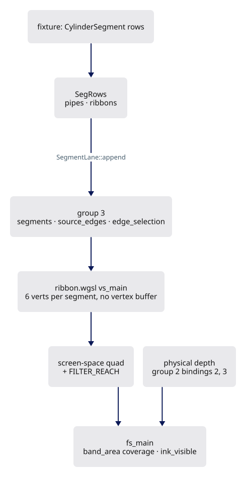
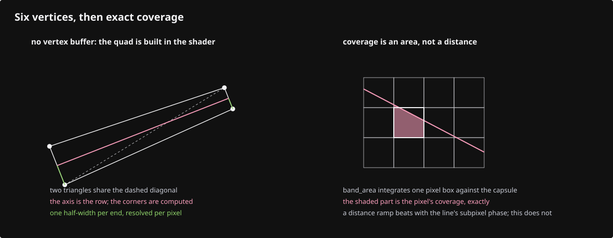
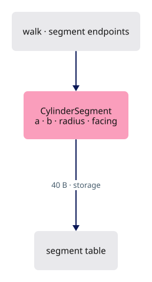
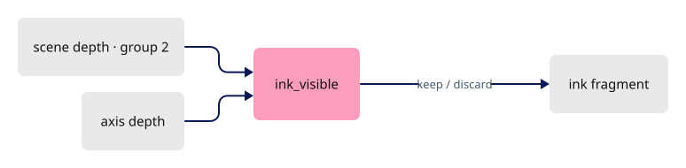
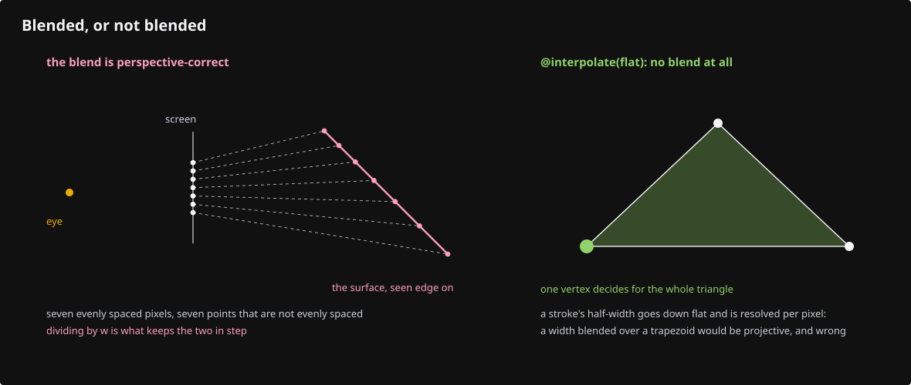
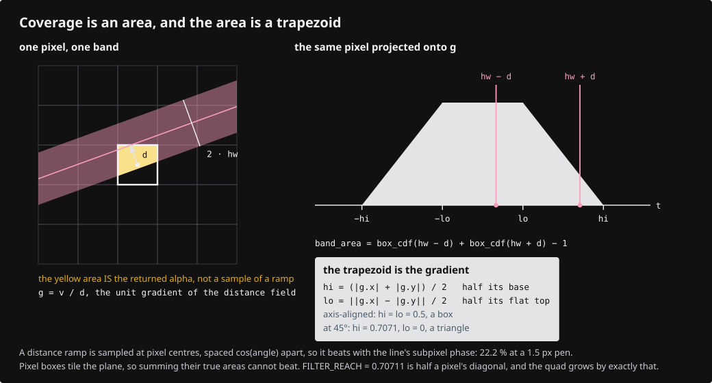
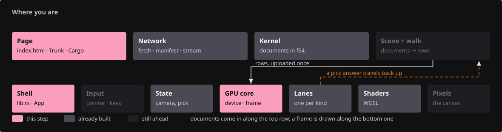
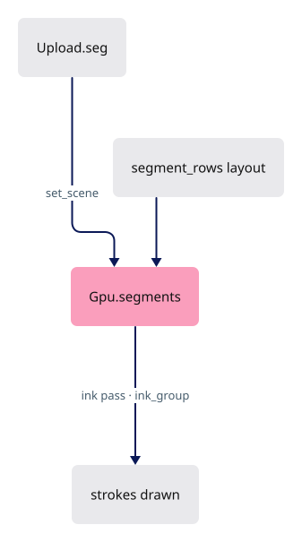
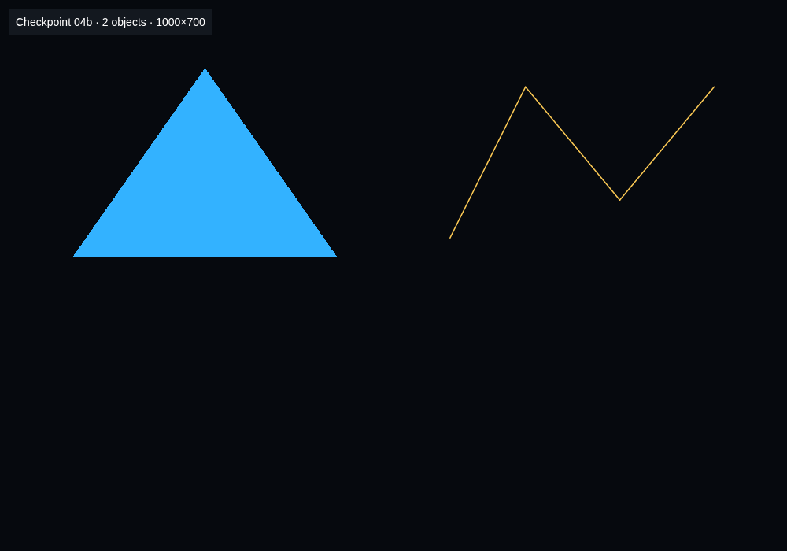

# 04b · Strokes

## You are building

Group 3 of the segment pipelines (`Layouts::segment_rows`):

| Binding | Rust buffer | WGSL |
|---|---|---|
| 0 | `SegTable.buf` 40-byte rows | `@group(3) @binding(0) var<storage, read> segments: array<CylinderSegment>` |
| 1 | `SegTable.ids` one `u32` per row | `@group(3) @binding(1) var<storage, read> source_edges: array<u32>` |
| 2 | `SegmentLane.selection` uniform | `@group(3) @binding(2) var<uniform> edge_selection: vec4<u32>` |

## Starting point

- Checkpoint 04a: one mesh drawn through the arena; the ink pass exists but draws nothing of its own.
- A stroke is a camera-facing quad per segment.
- The vertex stage pulls six vertices by index from the segment table.
- The fragment stage computes exact pixel coverage of a capsule, then asks the physical depth whether the axis is visible.

<!-- step-status: start -->

**Does it compile yet?** Yes — `cargo check` was run at the end of every step of this lesson.

<!-- step-status: end -->

## Step 1 · The segment row

{ .locator data-strip="illustrations/strip-445a1edf20.svg" }

- `radius` 0 means the screen-constant pen; `facing` packs two face normals for the solid lane's back-edge cull.

<!-- file: 04b session_viewer/src/engine/gpu/segments.rs type lines=1-56 -->

## Step 2 · The lane

{ .locator data-strip="illustrations/strip-445a1edf20.svg" }

- Two tables of the same row: pipes (mesh edges, culled by facing) and ribbons (free linework, always drawn).

<!-- file: 04b session_viewer/src/engine/gpu/segments.rs type lines=57-115 -->

<!-- file: 04b session_viewer/src/engine/gpu/segments.rs type lines=116-180 -->

- Every draw is `RIBBON_VERTS * rows` vertices with no vertex buffer bound; the shader indexes the table.

<!-- file: 04b session_viewer/src/engine/gpu/segments.rs type lines=181-240 -->

- The lane reports whether it holds any solid rows: 4x is spent only when hard edges exist on the GPU, and only if the canvas fits the adapter's budget.

<!-- file: 04b session_viewer/src/engine/gpu/segments.rs type lines=241-252 -->

- `DepthMode::Always` with blending: the shader decides visibility itself, so no hardware depth test can hide a stroke that lies on a surface.

<!-- file: 04b session_viewer/src/engine/gpu/segments.rs type lines=253-275 -->

<!-- file: 04b session_viewer/src/engine/gpu/segments.rs copy lines=276-314 -->

## Step 3 · The shared visibility rule

{ .locator data-strip="illustrations/strip-ef21ae124d.svg" }

- Appended to every ink shader by `ink_module`. It compares the scene depth at the pixel with the axis depth.

<!-- file: 04b session_viewer/src/shaders/ink_visibility.wgsl type -->

## Step 4 · The ribbon shader

{ .locator data-strip="illustrations/strip-ef21ae124d.svg" }

- Bindings and constants. `LineUniform` is the same block as `triangle.wgsl`.

<!-- file: 04b session_viewer/src/shaders/ribbon.wgsl type lines=1-4 -->

<!-- file: 04b session_viewer/src/shaders/ribbon.wgsl type lines=5-17 -->

- The two half-widths travel flat, one scalar per end, and resolve per pixel, because a per-vertex width is projective over a trapezoid.

<!-- file: 04b session_viewer/src/shaders/ribbon.wgsl type lines=18-25 -->

- Clip against the near plane before any divide; a hand divide behind the eye mirrors the point through the screen centre.

<!-- file: 04b session_viewer/src/shaders/ribbon.wgsl type lines=26-93 -->

- The fragment: coverage times fade, then `ink_visible` at the closest axis point.

<!-- file: 04b session_viewer/src/shaders/ribbon.wgsl type lines=94-140 -->

- `band_area` integrates the pixel box against the capsule instead of sampling a distance: the figure above is that integral.

<!-- file: 04b session_viewer/src/shaders/ribbon.wgsl type lines=141-190 -->

- The ID entries write `(row + 1, segment + 1)`; a tag bit in the segment half tells a picked ribbon from a picked face in the same channel.

<!-- file: 04b session_viewer/src/shaders/ribbon.wgsl type lines=191-293 -->

<!-- check: 04b -->

## Step 5 · Wire the lane

{ .locator data-strip="illustrations/strip-20ba8a8ce6.svg" }

- `ink_module` compiles a lane shader with the visibility rule appended.

<!-- file: 04b session_viewer/src/engine/pipelines/mod.rs type -->

<!-- file: 04b session_viewer/src/engine/pipelines/layouts.rs type -->

- Every layout is built once per device and lives here, so a group number is decided in one file.

<!-- file: 04b session_viewer/src/engine/gpu/upload.rs type -->

- The ink pass binds group 2 through `objects.ink_group`, the variant that carries the physical depth.

<!-- file: 04b session_viewer/src/engine/gpu/mod.rs type -->

- A second object row with a three-segment polyline.

<!-- file: 04b session_viewer/src/fixture.rs copy -->

<!-- file: 04b session_viewer/src/lib.rs type -->

- The shell's only change is the status line: every lane reports its own count, and the checkpoint test reads that JSON, not a screenshot.

<!-- file: 04b session_viewer/index.html copy -->

## Check

<!-- checkpoint: 04b -->

Expected:

- The blue triangle plus a thin yellow polyline to its right.
- Status reads **Checkpoint 04b · 2 objects**.
- Zoom in: the line keeps its on-screen width.

## What changed

<!-- tree: 04b session_viewer/src/engine -->

- Data flow: `SegRows` → `SegTable` buffers → group 3 → `ribbon.wgsl` → blended ink over the face pass's depth.

**Production equivalent:** `src/engine/gpu/segments.rs`, `src/shaders/ribbon.wgsl`. Production keeps the visibility rule in `src/shaders/ink_visibility.wgsl`.

## Try

- Append `?thickness=4`: every stroke widens on screen while the geometry stays put — the pen is applied in `ribbon.wgsl`, not in the vertex data.
- Zoom far out: the strokes keep their pixel width. A world-space width would vanish; a screen-space pen does not.
- Set `?thickness=0.2`: `floor_hairline` holds the stroke at half a pixel and `hairline_fade` floors its alpha at `HAIRLINE_MIN_ALPHA`, so it thins instead of disappearing. (`?aa=` feathers markers and dots, not ribbons — `ribbon.wgsl` never reads `line.feather`.)

## Questions and answers

**The segment row ends in flat `f32`s instead of two `vec3`s. What would the `vec3`s cost?**

*How to work it out.* Apply lesson 03's alignment rule: a `vec3` holds 12 bytes but aligns to 16. Count the row both ways, then ask what the `vec3` form buys when the shader reads the components individually anyway.

*The answer.* Eight bytes a row, 40 to 48, for no benefit. Predicting this rather than discovering it is the point: the same rule set `Instance` at 96 and will set the marker row at 48.

**Strokes draw with `DepthMode::Always` and blending. Why not simply depth-test them?**

*How to work it out.* A stroke sits on the edge of its own face, at that face's depth. A depth test between two fragments at the same depth is a per-pixel coin flip decided by float rounding, and it changes as the camera moves.

*The answer.* Hardware depth testing at equal depth produces stitching, so the shader decides visibility itself: `ink_visible` compares the scene depth at the pixel against the depth of the closest point on the stroke's axis, read straight out of the depth the face pass wrote. One shared file keeps every ink lane answering the question the same way.

**The half-width at each end travels as a flat scalar, resolved per pixel. What breaks if you interpolate a width per vertex instead?**

*How to work it out.* A stroke going away from the camera is a trapezoid on screen, wide near, narrow far. Interpolation across it is perspective-correct for *positions*, but a width is not a position — it is a screen-space quantity derived from one.

*The answer.* The width comes out wrong in the middle and wobbles as the camera moves. Sending both ends flat and computing the width per pixel is exact — hence `@interpolate(flat)` on the outputs.

**Why must the segment be clipped against the near plane before any divide?**

*How to work it out.* Write out the divide: `x/w`, `y/w`. When `w` is negative both signs flip, so the point appears mirrored through the screen centre instead of absent.

*The answer.* A line crossing behind the eye would swing across the canvas rather than disappear. Clip first, divide second: the bug otherwise appears only when you walk the camera into geometry.

**What you should be able to do now**

Say in two sentences why a stroke keeps its pixel width when you zoom out, and where that decision is applied. Correct: the vertex stage expands the segment into a quad whose half-width is computed in *screen* space from `line.thickness`, so world distance never enters it — the pen is applied in `ribbon.wgsl`, not in the vertex data. Then predict the CPU alternative: rebuilding and re-uploading the geometry on every camera move.

## Next

[04c · Markers](04c-markers.md): vertex markers on a quad template and free dots as SDF triangles.
