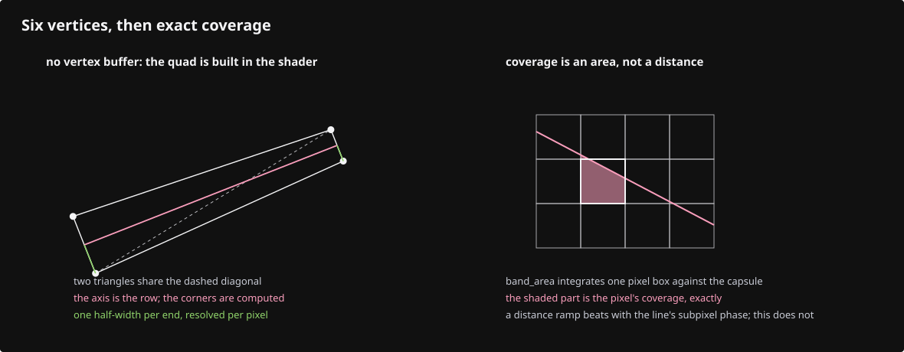

# 04b · Strokes and arrows

**Estimated study time: about 35–70 hours.** Includes reading, typing, tracing, testing and experiments. [How to use this estimate](map.md#time-estimates).

**This section:** Draw readable strokes and arrows with width and visibility rules.

**In the whole viewer:** Strokes add readable edges and curves to the surfaces already drawn. Their depth decisions must agree with those surfaces.

**Follow the data:** Curve samples → segment records → screen-space coverage → depth-tested ink.

**Start with these files:** [`src/engine/gpu/segments.rs`](04b-strokes.md#code-04b-039).

**Aim to explain:** Why can a thick edge disappear when compared only with the depth at a neighbouring pixel?

[Whole-viewer map and course milestones](map.md)

A mathematical line has no thickness, so we draw a narrow strip around it. Some widths describe a real object, such as a cable radius in millimetres. Others describe a pen width in screen pixels. These two widths should respond differently when the camera moves.



Start from the working result of [step 04a](04a-meshes.md).

**One buildable step:** type the additions below in `workspace/handwritten`, then build and test. This step adds 3,168 lines across 13 files and may take several sittings. Individual listings are parts of this step, not separate build checkpoints.

<span id="code-04b-001"></span>

## `src/engine/gpu/lane.rs`

Insert **after line 87** of your current file.

Keep these preceding lines:

```rust
// A registry is a list later lessons add lines to: a new lane is one file plus one line here.
// It holds `fn` pointers, so nothing is built until Gpu::build calls `make`; it starts empty.
/// Lanes that live only behind the `Lane` hooks. Adding one means one file and one line here.
pub const REGISTRY: &[Registered] = &[
```

Keep these following lines:

```rust
];

/// How many lanes are registered.
pub const REGISTERED: usize = REGISTRY.len();
```

Type these new lines:

```rust
--8<-- "typing/code/04b-001.rs"
```

<span id="code-04b-002"></span>

## `src/engine/gpu/mod.rs`

Insert **after line 18** of your current file.

Keep these preceding lines:

```rust
pub mod pass; // register:pass
pub(crate) mod patch; // register:patch
pub mod present; // register:present
pub mod render; // register:render
```

Keep these following lines:

```rust
pub mod targets; // register:targets
pub mod text_outline; // register:text_outline
mod triangle_tiles; // register:triangle_tiles
pub mod upload; // register:upload
```

Type these new lines:

```rust
--8<-- "typing/code/04b-002.rs"
```

<span id="code-04b-003"></span>

## `src/engine/gpu/mod.rs`

Insert **after line 23** of your current file.

Keep these preceding lines:

```rust
pub mod targets; // register:targets
pub mod text_outline; // register:text_outline
mod triangle_tiles; // register:triangle_tiles
pub mod upload; // register:upload
```

Keep these following lines:

```rust
pub mod view; // register:view

use crate::engine::performance::Performance;
use crate::engine::pipelines::{Layouts, Target};
```

Type these new lines:

```rust
--8<-- "typing/code/04b-003.rs"
```

<span id="code-04b-004"></span>

## `src/engine/gpu/mod.rs`

Insert **after line 36** of your current file.

Keep these preceding lines:

```rust
use buffers::GpuCtx;
use device::DeviceSetup;
use frame::FrameUniforms;
use lane::{Lane, RowLane};
```

Keep these following lines:

```rust
use objects::InstanceTable;
use pass::Pass;
use targets::Targets;
```

Type these new lines:

```rust
--8<-- "typing/code/04b-004.rs"
```

<span id="code-04b-005"></span>

## `src/engine/gpu/mod.rs`

Insert **after line 39** of your current file.

Keep these preceding lines:

```rust
use lane::{Lane, RowLane};
use objects::InkScene; // register:ink
use objects::InstanceTable;
use pass::Pass;
```

Keep these following lines:

```rust
use targets::Targets;

pub use frame::FrameInput;
pub use instance::Instance;
```

Type these new lines:

```rust
--8<-- "typing/code/04b-005.rs"
```

<span id="code-04b-006"></span>

## `src/engine/gpu/mod.rs`

Insert **after line 45** of your current file.

Keep these preceding lines:

```rust

pub use frame::FrameInput;
pub use instance::Instance;
pub use objects::{ObjectRow, Rebase};
```

Keep these following lines:

```rust
pub use upload::Upload;
pub use view::View;

/// Everything on the GPU: the device, the frame and one field per lane.
```

Type these new lines:

```rust
--8<-- "typing/code/04b-006.rs"
```

<span id="code-04b-007"></span>

## `src/engine/gpu/mod.rs`

Insert **after line 61** of your current file.

Keep these preceding lines:

```rust
    pub view: View,                              // display settings
    pub objects: InstanceTable,                  // one row per object
    pub backdrop: BackdropLane,                  // background and grid
    pub arena: ArenaLane,                        // meshes; register:meshes
```

Keep these following lines:

```rust
    pub selection_revision: u64,                 // bumps on every selection change
    pub logical_size: [f64; 2],                  // canvas size in CSS pixels
    registered: Vec<Box<dyn RowLane>>,           // lanes from lane::REGISTRY
    passes: Vec<Box<dyn Pass>>,                  // passes from pass::PASSES, in frame order
```

Type these new lines:

```rust
--8<-- "typing/code/04b-007.rs"
```

<span id="code-04b-008"></span>

## `src/engine/gpu/mod.rs`

Insert **after line 82** of your current file.

Keep these preceding lines:

```rust
            frame,             // register:frame
            objects,
            backdrop,          // register:backdrop
            arena,             // register:meshes
```

Keep these following lines:

```rust
        )
    };
}
```

Type these new lines:

```rust
--8<-- "typing/code/04b-008.rs"
```

<span id="code-04b-009"></span>

## `src/engine/gpu/mod.rs`

Insert **after line 165** of your current file.

Keep these preceding lines:

```rust
        let targets = Targets::new(&ctx, size, config.format, target.samples);
        let arena = ArenaLane::new(&ctx, &layouts, target); // register:meshes
        let objects = InstanceTable::new(&ctx, &layouts);
        let backdrop = BackdropLane::new(&ctx, &layouts, target);
```

Keep these following lines:

```rust
        // each registered lane builds itself through its `make` function
        let registered = lane::REGISTRY
            .iter()
            .map(|lane| (lane.make)(&ctx, &layouts, target))
```

Type these new lines:

```rust
--8<-- "typing/code/04b-009.rs"
```

<span id="code-04b-010"></span>

## `src/engine/gpu/mod.rs`

Insert **after line 191** of your current file.

Keep these preceding lines:

```rust
            view: View::from_env(),
            objects,
            backdrop,
            arena,       // register:meshes
```

Keep these following lines:

```rust
            selection_revision: 0,
            logical_size: [size.0 as f64, size.1 as f64],
            registered,
            passes,
```

Type these new lines:

```rust
--8<-- "typing/code/04b-010.rs"
```

<span id="code-04b-011"></span>

## `src/engine/gpu/mod.rs`

Insert **after line 202** of your current file.

Keep these preceding lines:

```rust
            bounds: AABB::empty(),
            device_type,
            failure,
        };
```

Keep these following lines:

```rust
        Ok(gpu)
    }

    /// Append one upload to every lane.
```

Type these new lines:

```rust
--8<-- "typing/code/04b-011.rs"
```

<span id="code-04b-012"></span>

## `src/engine/gpu/mod.rs`

Insert **after line 210** of your current file.

Keep these preceding lines:

```rust
    /// Append one upload to every lane.
    pub fn set_scene(&mut self, up: &Upload) {
        self.objects.append(&self.ctx, &self.layouts, &up.obj);
        self.arena.append(&self.ctx, &up.arena); // register:meshes
```

Keep these following lines:

```rust
        for lane in &mut self.registered {
            lane.on_append(&self.ctx, &self.layouts, up);
        }
```

Type these new lines:

```rust
--8<-- "typing/code/04b-012.rs"
```

<span id="code-04b-013"></span>

## `src/engine/gpu/mod.rs`

Insert **after line 217** of your current file.

Keep these preceding lines:

```rust
        }

        self.bounds.union_with(&up.bounds);
        self.retarget(false);
```

Keep these following lines:

```rust
    }

    /// Current color format and sample count.
    pub(super) fn target(&self) -> Target {
```

Type these new lines:

```rust
--8<-- "typing/code/04b-013.rs"
```

<span id="code-04b-014"></span>

## `src/engine/gpu/mod.rs`

Insert **after line 241** of your current file.

Keep these preceding lines:

```rust
                (self.config.width, self.config.height),
                self.config.format,
                samples,
            );
```

Keep these following lines:

```rust
        }

        if flip {
            self.rebuild_pipelines();
```

Type these new lines:

```rust
--8<-- "typing/code/04b-014.rs"
```

<span id="code-04b-015"></span>

## `src/engine/gpu/mod.rs`

Insert **after line 281** of your current file.

Keep these preceding lines:

```rust
    fn msaa_now(&self) -> u32 {
        let mut solid = false;
        solid |= self.live_faces() > 0; // register:meshes
        solid |= self.live_sheet() > 0; // register:meshes
```

Keep these following lines:

```rust
        Targets::samples_for(
            solid,
            self.config.width * self.config.height,
            self.view.msaa_forced,
```

Type these new lines:

```rust
--8<-- "typing/code/04b-015.rs"
```

<span id="code-04b-016"></span>

## `src/engine/gpu/mod.rs`

Insert **after line 319** of your current file.

Keep these preceding lines:

```rust
        }
        for pass in &mut self.passes {
            pass.on_reset(ctx);
        }
```

Keep these following lines:

```rust
        self.bounds = AABB::empty();
        self.dead = patch::Counts::default(); // register:patch
    }
```

Type these new lines:

```rust
--8<-- "typing/code/04b-016.rs"
```

<span id="code-04b-017"></span>

## `src/engine/gpu/mod.rs`

Insert **after line 337** of your current file.

Keep these preceding lines:

```rust
        }
        for pass in &mut self.passes {
            pass.on_release(ctx, layouts);
        }
```

Keep these following lines:

```rust
        self.bounds = AABB::empty();
        self.dead = patch::Counts::default(); // register:patch
        self.retarget(false);
    }
```

Type these new lines:

```rust
--8<-- "typing/code/04b-017.rs"
```

<span id="code-04b-018"></span>

## `src/engine/gpu/mod.rs`

Insert **after line 341** of your current file.

Keep these preceding lines:

```rust
        self.segments.set_edge(&self.ctx, None); // register:strokes
        self.bounds = AABB::empty();
        self.dead = patch::Counts::default(); // register:patch
        self.retarget(false);
```

Keep these following lines:

```rust
    }
}

/// Every lane's shader sources, for the tests.
```

Type these new lines:

```rust
--8<-- "typing/code/04b-018.rs"
```

<span id="code-04b-019"></span>

## `src/engine/gpu/mod.rs`

Insert **after line 351** of your current file.

Keep these preceding lines:

```rust
pub(crate) fn lane_shaders() -> Vec<(&'static str, &'static str)> {
    let mut out = Vec::new();
    out.extend_from_slice(backdrop::SHADERS);
    out.extend_from_slice(arena::SHADERS); // register:meshes
```

Keep these following lines:

```rust
    out
}

impl Gpu {
```

Type these new lines:

```rust
--8<-- "typing/code/04b-019.rs"
```

<span id="code-04b-020"></span>

## `src/engine/gpu/mod.rs`

Insert **after line 385** of your current file.

Keep these preceding lines:

```rust
    // Every edit below writes one 96-byte row and never the geometry: selecting a mesh of a million triangles is one small write.
    /// Select or deselect object `row`.
    pub fn set_selected(&mut self, row: u32, on: bool) {
        self.selection_revision = self.selection_revision.wrapping_add(1);
```

Keep these following lines:

```rust
        for pass in &mut self.passes {
            pass.on_select(row, on);
        }
        self.objects
```

Type these new lines:

```rust
--8<-- "typing/code/04b-020.rs"
```

<span id="code-04b-021"></span>

## `src/engine/gpu/mod.rs`

Insert **after line 422** of your current file.

Keep these preceding lines:

```rust

    /// Overwrite one object's rows in every editable lane, from the rows `at`.
    pub(crate) fn write_rows(&mut self, at: patch::Counts, up: &Upload) {
        self.arena.patch(&self.ctx, at, &up.arena);
```

Keep these following lines:

```rust

        for (i, lane) in self.registered.iter_mut().enumerate() {
            lane.write_at(&self.ctx, &self.layouts, at.lanes[i], up);
        }
```

Type these new lines:

```rust
--8<-- "typing/code/04b-021.rs"
```

<span id="code-04b-022"></span>

## `src/engine/gpu/mod.rs`

Insert **after line 443** of your current file.

Keep these preceding lines:

```rust
        match lane {
            LaneId::Verts | LaneId::Faces | LaneId::Print | LaneId::Text | LaneId::Sources => {
                self.arena.kill(&self.ctx, lane, first, count, sink)
            }
```

Keep these following lines:

```rust
            LaneId::Registered(i) => {
                self.registered[i as usize].kill(&self.ctx, first, count, sink)
            }
        }
```

Type these new lines:

```rust
--8<-- "typing/code/04b-022.rs"
```

<span id="code-04b-023"></span>

## `src/engine/gpu/mod.rs`

Insert **after line 470** of your current file.

Keep these preceding lines:

```rust
    pub(crate) fn release_editable(&mut self) {
        let ctx = &self.ctx;
        let layouts = &self.layouts;
        self.arena.release(ctx);
```

Keep these following lines:

```rust

        for lane in &mut self.registered {
            lane.on_release(ctx, layouts);
        }
```

Type these new lines:

```rust
--8<-- "typing/code/04b-023.rs"
```

<span id="code-04b-024"></span>

## `src/engine/gpu/mod.rs`

Insert **after line 478** of your current file.

Keep these preceding lines:

```rust
        }

        self.dead = patch::Counts::default(); // register:patch
        self.objects.geometry_changed();
```

Keep these following lines:

```rust
    }
}
```

Type these new lines:

```rust
--8<-- "typing/code/04b-024.rs"
```

<span id="code-04b-025"></span>

## `src/engine/gpu/mod.rs`

Append **after line 481** of your current file.

Blank lines before: **1**; after: **0**. End with a newline.

```rust
--8<-- "typing/code/04b-025.rs"
```

<span id="code-04b-026"></span>

## `src/engine/gpu/objects.rs`

Insert **after line 165** of your current file.

Keep these preceding lines:

```rust
    buffer: GrowBuf,                    // Instance rows on the GPU
    translations: GrowBuf,              // positions minus the scene origin, on the GPU
    last_rebase_ms: f64,                // when the origin last moved
    pub group: wgpu::BindGroup,         // group 2: rows and translations
```

Keep these following lines:

```rust
}

/// Bind group 2: rows at binding 0, translations at 1.
fn instance_group(
```

Type these new lines:

```rust
--8<-- "typing/code/04b-026.rs"
```

<span id="code-04b-027"></span>

## `src/engine/gpu/objects.rs`

Insert **after line 224** of your current file.

Keep these preceding lines:

```rust
            buffer,
            translations,
            last_rebase_ms: 0.0,
            group,
```

Keep these following lines:

```rust
        }
    }

    /// Append one upload's rows.
```

Type these new lines:

```rust
--8<-- "typing/code/04b-027.rs"
```

<span id="code-04b-028"></span>

## `src/engine/gpu/objects.rs`

Append **after line 1143** of your current file.

Blank lines before: **1**; after: **0**. End with a newline.

```rust
--8<-- "typing/code/04b-028.rs"
```

<span id="code-04b-029"></span>

## `src/engine/gpu/patch.rs`

Insert **after line 12** of your current file.

Keep these preceding lines:

```rust
    Faces,          // solid face indices; register:meshes
    Print,          // sheet fill indices; register:meshes
    Text,           // sheet lettering indices; register:meshes
    Sources,        // source faces; register:meshes
```

Keep these following lines:

```rust
    Registered(u8), // a lane of lane::REGISTRY
}

/// The fixed lanes, in table order.
```

Type these new lines:

```rust
--8<-- "typing/code/04b-029.rs"
```

<span id="code-04b-030"></span>

## `src/engine/gpu/patch.rs`

Insert **after line 24** of your current file.

Keep these preceding lines:

```rust
    LaneId::Faces,   // register:meshes
    LaneId::Print,   // register:meshes
    LaneId::Text,    // register:meshes
    LaneId::Sources, // register:meshes
```

Keep these following lines:

```rust
];

impl LaneId {
    /// Every lane, fixed ones first.
```

Type these new lines:

```rust
--8<-- "typing/code/04b-030.rs"
```

<span id="code-04b-031"></span>

## `src/engine/gpu/patch.rs`

Insert **after line 44** of your current file.

Keep these preceding lines:

```rust
            LaneId::Verts => 44,               // vertex plus its object row; register:meshes
            LaneId::Faces => 5,                // index plus a third of a face id; register:meshes
            LaneId::Print | LaneId::Text => 4, // register:meshes
            LaneId::Sources => 16,             // register:meshes
```

Keep these following lines:

```rust
            LaneId::Registered(i) => REGISTRY[i as usize].stride,
        }
    }
}
```

Type these new lines:

```rust
--8<-- "typing/code/04b-031.rs"
```

<span id="code-04b-032"></span>

## `src/engine/gpu/patch.rs`

Insert **after line 59** of your current file.

Keep these preceding lines:

```rust
    pub faces: u32,               // solid face indices; register:meshes
    pub print: u32,               // sheet fill indices; register:meshes
    pub text: u32,                // sheet lettering indices; register:meshes
    pub sources: u32,             // source faces; register:meshes
```

Keep these following lines:

```rust
    pub lanes: [u32; REGISTERED], // rows of each registered lane
}

impl Counts {
```

Type these new lines:

```rust
--8<-- "typing/code/04b-032.rs"
```

<span id="code-04b-033"></span>

## `src/engine/gpu/patch.rs`

Insert **after line 79** of your current file.

Keep these preceding lines:

```rust
            faces: up.arena.idx.len() as u32,            // register:meshes
            print: up.arena.idx_print.len() as u32,      // register:meshes
            text: up.arena.idx_text.len() as u32,        // register:meshes
            sources: up.arena.face_sources.len() as u32, // register:meshes
```

Keep these following lines:

```rust
            lanes,
        }
    }
```

Type these new lines:

```rust
--8<-- "typing/code/04b-033.rs"
```

<span id="code-04b-034"></span>

## `src/engine/gpu/patch.rs`

Insert **after line 93** of your current file.

Keep these preceding lines:

```rust
            LaneId::Faces => self.faces,     // register:meshes
            LaneId::Print => self.print,     // register:meshes
            LaneId::Text => self.text,       // register:meshes
            LaneId::Sources => self.sources, // register:meshes
```

Keep these following lines:

```rust
            LaneId::Registered(i) => self.lanes[i as usize],
        }
    }
```

Type these new lines:

```rust
--8<-- "typing/code/04b-034.rs"
```

<span id="code-04b-035"></span>

## `src/engine/gpu/patch.rs`

Insert **after line 107** of your current file.

Keep these preceding lines:

```rust
            LaneId::Faces => &mut self.faces,     // register:meshes
            LaneId::Print => &mut self.print,     // register:meshes
            LaneId::Text => &mut self.text,       // register:meshes
            LaneId::Sources => &mut self.sources, // register:meshes
```

Keep these following lines:

```rust
            LaneId::Registered(i) => &mut self.lanes[i as usize],
        };
        *slot = value;
    }
```

Type these new lines:

```rust
--8<-- "typing/code/04b-035.rs"
```

<span id="code-04b-036"></span>

## `src/engine/gpu/present.rs`

Insert **after line 61** of your current file.

Keep these preceding lines:

```rust

        // startup marks; the GPU-side one also times the pipelines the first frames compiled
        let mut geometry = false;
        geometry |= self.live_faces() + self.live_sheet() > 0; // register:meshes
```

Keep these following lines:

```rust

        if let Some(done) = self.performance.mark_startup(geometry) {
            self.ctx
                .queue
```

Type these new lines:

```rust
--8<-- "typing/code/04b-036.rs"
```

<span id="code-04b-037"></span>

## `src/engine/gpu/render.rs`

Insert **after line 30** of your current file.

Keep these preceding lines:

```rust
        // pass 1: background, section caps, faces and clouds write depth
        let mut draws = self.face_passes(encoder, &frame);
        // pass 2: ambient occlusion and the outline masks, each pass in turn
        self.each_pass(|pass, g| draws += pass.after_faces(g, encoder, &frame));
```

Keep these following lines:

```rust
        (draws, self.objects.len())
    }

    /// The first pass: each pass's own face passes, then the one the faces draw in.
```

Type these new lines:

```rust
--8<-- "typing/code/04b-037.rs"
```

<span id="code-04b-038"></span>

## `src/engine/gpu/render.rs`

Append **after line 84** of your current file.

Blank lines before: **1**; after: **0**. End with a newline.

```rust
--8<-- "typing/code/04b-038.rs"
```

<span id="code-04b-039"></span>

## `src/engine/gpu/segments.rs`

A mathematical line has no width. The renderer expands a segment into covered screen samples so it remains readable. It still needs depth and object identity to behave like geometry rather than a flat overlay.

Create this file. Type the complete listing, including comments and blank lines.

```rust
--8<-- "typing/code/04b-039.rs"
```

<span id="code-04b-040"></span>

## `src/engine/gpu/upload.rs`

Insert **after line 8** of your current file.

Keep these preceding lines:

```rust
/// Everything one file adds to the GPU, collected on the CPU first, so the GPU sees one write per buffer.
pub struct Upload {
    pub obj: ObjectRows,
    pub arena: super::arena::ArenaRows,  // meshes; register:meshes
```

Keep these following lines:

```rust
    pub lanes: LaneRows,                 // rows of registered lanes, by type
    pub bounds: AABB,                    // world box: the camera fits to it
}
```

Type these new lines:

```rust
--8<-- "typing/code/04b-040.rs"
```

<span id="code-04b-041"></span>

## `src/engine/gpu/upload.rs`

Insert **after line 19** of your current file.

Keep these preceding lines:

```rust
    fn default() -> Self {
        Self {
            obj: ObjectRows::default(),
            arena: Default::default(), // register:meshes
```

Keep these following lines:

```rust
            lanes: LaneRows::default(),
            bounds: AABB::empty(),
        }
    }
```

Type these new lines:

```rust
--8<-- "typing/code/04b-041.rs"
```

<span id="code-04b-042"></span>

## `src/engine/gpu/upload.rs`

Insert **after line 31** of your current file.

Keep these preceding lines:

```rust
    /// Free the rows once the GPU holds them.
    pub fn drop_uploaded(&mut self) {
        drop_rows(&mut self.obj.rows);
        self.arena.drop_rows(); // register:meshes
```

Keep these following lines:

```rust
        self.lanes.clear();
        self.bounds = AABB::empty();
    }
```

Type these new lines:

```rust
--8<-- "typing/code/04b-042.rs"
```

<span id="code-04b-043"></span>

## `src/engine/gpu/upload.rs`

Insert **after line 40** of your current file.

Keep these preceding lines:

```rust
    /// Move `other`'s rows after these; its vertex 0 lands on vertex `vert_base`.
    /// `mut other: Upload` takes it by value: the caller gives it away, so its lists can be moved out.
    pub fn merge(&mut self, mut other: Upload, vert_base: u32) {
        self.merge_arena(&mut other, vert_base); // register:meshes
```

Keep these following lines:

```rust

        for lane in super::lane::REGISTRY {
            (lane.merge)(self, &mut other);
        }
```

Type these new lines:

```rust
--8<-- "typing/code/04b-043.rs"
```

<span id="code-04b-044"></span>

## `src/engine/gpu/vectors.rs`

An arrow combines a shaft and a head. Its direction sets an orientation, while size rules determine how it reads on screen. Degenerate directions need care because normalizing a zero-length vector is undefined.

Create this file. Type the complete listing, including comments and blank lines.

```rust
--8<-- "typing/code/04b-044.rs"
```

<span id="code-04b-045"></span>

## `src/engine/pipelines/mod.rs`

Append **after line 693** of your current file.

Blank lines before: **1**; after: **0**. End with a newline.

```rust
--8<-- "typing/code/04b-045.rs"
```

<span id="code-04b-046"></span>

## `src/shaders/ink_visibility.wgsl`

Create this file. Type the complete listing, including comments and blank lines.

```wgsl
--8<-- "typing/code/04b-046.wgsl"
```

<span id="code-04b-047"></span>

## `src/shaders/ribbon.wgsl`

Create this file. Type the complete listing, including comments and blank lines.

```wgsl
--8<-- "typing/code/04b-047.wgsl"
```

<span id="code-04b-048"></span>

## `src/shaders/vector.wgsl`

Create this file. Type the complete listing, including comments and blank lines.

```wgsl
--8<-- "typing/code/04b-048.wgsl"
```

## Check the completed chapter

From `session_viewer`, compare everything you have typed:

```sh
npm --prefix ../session_tests run course -- reference-check 04b
```

From `workspace/handwritten`:

```sh
cargo build --lib --locked -j4
cargo xtest --lib --locked -j4
```

Run the native tests. Follow the half-width result into the ribbon vertex shader and identify how it moves the two sides of the strip.

If widths change unexpectedly, first check whether the input radius means world units or the default screen pen. Do not adjust the visibility tolerance to repair a width error.

**Before moving on:** explain what changed, check the expected result above, and fix any build or test failure.

<details>
<summary>Check your explanation of the opening question</summary>

That pixel may lie on a different part of a sloping surface. Its depth is not necessarily the surface depth at the stroke’s axis.

</details>

[Next step: 04c](04c-markers.md)
