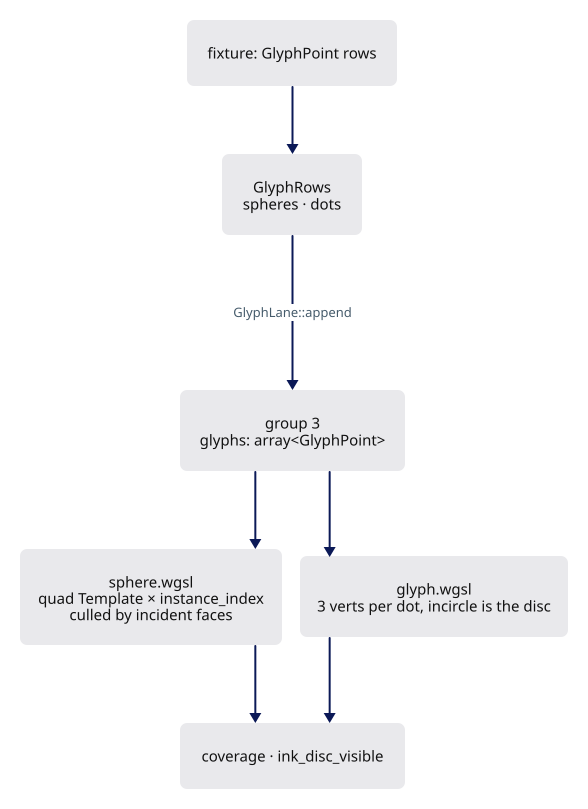
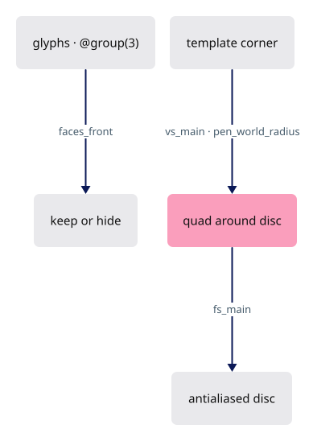
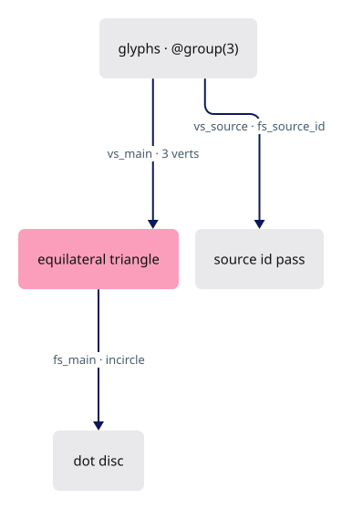
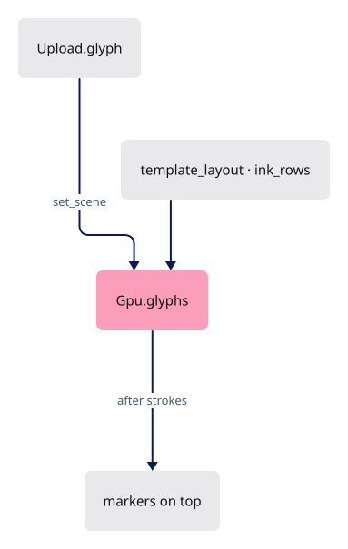

# 04c · Markers

## You are building

Vertex input of the marker pipeline (`pipelines::template_layout`):

| Slot | Rust | WGSL |
|---|---|---|
| 0 | `Template.vbo`, 12-byte positions, `step_mode: Vertex` | `@location(0) tmpl: vec3<f32>` |
| — | `draw_indexed(.., 0..spheres.len())` | `@builtin(instance_index) gi` selects the glyph row |

The dot pipeline binds no vertex buffer: `@builtin(vertex_index) / 3` is the row.

## Starting point

- Checkpoint 04b: meshes and strokes. Both ink lanes share the visibility rule appended by `ink_module`.
- Markers are the vertex-sized ink: mesh vertex markers (solid lane) and free points (flat lane), one 48-byte row for both.

<!-- step-status: start -->

**Does it compile yet?** Yes — `cargo check` was run at the end of every step of this lesson.

<!-- step-status: end -->

## Step 1 · The glyph row

{ .locator data-strip="illustrations/strip-445a1edf20.svg" }

- `facing` plus `facing_ext` hold up to six incident face normals as oct16 pairs; a marker hides when every incident face turns away.

<!-- file: 04c session_viewer/src/engine/gpu/glyphs.rs type lines=1-56 -->

## Step 2 · The lane

{ .locator data-strip="illustrations/strip-445a1edf20.svg" }

- One table per kind, one bind group each, two shader modules, five pipelines.

<!-- file: 04c session_viewer/src/engine/gpu/glyphs.rs type lines=57-100 -->

<!-- file: 04c session_viewer/src/engine/gpu/glyphs.rs type lines=101-153 -->

<!-- file: 04c session_viewer/src/engine/gpu/glyphs.rs type lines=154-212 -->

- Clearing keeps the capacity: a reload refills a buffer already the right size.

<!-- file: 04c session_viewer/src/engine/gpu/glyphs.rs type lines=213-238 -->

- `source_dot` serves streamed source queries; declaring it with the others keeps the lane from growing a second pipeline set.

<!-- file: 04c session_viewer/src/engine/gpu/glyphs.rs type lines=239-294 -->

<!-- file: 04c session_viewer/src/engine/gpu/glyphs.rs copy lines=295-321 -->

## Step 3 · Vertex markers

{ .locator data-strip="illustrations/strip-ef21ae124d.svg" }

- Same bindings as the ribbon shader, the row is `GlyphPoint`, `line` comes from `scene.wgsl` as always.
- A sphere sizes and culls against `vp_w`/`vp_h`, the attachment it is drawn into.

<!-- file: 04c session_viewer/src/shaders/sphere.wgsl type lines=1-2 -->

- `to_px` turns a world length into pixels; `screen_radius` goes the other way, expressing the pen as a world radius.; `faces_front` decodes the packed normals.

<!-- file: 04c session_viewer/src/shaders/sphere.wgsl type lines=3-3 -->

- The template corner is offset in clip space by the pixel radius plus half the feather, so the quad always contains the antialiased disc.

<!-- file: 04c session_viewer/src/shaders/sphere.wgsl type lines=4-16 -->

- The facing cull is skipped when the object is flagged inside or open, or when `line.opacity` is zero: in x-ray, a vertex on the far side of a cube is what you want to see.

<!-- file: 04c session_viewer/src/shaders/sphere.wgsl type lines=17-62 -->

- The antialiasing ramp is clamped to the ink it feathers; a pen thinner than the ramp would otherwise be drawn entirely out of fade and vanish at distance.

<!-- file: 04c session_viewer/src/shaders/sphere.wgsl type lines=63-153 -->

## Step 4 · Free dots

{ .locator data-strip="illustrations/strip-ef21ae124d.svg" }

- One equilateral triangle per dot; its incircle is the visible disc, so three vertices cover it without a template.

<!-- file: 04c session_viewer/src/shaders/glyph.wgsl type lines=1-2 -->

- A dot wider than the canvas is dropped before it is placed.
- The test reads `frame`, the canvas the scene was projected for, not `vp_w`/`vp_h`, the attachment.
- A large dot then survives a window-sized pass and stays pickable.

<!-- file: 04c session_viewer/src/shaders/glyph.wgsl type lines=3-13 -->

- `vs_source` and `fs_source_id` serve source-cloud queries.

<!-- file: 04c session_viewer/src/shaders/glyph.wgsl type lines=14-45 -->

- The fragment half is the same shape as the ribbon's: coverage first, then the shared visibility test.

<!-- file: 04c session_viewer/src/shaders/glyph.wgsl type lines=46-138 -->

<!-- check: 04c -->

## Step 5 · Wire the lane

{ .locator data-strip="illustrations/strip-20ba8a8ce6.svg" }

- A template vertex slot and the `ink_rows` layout (one storage buffer at group 3).

<!-- file: 04c session_viewer/src/engine/pipelines/mod.rs type -->

<!-- file: 04c session_viewer/src/engine/pipelines/layouts.rs type -->

- Group 2 has two variants; a marker takes the ink one, which carries the physical depth it must test itself against.

<!-- file: 04c session_viewer/src/engine/gpu/upload.rs type -->

- Markers draw after strokes so their full footprint stays on top of the edges they sit on.

<!-- file: 04c session_viewer/src/engine/gpu/mod.rs type -->

<!-- file: 04c session_viewer/src/fixture.rs copy -->

<!-- file: 04c session_viewer/src/lib.rs type -->

<!-- file: 04c session_viewer/index.html copy -->

## Check

<!-- checkpoint: 04c -->

Expected:

- Triangle, polyline, and one orange dot below the triangle.
- Status reads **Checkpoint 04c · 3 objects**.
- Zoom out: the dot shrinks with its world radius, then holds at half a pixel and fades instead of vanishing.

## What changed

<!-- tree: 04c session_viewer/src/engine -->

- Data flow: `GlyphRows` → `GlyphTable` → group 3 → `sphere.wgsl` (instanced template) or `glyph.wgsl` (vertex-pulled triangles).

**Production equivalent:** `src/engine/gpu/glyphs.rs`, `src/shaders/sphere.wgsl`, `src/shaders/glyph.wgsl`.

## Try

- Append `?nomarkers=1`: the vertex markers disappear, the strokes stay; markers are a separate lane with its own draw.
- Zoom out until the markers thin out: `spacing` in the object row lets the shader fade them once they would overlap.
- Give one `GlyphPoint` a larger radius in `fixture.rs`: only that dot grows, because size travels per point.

## Questions and answers

**A marker is a disc, but the pipeline draws a quad template. Why not draw a disc?**

*How to work it out.* Hardware fills triangles and nothing else. A disc is either many triangles approximating a circle, or a covering shape with a fragment test inside it. Price both: an N-gon costs N vertices and still shows corners when zoomed; a quad costs four and is exact.

*The answer.* Replace the clause with "pushed out in clip space by the pixel radius plus half the feather". NOTE: this clause sits on the same line as rewrite docs/04c-markers.md:222 above, and my replacement text for that rewrite carries the clause forward verbatim — apply this correction to whichever version of line 222 ends up in the file., so the quad always contains the antialiased disc, and the fragment stage decides what is inside. Cover with a simple shape, resolve with the fragment stage — the same pattern as strokes and dots.

**A free dot is one triangle, not a quad. What makes that enough?**

*How to work it out.* What is the smallest triangle containing a given circle? The equilateral one whose incircle is that circle. Three vertices instead of four, and no template buffer.

*The answer.* The incircle of an equilateral triangle is the disc, so three vertices cover it, and the row comes from `@builtin(vertex_index) / 3` with nothing bound. Slightly more wasted area per dot than a quad, far less per-vertex work — the right trade when there are millions of dots.

**The dot's too-big-to-draw test reads `frame`, while a sphere sizes itself against `vp_w`/`vp_h`. Why the difference?**

*How to work it out.* Ask which question each test answers. "Is this dot so large it is not worth drawing?" is about the picture the user is looking at. "How many pixels wide is this marker in the thing I am drawing into?" is about the attachment. In a colour frame those coincide; in the pick pass they do not.

*The answer.* A dot judged against the small pick window would be dropped there and silently become unpickable, so it is judged against `frame`, the canvas. A sphere genuinely needs the attachment it is being sized into, so it uses `vp_w`/`vp_h`. Two similar-looking numbers, two different questions.

**When is the facing cull skipped, and what would you see if it never were?**

*How to work it out.* The cull hides a vertex whose incident faces all point away. That is wrong when no face is in the way — the eye is inside the object, or the faces are not drawn at all.

*The answer.* It is skipped on three conditions: the object is flagged inside, the object is flagged open, or `line.opacity` is zero, which is x-ray. Without the skip, `P` would show back edges but no back vertices, because every far-side marker is culled by faces that are not even drawn.

**What you should be able to do now**

Predict where the radius sits in the 48-byte marker row before looking. Correct: `center` is a `vec3` so it aligns to 16 and leaves a 4-byte hole after it — the radius goes in that hole, which is why the row is 48 and not 52. 

## Next

[04d · Point clouds](04d-clouds.md): the cloud tables, the LOD walk, and the splat prelude that resolves into the face pass.
