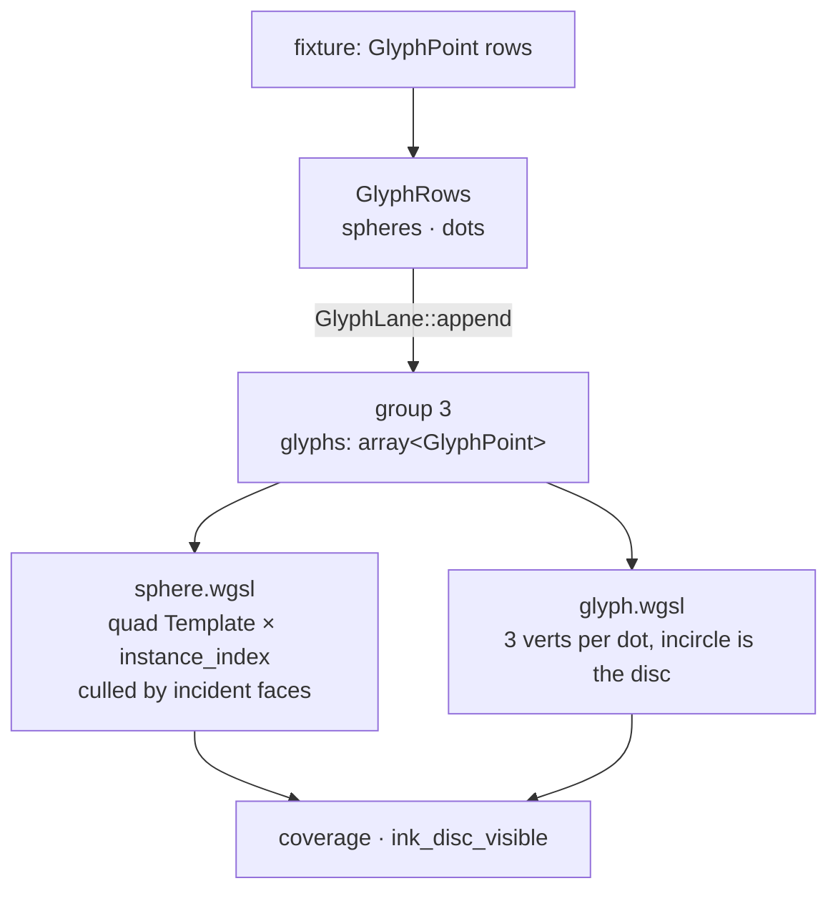
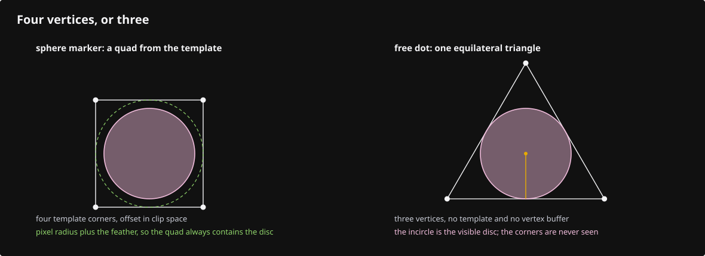
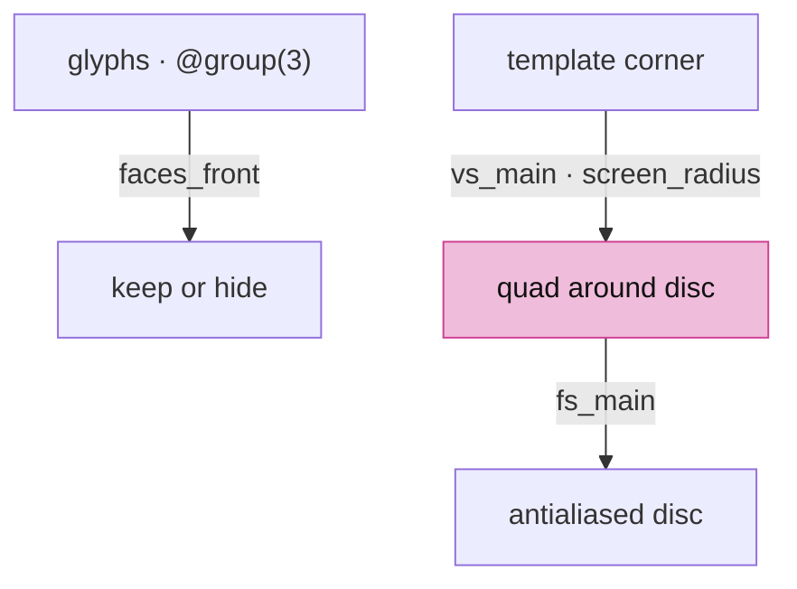
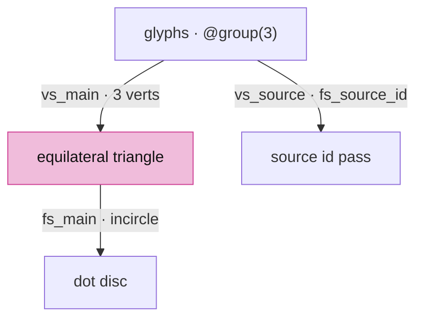
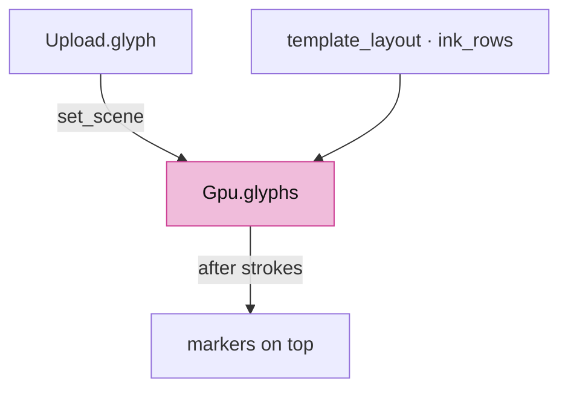
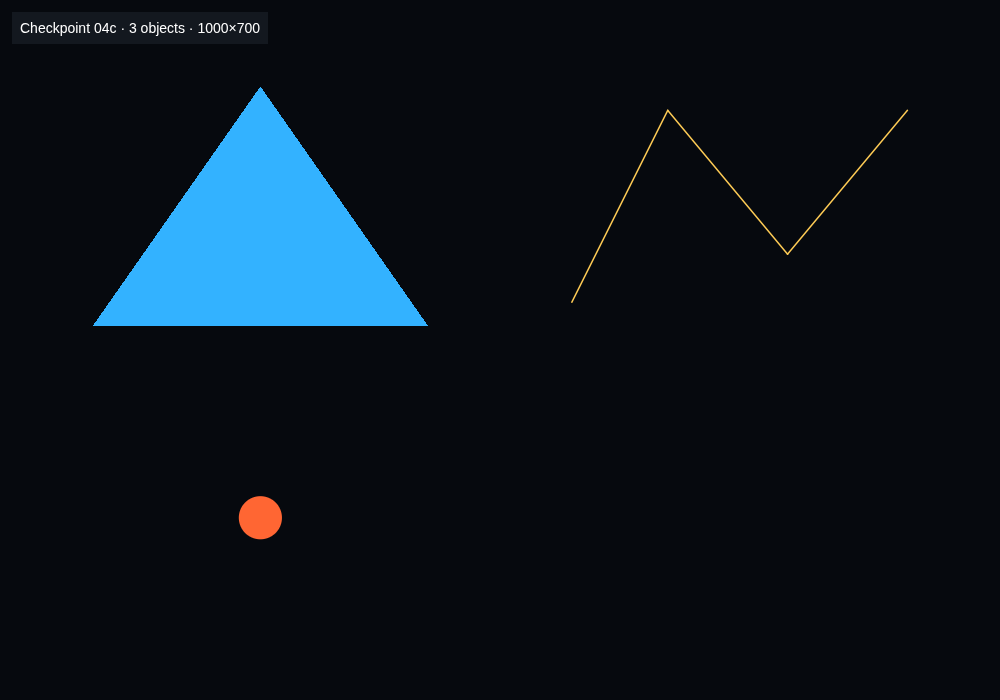

# 04c · Markers

## You are building

Vertex input of the marker pipeline (`pipelines::template_layout`):

| Slot | Rust | WGSL |
|---|---|---|
| 0 | `Template.vbo`, 12-byte positions, `step_mode: Vertex` | `@location(0) tmpl: vec3<f32>` |
| — | `draw_indexed(.., 0..spheres.len())` | `@builtin(instance_index) gi` selects the glyph row |

The dot pipeline binds no vertex buffer: `@builtin(vertex_index) / 3` is the row.

## Starting point

- Checkpoint 04b: meshes and strokes. Both ink lanes share the visibility rule appended by `ink_module`.
- Markers are the vertex-sized ink: mesh vertex markers (solid lane) and free points (flat lane), one 48-byte row for both.

## Step 1 · The glyph row

- `center` is a `vec3` in WGSL, so the row is 48 bytes with `radius` in the padding slot.
- `facing` plus `facing_ext` hold up to six incident face normals as oct16 pairs; a marker hides when every incident face turns away.

<!-- file: 04c session_viewer/src/engine/gpu/glyphs.rs type lines=1-56 -->

## Step 2 · The lane

- One table per kind, one bind group each, two shader modules, five pipelines.

<!-- file: 04c session_viewer/src/engine/gpu/glyphs.rs type lines=57-100 -->

<!-- file: 04c session_viewer/src/engine/gpu/glyphs.rs type lines=101-153 -->

- Markers draw the template `spheres.len()` times; dots draw `DOT_VERTS * dots.len()` vertices with no template.

<!-- file: 04c session_viewer/src/engine/gpu/glyphs.rs type lines=154-212 -->

- Clearing forgets the rows and keeps the capacity, the same bargain the arena makes: a reload refills a buffer that is already the right size.

<!-- file: 04c session_viewer/src/engine/gpu/glyphs.rs type lines=213-238 -->

- `source_dot` is the pipeline for streamed source queries; it is declared with the others so the lane never grows a second pipeline set.

<!-- file: 04c session_viewer/src/engine/gpu/glyphs.rs type lines=239-294 -->

<!-- file: 04c session_viewer/src/engine/gpu/glyphs.rs copy lines=295-321 -->

## Step 3 · Vertex markers

- Same bindings as the ribbon shader; the row is `GlyphPoint`. The `LineUniform` mirror lists the whole 80-byte block, `origin` and `frame` included; a sphere sizes and culls against `vp_w`/`vp_h`, the attachment it is drawn into.

<!-- file: 04c session_viewer/src/shaders/sphere.wgsl type lines=1-3 -->

- `screen_radius` and `to_px` turn a world or pen radius into pixels; `faces_front` decodes the packed normals.

<!-- file: 04c session_viewer/src/shaders/sphere.wgsl type lines=4-16 -->

- The template corner is offset in clip space by the pixel radius plus the feather, so the quad always contains the antialiased disc.

<!-- file: 04c session_viewer/src/shaders/sphere.wgsl type lines=17-62 -->

- The facing cull is skipped when the eye is inside the object and when `line.opacity` is zero: in x-ray a vertex on the far side of a cube is exactly what you want to see.

<!-- file: 04c session_viewer/src/shaders/sphere.wgsl type lines=63-124 -->

- The antialiasing ramp is clamped to the ink it feathers. A pen thinner than the ramp would otherwise be drawn entirely out of fade and disappear at distance.

<!-- file: 04c session_viewer/src/shaders/sphere.wgsl type lines=125-153 -->

## Step 4 · Free dots

- One equilateral triangle per dot; its incircle is the visible disc, so three vertices cover it without a template.

<!-- file: 04c session_viewer/src/shaders/glyph.wgsl type lines=1-6 -->

- A dot wider than the canvas is dropped before it is placed. The test reads `frame`, the canvas the scene was projected for, not `vp_w`/`vp_h`, the attachment: a large dot survives when the pass renders only a window of the canvas, so it stays pickable.

<!-- file: 04c session_viewer/src/shaders/glyph.wgsl type lines=7-38 -->

- The ramp never exceeds the ink it feathers; `vs_source` and `fs_source_id` serve source-cloud queries.

<!-- file: 04c session_viewer/src/shaders/glyph.wgsl type lines=39-96 -->

- The fragment half is the same shape as the ribbon's: coverage first, then the shared visibility test. Every ink lane answers the visibility question with the same function, which is why the rule lives in its own file.

<!-- file: 04c session_viewer/src/shaders/glyph.wgsl type lines=97-138 -->

<!-- check: 04c -->

## Step 5 · Wire the lane

- A template vertex slot and the `ink_rows` layout (one storage buffer at group 3).

<!-- file: 04c session_viewer/src/engine/pipelines/mod.rs type -->

<!-- file: 04c session_viewer/src/engine/pipelines/layouts.rs type -->

<!-- file: 04c session_viewer/src/engine/gpu/upload.rs type -->

- Markers draw after strokes so their full footprint stays on top of the edges they sit on.

<!-- file: 04c session_viewer/src/engine/gpu/mod.rs type -->

<!-- file: 04c session_viewer/src/fixture.rs copy -->

<!-- file: 04c session_viewer/src/lib.rs type -->

<!-- file: 04c session_viewer/index.html copy -->

## Check

<!-- checkpoint: 04c -->

Expected:

- Triangle, polyline, and one orange dot below the triangle.
- Status reads **Checkpoint 04c · 3 objects**.
- Zoom out: the dot shrinks with its world radius, then holds at the pen width.

## What changed

<!-- tree: 04c session_viewer/src/engine -->

- Data flow: `GlyphRows` → `GlyphTable` → group 3 → `sphere.wgsl` (instanced template) or `glyph.wgsl` (vertex-pulled triangles).

**Production equivalent:** `src/engine/gpu/glyphs.rs`, `src/shaders/sphere.wgsl`, `src/shaders/glyph.wgsl`.

## Try

- Append `?nomarkers=1`: the vertex markers disappear, the strokes stay; markers are a separate lane with its own draw.
- Zoom out until the markers thin out: `spacing` in the object row is what lets the shader fade them once they would overlap.
- Give one `GlyphPoint` a larger radius in `fixture.rs`: only that dot grows, because size travels per point.

## Questions and answers

**A marker is a disc, but the pipeline draws a quad template. Why not draw a disc?**

*How to work it out.* Ask what the hardware can fill: triangles, and nothing else. A disc has to be either many triangles approximating a circle, or a shape that covers the disc with a fragment test inside it. Then compare the costs: an N-gon costs N vertices and still has visible corners when zoomed; a quad costs four and is exact.

*The answer.* The four template corners are pushed out in clip space by the pixel radius plus the feather, so the quad always contains the antialiased disc, and the fragment stage decides what is inside. Cover with a simple shape, resolve with the fragment stage — the same pattern as strokes and dots.

**A free dot is one triangle, not a quad. What makes that enough?**

*How to work it out.* Ask what the smallest triangle containing a given circle is. That is the equilateral triangle whose inscribed circle is the disc — its incircle touches all three sides. Three vertices instead of four, and no template buffer.

*The answer.* The incircle of an equilateral triangle is the disc, so three vertices cover it, and the row comes from `@builtin(vertex_index) / 3` with nothing bound. Slightly more wasted area per dot than a quad, far less per-vertex work — the right trade when there are millions of dots.

**The dot's too-big-to-draw test reads `frame`, while a sphere sizes itself against `vp_w`/`vp_h`. Why the difference?**

*How to work it out.* For each test, ask which question it is answering. "Is this dot so large it is not worth drawing?" is a question about the picture the user is looking at. "How many pixels wide is this marker in the thing I am drawing into?" is a question about the attachment. In a colour frame those coincide; in the pick pass they do not.

*The answer.* A dot judged against the small pick window would be dropped there and silently become unpickable, so it is judged against `frame`, the canvas. A sphere genuinely needs the attachment it is being sized into, so it uses `vp_w`/`vp_h`. Two similar-looking numbers, two different questions.

**When is the facing cull skipped, and what would you see if it never were?**

*How to work it out.* The cull hides a vertex whose incident faces all point away. Ask when that is the wrong thing to do: when there is no face in the way — because the eye is inside the object, or because the faces are not being drawn at all.

*The answer.* It is skipped when the eye is inside the object and when `line.opacity` is zero, which is x-ray. Without the skip, `P` would show back edges but no back vertices, because every far-side marker is culled by faces that are not even drawn. One line of condition; its absence is a bug you would struggle to describe.

**What you should be able to do now**

Predict where the radius sits in the 48-byte marker row before looking. Correct: `center` is a `vec3` so it aligns to 16 and leaves a 4-byte hole after it — the radius goes in that hole, which is why the row is 48 and not 52. This is the third time the same alignment rule has decided a layout; by now you should be able to work it out rather than read it.

## Next

[04d · Point clouds](04d-clouds.md): the cloud tables, the LOD walk, and the splat prelude that resolves into the face pass.
