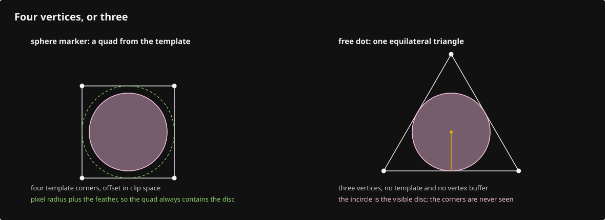

# 04c · Markers

**Estimated study time: about 7–15 hours.** Includes reading, typing, tracing, testing and experiments. [How to use this estimate](map.md#time-estimates).

**This section:** Render points and control markers with identifiable owners.

**In the whole viewer:** Markers make small positions visible and later provide targets for selecting original controls.

**Follow the data:** Source position and owner → marker row → screen-sized shape → visible marker.

**Start with these files:** [`src/engine/gpu/glyphs.rs`](04c-markers.md#code-04c-001).

**Aim to explain:** What is the difference between a marker’s display slot and its original control identity?

[Whole-viewer map and course milestones](map.md)

The GPU covers triangles, but a point marker should look round. We draw a small triangle around the marker and calculate how far each fragment lies from its centre. Fragments near the circle edge fade gradually. This avoids the staircase you would see with a hard inside-or-outside decision.



Start from the working result of [step 04b](04b-strokes.md).

**One buildable step:** type the additions below in `workspace/handwritten`, then build and test. This step adds 827 lines across 8 files and may take several sittings. Individual listings are parts of this step, not separate build checkpoints.

<span id="code-04c-001"></span>

## `src/engine/gpu/glyphs.rs`

A marker turns a single location into a visible shape. The location belongs to the model, while the marker shape helps a person see and select it. Separate its visual size from its geometric position.

Create this file. Type the complete listing, including comments and blank lines.

```rust
--8<-- "typing/code/04c-001.rs"
```

<span id="code-04c-002"></span>

## `src/engine/gpu/mod.rs`

Insert **after line 8** of your current file.

Keep these preceding lines:

```rust
pub mod buffers; // register:buffers
pub mod device; // register:device
pub mod faces; // register:faces
pub mod frame; // register:frame
```

Keep these following lines:

```rust
pub mod hull; // register:hull
pub mod instance; // register:instance
pub mod objects;
pub mod slots; // register:slots
```

Type these new lines:

```rust
--8<-- "typing/code/04c-002.rs"
```

<span id="code-04c-003"></span>

## `src/engine/gpu/mod.rs`

Insert **after line 36** of your current file.

Keep these preceding lines:

```rust
use backdrop::BackdropLane;
use buffers::GpuCtx;
use device::DeviceSetup;
use frame::FrameUniforms;
```

Keep these following lines:

```rust
use lane::{Lane, RowLane};
use objects::InkScene; // register:ink
use objects::InstanceTable;
use pass::Pass;
```

Type these new lines:

```rust
--8<-- "typing/code/04c-003.rs"
```

<span id="code-04c-004"></span>

## `src/engine/gpu/mod.rs`

Insert **after line 45** of your current file.

Keep these preceding lines:

```rust
use segments::SegmentLane; // register:strokes
use targets::Targets;

pub use frame::FrameInput;
```

Keep these following lines:

```rust
pub use instance::Instance;
pub use objects::{ObjectRow, Rebase};
pub use segments::CylinderSegment; // register:strokes
pub use upload::Upload;
```

Type these new lines:

```rust
--8<-- "typing/code/04c-004.rs"
```

<span id="code-04c-005"></span>

## `src/engine/gpu/mod.rs`

Insert **after line 65** of your current file.

Keep these preceding lines:

```rust
    pub objects: InstanceTable,                  // one row per object
    pub backdrop: BackdropLane,                  // background and grid
    pub arena: ArenaLane,                        // meshes; register:meshes
    pub segments: SegmentLane,                   // lines; register:strokes
```

Keep these following lines:

```rust
    pub selection_revision: u64,                 // bumps on every selection change
    pub logical_size: [f64; 2],                  // canvas size in CSS pixels
    registered: Vec<Box<dyn RowLane>>,           // lanes from lane::REGISTRY
    passes: Vec<Box<dyn Pass>>,                  // passes from pass::PASSES, in frame order
```

Type these new lines:

```rust
--8<-- "typing/code/04c-005.rs"
```

<span id="code-04c-006"></span>

## `src/engine/gpu/mod.rs`

Insert **after line 87** of your current file.

Keep these preceding lines:

```rust
            objects,
            backdrop,          // register:backdrop
            arena,             // register:meshes
            segments,          // register:strokes
```

Keep these following lines:

```rust
        )
    };
}
```

Type these new lines:

```rust
--8<-- "typing/code/04c-006.rs"
```

<span id="code-04c-007"></span>

## `src/engine/gpu/mod.rs`

Insert **after line 171** of your current file.

Keep these preceding lines:

```rust
        let arena = ArenaLane::new(&ctx, &layouts, target); // register:meshes
        let objects = InstanceTable::new(&ctx, &layouts);
        let backdrop = BackdropLane::new(&ctx, &layouts, target);
        let segments = SegmentLane::new(&ctx, &layouts, target); // register:strokes
```

Keep these following lines:

```rust
        // each registered lane builds itself through its `make` function
        let registered = lane::REGISTRY
            .iter()
            .map(|lane| (lane.make)(&ctx, &layouts, target))
```

Type these new lines:

```rust
--8<-- "typing/code/04c-007.rs"
```

<span id="code-04c-008"></span>

## `src/engine/gpu/mod.rs`

Insert **after line 198** of your current file.

Keep these preceding lines:

```rust
            objects,
            backdrop,
            arena,       // register:meshes
            segments,    // register:strokes
```

Keep these following lines:

```rust
            selection_revision: 0,
            logical_size: [size.0 as f64, size.1 as f64],
            registered,
            passes,
```

Type these new lines:

```rust
--8<-- "typing/code/04c-008.rs"
```

<span id="code-04c-009"></span>

## `src/engine/gpu/mod.rs`

Insert **after line 218** of your current file.

Keep these preceding lines:

```rust
    pub fn set_scene(&mut self, up: &Upload) {
        self.objects.append(&self.ctx, &self.layouts, &up.obj);
        self.arena.append(&self.ctx, &up.arena); // register:meshes
        self.segments.append(&self.ctx, &self.layouts, &up.seg); // register:strokes
```

Keep these following lines:

```rust
        for lane in &mut self.registered {
            lane.on_append(&self.ctx, &self.layouts, up);
        }
```

Type these new lines:

```rust
--8<-- "typing/code/04c-009.rs"
```

<span id="code-04c-010"></span>

## `src/engine/gpu/mod.rs`

Insert **after line 290** of your current file.

Keep these preceding lines:

```rust
        let mut solid = false;
        solid |= self.live_faces() > 0; // register:meshes
        solid |= self.live_sheet() > 0; // register:meshes
        solid |= self.live_pipes() > 0; // register:strokes
```

Keep these following lines:

```rust
        Targets::samples_for(
            solid,
            self.config.width * self.config.height,
            self.view.msaa_forced,
```

Type these new lines:

```rust
--8<-- "typing/code/04c-010.rs"
```

<span id="code-04c-011"></span>

## `src/engine/gpu/mod.rs`

Insert **after line 361** of your current file.

Keep these preceding lines:

```rust
    let mut out = Vec::new();
    out.extend_from_slice(backdrop::SHADERS);
    out.extend_from_slice(arena::SHADERS); // register:meshes
    out.extend_from_slice(segments::SHADERS); // register:strokes
```

Keep these following lines:

```rust
    out.extend_from_slice(vectors::SHADERS); // register:strokes
    out
}
```

Type these new lines:

```rust
--8<-- "typing/code/04c-011.rs"
```

<span id="code-04c-012"></span>

## `src/engine/gpu/mod.rs`

Insert **after line 433** of your current file.

Keep these preceding lines:

```rust
    /// Overwrite one object's rows in every editable lane, from the rows `at`.
    pub(crate) fn write_rows(&mut self, at: patch::Counts, up: &Upload) {
        self.arena.patch(&self.ctx, at, &up.arena);
        self.segments.patch(&self.ctx, at, &up.seg); // register:strokes
```

Keep these following lines:

```rust

        for (i, lane) in self.registered.iter_mut().enumerate() {
            lane.write_at(&self.ctx, &self.layouts, at.lanes[i], up);
        }
```

Type these new lines:

```rust
--8<-- "typing/code/04c-012.rs"
```

<span id="code-04c-013"></span>

## `src/engine/gpu/mod.rs`

Insert **after line 456** of your current file.

Keep these preceding lines:

```rust
                self.arena.kill(&self.ctx, lane, first, count, sink)
            }
            LaneId::Pipes => self.segments.kill(&self.ctx, lane, first, count, sink), // register:strokes
            LaneId::Ribbons => self.segments.kill(&self.ctx, lane, first, count, sink), // register:strokes
```

Keep these following lines:

```rust
            LaneId::Registered(i) => {
                self.registered[i as usize].kill(&self.ctx, first, count, sink)
            }
        }
```

Type these new lines:

```rust
--8<-- "typing/code/04c-013.rs"
```

<span id="code-04c-014"></span>

## `src/engine/gpu/mod.rs`

Insert **after line 484** of your current file.

Keep these preceding lines:

```rust
        let ctx = &self.ctx;
        let layouts = &self.layouts;
        self.arena.release(ctx);
        self.segments.release_editable(ctx, layouts); // register:strokes
```

Keep these following lines:

```rust

        for lane in &mut self.registered {
            lane.on_release(ctx, layouts);
        }
```

Type these new lines:

```rust
--8<-- "typing/code/04c-014.rs"
```

<span id="code-04c-015"></span>

## `src/engine/gpu/mod.rs`

Append **after line 523** of your current file.

Blank lines before: **1**; after: **0**. End with a newline.

```rust
--8<-- "typing/code/04c-015.rs"
```

<span id="code-04c-016"></span>

## `src/engine/gpu/patch.rs`

Insert **after line 14** of your current file.

Keep these preceding lines:

```rust
    Text,           // sheet lettering indices; register:meshes
    Sources,        // source faces; register:meshes
    Pipes,          // edge segments; register:strokes
    Ribbons,        // line segments; register:strokes
```

Keep these following lines:

```rust
    Registered(u8), // a lane of lane::REGISTRY
}

/// The fixed lanes, in table order.
```

Type these new lines:

```rust
--8<-- "typing/code/04c-016.rs"
```

<span id="code-04c-017"></span>

## `src/engine/gpu/patch.rs`

Insert **after line 28** of your current file.

Keep these preceding lines:

```rust
    LaneId::Text,    // register:meshes
    LaneId::Sources, // register:meshes
    LaneId::Pipes,   // register:strokes
    LaneId::Ribbons, // register:strokes
```

Keep these following lines:

```rust
];

impl LaneId {
    /// Every lane, fixed ones first.
```

Type these new lines:

```rust
--8<-- "typing/code/04c-017.rs"
```

<span id="code-04c-018"></span>

## `src/engine/gpu/patch.rs`

Insert **after line 50** of your current file.

Keep these preceding lines:

```rust
            LaneId::Print | LaneId::Text => 4, // register:meshes
            LaneId::Sources => 16,             // register:meshes
            LaneId::Pipes => 60, // stroke, source id and edge source; register:strokes
            LaneId::Ribbons => 52, // register:strokes
```

Keep these following lines:

```rust
            LaneId::Registered(i) => REGISTRY[i as usize].stride,
        }
    }
}
```

Type these new lines:

```rust
--8<-- "typing/code/04c-018.rs"
```

<span id="code-04c-019"></span>

## `src/engine/gpu/patch.rs`

Insert **after line 66** of your current file.

Keep these preceding lines:

```rust
    pub text: u32,                // sheet lettering indices; register:meshes
    pub sources: u32,             // source faces; register:meshes
    pub pipes: u32,               // line segments drawn as pipes; register:strokes
    pub ribbons: u32,             // line segments drawn flat; register:strokes
```

Keep these following lines:

```rust
    pub lanes: [u32; REGISTERED], // rows of each registered lane
}

impl Counts {
```

Type these new lines:

```rust
--8<-- "typing/code/04c-019.rs"
```

<span id="code-04c-020"></span>

## `src/engine/gpu/patch.rs`

Insert **after line 88** of your current file.

Keep these preceding lines:

```rust
            text: up.arena.idx_text.len() as u32,        // register:meshes
            sources: up.arena.face_sources.len() as u32, // register:meshes
            pipes: up.seg.pipes.len() as u32,            // register:strokes
            ribbons: up.seg.ribbons.len() as u32,        // register:strokes
```

Keep these following lines:

```rust
            lanes,
        }
    }
```

Type these new lines:

```rust
--8<-- "typing/code/04c-020.rs"
```

<span id="code-04c-021"></span>

## `src/engine/gpu/patch.rs`

Insert **after line 104** of your current file.

Keep these preceding lines:

```rust
            LaneId::Text => self.text,       // register:meshes
            LaneId::Sources => self.sources, // register:meshes
            LaneId::Pipes => self.pipes,     // register:strokes
            LaneId::Ribbons => self.ribbons, // register:strokes
```

Keep these following lines:

```rust
            LaneId::Registered(i) => self.lanes[i as usize],
        }
    }
```

Type these new lines:

```rust
--8<-- "typing/code/04c-021.rs"
```

<span id="code-04c-022"></span>

## `src/engine/gpu/patch.rs`

Insert **after line 120** of your current file.

Keep these preceding lines:

```rust
            LaneId::Text => &mut self.text,       // register:meshes
            LaneId::Sources => &mut self.sources, // register:meshes
            LaneId::Pipes => &mut self.pipes,     // register:strokes
            LaneId::Ribbons => &mut self.ribbons, // register:strokes
```

Keep these following lines:

```rust
            LaneId::Registered(i) => &mut self.lanes[i as usize],
        };
        *slot = value;
    }
```

Type these new lines:

```rust
--8<-- "typing/code/04c-022.rs"
```

<span id="code-04c-023"></span>

## `src/engine/gpu/present.rs`

Insert **after line 62** of your current file.

Keep these preceding lines:

```rust
        // startup marks; the GPU-side one also times the pipelines the first frames compiled
        let mut geometry = false;
        geometry |= self.live_faces() + self.live_sheet() > 0; // register:meshes
        geometry |= self.live_pipes() + self.live_ribbons() > 0; // register:strokes
```

Keep these following lines:

```rust

        if let Some(done) = self.performance.mark_startup(geometry) {
            self.ctx
                .queue
```

Type these new lines:

```rust
--8<-- "typing/code/04c-023.rs"
```

<span id="code-04c-024"></span>

## `src/engine/gpu/render.rs`

Insert **after line 115** of your current file.

Keep these preceding lines:

```rust
        for lane in &self.registered {
            draws += lane.draw_ink(pass, &b, v);
        }
```

Keep these following lines:

```rust
        draws += self.arena.draw_text(pass, &basic);
        draws
    }
}
```

Type these new lines:

```rust
--8<-- "typing/code/04c-024.rs"
```

<span id="code-04c-025"></span>

## `src/engine/gpu/render.rs`

Insert **after line 117** of your current file.

Keep these preceding lines:

```rust
        }

        draws += self.sphere_draws(pass, &b); // register:markers
        draws += self.arena.draw_text(pass, &basic);
```

Keep these following lines:

```rust
        draws
    }
}
```

Type these new lines:

```rust
--8<-- "typing/code/04c-025.rs"
```

<span id="code-04c-026"></span>

## `src/engine/gpu/render.rs`

Append **after line 121** of your current file.

Blank lines before: **1**; after: **0**. End with a newline.

```rust
--8<-- "typing/code/04c-026.rs"
```

<span id="code-04c-027"></span>

## `src/engine/gpu/upload.rs`

Insert **after line 9** of your current file.

Keep these preceding lines:

```rust
pub struct Upload {
    pub obj: ObjectRows,
    pub arena: super::arena::ArenaRows,  // meshes; register:meshes
    pub seg: super::segments::SegRows,   // lines; register:strokes
```

Keep these following lines:

```rust
    pub lanes: LaneRows,                 // rows of registered lanes, by type
    pub bounds: AABB,                    // world box: the camera fits to it
}
```

Type these new lines:

```rust
--8<-- "typing/code/04c-027.rs"
```

<span id="code-04c-028"></span>

## `src/engine/gpu/upload.rs`

Insert **after line 21** of your current file.

Keep these preceding lines:

```rust
        Self {
            obj: ObjectRows::default(),
            arena: Default::default(), // register:meshes
            seg: Default::default(),   // register:strokes
```

Keep these following lines:

```rust
            lanes: LaneRows::default(),
            bounds: AABB::empty(),
        }
    }
```

Type these new lines:

```rust
--8<-- "typing/code/04c-028.rs"
```

<span id="code-04c-029"></span>

## `src/engine/gpu/upload.rs`

Insert **after line 34** of your current file.

Keep these preceding lines:

```rust
    pub fn drop_uploaded(&mut self) {
        drop_rows(&mut self.obj.rows);
        self.arena.drop_rows(); // register:meshes
        self.seg.drop_rows(); // register:strokes
```

Keep these following lines:

```rust
        self.lanes.clear();
        self.bounds = AABB::empty();
    }
```

Type these new lines:

```rust
--8<-- "typing/code/04c-029.rs"
```

<span id="code-04c-030"></span>

## `src/engine/gpu/upload.rs`

Insert **after line 44** of your current file.

Keep these preceding lines:

```rust
    /// `mut other: Upload` takes it by value: the caller gives it away, so its lists can be moved out.
    pub fn merge(&mut self, mut other: Upload, vert_base: u32) {
        self.merge_arena(&mut other, vert_base); // register:meshes
        self.seg.merge(&mut other.seg); // register:strokes
```

Keep these following lines:

```rust

        for lane in super::lane::REGISTRY {
            (lane.merge)(self, &mut other);
        }
```

Type these new lines:

```rust
--8<-- "typing/code/04c-030.rs"
```

<span id="code-04c-031"></span>

## `src/shaders/glyph.wgsl`

Create this file. Type the complete listing, including comments and blank lines.

```wgsl
--8<-- "typing/code/04c-031.wgsl"
```

<span id="code-04c-032"></span>

## `src/shaders/sphere.wgsl`

Create this file. Type the complete listing, including comments and blank lines.

```wgsl
--8<-- "typing/code/04c-032.wgsl"
```

## Check the completed chapter

From `session_viewer`, compare everything you have typed:

```sh
npm --prefix ../session_tests run course -- reference-check 04c
```

From `workspace/handwritten`:

```sh
cargo build --lib --locked -j4
cargo xtest --lib --locked -j4
```

Run the native tests and compare the colour fragment function with its ID-picking companion. Both must describe the same visible marker.

If a marker becomes a square or triangle, inspect the coverage calculation. If it shows through a solid, inspect the separate visibility test.

**Before moving on:** explain what changed, check the expected result above, and fix any build or test failure.

<details>
<summary>Check your explanation of the opening question</summary>

The slot is temporary rendering storage. The control identity names the editable source point and must survive rebuilding that storage.

</details>

[Next step: 04d](04d-clouds.md)
