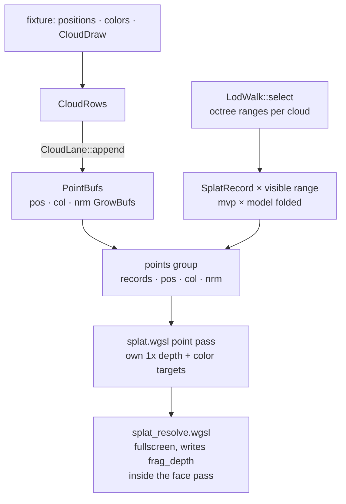
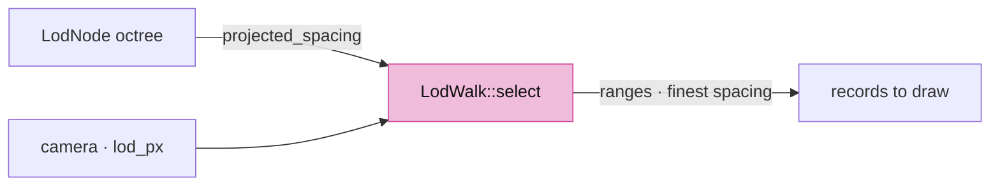
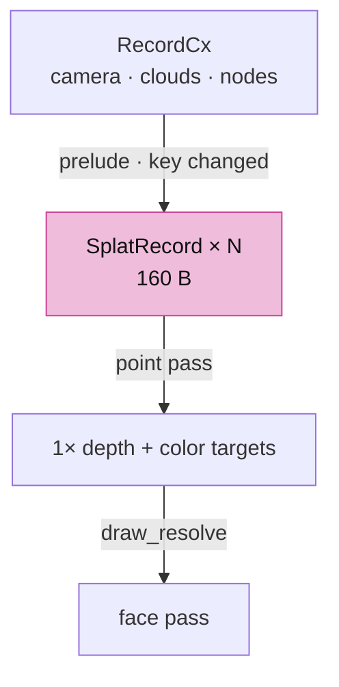
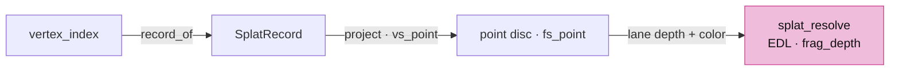

# 04d · Point clouds

## You are building

Group 1 of the point pass (`Layouts::points`):

| Binding | Rust buffer | WGSL |
|---|---|---|
| 0 | `Splat.record_buf` header + 160-byte records | `@group(1) @binding(0) var<storage, read> table: array<u32>` |
| 1 | `CloudLane.pos` | `@group(1) @binding(1) positions: array<f32>` |
| 2 | `CloudLane.col` | `@group(1) @binding(2) colors: array<u32>` |
| 3 | `CloudLane.nrm` | `@group(1) @binding(3) normals: array<u32>` |

Group 0 of both point pipelines is the cloud uniform (`FrameUniforms::cloud_group`), not the camera: the camera is folded into each record.

## Starting point

- Checkpoint 04c: meshes, strokes and markers draw inside the face and ink passes.
- Points draw into their own 1× depth and color targets before the face pass, then a fullscreen resolve writes them into the scene with `frag_depth`, so a cloud occludes and is occluded like a solid.

## Step 1 · Cloud tables

- A cloud's points arrive in chunks; `Chunk` maps cloud-local indices to lane rows.

<!-- file: 04d session_viewer/src/engine/gpu/cloud.rs type lines=1-57 -->

<!-- file: 04d session_viewer/src/engine/gpu/cloud.rs type lines=58-114 -->

- `append` returns whether a buffer moved; the point lane must then rebind its group.

<!-- file: 04d session_viewer/src/engine/gpu/cloud.rs type lines=115-144 -->

<!-- file: 04d session_viewer/src/engine/gpu/cloud.rs type lines=145-208 -->

<!-- file: 04d session_viewer/src/engine/gpu/cloud.rs type lines=209-257 -->

## Step 2 · The LOD walk

- Pure CPU: which octree ranges to draw, given how wide each node's point spacing projects. Small clouds draw whole.

<!-- file: 04d session_viewer/src/engine/gpu/lod.rs type lines=1-48 -->

- Each node owns its subsample, so descending only adds detail; the finest spacing found below a node travels back up to size its discs.

<!-- file: 04d session_viewer/src/engine/gpu/lod.rs type lines=49-115 -->

<!-- file: 04d session_viewer/src/engine/gpu/lod.rs type lines=116-151 -->

## Step 3 · The splat lane

`SplatRecord` is 160 bytes, read as raw words by the shader:

| Offset | Field |
|---|---|
| 0 | `mvp_model: [f32; 16]` |
| 64 | `tint: [f32; 4]`, `.a` = minimum radius in px |
| 80 | `first`, `count`, `cum`, `k` |
| 96 | `rot: [f32; 12]` |
| 144 | `nrm_first`, `instance`, `flags`, `_pad` |

<!-- file: 04d session_viewer/src/engine/gpu/splat.rs type lines=1-68 -->

- The point pass targets are made on the first frame that has points, so a scene without a cloud never pays for them.

<!-- file: 04d session_viewer/src/engine/gpu/splat.rs type lines=69-134 -->

<!-- file: 04d session_viewer/src/engine/gpu/splat.rs type lines=135-157 -->

<!-- file: 04d session_viewer/src/engine/gpu/splat.rs type lines=158-230 -->

<!-- file: 04d session_viewer/src/engine/gpu/splat.rs type lines=231-278 -->

- `prelude` is skipped while the key (camera, knobs, point count) matches; otherwise it rebuilds records, writes them and draws the point pass.

<!-- file: 04d session_viewer/src/engine/gpu/splat.rs type lines=279-359 -->

- One record per visible cloud, or per selected octree node; a range straddling two chunks becomes two records.

<!-- file: 04d session_viewer/src/engine/gpu/splat.rs type lines=360-443 -->

<!-- file: 04d session_viewer/src/engine/gpu/splat.rs type lines=444-515 -->

## Step 4 · The point shaders

- `record_of` finds the record whose cumulative range contains the vertex index; `project` folds one mat-vec per point.

<!-- file: 04d session_viewer/src/shaders/splat.wgsl type lines=1-63 -->

<!-- file: 04d session_viewer/src/shaders/splat.wgsl type lines=64-122 -->

<!-- file: 04d session_viewer/src/shaders/splat.wgsl type lines=123-181 -->

- The resolve reads the lane's depth and color, applies Eye-Dome Lighting from neighbouring depths, and writes `frag_depth` under the scene's `Greater` test.

<!-- file: 04d session_viewer/src/shaders/splat_resolve.wgsl type -->

<!-- check: 04d -->

## Step 5 · Wire the lane

<!-- file: 04d session_viewer/src/engine/pipelines/layouts.rs type -->

<!-- file: 04d session_viewer/src/engine/gpu/upload.rs type -->

- The prelude runs before the face pass on the same encoder; the resolve draws inside the face pass right after the solid faces.

<!-- file: 04d session_viewer/src/engine/gpu/mod.rs type -->

- A fourth row: a small grid of points with one `CloudDraw` and no octree.

<!-- file: 04d session_viewer/src/fixture.rs copy -->

<!-- file: 04d session_viewer/src/lib.rs type -->

<!-- file: 04d session_viewer/index.html copy -->

## Check

<!-- checkpoint: 04d -->

Expected:

- Triangle, polyline, dot, and a grid of orange points at the lower right.
- Status reads **Checkpoint 04 · 4 objects**.
- Orbit: the points stay round and keep their size on screen.

## What changed

<!-- tree: 04d session_viewer/src/engine -->

- Data flow: `CloudRows` → point buffers + records → point pass into private targets → resolve into the face pass.
- This checkpoint is the former checkpoint 04: every file now matches it byte for byte.

**Production equivalent:** `src/engine/gpu/cloud.rs`, `lod.rs`, `splat.rs`, `src/shaders/splat.wgsl`, `splat_resolve.wgsl`.

## Try

- Append `?cloud=3`: every point grows on screen; `cloud_size` scales the per-cloud size in the record, the buffers are untouched.
- Append `?edl=0`: the eye-dome lighting goes away and the cloud reads flat; it is a resolve-pass effect, not stored colour.
- Append `?lod=64`: fewer octree nodes qualify and the cloud thins with distance; `LodWalk::select` is the only code that changed behaviour.

## Next

[05 · Depth and visible ink](05-visibility.md): the physical pass, the surface-carry visibility rule, and multisampling.
