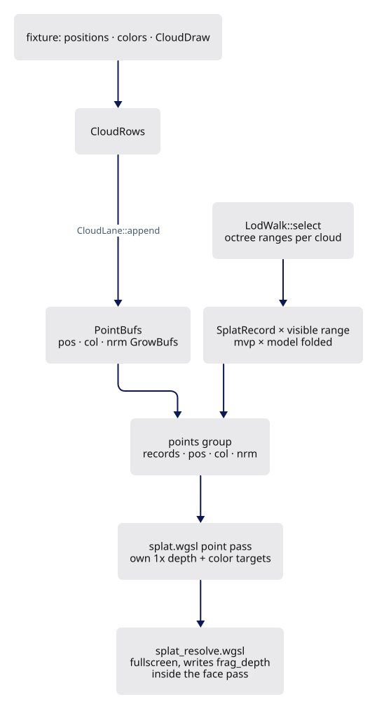
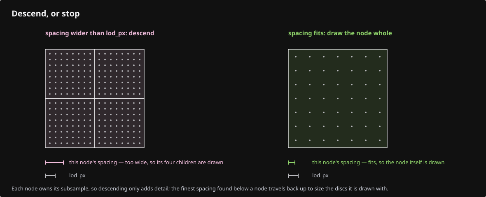
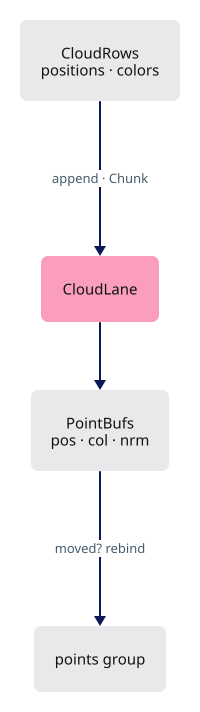
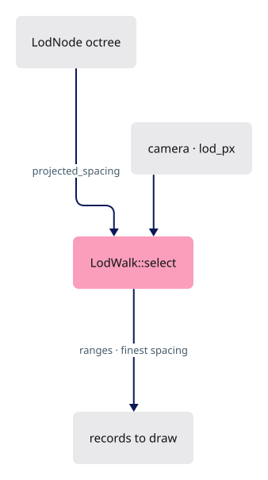
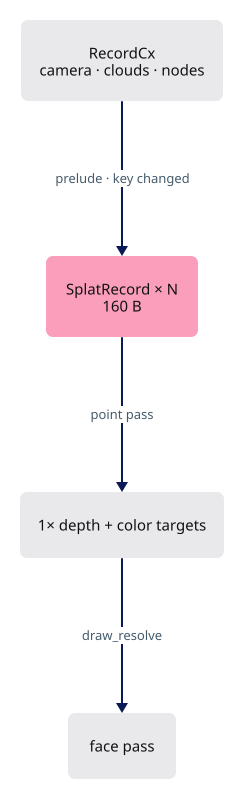
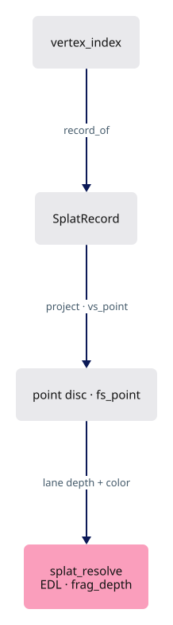
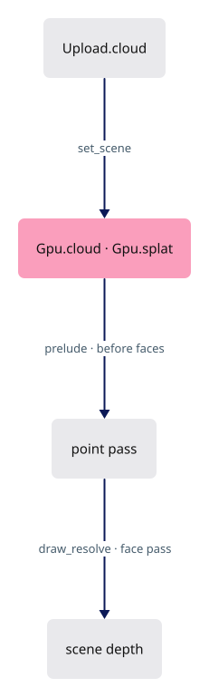
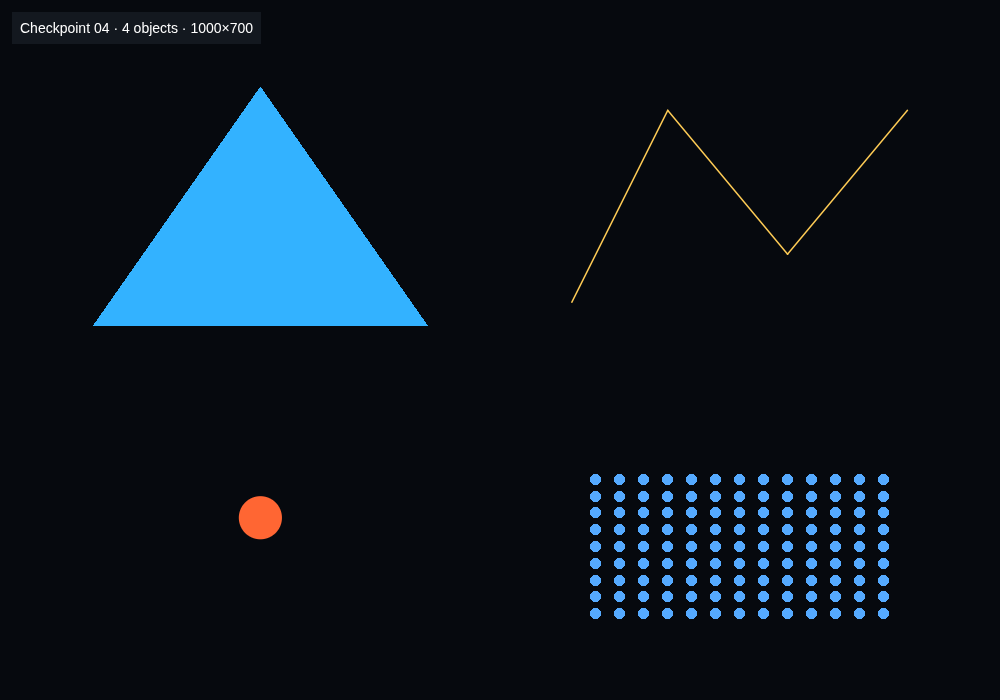

# 04d · Point clouds

## You are building

Group 1 of the point pass (`Layouts::points`):

| Binding | Rust buffer | WGSL |
|---|---|---|
| 0 | `Splat.record_buf` header + 160-byte records | `@group(1) @binding(0) var<storage, read> table: array<u32>` |
| 1 | `CloudLane.pos` | `@group(1) @binding(1) positions: array<f32>` |
| 2 | `CloudLane.col` | `@group(1) @binding(2) colors: array<u32>` |
| 3 | `CloudLane.nrm` | `@group(1) @binding(3) normals: array<u32>` |

Group 0 of both point pipelines is the cloud uniform (`FrameUniforms::cloud_group`), not the camera: the camera is folded into each record.

## Starting point

- Checkpoint 04c: meshes, strokes and markers draw inside the face and ink passes.
- Points draw into their own 1× depth and color targets before the face pass, then a fullscreen resolve writes them into the scene with `frag_depth`, so a cloud occludes and is occluded like a solid.

<!-- step-status: start -->

**Does it compile yet?** Yes, after every step of this lesson — `cargo check` was run at the end of each one to make sure. A step that writes a file Rust has not been told about yet compiles without checking any of it, so keep going to the checkpoint: that build is the real test.

<!-- step-status: end -->

## Step 1 · Cloud tables

{ .locator data-strip="illustrations/strip-445a1edf20.svg" }

- A cloud's points arrive in chunks; `Chunk` maps cloud-local indices to lane rows.

<!-- file: 04d session_viewer/src/engine/gpu/cloud.rs type lines=1-57 -->

<!-- file: 04d session_viewer/src/engine/gpu/cloud.rs type lines=58-114 -->

- `append` returns whether a buffer moved; the point lane must then rebind its group.

<!-- file: 04d session_viewer/src/engine/gpu/cloud.rs type lines=115-144 -->

<!-- file: 04d session_viewer/src/engine/gpu/cloud.rs type lines=145-208 -->

- Clouds arrive in chunks, so the lane keeps a chunk list: `append` grows the buffers, `extend` records which object row a chunk belongs to, and a chunk that does not continue the resident prefix is refused rather than silently misplaced.

<!-- file: 04d session_viewer/src/engine/gpu/cloud.rs type lines=209-257 -->

- `row_of` is the inverse the picker needs: a global point row back to its cloud and its index within it. Without it a picked point could not be named.

## Step 2 · The LOD walk

{ .locator data-strip="illustrations/strip-445a1edf20.svg" }

- Pure CPU: which octree ranges to draw, given how wide each node's point spacing projects. Small clouds draw whole.

<!-- file: 04d session_viewer/src/engine/gpu/lod.rs type lines=1-48 -->

- Each node owns its subsample, so descending only adds detail; the finest spacing found below a node travels back up to size its discs.

<!-- file: 04d session_viewer/src/engine/gpu/lod.rs type lines=49-115 -->

<!-- file: 04d session_viewer/src/engine/gpu/lod.rs type lines=116-151 -->

- The size of a disc is decided here, on the CPU, and folded into the record, so the shader divides once per point instead of reasoning about spacing.

## Step 3 · The splat lane

{ .locator data-strip="illustrations/strip-445a1edf20.svg" }

`SplatRecord` is 160 bytes, read as raw words by the shader:

| Offset | Field |
|---|---|
| 0 | `mvp_model: [f32; 16]` |
| 64 | `tint: [f32; 4]`, `.a` = minimum radius in px |
| 80 | `first`, `count`, `cum`, `k` |
| 96 | `rot: [f32; 12]` |
| 144 | `nrm_first`, `instance`, `flags`, `_pad` |

<!-- file: 04d session_viewer/src/engine/gpu/splat.rs type lines=1-68 -->

- The point pass targets are made on the first frame that has points, so a scene without a cloud never pays for them.

<!-- file: 04d session_viewer/src/engine/gpu/splat.rs type lines=69-134 -->

<!-- file: 04d session_viewer/src/engine/gpu/splat.rs type lines=135-157 -->

- The lane's own type: three pipelines - colour, id, resolve - and the record buffer that feeds them.

<!-- file: 04d session_viewer/src/engine/gpu/splat.rs type lines=158-230 -->

- Construction allocates the record buffer up front - 4096 records at 160 bytes, about 640 KB - and binds it over placeholder buffers. The point *targets* are what wait for the first cloud, and they are the part that scales with the framebuffer.

<!-- file: 04d session_viewer/src/engine/gpu/splat.rs type lines=231-278 -->

- `prelude` is skipped while the key (camera, knobs, point count) matches; otherwise it rebuilds records, writes them and draws the point pass.

<!-- file: 04d session_viewer/src/engine/gpu/splat.rs type lines=279-344 -->

- The ID pipeline draws the same quads and writes `(object row, point row)` instead of colour, so a point answers a pick with the identity of the point, not of the cloud.

<!-- file: 04d session_viewer/src/engine/gpu/splat.rs type lines=345-359 -->

- One record per visible cloud, or per selected octree node; a range straddling two chunks becomes two records.

<!-- file: 04d session_viewer/src/engine/gpu/splat.rs type lines=360-443 -->

<!-- file: 04d session_viewer/src/engine/gpu/splat.rs type lines=444-501 -->

- The resolve is one fullscreen triangle writing colour and `frag_depth`, which is what folds the private point pass back under the scene's own depth test.

<!-- file: 04d session_viewer/src/engine/gpu/splat.rs type lines=502-515 -->

## Step 4 · The point shaders

{ .locator data-strip="illustrations/strip-ef21ae124d.svg" }

- `record_of` finds the record whose cumulative range contains the vertex index; `project` folds one mat-vec per point.

<!-- file: 04d session_viewer/src/shaders/splat.wgsl type lines=1-50 -->

<!-- file: 04d session_viewer/src/shaders/splat.wgsl type lines=51-92 -->

- `project` is the whole per-point cost: one mat-vec, a radius folded from the record, a depth. Everything computable per cloud was already computed on the CPU.

<!-- file: 04d session_viewer/src/shaders/splat.wgsl type lines=93-171 -->

- The resolve reads the lane's depth and color, applies Eye-Dome Lighting from neighbouring depths, and writes `frag_depth` under the scene's `Greater` test.

<!-- file: 04d session_viewer/src/shaders/splat_resolve.wgsl type -->

<!-- check: 04d -->

## Step 5 · Wire the lane

{ .locator data-strip="illustrations/strip-20ba8a8ce6.svg" }

<!-- file: 04d session_viewer/src/engine/pipelines/layouts.rs type -->

<!-- file: 04d session_viewer/src/engine/gpu/upload.rs type -->

- The prelude runs before the face pass on the same encoder; the resolve draws inside the face pass right after the solid faces.

<!-- file: 04d session_viewer/src/engine/gpu/mod.rs type -->

- A fourth row: a small grid of points with one `CloudDraw` and no octree.

<!-- file: 04d session_viewer/src/fixture.rs copy -->

<!-- file: 04d session_viewer/src/lib.rs type -->

- Wiring a lane into the shell costs a hunk or two: construct it where the others are built, and report it. That is the whole price of adding a lane to this facade.

<!-- file: 04d session_viewer/index.html copy -->

## Check

<!-- checkpoint: 04d -->

Expected:

- Triangle, polyline, dot, and a grid of orange points at the lower right.
- Status reads **Checkpoint 04 · 4 objects**.
- Orbit: the points stay round and keep their size on screen.

## What changed

<!-- tree: 04d session_viewer/src/engine -->

- Data flow: `CloudRows` → point buffers + records → point pass into private targets → resolve into the face pass.

**Production equivalent:** `src/engine/gpu/cloud.rs`, `lod.rs`, `splat.rs`, `src/shaders/splat.wgsl`, `splat_resolve.wgsl`.

## Try

- Append `?cloud=3`: every point grows on screen; `cloud_size` scales the per-cloud size in the record, the buffers are untouched.
- Append `?edl=0`: the eye-dome lighting goes away and the cloud reads flat; it is a resolve-pass effect, not stored colour.
- Append `?lod=64`: fewer octree nodes qualify and the cloud thins with distance; `LodWalk::select` is the only code that changed behaviour.

## Questions and answers

**Points draw into their own targets and are then resolved into the scene. Why not draw them with everything else?**

*How to work it out.* List what a splat needs that a triangle does not. It needs to read the depth of *neighbouring* points to shade itself (Eye-Dome Lighting), and you cannot read the depth buffer you are writing. But it must still occlude and be occluded like a solid. Those two requirements conflict unless the points get a buffer of their own.

*The answer.* A private colour and depth pass first, then a fullscreen resolve that reads them, applies EDL and writes `frag_depth` under the scene's `Greater` test — which folds the result back into the shared depth as if it had been drawn there. The cost is one pass; the benefit is that no other lane has to know clouds exist.

**The point pass targets are created on the first frame that has points. What principle is that, and where else does it appear?**

*How to work it out.* Ask what a scene with no cloud should pay for cloud support. Then look for other features with the same shape: something expensive, allocated per-framebuffer, not always needed.

*The answer.* Pay for a feature only when it is used. The same rule allocates the coverage masks only while something is outlined and releases them when nothing is, and builds the tile pool only when finite visibility runs. In a browser, memory you never allocate is the cheapest optimisation available.

**The LOD walk is pure CPU and answers one question per node. What is the question?**

*How to work it out.* You want just enough points that the gaps between them are invisible. So the quantity to test is the node's point spacing *as projected on screen*, compared against a pixel threshold.

*The answer.* "Does this node's spacing project wider than `lod_px`?" Yes: descend into the eight children. No: draw the node whole. Because each node owns its own subsample, descending only ever adds detail, which is what makes this a single pass with no back-tracking.

**Group 0 of the point pipelines is the cloud uniform, not the camera. Where did the camera go?**

*How to work it out.* Ask what a splat record has to contain anyway: which range of points, at what size, from which cloud. Once a record exists per visible cloud, the camera can be premultiplied into it on the CPU at no per-point cost.

*The answer.* Folded into each `SplatRecord`, so the shader does one mat-vec per point from a record the CPU wrote, and the point pass does not need the scene's camera group at all. It also makes a range straddling two chunks simply two records instead of a special case in the shader.

**What you should be able to do now**

Trace one point from a chunk in CPU memory to a lit pixel, naming every buffer and pass. Correct: `CloudRows` → the lane's point buffers → `LodWalk::select` picks ranges → `SplatRecord`s written per visible cloud → the point pass draws into private colour and depth → the resolve reads both, applies EDL and writes `frag_depth` into the face pass. Four checkpoints in, this is the first whole lane you can narrate.

## Next

[05 · Depth and visible ink](05-visibility.md): the physical pass, the surface-carry visibility rule, and multisampling.
