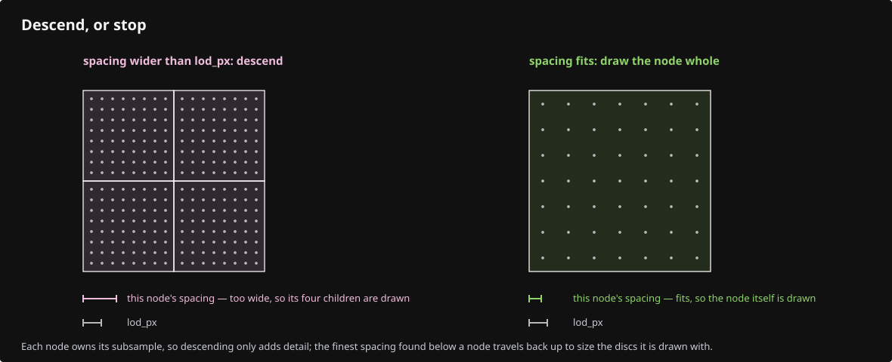

# 04d · Point clouds

**Estimated study time: about 20–40 hours.** Includes reading, typing, tracing, testing and experiments. [How to use this estimate](map.md#time-estimates).

**This section:** Organize point clouds and draw the detail needed for the current view.

**In the whole viewer:** The cloud drawing path limits display work while later source queries preserve access to original points.

**Follow the data:** Cloud hierarchy → visible detail selection → splat records → pixels.

**Start with these files:** [`src/engine/gpu/cloud.rs`](04d-clouds.md#code-04d-001), [`src/engine/gpu/splat.rs`](04d-clouds.md#code-04d-032).

**Aim to explain:** Why should selecting an original cloud point not depend only on the points currently drawn?

[Whole-viewer map and course milestones](map.md)

A scan can contain millions of points. When many project onto the same pixel, drawing all of them adds work without revealing detail. An octree groups points into smaller and smaller regions. Projected spacing tells us whether a region needs more detail at the current view.



Start from the working result of [step 04c](04c-markers.md).

**One buildable step:** type the additions below in `workspace/handwritten`, then build and test. This step adds 1,560 lines across 10 files and may take several sittings. Individual listings are parts of this step, not separate build checkpoints.

<span id="code-04d-001"></span>

## `src/engine/gpu/cloud.rs`

Point clouds contain many independent samples. Batched storage and visibility decisions are essential because a per-point CPU draw would be expensive. A point still needs enough information for colour, size and picking.

Create this file. Type the complete listing, including comments and blank lines.

```rust
--8<-- "typing/code/04d-001.rs"
```

<span id="code-04d-002"></span>

## `src/engine/gpu/hull.rs`

Append **after line 364** of your current file.

Blank lines before: **1**; after: **0**. End with a newline.

```rust
--8<-- "typing/code/04d-002.rs"
```

<span id="code-04d-003"></span>

## `src/engine/gpu/lod.rs`

Level of detail keeps samples that contribute at the current view scale. The aim is to bound work without producing obvious holes or unstable changes. A coarse representation should remain useful while finer data is unavailable.

Create this file. Type the complete listing, including comments and blank lines.

```rust
--8<-- "typing/code/04d-003.rs"
```

<span id="code-04d-004"></span>

## `src/engine/gpu/mod.rs`

Insert **after line 5** of your current file.

Keep these preceding lines:

```rust
// A line tagged `register:<name>` is a registration: each later lesson adds its own line to lists like this one.
pub mod arena; // register:arena
pub mod backdrop; // register:backdrop
pub mod buffers; // register:buffers
```

Keep these following lines:

```rust
pub mod device; // register:device
pub mod faces; // register:faces
pub mod frame; // register:frame
pub mod glyphs; // register:glyphs
```

Type these new lines:

```rust
--8<-- "typing/code/04d-004.rs"
```

<span id="code-04d-005"></span>

## `src/engine/gpu/mod.rs`

Insert **after line 12** of your current file.

Keep these preceding lines:

```rust
pub mod frame; // register:frame
pub mod glyphs; // register:glyphs
pub mod hull; // register:hull
pub mod instance; // register:instance
```

Keep these following lines:

```rust
pub mod objects;
pub mod slots; // register:slots

pub mod lane; // register:lane
```

Type these new lines:

```rust
--8<-- "typing/code/04d-005.rs"
```

<span id="code-04d-006"></span>

## `src/engine/gpu/mod.rs`

Insert **after line 22** of your current file.

Keep these preceding lines:

```rust
pub(crate) mod patch; // register:patch
pub mod present; // register:present
pub mod render; // register:render
pub mod segments; // register:segments
```

Keep these following lines:

```rust
pub mod targets; // register:targets
pub mod text_outline; // register:text_outline
mod triangle_tiles; // register:triangle_tiles
pub mod upload; // register:upload
```

Type these new lines:

```rust
--8<-- "typing/code/04d-006.rs"
```

<span id="code-04d-007"></span>

## `src/engine/gpu/mod.rs`

Insert **after line 37** of your current file.

Keep these preceding lines:

```rust

use arena::ArenaLane; // register:meshes
use backdrop::BackdropLane;
use buffers::GpuCtx;
```

Keep these following lines:

```rust
use device::DeviceSetup;
use frame::FrameUniforms;
use glyphs::GlyphLane; // register:markers
use lane::{Lane, RowLane};
```

Type these new lines:

```rust
--8<-- "typing/code/04d-007.rs"
```

<span id="code-04d-008"></span>

## `src/engine/gpu/mod.rs`

Insert **after line 46** of your current file.

Keep these preceding lines:

```rust
use objects::InkScene; // register:ink
use objects::InstanceTable;
use pass::Pass;
use segments::SegmentLane; // register:strokes
```

Keep these following lines:

```rust
use targets::Targets;

pub use frame::FrameInput;
pub use glyphs::GlyphPoint; // register:markers
```

Type these new lines:

```rust
--8<-- "typing/code/04d-008.rs"
```

<span id="code-04d-009"></span>

## `src/engine/gpu/mod.rs`

Insert **after line 49** of your current file.

Keep these preceding lines:

```rust
use segments::SegmentLane; // register:strokes
use splat::Splat; // register:clouds
use targets::Targets;
```

Keep these following lines:

```rust
pub use frame::FrameInput;
pub use glyphs::GlyphPoint; // register:markers
pub use instance::Instance;
pub use objects::{ObjectRow, Rebase};
```

Type these new lines:

```rust
--8<-- "typing/code/04d-009.rs"
```

<span id="code-04d-010"></span>

## `src/engine/gpu/mod.rs`

Insert **after line 74** of your current file.

Keep these preceding lines:

```rust
    pub segments: SegmentLane,                   // lines; register:strokes
    pub glyphs: GlyphLane,                       // markers and dots; register:markers
    pub selection_revision: u64,                 // bumps on every selection change
    pub logical_size: [f64; 2],                  // canvas size in CSS pixels
```

Keep these following lines:

```rust
    registered: Vec<Box<dyn RowLane>>,           // lanes from lane::REGISTRY
    passes: Vec<Box<dyn Pass>>,                  // passes from pass::PASSES, in frame order
    dead: patch::Counts, // editable rows retired and not yet reclaimed; register:patch
    pub performance: Performance, // frame timing
```

Type these new lines:

```rust
--8<-- "typing/code/04d-010.rs"
```

<span id="code-04d-011"></span>

## `src/engine/gpu/mod.rs`

Insert **after line 78** of your current file.

Keep these preceding lines:

```rust
    pub cloud: CloudLane,                        // point cloud buffers; register:clouds
    registered: Vec<Box<dyn RowLane>>,           // lanes from lane::REGISTRY
    passes: Vec<Box<dyn Pass>>,                  // passes from pass::PASSES, in frame order
    dead: patch::Counts, // editable rows retired and not yet reclaimed; register:patch
```

Keep these following lines:

```rust
    pub performance: Performance, // frame timing
    pub bounds: AABB,                     // world box of everything uploaded
    device_type: wgpu::DeviceType,        // discrete, integrated or CPU
    pub failure: std::sync::Arc<std::sync::Mutex<Option<String>>>, // first GPU error
```

Type these new lines:

```rust
--8<-- "typing/code/04d-011.rs"
```

<span id="code-04d-012"></span>

## `src/engine/gpu/mod.rs`

Insert **after line 97** of your current file.

Keep these preceding lines:

```rust
            backdrop,          // register:backdrop
            arena,             // register:meshes
            segments,          // register:strokes
            glyphs,            // register:markers
```

Keep these following lines:

```rust
        )
    };
}
```

Type these new lines:

```rust
--8<-- "typing/code/04d-012.rs"
```

<span id="code-04d-013"></span>

## `src/engine/gpu/mod.rs`

Insert **after line 183** of your current file.

Keep these preceding lines:

```rust
        let objects = InstanceTable::new(&ctx, &layouts);
        let backdrop = BackdropLane::new(&ctx, &layouts, target);
        let segments = SegmentLane::new(&ctx, &layouts, target); // register:strokes
        let glyphs = GlyphLane::new(&ctx, &layouts, target); // register:markers
```

Keep these following lines:

```rust
        // each registered lane builds itself through its `make` function
        let registered = lane::REGISTRY
            .iter()
            .map(|lane| (lane.make)(&ctx, &layouts, target))
```

Type these new lines:

```rust
--8<-- "typing/code/04d-013.rs"
```

<span id="code-04d-014"></span>

## `src/engine/gpu/mod.rs`

Insert **after line 214** of your current file.

Keep these preceding lines:

```rust
            segments,    // register:strokes
            glyphs,      // register:markers
            selection_revision: 0,
            logical_size: [size.0 as f64, size.1 as f64],
```

Keep these following lines:

```rust
            registered,
            passes,
            dead: patch::Counts::default(), // register:patch
            performance: Performance::new(),
```

Type these new lines:

```rust
--8<-- "typing/code/04d-014.rs"
```

<span id="code-04d-015"></span>

## `src/engine/gpu/mod.rs`

Insert **after line 218** of your current file.

Keep these preceding lines:

```rust
            cloud, // register:clouds
            registered,
            passes,
            dead: patch::Counts::default(), // register:patch
```

Keep these following lines:

```rust
            performance: Performance::new(),
            bounds: AABB::empty(),
            device_type,
            failure,
```

Type these new lines:

```rust
--8<-- "typing/code/04d-015.rs"
```

<span id="code-04d-016"></span>

## `src/engine/gpu/mod.rs`

Insert **after line 239** of your current file.

Keep these preceding lines:

```rust
        for lane in &mut self.registered {
            lane.on_append(&self.ctx, &self.layouts, up);
        }
```

Keep these following lines:

```rust
        self.bounds.union_with(&up.bounds);
        self.retarget(false);
        self.rebind_ink(); // register:ink
    }
```

Type these new lines:

```rust
--8<-- "typing/code/04d-016.rs"
```

<span id="code-04d-017"></span>

## `src/engine/gpu/mod.rs`

Insert **after line 241** of your current file.

Keep these preceding lines:

```rust
        }

        self.append_cloud(up); // register:clouds
        self.bounds.union_with(&up.bounds);
```

Keep these following lines:

```rust
        self.retarget(false);
        self.rebind_ink(); // register:ink
    }
```

Type these new lines:

```rust
--8<-- "typing/code/04d-017.rs"
```

<span id="code-04d-018"></span>

## `src/engine/gpu/mod.rs`

Insert **after line 332** of your current file.

Keep these preceding lines:

```rust
            s.configure(&self.ctx.device, &self.config);
        }

        self.retarget(true);
```

Keep these following lines:

```rust
    }

    /// Forget every row; keep the buffers.
    pub fn reset(&mut self) {
```

Type these new lines:

```rust
--8<-- "typing/code/04d-018.rs"
```

<span id="code-04d-019"></span>

## `src/engine/gpu/mod.rs`

Insert **after line 350** of your current file.

Keep these preceding lines:

```rust
        }
        self.segments.set_edge(&self.ctx, None); // register:strokes
        self.bounds = AABB::empty();
        self.dead = patch::Counts::default(); // register:patch
```

Keep these following lines:

```rust
    }

    /// Forget every row and free the buffers.
    pub fn release(&mut self) {
```

Type these new lines:

```rust
--8<-- "typing/code/04d-019.rs"
```

<span id="code-04d-020"></span>

## `src/engine/gpu/mod.rs`

Insert **after line 367** of your current file.

Keep these preceding lines:

```rust
        for pass in &mut self.passes {
            pass.on_release(ctx, layouts);
        }
        self.segments.set_edge(&self.ctx, None); // register:strokes
```

Keep these following lines:

```rust
        self.bounds = AABB::empty();
        self.dead = patch::Counts::default(); // register:patch
        self.retarget(false);
        self.rebind_ink(); // register:ink
```

Type these new lines:

```rust
--8<-- "typing/code/04d-020.rs"
```

<span id="code-04d-021"></span>

## `src/engine/gpu/mod.rs`

Insert **after line 370** of your current file.

Keep these preceding lines:

```rust
        self.segments.set_edge(&self.ctx, None); // register:strokes
        self.rebind_cloud(); // a freed cloud buffer needs a new bind group; register:clouds
        self.bounds = AABB::empty();
        self.dead = patch::Counts::default(); // register:patch
```

Keep these following lines:

```rust
        self.retarget(false);
        self.rebind_ink(); // register:ink
    }
}
```

Type these new lines:

```rust
--8<-- "typing/code/04d-021.rs"
```

<span id="code-04d-022"></span>

## `src/engine/gpu/mod.rs`

Insert **after line 403** of your current file.

Keep these preceding lines:

```rust
            .objects
            .rebase_anchor(&self.ctx, origin, view_dist, now);

        if rebase.moved {
```

Keep these following lines:

```rust
        }

        rebase
    }
```

Type these new lines:

```rust
--8<-- "typing/code/04d-022.rs"
```

<span id="code-04d-023"></span>

## `src/engine/gpu/mod.rs`

Insert **after line 412** of your current file.

Keep these preceding lines:

```rust

    /// Take the editable rows retired but not yet reclaimed, for the live counts.
    pub(crate) fn set_dead(&mut self, dead: patch::Counts, points: u32) {
        self.dead = dead;
```

Keep these following lines:

```rust
    }

    // Every edit below writes one 96-byte row and never the geometry: selecting a mesh of a million triangles is one small write.
    /// Select or deselect object `row`.
```

Type these new lines:

```rust
--8<-- "typing/code/04d-023.rs"
```

<span id="code-04d-024"></span>

## `src/engine/gpu/mod.rs`

Insert **after line 425** of your current file.

Keep these preceding lines:

```rust
            pass.on_select(row, on);
        }
        self.objects
            .set_flag(&self.ctx, row, Instance::FLAG_SELECTED, on);
```

Keep these following lines:

```rust
    }

    /// Set the face or edge color of object `row`; None restores its own.
    pub fn set_object_color(&mut self, row: u32, edge: bool, color: Option<[u8; 3]>) {
```

Type these new lines:

```rust
--8<-- "typing/code/04d-024.rs"
```

<span id="code-04d-025"></span>

## `src/engine/gpu/mod.rs`

Insert **after line 431** of your current file.

Keep these preceding lines:

```rust

    /// Set the face or edge color of object `row`; None restores its own.
    pub fn set_object_color(&mut self, row: u32, edge: bool, color: Option<[u8; 3]>) {
        self.objects.set_color(&self.ctx, row, edge, color);
```

Keep these following lines:

```rust
    }

    // Hidden, not freed: the row stays on the GPU, so showing it again is one more write.
    /// Hide or show object `row`.
```

Type these new lines:

```rust
--8<-- "typing/code/04d-025.rs"
```

<span id="code-04d-026"></span>

## `src/engine/gpu/mod.rs`

Insert **after line 439** of your current file.

Keep these preceding lines:

```rust
    /// Hide or show object `row`.
    pub fn set_hidden(&mut self, row: u32, on: bool) {
        self.objects
            .set_flag(&self.ctx, row, Instance::FLAG_HIDDEN, on);
```

Keep these following lines:

```rust
    }
}

impl Gpu {
```

Type these new lines:

```rust
--8<-- "typing/code/04d-026.rs"
```

<span id="code-04d-027"></span>

## `src/engine/gpu/mod.rs`

Append **after line 562** of your current file.

Blank lines before: **1**; after: **0**. End with a newline.

```rust
--8<-- "typing/code/04d-027.rs"
```

<span id="code-04d-028"></span>

## `src/engine/gpu/present.rs`

Insert **after line 63** of your current file.

Keep these preceding lines:

```rust
        let mut geometry = false;
        geometry |= self.live_faces() + self.live_sheet() > 0; // register:meshes
        geometry |= self.live_pipes() + self.live_ribbons() > 0; // register:strokes
        geometry |= self.live_spheres() + self.live_dots() > 0; // register:markers
```

Keep these following lines:

```rust

        if let Some(done) = self.performance.mark_startup(geometry) {
            self.ctx
                .queue
```

Type these new lines:

```rust
--8<-- "typing/code/04d-028.rs"
```

<span id="code-04d-029"></span>

## `src/engine/gpu/render.rs`

Insert **after line 20** of your current file.

Keep these preceding lines:

```rust
            0
        } else {
            self.performance.drag_tier()
        };
```

Keep these following lines:

```rust

        let frame = Frame {
            view,
            clear,
```

Type these new lines:

```rust
--8<-- "typing/code/04d-029.rs"
```

<span id="code-04d-030"></span>

## `src/engine/gpu/render.rs`

Insert **after line 71** of your current file.

Keep these preceding lines:

```rust
        let clipped = self.passes.iter().any(|pass| pass.clips());
        let opaque = self.view.opacity >= 1.0; // at full opacity the blend returns the face color itself
        let mut draws = 0;
        draws += self.arena.draw_faces(pass, b, opaque, clipped); // register:meshes
```

Keep these following lines:

```rust
        draws
    }
}
```

Type these new lines:

```rust
--8<-- "typing/code/04d-030.rs"
```

<span id="code-04d-031"></span>

## `src/engine/gpu/render.rs`

Append **after line 145** of your current file.

Blank lines before: **1**; after: **0**. End with a newline.

```rust
--8<-- "typing/code/04d-031.rs"
```

<span id="code-04d-032"></span>

## `src/engine/gpu/splat.rs`

A splat spreads a point over an area. Drawing samples and resolving their accumulated result are separate operations. Depth and weighting determine how overlapping footprints combine.

Create this file. Type the complete listing, including comments and blank lines.

```rust
--8<-- "typing/code/04d-032.rs"
```

<span id="code-04d-033"></span>

## `src/engine/gpu/upload.rs`

Insert **after line 10** of your current file.

Keep these preceding lines:

```rust
    pub obj: ObjectRows,
    pub arena: super::arena::ArenaRows,  // meshes; register:meshes
    pub seg: super::segments::SegRows,   // lines; register:strokes
    pub glyph: super::glyphs::GlyphRows, // markers and dots; register:markers
```

Keep these following lines:

```rust
    pub lanes: LaneRows,                 // rows of registered lanes, by type
    pub bounds: AABB,                    // world box: the camera fits to it
}
```

Type these new lines:

```rust
--8<-- "typing/code/04d-033.rs"
```

<span id="code-04d-034"></span>

## `src/engine/gpu/upload.rs`

Insert **after line 23** of your current file.

Keep these preceding lines:

```rust
            obj: ObjectRows::default(),
            arena: Default::default(), // register:meshes
            seg: Default::default(),   // register:strokes
            glyph: Default::default(), // register:markers
```

Keep these following lines:

```rust
            lanes: LaneRows::default(),
            bounds: AABB::empty(),
        }
    }
```

Type these new lines:

```rust
--8<-- "typing/code/04d-034.rs"
```

<span id="code-04d-035"></span>

## `src/engine/gpu/upload.rs`

Insert **after line 37** of your current file.

Keep these preceding lines:

```rust
        drop_rows(&mut self.obj.rows);
        self.arena.drop_rows(); // register:meshes
        self.seg.drop_rows(); // register:strokes
        self.glyph.drop_rows(); // register:markers
```

Keep these following lines:

```rust
        self.lanes.clear();
        self.bounds = AABB::empty();
    }
```

Type these new lines:

```rust
--8<-- "typing/code/04d-035.rs"
```

<span id="code-04d-036"></span>

## `src/engine/gpu/upload.rs`

Insert **after line 49** of your current file.

Keep these preceding lines:

```rust
        self.merge_arena(&mut other, vert_base); // register:meshes
        self.seg.merge(&mut other.seg); // register:strokes
        self.glyph.spheres.append(&mut other.glyph.spheres); // register:markers
        self.glyph.dots.append(&mut other.glyph.dots); // register:markers
```

Keep these following lines:

```rust

        for lane in super::lane::REGISTRY {
            (lane.merge)(self, &mut other);
        }
```

Type these new lines:

```rust
--8<-- "typing/code/04d-036.rs"
```

<span id="code-04d-037"></span>

## `src/shaders/splat.wgsl`

Create this file. Type the complete listing, including comments and blank lines.

```wgsl
--8<-- "typing/code/04d-037.wgsl"
```

<span id="code-04d-038"></span>

## `src/shaders/splat_resolve.wgsl`

Create this file. Type the complete listing, including comments and blank lines.

```wgsl
--8<-- "typing/code/04d-038.wgsl"
```

## Check the completed chapter

From `session_viewer`, compare everything you have typed:

```sh
npm --prefix ../session_tests run course -- reference-check 04d
```

From `workspace/handwritten`:

```sh
cargo build --lib --locked -j4
cargo xtest --lib --locked -j4
```

Run the native level-of-detail tests. Find the caller that compares projected spacing with its pixel threshold; explain why the threshold belongs in screen space.

If a cloud becomes too coarse near the camera, check the distance and unit conversion before changing the cutoff. Millimetres and metres differ by a factor of one thousand.

**Before moving on:** explain what changed, check the expected result above, and fix any build or test failure.

<details>
<summary>Check your explanation of the opening question</summary>

Display detail is reduced for speed and changes with the view. An original point may exist in source data even when its display sample is absent.

</details>

[Next step: 05](05-visibility.md)
