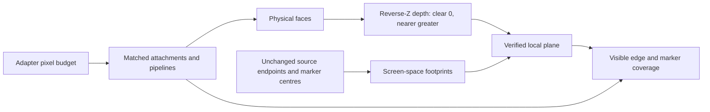

# 05 · Physical visibility and readable ink

Start at checkpoint **04** in `/tmp/viewer-course`. This checkpoint adds the production planar visibility rule and sample budget while keeping the existing camera and source coordinates.



Text equivalent: faces write physical depth first; strokes and markers test their footprints against a verified local surface, and every attachment and pipeline uses the same chosen sample count.

1. Add visibility, sample budgeting and the local regression fixtures as one compilable change.

**COPY/PASTE — complete mechanical changes.** [05.patch](reconstruction/patches/05.patch) contains every import, field, backdrop descriptor, fixture and replacement; use its full changes, substituting the typed blocks below for the corresponding hunks.

| File | Exact action / anchor | Input → output |
|---|---|---|
| `src/shaders/ink_visibility.wgsl` | Replace the complete file beginning `@group(2) @binding(2)` after its comment. | Physical depth + source axis/centre → visibility. |
| `src/engine/gpu/targets.rs` | Insert the three `MSAA_PIXELS_*` constants; insert `Targets::msaa_budget` and `Targets::samples_for`. | Adapter class + pixel count → 1 or 4 samples. |
| `src/engine/gpu/mod.rs` | Add `backdrop` registration/field; replace `Gpu::new`, `set_scene`, `resize`, `render`; insert `target`, `retarget`, `msaa_budget`, `msaa_now`. | Changed scene/size → coherent lane targets. |
| `src/engine/gpu/backdrop.rs` | Create the complete backdrop module. | Frame uniforms → background and grid draws. |
| `src/shaders/background.wgsl`, `src/shaders/grid.wgsl` | Create both complete shaders. | Vertex index → background/grid geometry. |
| `src/fixture.rs` | Replace `scene` and the complete fixture module. | Local arrays → exact grey box or sloping floor upload. |
| `src/lib.rs` | Replace `Tutorial::create` and `render`; add `parse_distance`. | Query knobs → reproducible camera and inspection. |
| `index.html` | Apply the exact title/status replacements and normalized wheel adapter. | CSS wheel delta → camera step. |

**TYPE BY HAND — `src/shaders/ink_visibility.wgsl`: replace the complete file.** The fragment may carry depth only across a verified plane; the marker-centre veto also checks the diagonal so unrelated corner faces cannot form a false plane.

```wgsl
// Ink compares its axis with the physical primitive depth carried by that primitive's
// raster gradient. This retains subpixel and grazing facets without relaxing occlusion.
// A bounded neighboring-plane fit handles gradients outside the attachment's range.
// Reverse-Z: nearer is greater, 0 is cleared. Pixels are framebuffer coordinates, y down.
@group(2) @binding(2) var scene_depth_single: texture_depth_2d;
@group(2) @binding(3) var scene_depth_msaa: texture_depth_multisampled_2d;

override SCENE_MSAA: bool = false;
@group(2) @binding(4) var scene_gradient_single: texture_2d<f32>;
@group(2) @binding(5) var scene_gradient_msaa: texture_multisampled_2d<f32>;

// 2^-19: about 16 ULPs of a float, relative to the depth.
const DEPTH_REL_TOL: f32 = 1.9073486e-6;
// The rasterizer snaps vertices to 1/256 px, so a fitted plane's depth is off by its slope
// times that; 2^-8 is exactly that quantisation, with the headroom measured away: the close-up
// holds at 242720 non-background pixels and the probe matrix at 54 cases with its nine
// distance-1 counts unchanged, while the floor census residual falls from 29 to 13 samples.
const SLOPE_PX: f32 = 0.00390625;
// How much of the two slopes a KINK may differ by and still count as one surface. A tessellation
// is piecewise planar and turns at every facet boundary, so a curved BRep's edge curve runs along
// kinks and loses half its width when the guard reads one as a surface jump; a real jump changes
// the slope by many times itself. 2^-5 is the largest fraction that keeps the floor census at
// zero at every camera at 1x and 4x - 2^-4 leaks one sample at down_4_flat - and it leaves the
// close-up at 242720 non-background pixels, the probe matrix at 54 cases with its nine distance-1
// counts unchanged, and the census's 16x counts unchanged, while the BRep orbit mean rises from
// 709 to 724. It does NOT admit a whole facet kink: 5 degrees between samples at 45 degrees of
// incidence is about 0.09 of the slope. The rest of a sphere's meridian waits for edge and face
// discretisation to match, which is phase 2.
const KINK: f32 = 0.03125;

struct InkColor {
    @location(0) color: vec4<f32>,
};

// The stroke as one fragment sees it: the closest axis point, its depth, the unit screen
// direction of the stroke and the axis's depth change per pixel along it.
struct InkAxis {
    at: vec2<f32>,
    depth: f32,
    along: vec2<f32>,
    slope: f32,
};

// A texel's physical depth at one sample; outside the viewport counts as cleared.
fn ink_depth(pixel: vec2<f32>, sample: u32) -> f32 {
    if (any(pixel < vec2<f32>(0.0)) || any(pixel >= vec2<f32>(line.vp_w, line.vp_h))) {
        return 0.0;
    }
    let at = vec2<i32>(pixel);
    if (SCENE_MSAA) {
        return textureLoad(scene_depth_msaa, at, i32(sample));
    }
    return textureLoad(scene_depth_single, at, 0);
}

// How far a fitted plane may miss: float precision plus the slope's snapping error over the
// lever arm it was extrapolated across.
fn ink_tolerance(depth: f32, slope: f32, lever: f32) -> f32 {
    return abs(depth) * DEPTH_REL_TOL + abs(slope) * SLOPE_PX * (1.0 + lever);
}

// Whether the fragment and its neighbour one texel along `dir` lie on one surface, so that
// pair may be fitted: on a plane the next texel out extends the slope, bent only by the
// rasterizer's vertex snapping and by whatever kink a tessellation has there, while a step from
// one surface to another is many times the slope. A cleared neighbour is no pair at all; cleared
// beyond it means the surface ends there and the pair is all there is to fit.
fn ink_pair_planar(pixel: vec2<f32>, dir: vec2<f32>, z: f32, sample: u32) -> bool {
    let z_side = ink_depth(pixel + dir, sample);
    if (z_side == 0.0) {
        return false;
    }
    let z_far = ink_depth(pixel + dir * 2.0, sample);
    if (z_far == 0.0) {
        return true;
    }
    let g = z_side - z;
    let g_far = z_far - z_side;
    return abs(g_far - g) <= abs(z) * DEPTH_REL_TOL + KINK * (abs(g) + abs(g_far));
}

// The carry's verdict, shared by strokes and discs. A texel already nearer than the axis is
// ink only when its surface passes THROUGH the axis, so a plane fitted in front of the axis
// that lands behind it cannot uncover a covered stroke; a farther texel keeps the one-sided
// compare, so a stroke still overhangs a silhouette at full width.
fn ink_carry_visible(predicted: f32, z: f32, depth: f32, tolerance: f32) -> bool {
    if (z > depth + abs(depth) * DEPTH_REL_TOL) {
        return abs(predicted - depth) <= tolerance;
    }
    return predicted <= depth + tolerance;
}

// The unit texel step away from the stroke on this fragment's side, along the dominant
// component of the perpendicular, so both texels of the fit lie on the fragment's surface.
fn ink_step(pixel: vec2<f32>, axis: InkAxis) -> vec2<f32> {
    let perp = vec2<f32>(-axis.along.y, axis.along.x);
    var step = vec2<f32>(sign(perp.x), 0.0);
    if (abs(perp.y) > abs(perp.x)) {
        step = vec2<f32>(0.0, sign(perp.y));
    }
    return select(step, -step, dot(pixel - axis.at, step) < 0.0);
}

// A stroke fragment: the surface under it, fitted from its own texel and the next one away
// from the stroke, carried to the axis, must not be nearer than the axis. On its own face
// or a touching neighbour the carry lands on the axis; a nearer occluder carries nearer and
// hides the fragment even where the occluder recedes past the axis depth at this pixel; a
// farther surface beyond a silhouette carries farther and the stroke overhangs it.
fn ink_axis_visible(pixel: vec2<f32>, axis: InkAxis, sample: u32) -> bool {
    let z = ink_depth(pixel, sample);
    if (z == 0.0) {
        return true;
    }
    let step = ink_step(pixel, axis);
    // Three outcomes, in this order. The pair away from the stroke is written and planar, so it
    // holds the fragment's own surface and carries it. Else the pair toward the stroke is, and
    // a face two texels wide, or one whose edge runs beside the stroke, still carries its own
    // plane; a rejected outward pair never carries, because the step across a surface boundary
    // it just failed on is exactly the phantom plane this guard exists to remove. Else the raw
    // compare, and that is the end of the line: a texel whose neighbours disagree with each
    // other has no surface to carry to the axis, so only its own depth can decide.
    var side = step;
    if (!ink_pair_planar(pixel, side, z, sample)) {
        side = -step;
        if (!ink_pair_planar(pixel, side, z, sample)) {
            return z <= axis.depth + abs(axis.depth) * DEPTH_REL_TOL;
        }
    }
    let z_side = ink_depth(pixel + side, sample);
    // The displacement to the axis as a * along + b * side; the two are never parallel.
    let e = axis.at - pixel;
    let det = axis.along.x * side.y - axis.along.y * side.x;
    let a = (e.x * side.y - e.y * side.x) / det;
    let b = (axis.along.x * e.y - axis.along.y * e.x) / det;
    let g = z_side - z;
    let predicted = z + a * axis.slope + b * g;
    return ink_carry_visible(predicted, z, axis.depth, ink_tolerance(axis.depth, abs(g) + abs(axis.slope), abs(b)));
}

// A disc fragment: the surface under it, fitted along both axes away from the centre and
// carried back to the centre by that plane, is not in front of the disc. A disc is a
// camera-facing billboard, so the whole of it stands or falls with its centre; comparing at
// the fragment instead lets a grazing surface, which crosses the disc's own depth within a
// few pixels of its radius, uncover the rim of a marker buried behind it.
fn ink_disc_fragment_visible(pixel: vec2<f32>, centre: vec2<f32>, depth: f32, sample: u32) -> bool {
    let z = ink_depth(pixel, sample);
    if (z == 0.0) {
        return true;
    }
    let d = pixel - centre;
    var along_x = vec2<f32>(select(1.0, -1.0, d.x < 0.0), 0.0);
    var along_y = vec2<f32>(0.0, select(1.0, -1.0, d.y < 0.0));
    if (!ink_pair_planar(pixel, along_x, z, sample)) {
        along_x = -along_x;
        if (!ink_pair_planar(pixel, along_x, z, sample)) {
            return z <= depth + abs(depth) * DEPTH_REL_TOL;
        }
    }
    if (!ink_pair_planar(pixel, along_y, z, sample)) {
        along_y = -along_y;
        if (!ink_pair_planar(pixel, along_y, z, sample)) {
            return z <= depth + abs(depth) * DEPTH_REL_TOL;
        }
    }
    let gx = (ink_depth(pixel + along_x, sample) - z) * along_x.x;
    let gy = (ink_depth(pixel + along_y, sample) - z) * along_y.y;
    let predicted = z - d.x * gx - d.y * gy;
    return ink_carry_visible(predicted, z, depth, ink_tolerance(depth, abs(gx) + abs(gy), abs(d.x) + abs(d.y)));
}

// Orthographic visibility uses parallel rays, independent of lateral camera position.
fn toward_eye(point: vec3<f32>) -> vec3<f32> {
    if (line.ortho_h > 0.0) {
        return vec3<f32>(mvp[0].z, mvp[1].z, mvp[2].z);
    }
    return vec3<f32>(line.eye_x, line.eye_y, line.eye_z) - point;
}

// Test the footprint and its source centre at the same subpixel sample position.
// Only a verified plane can veto the centre: a raw texel at a silhouette is ambiguous.
fn ink_disc_visible(pixel: vec2<f32>, centre: vec2<f32>, depth: f32, sample: u32) -> bool {
    if (!ink_disc_fragment_visible(pixel, centre, depth, sample)) {
        return false;
    }
    let source_pixel = floor(centre) + fract(pixel);
    return !ink_disc_source_hidden(source_pixel, centre, depth, sample);
}

// At a corner, independent x/y fits can belong to different faces. The diagonal must
// agree too; try each quadrant so a boundary does not discard an otherwise valid fit.
// The centre is hidden only when that complete plane lies strictly in front of it.
fn ink_disc_source_hidden(pixel: vec2<f32>, centre: vec2<f32>, depth: f32, sample: u32) -> bool {
    let z = ink_depth(pixel, sample);
    if (z == 0.0) {
        return false;
    }
    let d = pixel - centre;
    for (var x = 0u; x < 2u; x++) {
        let dx = vec2<f32>(select(1.0, -1.0, x == 1u), 0.0);
        if (!ink_pair_planar(pixel, dx, z, sample)) {
            continue;
        }
        let gx = (ink_depth(pixel + dx, sample) - z) * dx.x;
        for (var y = 0u; y < 2u; y++) {
            let dy = vec2<f32>(0.0, select(1.0, -1.0, y == 1u));
            if (!ink_pair_planar(pixel, dy, z, sample)) {
                continue;
            }
            let gy = (ink_depth(pixel + dy, sample) - z) * dy.y;
            let diagonal = ink_depth(pixel + dx + dy, sample);
            let expected = z + gx * dx.x + gy * dy.y;
            if (diagonal == 0.0 || abs(diagonal - expected) > ink_tolerance(z, abs(gx) + abs(gy), 2.0)) {
                continue;
            }
            let predicted = z - d.x * gx - d.y * gy;
            if (predicted > depth + ink_tolerance(depth, abs(gx) + abs(gy), abs(d.x) + abs(d.y))) {
                return true;
            }
        }
    }
    return false;
}


// Use the physical primitive's own gradient even when it covers only one sample.
fn ink_visible(pixel: vec2<f32>, axis: InkAxis, sample: u32) -> bool {
    let z = ink_depth(pixel, sample);
    if (z == 0.0) { return true; }
    var encoded = vec2<f32>(0.0);
    if (SCENE_MSAA) { encoded = textureLoad(scene_gradient_msaa, vec2<i32>(pixel), i32(sample)).xy; }
    else { encoded = textureLoad(scene_gradient_single, vec2<i32>(pixel), 0).xy; }
    if (any(abs(encoded) >= vec2<f32>(PLANE_INVALID))) { return ink_axis_visible(pixel, axis, sample); }
    let gradient = encoded / PLANE_SCALE;
    let delta = axis.at - pixel;
    let predicted = z + dot(gradient, delta);
    return ink_carry_visible(predicted, z, axis.depth, ink_tolerance(axis.depth, abs(gradient.x)+abs(gradient.y), abs(delta.x)+abs(delta.y)));
}
```

**TYPE BY HAND — `src/engine/gpu/targets.rs`: insert these constants after `use super::buffers::GpuCtx;`.** The browser's anonymized adapter uses the `Other` budget; a forced test sample count remains explicit.

```rust
const MSAA_PIXELS_DISCRETE: u32 = 9_000_000;
const MSAA_PIXELS_SHARED: u32 = 2_500_000;
const MSAA_PIXELS_UNKNOWN: u32 = 4_200_000;
```

**TYPE BY HAND — inside `impl Targets`, insert the complete methods `msaa_budget` and `samples_for` before `begin_faces`.** Preserve the patch's documentation comments and tests around these methods.

```rust
    pub fn msaa_budget(gpu: wgpu::DeviceType) -> Option<u32> {
        match gpu {
            wgpu::DeviceType::DiscreteGpu => Some(MSAA_PIXELS_DISCRETE),
            wgpu::DeviceType::IntegratedGpu | wgpu::DeviceType::VirtualGpu => {
                Some(MSAA_PIXELS_SHARED)
            }
            wgpu::DeviceType::Cpu => None,
            wgpu::DeviceType::Other => Some(MSAA_PIXELS_UNKNOWN),
        }
    }

    pub fn samples_for(solid: bool, pixels: u32, forced: Option<u32>, budget: Option<u32>) -> u32 {
        if let Some(s) = forced {
            return if s == 4 { 4 } else { 1 };
        }
        match budget {
            Some(max) if solid && pixels <= max => 4,
            _ => 1,
        }
    }
```

**TYPE BY HAND — inside `impl Gpu` in `src/engine/gpu/mod.rs`, insert the following complete methods before `rebase_anchor`.** `resize` calls `retarget(true)`; an appended scene calls `retarget(false)` after updating bounds.

```rust
    fn target(&self) -> Target {
        Target {
            format: self.config.format,
            samples: self.targets.samples,
        }
    }

    fn retarget(&mut self, resized: bool) {
        let samples = self.msaa_now();
        let flip = samples != self.targets.samples;
        if flip || resized {
            self.targets = Targets::new(
                &self.ctx,
                (self.config.width, self.config.height),
                self.config.format,
                samples,
            );
            self.objects.rebind_ink(
                &self.ctx,
                &self.layouts,
                &InkScene {
                    targets: &self.targets,
                },
            );
        }
        if flip {
            let target = self.target();
            self.backdrop.retarget(&self.ctx, &self.layouts, target);
            self.arena.retarget(&self.ctx, &self.layouts, target);
            self.segments.retarget(&self.ctx, &self.layouts, target);
            self.glyphs.retarget(&self.ctx, &self.layouts, target);
            self.splat.retarget(&self.ctx, &self.layouts, target);
            log::info!("msaa: {}x", samples);
        }
    }

    pub fn msaa_budget(&self) -> Option<u32> {
        Targets::msaa_budget(self.device_type)
    }

    fn msaa_now(&self) -> u32 {
        let solid = self.arena.face_count() > 0
            || self.arena.sheet_count() > 0
            || self.segments.pipe_count() > 0
            || self.glyphs.sphere_count() > 0;
        Targets::samples_for(
            solid,
            self.config.width * self.config.height,
            self.view.msaa_forced,
            self.msaa_budget(),
        )
    }
```

**COPY/PASTE — verify the exact reconstructed checkpoint and open its browser project.** Run from the maintained repository, with `COURSE_REPO` pointing to it.

```sh
python3 "$COURSE_REPO/docs/reconstruction/replay.py" --output /tmp/viewer-course --through 05 --adopt --verify --target-dir "$COURSE_REPO/target"
cd /tmp/viewer-course/session_viewer
REGEN_PROTO=0 trunk serve --port 8770
```

For automatic reconstruction, use `--advance` instead of `--adopt`; the same complete patch and source hashes are checked.

| Local URL | Expected browser result |
|---|---|
| `http://127.0.0.1:8770/` | Grey box, retained red edges and attached black source markers. |
| `http://127.0.0.1:8770/?fixture=floor&top&msaa=1` | Blue visible stroke; magenta ink 4 mm behind the floor stays hidden. |
| `http://127.0.0.1:8770/?fixture=floor&perspective&distance=16&msaa=4` | Distant perspective floor preserves the same visibility rule. |

The camera from chapter02 already bounds orthographic depth using `distance + 2 * scene_extent`; this chapter does not replace it with an arbitrary range or move source geometry.

**COPY/PASTE — run the chapter's actual browser color assertions.** The runner opens the three local cases at DPR 1 and 2 and records canvas captures outside the repository.

```sh
VIEWER_URL=http://127.0.0.1:8770/ NODE_PATH=/tmp/viewer-browser-test/node_modules node "$COURSE_REPO/docs/reconstruction/visibility.cjs"
```

**TYPE BY HAND — `docs/reconstruction/visibility.cjs`, inside `main` after `colors`: these are the complete visibility assertions.** The full runner is supplied as maintained test setup; these assertions reject a hidden-ink fix that also removes visible ink.

```js
assert.equal(count.magenta,0,'four-millimetre hidden ink stays hidden');
if(spec.name==='box'){
  assert(count.red>200,'red edges remain');
  assert(count.black>20,'black source markers remain');
}else{
  assert(count.blue>5,'visible blue floor stroke remains');
}
```

The browser regression records actual counts and sample choices; zero hidden magenta and retained visible blue/red/black are required at both DPR values.

The physical pass also writes `Rg16Float` depth derivatives for the actual rasterized triangle and sample. `physical.wgsl` scales those derivatives by 65536 for storage; ink reconstructs the physical plane at the stroke axis. Neighbor-depth fitting remains the bounded fallback for out-of-range derivatives. This avoids treating a different triangle or an MSAA sample as the boundary's physical plane.

**COPY/PASTE — complete physical attachment contract from 05.patch.** Add `src/shaders/physical.wgsl`; update `Targets`, `Layouts`, pipeline descriptors and every physical background/grid/triangle/splat fragment together. The attachment is 4 bytes per sample, with a 1×1 unused opposite-sample-count binding. It must have the same dimensions and sample count as physical depth. Chapter 12 gives picking its own matching gradient target.

**TYPE BY HAND — `src/shaders/physical.wgsl`: create the complete shared physical output records and derivative encoding.**

```wgsl
// Preserve the rasterizer's primitive gradient, including subpixel and grazing triangles.
const PLANE_SCALE: f32 = 65536.0;
const PLANE_INVALID: f32 = 65504.0;
struct PhysicalColor {
    @location(0) color: vec4<f32>,
    @location(1) gradient: vec2<f32>,
};
struct PhysicalId {
 @location(0) id: vec2<u32>,
 @location(1) gradient: vec2<f32>,
};
fn physical_gradient(depth: f32) -> vec2<f32> {
    let scaled = vec2<f32>(dpdx(depth), dpdy(depth)) * PLANE_SCALE;
    if (any(abs(scaled) >= vec2<f32>(PLANE_INVALID))) { return vec2<f32>(PLANE_INVALID); }
    return scaled;
}
```

The stroke's source endpoints, reverse-Z tolerance and camera near-plane rule stay independent of this attachment. Increasing a global line depth bias would also expose ink behind the floor; the visible and hidden fixtures test both sides of that contract.
