# 05 · Depth and visible ink

## You are building

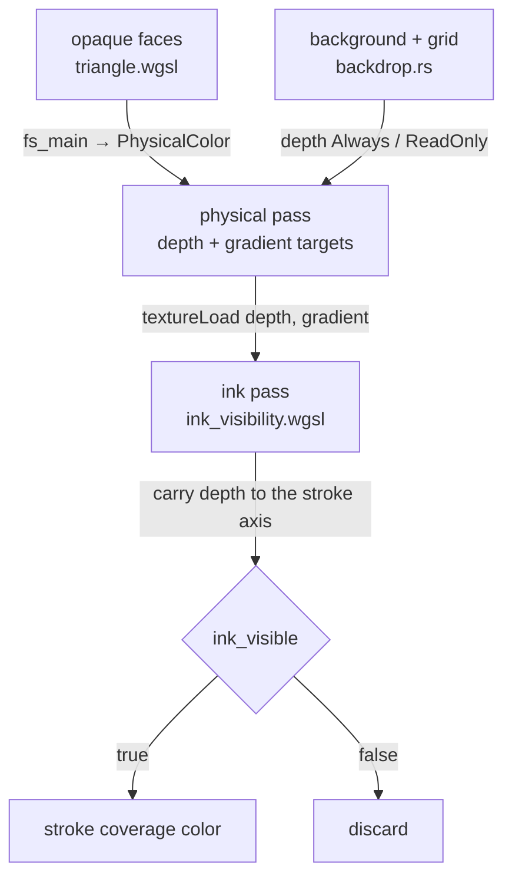


## Starting point

- Checkpoint 04d (all drawing modules present): faces, strokes, markers and clouds draw into one color target with a single-sample depth buffer, and every stroke fragment compares its own depth at its own pixel.
- Rear edges shine through solids at grazing angles: a thick stroke covers samples beside its axis, and those samples belong to a surface whose depth changes sharply within one pixel.
- Depth is reversed: near is larger, far approaches zero.

## Step 1 · The physical contract shared by every shader

Two constants and two output structs, appended to every shader module. `physical_gradient` is the rasterizer's own depth slope of the winning primitive, scaled so `Rg16Float` keeps it.

| Contract | Where it lives |
|---|---|
| `Depth32Float` attachment, cleared to `0.0` (reverse-Z far) | `targets.rs::begin_faces` |
| Solids write with `CompareFunction::Greater` (`DepthMode::Opaque`) | `pipelines/mod.rs` |
| Grid tests without writing (`DepthMode::ReadOnly`), background `DepthMode::Always` | `backdrop.rs` below |
| `@location(1) gradient: vec2<f32>` beside every physical color/ID | `physical.wgsl` below |

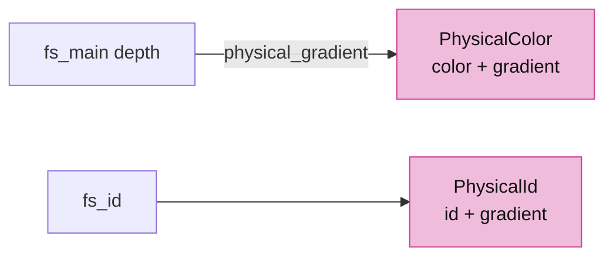

<!-- file: 05 session_viewer/src/shaders/physical.wgsl type -->

## Step 2 · Backdrop shaders

- The background is one oversized triangle at `w = 1.0`, depth `Always`, so it never occludes.
- The grid builds fifty vertices from `vertex_index` alone; it subtracts `line.anchor` because instance rows are rebased on the camera anchor.
- Both return `PhysicalColor` with a zero gradient: neither is a surface ink can be carried across.

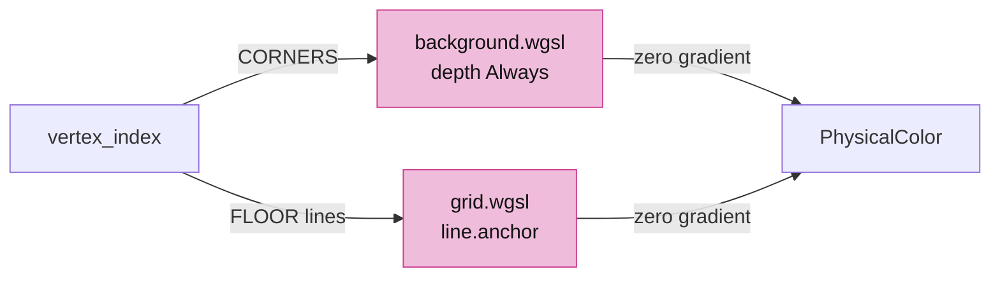

<!-- file: 05 session_viewer/src/shaders/background.wgsl type -->

<!-- file: 05 session_viewer/src/shaders/grid.wgsl type -->

## Step 3 · The backdrop lane

- One owner for two pipelines; no buffers, no upload, `retarget` when the sample count changes.
- `draw_grid` binds `mvp` and the `line` block, matching `@group(0)`/`@group(1)` in `grid.wgsl`.


<!-- file: 05 session_viewer/src/engine/gpu/backdrop.rs type -->

<!-- check: 05 -->

## Step 4 · The ink visibility test

A stroke is drawn as a ribbon of fragments around its mathematical axis. The physical depth at a fragment beside the axis belongs to whatever surface is there, not to the axis:

```text
      fragment ●─────── stroke footprint ───────● fragment
                 \                              /
                  \      axis (depth d)        /
   surface ────────●─────────────────────────●──────── surface
                   z0            depth varies across the footprint
```

Comparing `z0` with `d` directly hides ink on its own face. Instead the physical gradient carries the surface depth from the fragment to the axis point, and only that predicted depth is compared with the axis.

Replace the whole shader in five pieces.

### 4a · Bindings, tolerances and the axis record

- `scene_gradient_*` are the new attachments from step 1; `SCENE_MSAA` picks the multisampled view.
- Tolerances are expressed in float precision and rasterizer snapping, not in world units.

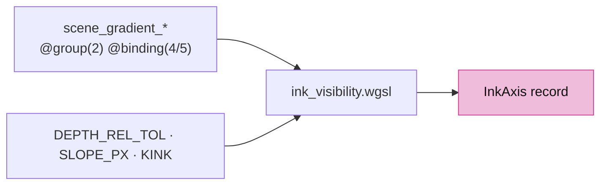

<!-- file: 05 session_viewer/src/shaders/ink_visibility.wgsl type whole lines=1-43 -->

### 4b · Reading depth and fitting a neighbouring pair

- Outside the viewport counts as cleared, so a stroke overhangs the canvas edge.
- `ink_pair_planar` accepts two adjacent texels as one surface only when their slopes agree within `KINK`; a step to another surface is many times the slope.

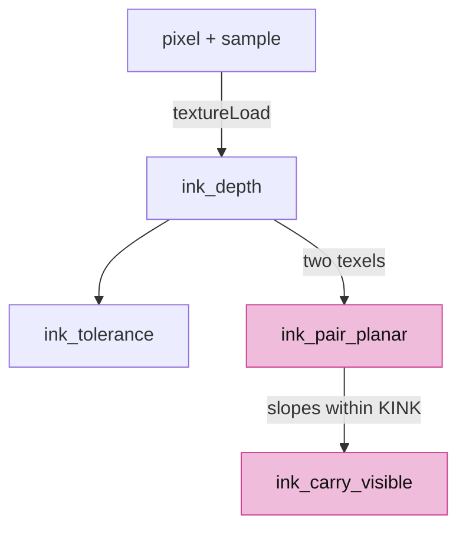

<!-- file: 05 session_viewer/src/shaders/ink_visibility.wgsl type whole lines=44-101 -->

### 4c · Carrying a stroke fragment's surface to the axis

- `ink_axis_visible` fits a plane from the fragment's texel and one neighbour away from the stroke, then evaluates it at the axis.
- `ink_carry_visible` is one-sided: a farther texel can never hide, a nearer texel hides unless its surface passes through the axis.

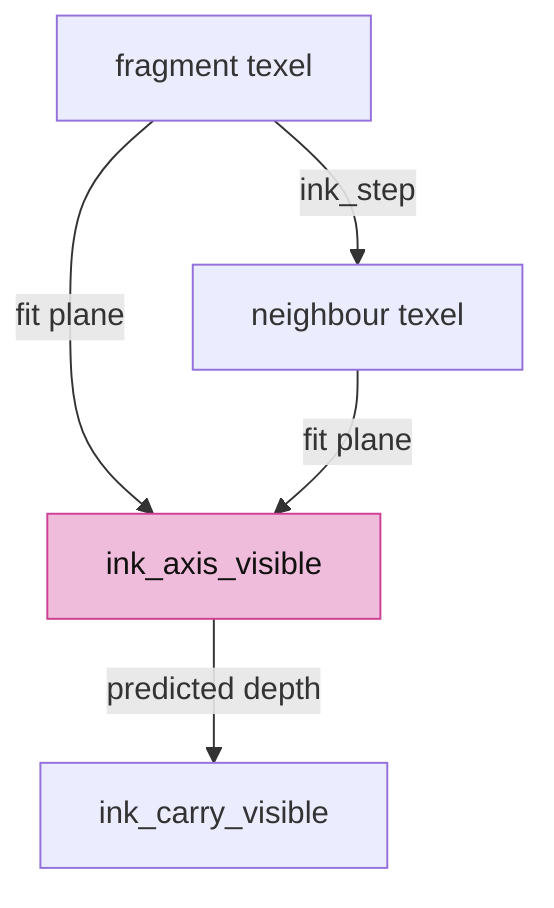

<!-- file: 05 session_viewer/src/shaders/ink_visibility.wgsl type whole lines=102-137 -->

### 4d · Discs: markers stand or fall with their centre

A marker is a camera-facing disc; its rim must not be uncovered by a grazing surface that crosses the disc's depth within a few pixels.

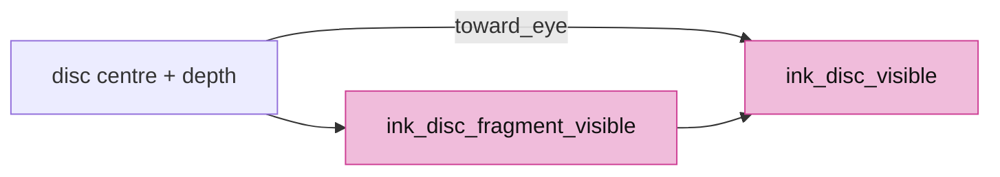

<!-- file: 05 session_viewer/src/shaders/ink_visibility.wgsl type whole lines=138-187 -->

### 4e · Corner fits and the fast path

- `ink_disc_source_hidden` tries each quadrant so a face boundary cannot discard a valid fit.
- `ink_visible` is the entry point strokes call: when the primitive's own gradient is valid, one `textureLoad` and a dot product decide; the neighbouring-pair fit is the fallback for gradients outside the attachment's range.
- A neighbouring triangle is treated as an infinite plane: the fit extends its slope past its edges.

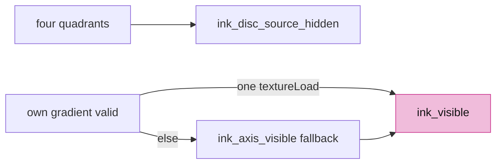

<!-- file: 05 session_viewer/src/shaders/ink_visibility.wgsl type whole lines=188-236 -->

## Step 5 · Shaders emit the gradient

Every fragment that writes physical depth also returns its gradient. Face shaders return the real slope; splats, sheets and ID passes return zero because they are not surfaces ink can be carried across.

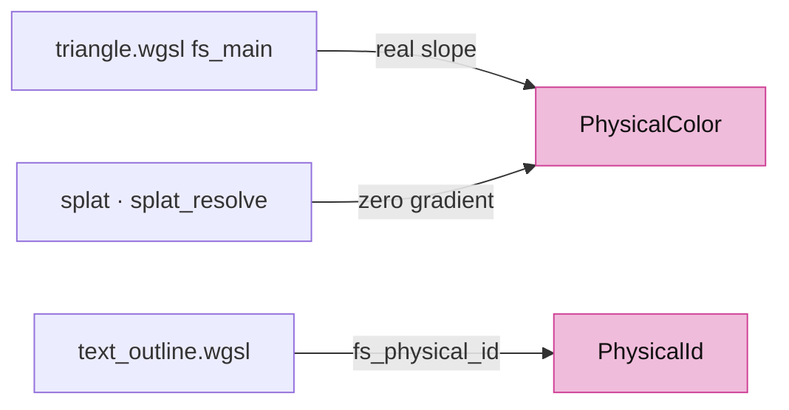

<!-- file: 05 session_viewer/src/shaders/triangle.wgsl type -->

<!-- file: 05 session_viewer/src/shaders/splat.wgsl type -->

<!-- file: 05 session_viewer/src/shaders/splat_resolve.wgsl type -->

<!-- file: 05 session_viewer/src/shaders/text_outline.wgsl type -->

## Step 6 · Targets: the gradient attachment and a sample budget

- `Rg16Float` gradient texture beside depth; single/multisampled views are swapped exactly like the depth views so bind groups stay valid at both sample counts.
- `begin_faces` clears the gradient to transparent alongside the reverse-Z depth clear.
- `msaa_budget`/`samples_for` decide the sample count from the adapter type and pixel count; multisampling smooths hard face edges only, ribbons and discs antialias themselves.

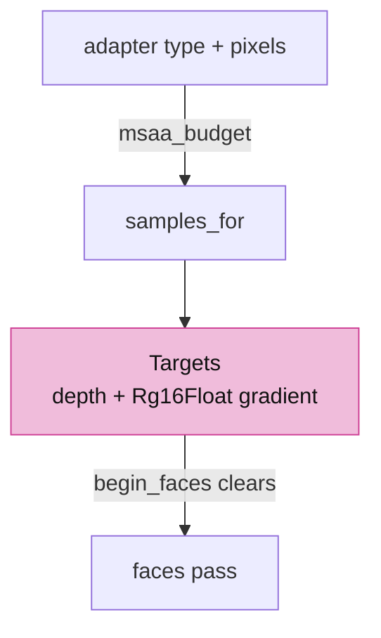

<!-- file: 05 session_viewer/src/engine/gpu/targets.rs type -->

## Step 7 · Pipelines: one flag adds the second color target

- `PipelineDesc::physical()` appends the `Rg16Float` target; `ReadOnlyEqual` pipelines keep the gradient their face already wrote by masking their writes.
- `module` appends `physical.wgsl` after `normals.wgsl`, so every shader sees `PhysicalColor`.

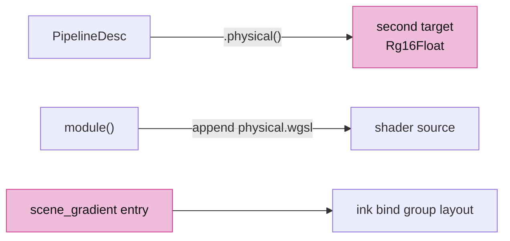

<!-- file: 05 session_viewer/src/engine/pipelines/mod.rs type -->

<!-- file: 05 session_viewer/src/engine/pipelines/layouts.rs type -->

<!-- file: 05 session_viewer/src/engine/gpu/instance.rs type -->

## Step 8 · Lanes read and write the gradient

- The ink bind group gains bindings 4 and 5: `@group(2) @binding(4/5)` in step 4a.
- The arena, splats and outline text build their pipelines with `.physical()`; the arena also gains a selection-mask pipeline.

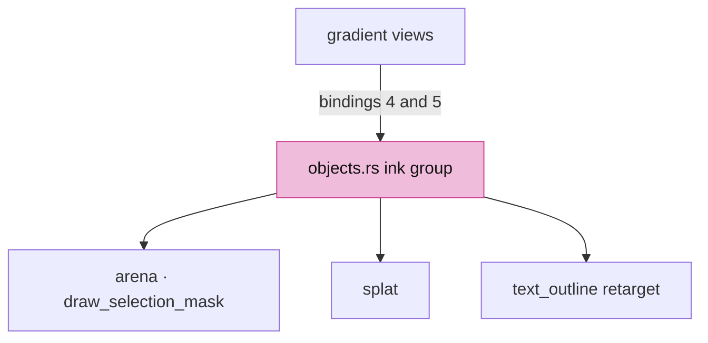

<!-- file: 05 session_viewer/src/engine/gpu/objects.rs type -->

<!-- file: 05 session_viewer/src/engine/gpu/arena.rs type -->

<!-- file: 05 session_viewer/src/engine/gpu/splat.rs type -->

<!-- file: 05 session_viewer/src/engine/gpu/text_outline.rs type -->

## Step 9 · Wire the lane and the sample count

- `retarget` rebuilds targets, ink bind groups and every lane's pipelines when the sample count flips, and only then.
- The backdrop draws first inside `begin_faces`, before any geometry.

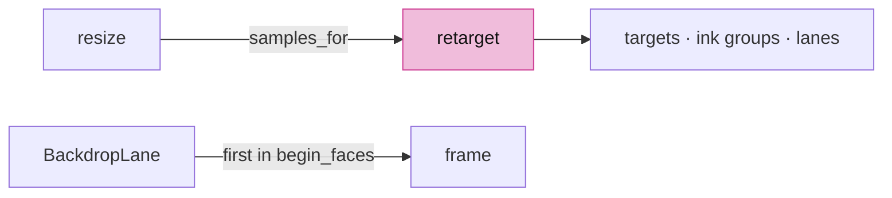

<!-- file: 05 session_viewer/src/engine/gpu/mod.rs type -->

## Step 10 · The fixture and the page

The grey box and the sloping floor are the shapes the visibility test is judged on.

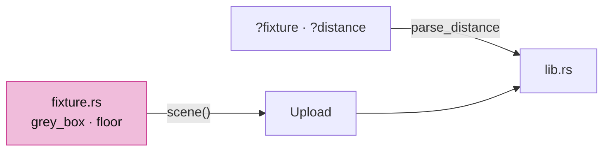

<!-- file: 05 session_viewer/src/fixture.rs copy -->

<!-- file: 05 session_viewer/src/lib.rs type -->

<!-- file: 05 session_viewer/index.html copy -->

## Check

<!-- checkpoint: 05 -->

Expected:

- A grey box on a white background, twelve red edges, black corner markers.
- Orbit: edges on the far side of the box disappear behind its faces; front edges stay at full width up to the corners.
- `?fixture=floor`: magenta lines just under the sloping floor stay hidden; the red line on the floor stays visible.
- `?top`, `?perspective`, `?distance=N` select the view for repeatable inspection.

If every edge disappears, compare the depth clear and compare function against the table in step 1. If hidden edges show through, check that the face pipeline uses `.physical()` and that `fs_main` returns `physical_gradient(in.pos.z)`.


## What changed

<!-- tree: 05 session_viewer/src -->

- Data flow: face fragment → depth + gradient attachments → stroke fragment loads both → `ink_visible` predicts the surface depth at the axis → coverage or discard.
- New lane: `BackdropLane` (background, grid).
- Sample count is chosen per frame from geometry and adapter budget.

**Production equivalent:** `src/engine/gpu/targets.rs`, `backdrop.rs`, `src/shaders/physical.wgsl`, `ink_visibility.wgsl`, `grid.wgsl`, `background.wgsl`; the page entry and the fixture live in `src/lib.rs` and `src/fixture.rs`.

## Try

- Append `?nogrid=1`: the construction grid is gone; it was drawn by `backdrop.rs` with a read-only depth test.
- Orbit until a stroke passes behind the box: the covered span disappears cleanly, without a global depth offset.
- Append `?msaa=4` and compare the stroke fringe with `msaa=1`: multisampling changes coverage, never the visibility decision.


## Recall

This lesson is the conceptual centre of the viewer. If only one lesson is worth being able to reconstruct, it is this one.

??? question "Why can a stroke fragment not simply compare its own depth with the depth buffer?"
    Because a stroke is a *ribbon* of fragments around a mathematical axis, and a fragment beside the axis reads the depth of whatever surface is under *that* pixel — not under the axis. On a face the stroke lies on, half the ribbon would lose the comparison and the line would stitch. The gradient the face pass wrote is what carries the surface depth from the fragment to the axis, and only that predicted depth is compared.

??? question "What exactly is stored in the gradient attachment, and who writes zero into it?"
    The winning primitive's own depth slope in screen space, scaled to survive `Rg16Float`. Surfaces write their real slope; the background, the grid, splats, sheets and every ID pass write zero, because they are not surfaces ink can be carried across. A zero gradient is not "flat" — it means "do not extrapolate me".

??? question "Reverse-Z needs three things to agree, and you have now seen all three in code. Name them."
    The projection swaps near and far; the depth attachment clears to `0.0`; the compare is `Greater`. If every edge vanishes, one of the three is wrong — the lesson's own troubleshooting note says exactly this, and it is worth being able to derive rather than look up.

??? question "Multisampling is chosen per frame from the adapter and the pixel count. Why does it never change the visibility decision?"
    Because visibility is computed per fragment from depth and gradient, not from coverage. MSAA changes how much of a pixel a face covers — the smoothness of a hard edge — while the ink test still asks the same question at the same place. Two mechanisms that both affect edges, kept deliberately independent; `?msaa=4` versus `?msaa=1` is the experiment that proves it.

**Rebuild from memory:** draw the frame on paper — which pass writes depth, which reads it, which attachments exist, and where the backdrop sits. Then predict what a stroke on the *far* side of a box does at each stage. This is the mental model that lessons 12, 17 and 18 extend rather than replace.

## Next

[06 · CAD face contract](06-cad-contract.md): BRep faces, surfaces and boundary records flow from the shared kernel into display data.
