# 05 · Depth and visible ink

## You are building

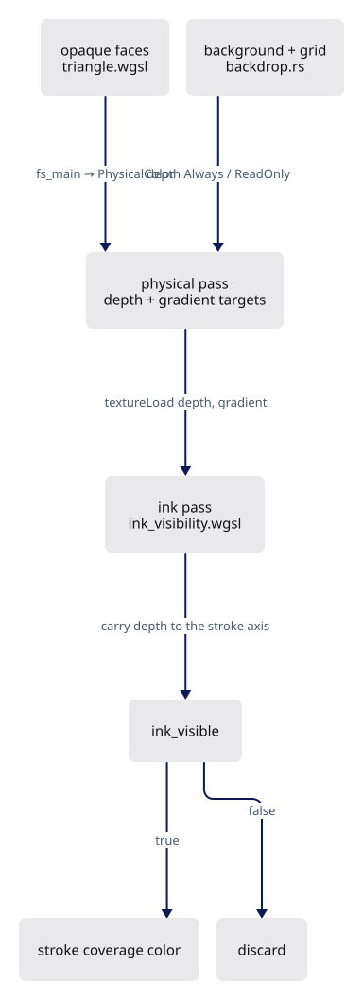

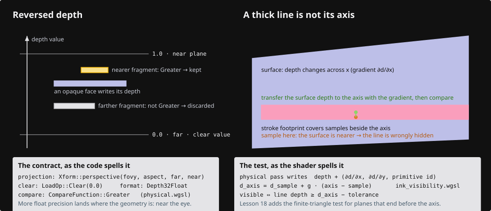

## Starting point

- Checkpoint 04d (all drawing modules present): faces, strokes, markers and clouds draw into one color target with a single-sample depth buffer, and every stroke fragment compares its own depth at its own pixel.
- Rear edges shine through solids at grazing angles: a thick stroke covers samples beside its axis, and those samples belong to a surface whose depth changes sharply within one pixel.
- Depth is reversed: near is larger, far approaches zero.

<!-- step-status: start -->

**Does it compile yet?** Yes — `cargo check` was run at the end of every step of this lesson.

<!-- step-status: end -->

## Step 1 · The physical contract shared by every shader

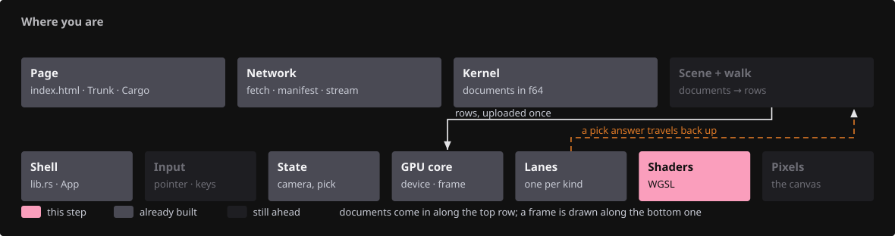{ .locator data-strip="illustrations/strip-ef21ae124d.svg" }

Two constants and two output structs, appended to every shader module. `physical_gradient` is the rasterizer's own depth slope of the winning primitive, scaled so `Rg16Float` keeps it.

| Contract | Where it lives |
|---|---|
| `Depth32Float` attachment, cleared to `0.0` (reverse-Z far) | `targets.rs::begin_faces` |
| Solids write with `CompareFunction::Greater` (`DepthMode::Opaque`) | `pipelines/mod.rs` |
| Grid tests without writing (`DepthMode::ReadOnly`), background `DepthMode::Always` | `backdrop.rs` below |
| `@location(1) gradient: vec2<f32>` beside every physical color/ID | `physical.wgsl` below |

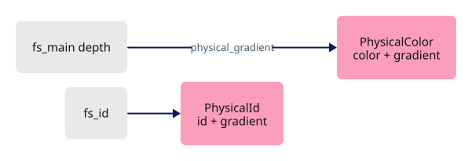

<span class="zone-mark" data-strip="illustrations/strip-ef21ae124d.svg" data-zone="Shaders"></span>

<!-- file: 05 session_viewer/src/shaders/physical.wgsl type -->

## Step 2 · Backdrop shaders

{ .locator data-strip="illustrations/strip-ef21ae124d.svg" }

- The background is one oversized triangle at `w = 1.0`, depth `Always`, so it never occludes.
- The grid builds fifty vertices from `vertex_index` alone; it subtracts `line.anchor` because instance rows are rebased on the camera anchor.
- Both return `PhysicalColor` with a zero gradient: neither is a surface ink can be carried across.

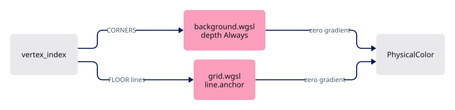

<span class="zone-mark" data-strip="illustrations/strip-ef21ae124d.svg" data-zone="Shaders"></span>

<!-- file: 05 session_viewer/src/shaders/background.wgsl type -->

<span class="zone-mark" data-strip="illustrations/strip-ef21ae124d.svg" data-zone="Shaders"></span>

<!-- file: 05 session_viewer/src/shaders/grid.wgsl type -->


## Step 3 · The backdrop lane

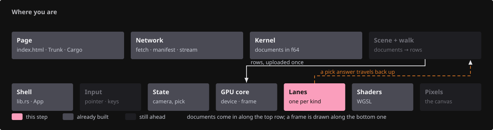{ .locator data-strip="illustrations/strip-445a1edf20.svg" }

- One owner for two pipelines; no buffers, no upload, `retarget` when the sample count changes.
- `draw_grid` binds `mvp` and the `line` block, matching `@group(0)`/`@group(1)` in `grid.wgsl`.


<span class="zone-mark" data-strip="illustrations/strip-445a1edf20.svg" data-zone="Lanes"></span>

<!-- file: 05 session_viewer/src/engine/gpu/backdrop.rs type -->

<!-- check: 05 -->

## Step 4 · The ink visibility test

{ .locator data-strip="illustrations/strip-ef21ae124d.svg" }

A stroke is a ribbon of fragments around its mathematical axis; the depth beside the axis belongs to whatever surface is there, not to the axis:

```text
      fragment ●─────── stroke footprint ───────● fragment
                 \                              /
                  \      axis (depth d)        /
   surface ────────●─────────────────────────●──────── surface
                   z0            depth varies across the footprint
```

Comparing `z0` with `d` directly hides ink on its own face. Instead the physical gradient carries the surface depth from the fragment to the axis point, and only that predicted depth is compared with the axis.


### 4a · Bindings, tolerances and the axis record

- `scene_gradient_*` are the new attachments from step 1; `SCENE_MSAA` picks the multisampled view.
- Tolerances are expressed in float precision and rasterizer snapping, not in world units.

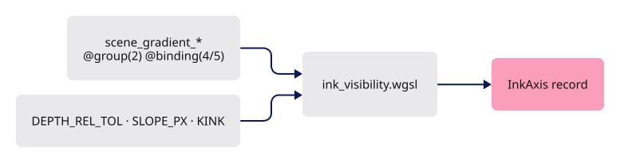

<span class="zone-mark" data-strip="illustrations/strip-ef21ae124d.svg" data-zone="Shaders"></span>

<!-- file: 05 session_viewer/src/shaders/ink_visibility.wgsl type whole lines=1-43 -->

### 4b · Reading depth and fitting a neighbouring pair

- Outside the viewport counts as cleared, so a stroke overhangs the canvas edge.
- `ink_pair_planar` accepts two adjacent texels as one surface only when their slopes agree within `KINK`; a step to another surface is many times the slope.

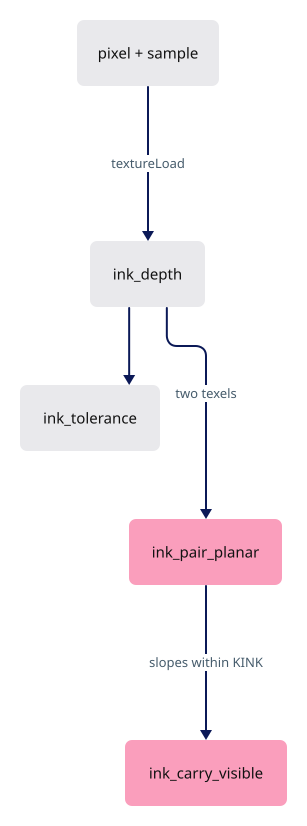

<span class="zone-mark" data-strip="illustrations/strip-ef21ae124d.svg" data-zone="Shaders"></span>

<!-- file: 05 session_viewer/src/shaders/ink_visibility.wgsl type whole lines=44-101 -->

### 4c · Carrying a stroke fragment's surface to the axis

- `ink_axis_visible` fits a plane from the fragment's texel and one neighbour away from the stroke, then evaluates it at the axis.
- `ink_carry_visible` is one-sided: a nearer texel hides the stroke unless its surface passes through the axis, while a farther texel keeps the plain compare.

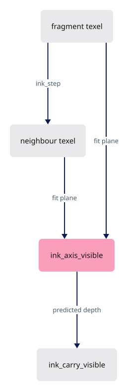

<span class="zone-mark" data-strip="illustrations/strip-ef21ae124d.svg" data-zone="Shaders"></span>

<!-- file: 05 session_viewer/src/shaders/ink_visibility.wgsl type whole lines=102-137 -->

### 4d · Discs: markers stand or fall with their centre

A marker is a camera-facing disc; its rim must not be uncovered by a grazing surface that crosses the disc's depth within a few pixels.


<span class="zone-mark" data-strip="illustrations/strip-ef21ae124d.svg" data-zone="Shaders"></span>

<!-- file: 05 session_viewer/src/shaders/ink_visibility.wgsl type whole lines=138-187 -->

### 4e · Corner fits and the fast path

- `ink_disc_source_hidden` tries each quadrant so a face boundary cannot discard a valid fit.
- `ink_visible` is the entry point strokes call: when the primitive's own gradient is valid, one `textureLoad` and a dot product decide; the neighbouring-pair fit is the fallback for gradients outside the attachment's range.
- A neighbouring triangle is treated as an infinite plane: the fit extends its slope past its edges.

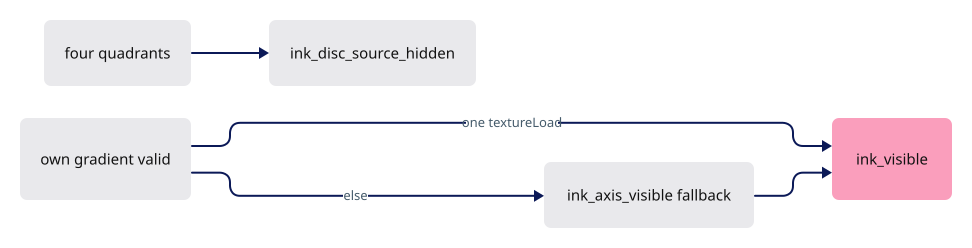

<span class="zone-mark" data-strip="illustrations/strip-ef21ae124d.svg" data-zone="Shaders"></span>

<!-- file: 05 session_viewer/src/shaders/ink_visibility.wgsl type whole lines=188-236 -->

## Step 5 · Shaders emit the gradient

{ .locator data-strip="illustrations/strip-ef21ae124d.svg" }

Every fragment that writes physical depth also returns its gradient. Face shaders return the real slope in the colour pass and the ID pass alike; the background, the grid, splats and imported lettering return zero, because they are not surfaces ink can be carried across.

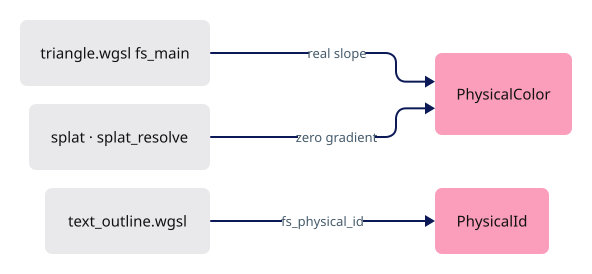

<span class="zone-mark" data-strip="illustrations/strip-ef21ae124d.svg" data-zone="Shaders"></span>

<!-- file: 05 session_viewer/src/shaders/triangle.wgsl type -->

<span class="zone-mark" data-strip="illustrations/strip-ef21ae124d.svg" data-zone="Shaders"></span>

<!-- file: 05 session_viewer/src/shaders/splat.wgsl type -->


<span class="zone-mark" data-strip="illustrations/strip-ef21ae124d.svg" data-zone="Shaders"></span>

<!-- file: 05 session_viewer/src/shaders/splat_resolve.wgsl type -->

- The resolve is where a private pass rejoins the shared one: it reads the lane's own depth and colour, lights each point from its neighbours, and writes `frag_depth` so the scene's depth test does the rest.

<span class="zone-mark" data-strip="illustrations/strip-ef21ae124d.svg" data-zone="Shaders"></span>

<!-- file: 05 session_viewer/src/shaders/text_outline.wgsl type -->

- Imported lettering's pipelines stay depth read-only: glyphs are drawn against the depth their page already wrote, never lit and never re-spaced.

## Step 6 · Targets: the gradient attachment and a sample budget

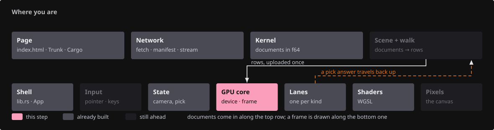{ .locator data-strip="illustrations/strip-203427a3dc.svg" }

- `Rg16Float` gradient texture beside depth; single/multisampled views are swapped exactly like the depth views so bind groups stay valid at both sample counts.
- `begin_faces` clears the gradient to transparent alongside the reverse-Z depth clear.
- `msaa_budget`/`samples_for` decide the sample count from the adapter type and pixel count; multisampling smooths hard face edges only, ribbons and discs antialias themselves.

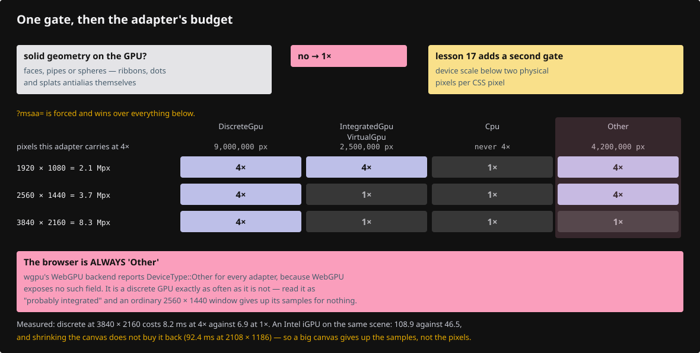

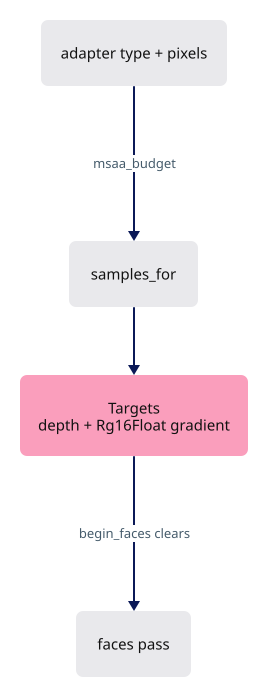

<span class="zone-mark" data-strip="illustrations/strip-203427a3dc.svg" data-zone="GPU core"></span>

<!-- file: 05 session_viewer/src/engine/gpu/targets.rs type -->

## Step 7 · Pipelines: one flag adds the second color target

{ .locator data-strip="illustrations/strip-203427a3dc.svg" }

- `PipelineDesc::physical()` appends the `Rg16Float` target; `ReadOnlyEqual` pipelines keep the gradient their face already wrote by masking their writes.
- `module` appends `physical.wgsl` after `normals.wgsl`, so every shader sees `PhysicalColor`.

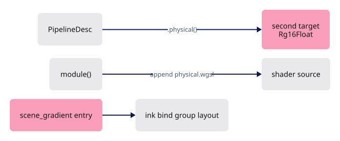

<span class="zone-mark" data-strip="illustrations/strip-203427a3dc.svg" data-zone="GPU core"></span>

<!-- file: 05 session_viewer/src/engine/pipelines/mod.rs type -->

<span class="zone-mark" data-strip="illustrations/strip-203427a3dc.svg" data-zone="GPU core"></span>

<!-- file: 05 session_viewer/src/engine/pipelines/layouts.rs type -->

- Group 2 grows: the ink variant now carries the depth and gradient views.

<span class="zone-mark" data-strip="illustrations/strip-203427a3dc.svg" data-zone="GPU core"></span>

<!-- file: 05 session_viewer/src/engine/gpu/instance.rs type -->

- `physical.wgsl` joins the shader sources the mirror test parses, so the new output is checked against the Rust side.

## Step 8 · Lanes read and write the gradient

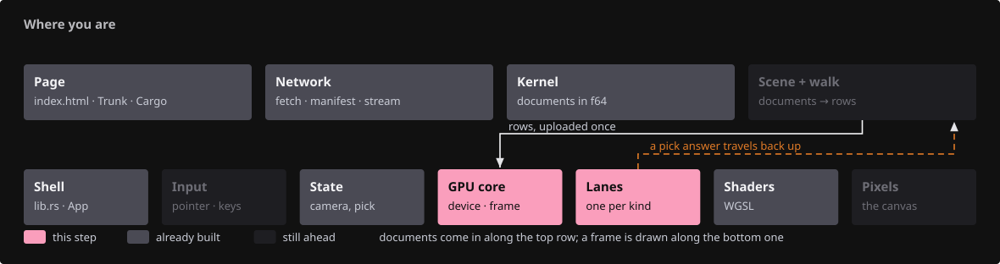{ .locator data-strip="illustrations/strip-5fb45cfc9e.svg" }

- The ink bind group gains bindings 4 and 5: `@group(2) @binding(4/5)` in step 4a.
- The arena, splats and outline text build their pipelines with `.physical()`; the arena also gains a selection-mask pipeline.

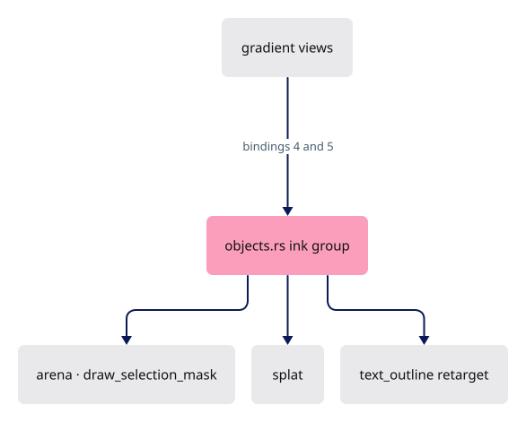

<span class="zone-mark" data-strip="illustrations/strip-203427a3dc.svg" data-zone="GPU core"></span>

<!-- file: 05 session_viewer/src/engine/gpu/objects.rs type -->

<span class="zone-mark" data-strip="illustrations/strip-445a1edf20.svg" data-zone="Lanes"></span>

<!-- file: 05 session_viewer/src/engine/gpu/arena.rs type -->

- The selection-mask pipeline writes the coverage the outline pass will read.

<span class="zone-mark" data-strip="illustrations/strip-445a1edf20.svg" data-zone="Lanes"></span>

<!-- file: 05 session_viewer/src/engine/gpu/splat.rs type -->

- `.physical()` on the ID pipeline and the resolve: the cloud now writes the same metadata as every other surface, which is what lets ink judge itself against a point cloud.

<span class="zone-mark" data-strip="illustrations/strip-445a1edf20.svg" data-zone="Lanes"></span>

<!-- file: 05 session_viewer/src/engine/gpu/text_outline.rs type -->


## Step 9 · Wire the lane and the sample count

{ .locator data-strip="illustrations/strip-203427a3dc.svg" }

- `retarget` rebuilds targets and ink bind groups on a resize or a sample-count flip; the lanes' pipelines only when the count flips.
- The backdrop draws first inside `begin_faces`, before any geometry.

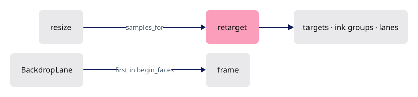

<span class="zone-mark" data-strip="illustrations/strip-203427a3dc.svg" data-zone="GPU core"></span>

<!-- file: 05 session_viewer/src/engine/gpu/mod.rs type -->

## Step 10 · The fixture and the page

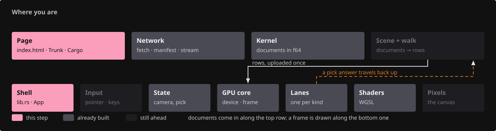{ .locator data-strip="illustrations/strip-75e0f98df5.svg" }

The grey box and the sloping floor are the shapes the visibility test is judged on.

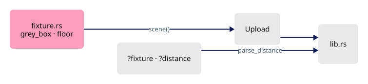

<span class="zone-mark" data-strip="illustrations/strip-6e964d1d1f.svg" data-zone="Shell"></span>

<!-- file: 05 session_viewer/src/fixture.rs copy -->

<span class="zone-mark" data-strip="illustrations/strip-6e964d1d1f.svg" data-zone="Shell"></span>

<!-- file: 05 session_viewer/src/lib.rs type -->

- A lane costs the shell a hunk or two: construct it where the others are built, and report it.

<span class="zone-mark" data-strip="illustrations/strip-a7bdebbf9f.svg" data-zone="Page"></span>

<!-- file: 05 session_viewer/index.html copy -->

## Check

<!-- checkpoint: 05 -->

Expected:

- A grey box on a white background, twelve red edges, black corner markers.
- Orbit: edges on the far side of the box disappear behind its faces; front edges stay at full width up to the corners.
- `?fixture=floor`: magenta lines just under the sloping floor stay hidden; the red line on the floor stays visible.
- `?top`, `?perspective`, `?distance=N` select the view for repeatable inspection.

If every edge disappears, compare the depth clear and compare function against the table in step 1. If hidden edges show through, check that the face pipeline uses `.physical()` and that `fs_main` returns `physical_gradient(in.pos.z)`.

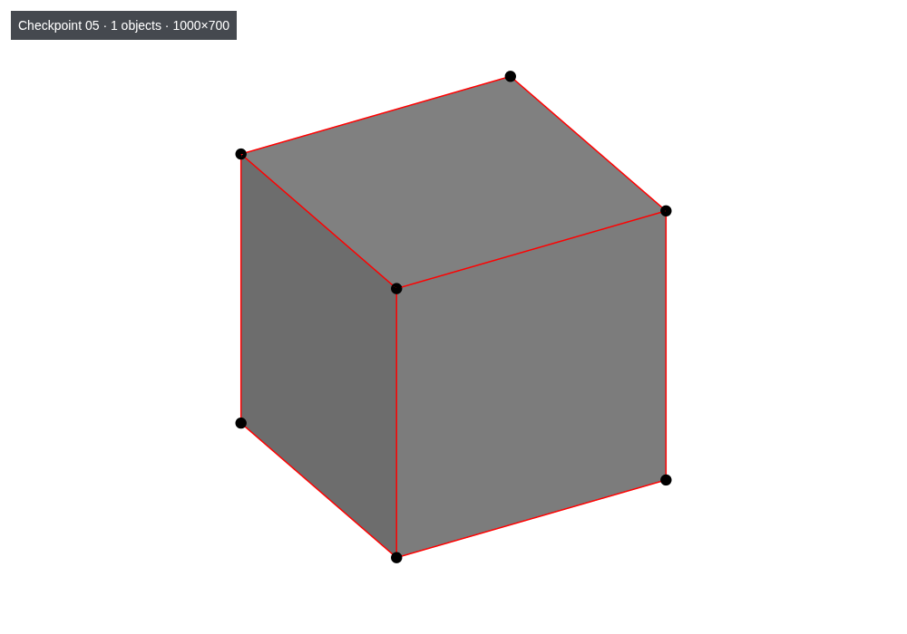

## What changed

<!-- tree: 05 session_viewer/src -->

- Data flow: face fragment → depth + gradient attachments → stroke fragment loads both → `ink_visible` predicts the surface depth at the axis → coverage or discard.
- New lane: `BackdropLane` (background, grid).
- Sample count is re-chosen on upload and on resize, from the geometry present and the adapter budget.

**Production equivalent:** `src/engine/gpu/targets.rs`, `backdrop.rs`, `src/shaders/physical.wgsl`, `ink_visibility.wgsl`, `grid.wgsl`, `background.wgsl`; the page entry is `src/lib.rs`. The fixture is scaffolding: lesson 12 deletes it for the manifest loader.

## Try

- Append `?nogrid=1`: the construction grid is gone; it was drawn by `backdrop.rs` with a read-only depth test.
- Orbit until a stroke passes behind the box: the covered span disappears cleanly, without a global depth offset.
- Append `?msaa=4` and compare the stroke fringe with `msaa=1`: multisampling changes coverage, never the visibility decision.

## Questions and answers


**Why can a stroke fragment not simply compare its own depth with the depth buffer?**

*How to work it out.* A stroke is a *ribbon* several pixels wide; an edge fragment reads the depth buffer at *its own* pixel, which is the surface under that pixel, not under the axis. On the stroke's own face the axis sits on the surface while the edge fragments sit over surface a little nearer or further.

*The answer.* Half the ribbon loses the naive comparison and the line stitches. Carry the surface depth to the axis with the gradient the face pass stored, and compare only that prediction.

**What exactly is stored in the gradient attachment, and who writes zero into it?**

*How to work it out.* Travelling along a surface from pixel to pixel needs the rate its depth changes per pixel — its screen-space slope. Then ask which things on screen are not surfaces you can slide along.

*The answer.* The winning primitive's own depth slope, scaled to survive `Rg16Float`. Faces write their real slope in both the colour and the ID pass; the background, the grid, splats and imported lettering write zero, because extrapolating across them is meaningless. A zero gradient does not mean "flat" — it means "do not extrapolate me".

**Reverse-Z needs three things to agree, and you have now seen all three in code. Name them.**

*How to work it out.* Lesson 02's three, now in code: the projection, the clear, the compare.

*The answer.* Near and far swapped in the projection; the depth attachment cleared to `0.0`; the compare `Greater`. If every edge disappears, one of the three is wrong.

**Multisampling is chosen from the adapter and the pixel count. Why does it never change the visibility decision?**

*How to work it out.* Separate the two things MSAA affects. It changes how many samples a triangle covers within a pixel — a coverage question. The ink test asks whether the axis is behind a surface — a depth question. At 4x it runs once per sample against that sample's own depth and gradient; coverage never enters it.

*The answer.* Because visibility is decided from depth and gradient, not from coverage. MSAA smooths hard face edges; the ink test still asks the same question at the same place. `?msaa=4` against `?msaa=1` is the experiment that shows it: the fringe changes, the decision does not.

**What you should be able to do now**

Draw the frame on paper. Correct: the face pass clears colour, depth and gradient and writes all three, the backdrop drawing first inside it; the ink pass loads colour, holds depth read-only and samples depth and gradient through group 2. Then predict a stroke on the far side of a box: its axis loses against the box's carried depth, so its fragments discard.

## Next

[06 · CAD face contract](06-cad-contract.md): BRep faces, surfaces and boundary records flow from the shared kernel into display data.
