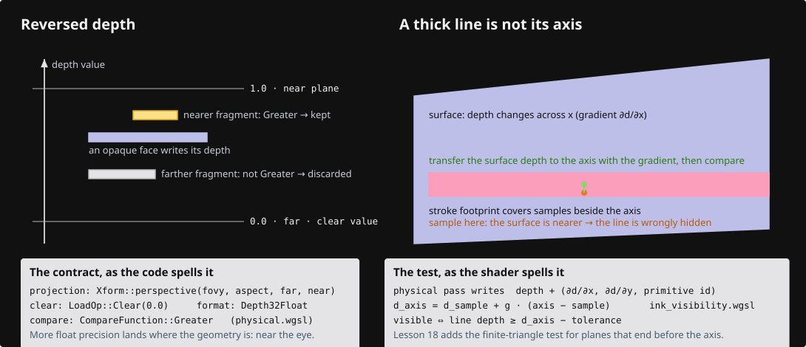

# 05 · Depth and visible ink

**Estimated study time: about 1–3 hours.** Includes reading, typing, tracing, testing and experiments. [How to use this estimate](map.md#time-estimates).

**This section:** Trace how surfaces decide whether nearby ink is visible.

**In the whole viewer:** This reviews the boundary between the surface depth pass and the stroke pass; you reuse the renderer already built.

**Follow the data:** Visible surface → depth and plane data → stroke comparison → kept or hidden ink.

**Start with these files:** [`src/shaders/ink_visibility.wgsl`](04b-strokes.md#code-04b-046).

**Aim to explain:** Why can two nearby pixels on one face have different valid depths?

[Whole-viewer map and course milestones](map.md)

A depth image records the nearest surface at each sample. Near a sloping face, neighbouring pixels naturally have different depths. Treating that difference as a gap can make edges disappear or leak through. We use the actual face plane where possible, then a fallback when its data is unavailable.



Start from the working result of [step 04d](04d-clouds.md).

This is a review step. Keep your existing code and use the experiment below to check your understanding.

## Check the completed chapter

From `session_viewer`, compare everything you have typed:

```sh
npm --prefix ../session_tests run course -- reference-check 05
```

From `workspace/handwritten`:

```sh
cargo build --lib --locked -j4
cargo xtest --lib --locked -j4
```

Run the native visibility tests. Trace the background branch, the valid-plane branch and one fallback branch on paper.

If distant edges leak through, check the triangle identity and the fallback path. A larger universal depth offset can hide one defect while creating another.

**Before moving on:** explain what changed, check the expected result above, and fix any build or test failure.

<details>
<summary>Check your explanation of the opening question</summary>

A sloping face changes depth across the image. A depth difference alone does not establish a gap or a second surface.

</details>

[Next step: 06](06-cad-contract.md)
