# 06 · CAD face contract

## You are building

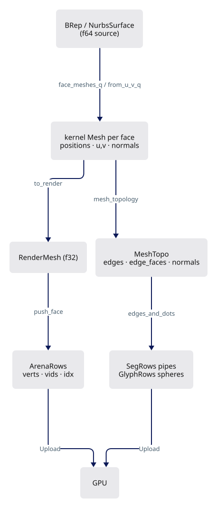

## Starting point

- Checkpoint 05: hand-built quads, strokes and markers in `fixture.rs`; physical depth and visible ink work.
- Nothing yet reads a Session `Mesh`, `BRep` or `NurbsSurface`. This lesson adds the whole `app/walk` producer layer and its first CAD consumer.
- A shading crease is a kernel decision; the viewer only carries it. One kernel edit comes first.

<!-- supplied: 06 -->

<!-- step-status: start -->

**Does it compile yet?** Yes — `cargo check` was run at the end of every step of this lesson.

<!-- step-status: end -->

## Step 1 · Kernel: one-sided normals at a C0 knot

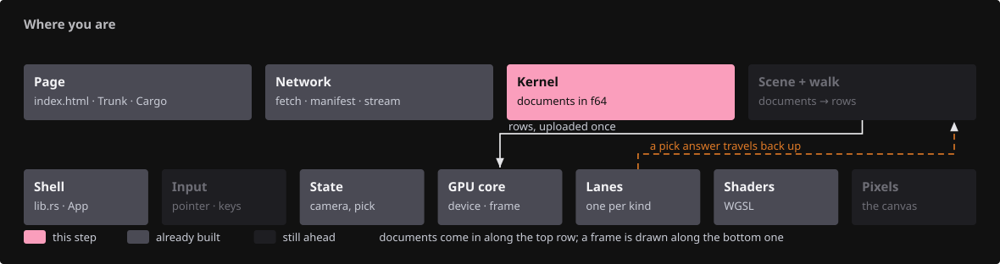{ .locator data-strip="illustrations/strip-a84a26918d.svg" }

- A knot repeated `degree` times folds the surface; averaging normals across that fold makes a sharp edge look rounded.
- The grid mesher splits a shading vertex on the crease side: same position and `u`/`v`, different normal, so the split never invents a CAD vertex.
- Face keys are sorted before accumulation: float sums are order-dependent, and map order must not reach the mesh bytes.

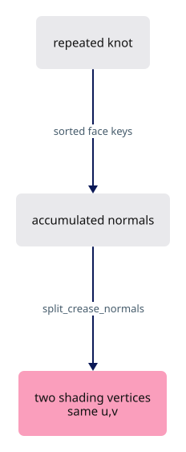

<!-- file: 06 session_rust/src/remesh_nurbssurface_grid.rs type hunks=1-4 -->

`split_crease_normals` is `pub(crate)`: the trimmed mesher in `nurbssurface_trimmed.rs` shares it.

<!-- file: 06 session_rust/src/remesh_nurbssurface_grid.rs type hunks=5-5 -->

<!-- check: 06 -->

## Step 2 · Row encodings

{ .locator data-strip="illustrations/strip-bb17a255a3.svg" }

- Every producer packs the same four things: pen width → world radius, colour → RGBA8, unit normal → 16-bit octahedral code, two normals → one `facing` word.
- `FACING_UNKNOWN` is all ones and means "no adjacency, always draw"; `pack_facing` steps around that value.

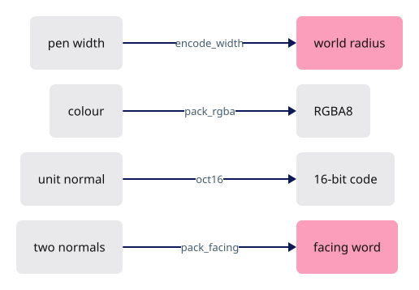

<!-- file: 06 session_viewer/src/app/walk/encode.rs type -->

## Step 3 · What a producer reports

{ .locator data-strip="illustrations/strip-bb17a255a3.svg" }

- `WalkCx`: where an object's rows land (vertex base, object row). `Row`: what the producer measured (local box, spacing, flags, and whether it drew faces).
- The `mod.rs` also declares the modules you type in the following steps; nothing compiles them until `app/mod.rs` names `walk` in step 11.

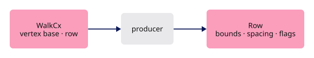

<!-- file: 06 session_viewer/src/app/walk/mod.rs type -->

## Step 4 · Per-file sweeps

{ .locator data-strip="illustrations/strip-bb17a255a3.svg" }

- A sheet (planar file) is detected after the walk from the object rows, so producers stay ignorant of documents.
- The sweeps read only this file's rows, against the `Baselines` captured before the walk.

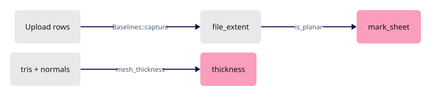

<!-- file: 06 session_viewer/src/app/walk/bounds.rs type -->

## Step 5 · Fused mesh topology

{ .locator data-strip="illustrations/strip-bb17a255a3.svg" }

- One pass over the faces gives the ink lanes everything: unique edges with pen colours, the two faces at each edge, face normals, closedness.
- Edges hang off their low vertex on an intrusive chain; a mesh with sparse vertex keys still indexes in O(1) through `SlotMap`.

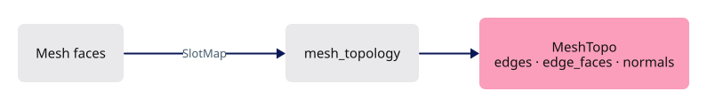

<!-- file: 06 session_viewer/src/app/walk/mesh_topology.rs type lines=1-48 -->

- Newell normals, not the first three corners: a reflex second corner would invert the normal and turn a flat region into a crease.

<!-- file: 06 session_viewer/src/app/walk/mesh_topology.rs type lines=49-95 -->

- Faces are slotted by arrival, not by direction; `opposed` records a winding disagreement instead of declaring the solid open.

<!-- file: 06 session_viewer/src/app/walk/mesh_topology.rs type lines=96-173 -->

## Step 6 · Ink: pipes for edges, spheres for vertices

{ .locator data-strip="illustrations/strip-bb17a255a3.svg" }

- The ink pass reads the topology and the f32 positions by slot, and writes only `SegRows.pipes` and `GlyphRows.spheres`.
- When a pair's winding disagrees, the second normal is negated: the facing test needs two outward normals.

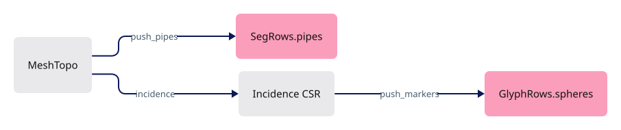

<!-- file: 06 session_viewer/src/app/walk/mesh_ink.rs type lines=1-67 -->

- The rest is the crease test: the cosine between two face normals decides whether a shared edge is a border, a crease, or an interior diagonal nobody should see.

<!-- file: 06 session_viewer/src/app/walk/mesh_ink.rs type lines=68-110 -->

- A smooth tessellation inks only borders and creases; a coplanar diagonal is dropped unless `VIEWER_ALL_EDGES` asks for it.
- `pipe_ids` gets the source edge index for an authored mesh and `u32::MAX` for a tessellation seam: selection must never return an invented edge.

<!-- file: 06 session_viewer/src/app/walk/mesh_ink.rs type lines=111-146 -->

- Incidence is CSR over the edges: each vertex knows its widest visible edge and every incident edge, so a marker can carry up to six face normals.

<!-- file: 06 session_viewer/src/app/walk/mesh_ink.rs type lines=147-192 -->

<!-- file: 06 session_viewer/src/app/walk/mesh_ink.rs type lines=193-250 -->

- One entry point does both lanes in order — pipes, then markers unless `VIEWER_NO_DOTS` — so a caller cannot produce edges without the vertices that belong to them.

<!-- file: 06 session_viewer/src/app/walk/mesh_ink.rs type lines=251-268 -->

<!-- file: 06 session_viewer/src/app/walk/mesh_ink.rs copy lines=269-373 -->

## Step 7 · One mesh into the tables

{ .locator data-strip="illustrations/strip-bb17a255a3.svg" }

- Gates first: above `MESH_RAW_MIN` triangles a mesh is faces only; a print fill (single width 0) takes the sheet index runs.
- `MeshOpts::SURFACE` marks a tessellation: `FLAG_SMOOTH` tells the marker lane its vertices are samples, and its seams are sampling rather than geometry. `OBJECT` and `ELEMENT` are the authored-mesh presets, which differ in whether an open mesh may be flagged open.

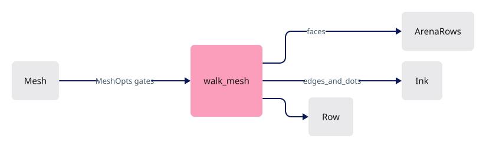

<!-- file: 06 session_viewer/src/app/walk/mesh.rs type lines=1-56 -->

- Named presets keep those three decisions out of the producer bodies.

<!-- file: 06 session_viewer/src/app/walk/mesh.rs type lines=57-78 -->

<!-- file: 06 session_viewer/src/app/walk/mesh.rs copy lines=79-141 -->

- Faces go into the arena with `vids = cx.row`; the ink pass runs only on decorated meshes with a topology.

<!-- file: 06 session_viewer/src/app/walk/mesh.rs type lines=142-236 -->

## Step 8 · Curves into the ribbon lane

{ .locator data-strip="illustrations/strip-bb17a255a3.svg" }

- Lines and polylines become one flat ribbon per span with `FACING_UNKNOWN`: free linework has no faces to cull against.

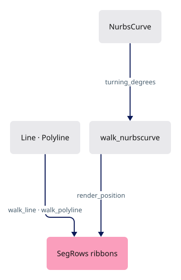

<!-- file: 06 session_viewer/src/app/walk/curves.rs type lines=1-61 -->

- A NURBS curve is sampled by turning angle of its control polygon, so a full circle gets the same chord count at any radius.
- `render_position` is the f64 → f32 boundary for every sampled point; a producer already holding f32 endpoints casts them where it builds them.

<!-- file: 06 session_viewer/src/app/walk/curves.rs type lines=62-125 -->

- A NURBS curve reaches the GPU as a polyline, sampled by its own turning rather than a fixed count, and then takes the polyline path. One sampling rule, used everywhere a curve is drawn.

<!-- file: 06 session_viewer/src/app/walk/curves.rs type lines=126-147 -->

## Step 9 · Edge records and the first BRep consumer

{ .locator data-strip="illustrations/strip-bb17a255a3.svg" }

- Topology records only: which edge, which face, which orientation. The records carry no geometry.

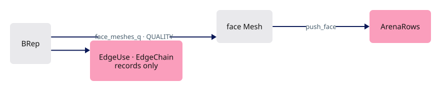

<!-- file: 06 session_viewer/src/app/walk/brep_edges.rs type -->

- Each BRep face keeps its own vertices and the kernel's normals; nothing is welded across faces, so a planar face never inherits a neighbour's normal.
- `QUALITY` is a display decision: the viewer asks for finer sampling than the kernel default.

<!-- file: 06 session_viewer/src/app/walk/brep.rs type -->

## Step 10 · Launch-time knobs

{ .locator data-strip="illustrations/strip-3bd0a898de.svg" }

Presence-only environment flags, read once per process; always false in the browser.

<!-- file: 06 session_viewer/src/app/knobs.rs copy -->

## Step 11 · Wire the producers

{ .locator data-strip="illustrations/strip-3bd0a898de.svg" }

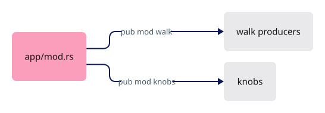

<!-- file: 06 session_viewer/src/app/mod.rs type -->

<!-- check: 06 -->

## Step 12 · The fixture becomes a source scene

{ .locator data-strip="illustrations/strip-3bd0a898de.svg" }

- `CadFixture` retains the f64 source objects and a `SourceIdentity` per object row; the GPU only receives prepared tables.
- The same `add` path serves BRep and surface sources, so a row maps back to a GUID without searching triangles.

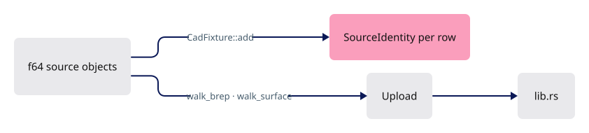

<!-- file: 06 session_viewer/src/fixture.rs copy -->

<!-- file: 06 session_viewer/src/lib.rs type -->

## Step 13 · Flat preview shading

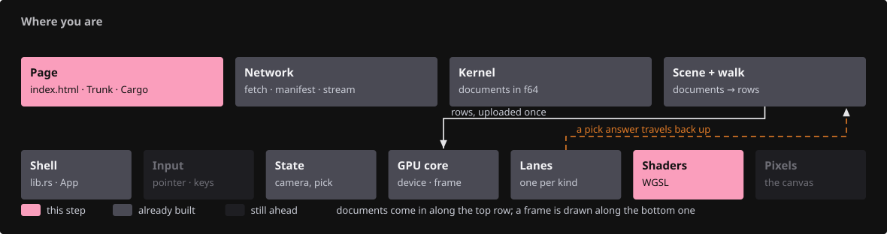{ .locator data-strip="illustrations/strip-c2d15201e1.svg" }

The shader ignores vertex normals and shades from the finite face fallback, so a wrong normal contract cannot hide behind lighting.

<!-- file: 06 session_viewer/src/shaders/triangle.wgsl type -->

<!-- file: 06 session_viewer/index.html copy -->

## Check

<!-- checkpoint: 06 -->

Expected:

- A grey shaded planar face fills a large part of the canvas; its four natural boundaries draw as black ink separate from the fill.
- The status reads one object; the inspection JSON lists `sourceObjects` with a GUID and `sourceEdgeIds`.
- Orbit: fill and boundary move together.

If the face is missing, follow producer → `Upload` → arena → draw range. If boundaries float off the face, the two f64 → f32 conversions differ.

## What changed

<!-- tree: 06 session_viewer/src/app -->

- New producer layer: kernel mesh → `ArenaRows` faces + `SegRows`/`GlyphRows` ink, with source identity kept beside every row.
- Data flow: f64 source → kernel `Mesh` with `u`/`v`/normal attributes → f32 `RenderMesh` → arena; topology → pipes and spheres.

**Production equivalent:** Production keeps this in `src/app/walk/{mod,bounds,encode,mesh,mesh_ink,mesh_topology,curves,brep,brep_edges}.rs` and `src/app/knobs.rs`. The [CAD design record](cad-design.md) documents the producer contract.

## Try

- Append `?top=1` or `?perspective=1`: the fixture is viewed from a fixed camera, which makes a boundary that drifts off its face easy to spot.
- Append `?distance=3` and then `?distance=12`: the pipes keep their pixel width while the faces shrink; the boundary nodes move with the mesh because they are the mesh. (`parse_distance` accepts 1 to 16 and ignores anything else.)
- Append `?thickness=3`: the boundary pipes widen on screen but stay glued to their faces, because their endpoints are face-mesh nodes, not a separately sampled curve.

## Questions and answers

**A producer reports a `Row` and is given a `WalkCx`. What is the boundary this draws, and why does it matter?**

*How to work it out.* `WalkCx` gives positions in the output (vertex base, object row); `Row` reports measurements of the input (box, spacing, flags). What is *absent* from both is the design: the file, the document, the selection, the camera.

*The answer.* A producer turns one geometry into rows and knows nothing else — which is why a sheet is detected after the walk from the object rows, and why a new geometry type costs one producer rather than an edit to the scene.

**Face normals are computed with Newell's method rather than from the first three corners. What goes wrong with three corners?**

*How to work it out.* Make a flat polygon's second corner reflex — push it inward past 180°. The cross product of the first two edges now points the other way while the polygon is unchanged. Authored geometry has reflex corners often.

*The answer.* The face reads as facing backwards, and downstream that is a crease in a surface that has none, or a back face painted red. Newell sums over every edge, so one awkward corner cannot flip the result: for human-authored input, prefer the formula that averages over the one that samples.

**`pipe_ids` stores the source edge index for an authored mesh but `u32::MAX` for a tessellation seam. Why not just number the seams?**

*How to work it out.* A pick returns that id and the viewer tells the user what they selected — so, is there anything in the document to name? A tessellation seam exists only because the surface was cut this finely; mesh it differently and it is gone.

*The answer.* Numbering it would hand selection an invented identity: the user clicks something that is not in their model. Refusing is the correct answer — the same refusal as lesson 08's periodic seams.

**Face keys are sorted before their normals are accumulated. What bug does the sort prevent?**

*How to work it out.* Float addition is not associative: `(a + b) + c` and `a + (b + c)` differ in the last bits. What decides the order here is iteration over a hash map, which is not stable.

*The answer.* Without the sort the same mesh produces different bytes on different runs, which breaks every hash the course verifies and makes bugs unreproducible. Determinism is something you write down.

**What you should be able to do now**

Name the four things every producer packs and why: pen width → world radius (the GPU works in world units), colour → RGBA8 (four bytes, and colour needs no more), unit normal → 16-bit octahedral code (a unit vector has two degrees of freedom), two normals → one `facing` word (the marker and edge lanes need adjacency, not geometry). Then predict which a point-cloud producer skips: facing and normals — a point has no adjacency, which is why `FACING_UNKNOWN` exists.

## Next

[07 · Shared boundaries](07-boundaries.md): one canonical chain per BRep edge, constrained into every incident face, drawn from the exact mesh nodes.
