# 06 · CAD face contract

## You are building

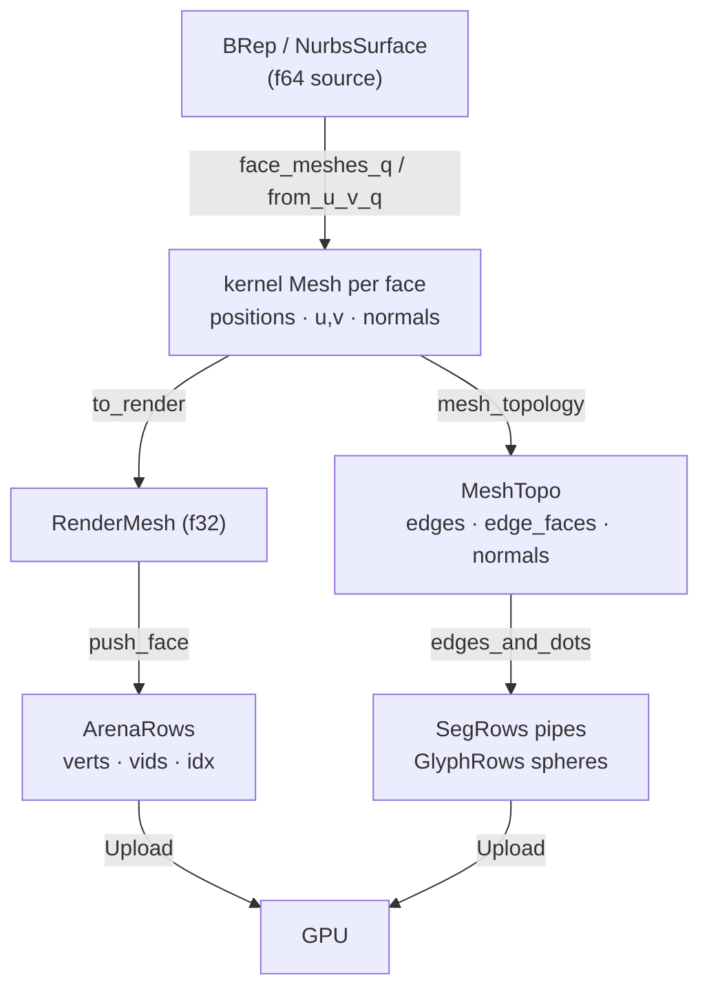

## Starting point

- Checkpoint 05: hand-built quads, strokes and markers in `fixture.rs`; physical depth and visible ink work.
- Nothing yet reads a Session `Mesh`, `BRep` or `NurbsSurface`. This lesson adds the whole `app/walk` producer layer and its first CAD consumer.
- A shading crease is a kernel decision; the viewer only carries it. One kernel edit comes first.

<!-- supplied: 06 -->

## Step 1 · Kernel: one-sided normals at a C0 knot

- A knot repeated `degree` times folds the surface; averaging normals across that fold makes a sharp edge look rounded.
- The grid mesher now splits a shading vertex on the crease side: same position and `u`/`v`, different normal, so the split never invents a CAD vertex.
- Face keys are sorted before accumulation: float sums are order-dependent, and map order must not reach the mesh bytes.

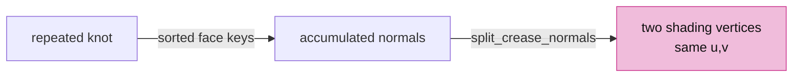

<!-- file: 06 session_rust/src/remesh_nurbssurface_grid.rs type hunks=1-4 -->

`split_crease_normals` is also called by the trimmed mesher in the next lesson, hence `pub(crate)`.

<!-- file: 06 session_rust/src/remesh_nurbssurface_grid.rs type hunks=5 -->

<!-- check: 06 -->

## Step 2 · Row encodings

- Every producer packs the same four things: pen width → world radius, colour → RGBA8, unit normal → 16-bit octahedral code, two normals → one `facing` word.
- `FACING_UNKNOWN` is all ones and means "no adjacency, always draw"; `pack_facing` steps around that value.

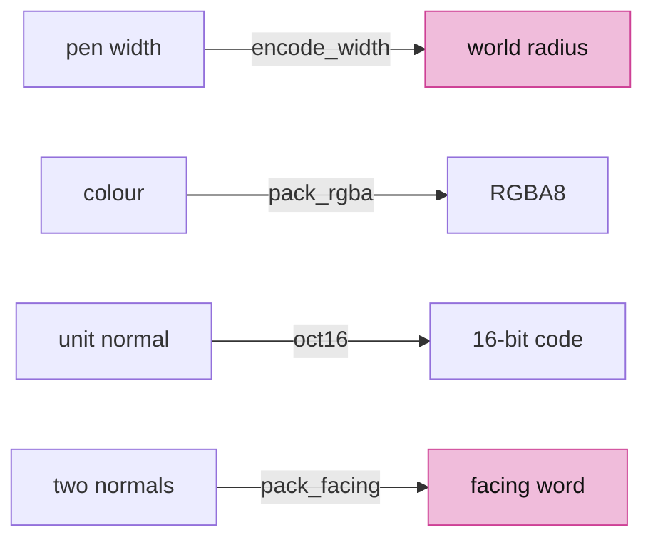

<!-- file: 06 session_viewer/src/app/walk/encode.rs type -->

## Step 3 · What a producer reports

- `WalkCx`: where an object's rows land (vertex base, object row). `Row`: what the producer measured (local box, spacing, flags, thickness).
- The `mod.rs` also declares the modules you type in the following steps; nothing compiles them until `app/mod.rs` names `walk` in step 11.

<!-- file: 06 session_viewer/src/app/walk/mod.rs type -->

## Step 4 · Per-file sweeps and thickness

- A sheet (planar file) is detected after the walk from the object rows, so producers stay ignorant of documents.
- Thickness is measured along the mesh's own dominant face normals, not the axis-aligned box: a rotated plate measures its plate thickness.

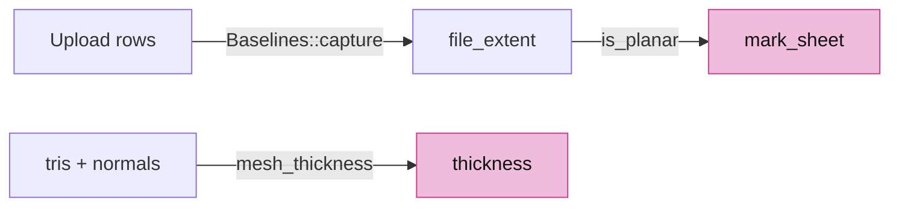

<!-- file: 06 session_viewer/src/app/walk/bounds.rs type lines=1-71 -->

<!-- file: 06 session_viewer/src/app/walk/bounds.rs type lines=72-153 -->

## Step 5 · Fused mesh topology

- One pass over the faces gives the ink lanes everything: unique edges with pen colours, the two faces at each edge, face normals, closedness.
- Edges hang off their low vertex on an intrusive chain; a mesh with sparse vertex keys still indexes in O(1) through `SlotMap`.

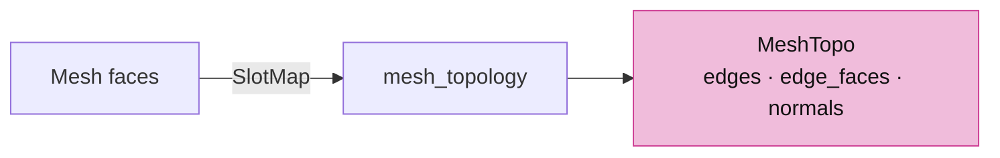

<!-- file: 06 session_viewer/src/app/walk/mesh_topology.rs type lines=1-48 -->

- Newell normals, not the first three corners: a reflex second corner would invert the normal and turn a flat region into a crease.

<!-- file: 06 session_viewer/src/app/walk/mesh_topology.rs type lines=49-95 -->

- Faces are slotted by arrival, not by direction; `opposed` records a winding disagreement instead of declaring the solid open.

<!-- file: 06 session_viewer/src/app/walk/mesh_topology.rs type lines=96-173 -->

## Step 6 · Ink: pipes for edges, spheres for vertices

- The ink pass reads the topology and the f32 positions by slot, and writes only `SegRows.pipes` and `GlyphRows.spheres`.
- When a pair's winding disagrees, the second normal is negated: the facing test needs two outward normals.

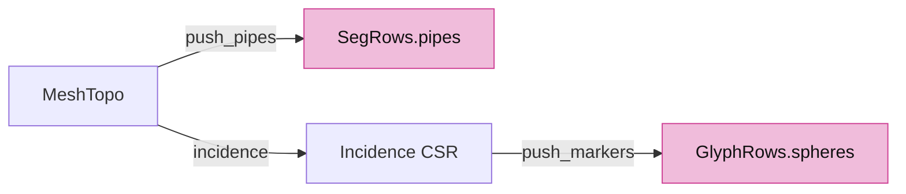

<!-- file: 06 session_viewer/src/app/walk/mesh_ink.rs type lines=1-110 -->

- A smooth tessellation inks only borders and creases; a coplanar diagonal is dropped unless `VIEWER_ALL_EDGES` asks for it.
- `pipe_ids` gets the source edge index for an authored mesh and `u32::MAX` for a tessellation seam: selection must never return an invented edge.

<!-- file: 06 session_viewer/src/app/walk/mesh_ink.rs type lines=111-146 -->

- Incidence is CSR over the edges: each vertex knows its widest visible edge and every incident edge, so a marker can carry up to six face normals.

<!-- file: 06 session_viewer/src/app/walk/mesh_ink.rs type lines=147-192 -->

<!-- file: 06 session_viewer/src/app/walk/mesh_ink.rs type lines=193-268 -->

<!-- file: 06 session_viewer/src/app/walk/mesh_ink.rs copy lines=269-373 -->

## Step 7 · One mesh into the tables

- Gates first: above `MESH_RAW_MIN` triangles a mesh is faces only; a print fill (single width 0) takes the sheet index runs.
- `MeshOpts::MODEL` marks a tessellation: `FLAG_SMOOTH` tells the marker lane its vertices are samples, and its seams are not geometry.

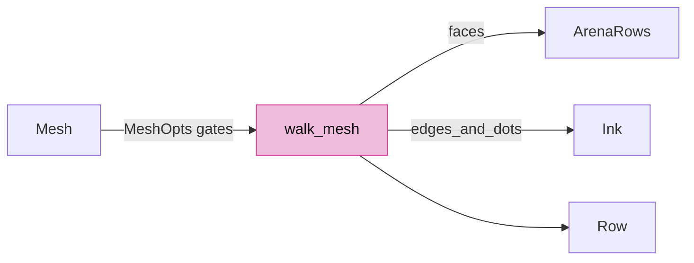

<!-- file: 06 session_viewer/src/app/walk/mesh.rs type lines=1-81 -->

<!-- file: 06 session_viewer/src/app/walk/mesh.rs copy lines=82-144 -->

- Faces go into the arena with `vids = cx.row`; the ink pass runs only on decorated meshes with a topology.

<!-- file: 06 session_viewer/src/app/walk/mesh.rs type lines=145-236 -->

## Step 8 · Curves into the ribbon lane

- Lines and polylines become one flat ribbon per span with `FACING_UNKNOWN`: free linework has no faces to cull against.

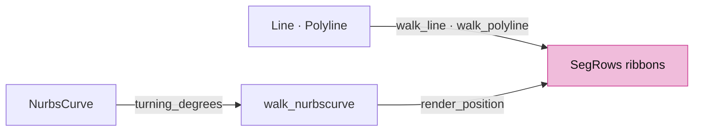

<!-- file: 06 session_viewer/src/app/walk/curves.rs type lines=1-67 -->

- A NURBS curve is sampled by turning angle of its control polygon, so a full circle gets the same chord count at any radius.
- `render_position` is the single f64 → f32 boundary; the same function will convert boundary chain endpoints in the next lesson.

<!-- file: 06 session_viewer/src/app/walk/curves.rs type lines=68-149 -->

## Step 9 · Edge records and the first BRep consumer

- Topology records only: which edge, which face, which orientation. Exact chains arrive in lesson 07.

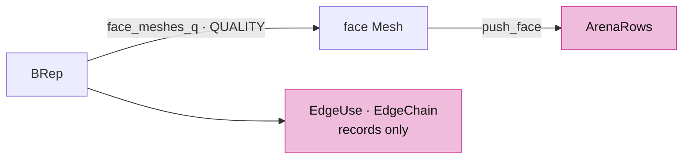

<!-- file: 06 session_viewer/src/app/walk/brep_edges.rs type -->

- Each BRep face keeps its own vertices and the kernel's normals; nothing is welded across faces, so a planar face never inherits a neighbour's normal.
- `QUALITY` is a display decision: the viewer asks for finer sampling than the kernel default.

<!-- file: 06 session_viewer/src/app/walk/brep.rs type -->

## Step 10 · Launch-time knobs

Presence-only environment flags, read once per process; always false in the browser.

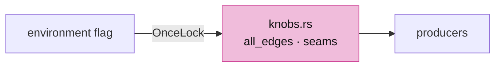

<!-- file: 06 session_viewer/src/app/knobs.rs copy -->

## Step 11 · Wire the producers

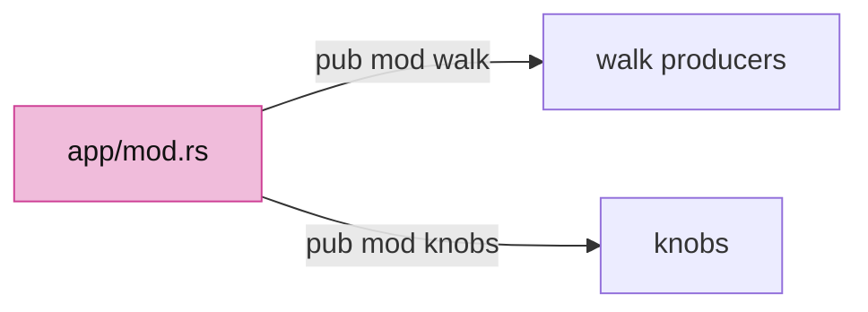

<!-- file: 06 session_viewer/src/app/mod.rs type -->

<!-- check: 06 -->

## Step 12 · The fixture becomes a source scene

- `CadFixture` retains the f64 source objects and a `SourceIdentity` per object row; the GPU only receives prepared tables.
- The same `add` path serves BRep and surface sources, so picking will map a row back to a GUID without searching triangles.

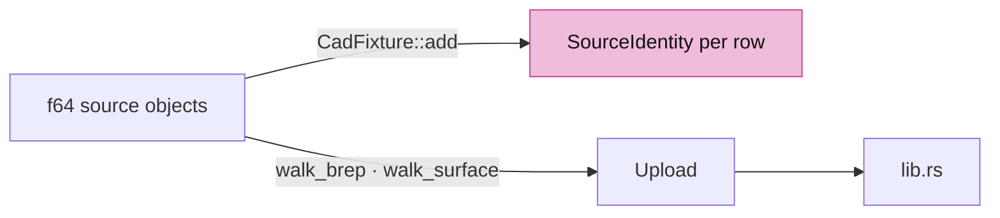

<!-- file: 06 session_viewer/src/fixture.rs copy -->

<!-- file: 06 session_viewer/src/lib.rs type -->

## Step 13 · Flat preview shading

Until lesson 09 the shader ignores vertex normals and uses the finite face fallback, so a wrong normal contract cannot hide behind lighting.

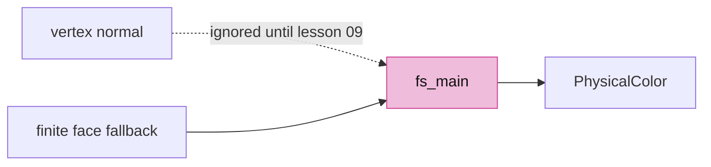

<!-- file: 06 session_viewer/src/shaders/triangle.wgsl type -->

<!-- file: 06 session_viewer/index.html copy -->

## Check

<!-- checkpoint: 06 -->

Expected:

- A grey shaded planar face fills a large part of the canvas; its four natural boundaries draw as black ink separate from the fill.
- The status reads one object; the inspection JSON lists `sourceObjects` with a GUID and `sourceEdgeIds`.
- Orbit: fill and boundary move together.

If the face is missing, follow producer → `Upload` → arena → draw range. If boundaries float off the face, the two f64 → f32 conversions differ.

## What changed

<!-- tree: 06 session_viewer/src/app -->

- New producer layer: kernel mesh → `ArenaRows` faces + `SegRows`/`GlyphRows` ink, with source identity kept beside every row.
- Data flow: f64 source → kernel `Mesh` with `u`/`v`/normal attributes → f32 `RenderMesh` → arena; topology → pipes and spheres.

**Production equivalent:** `src/app/walk/{mod,bounds,encode,mesh,mesh_ink,mesh_topology,curves,brep,brep_edges}.rs` and `src/app/knobs.rs` are production files from here on. The [CAD design record](cad-design.md) documents the producer contract.

## Try

- Append `?top=1` or `?perspective=1`: the fixture is viewed from a fixed camera, which makes a boundary that drifts off its face easy to spot.
- Append `?distance=3` then `?distance=0.3`: the pipes keep their pixel width while the faces grow; the boundary nodes move with the mesh because they are the mesh.
- Append `?thickness=3`: the boundary pipes widen on screen but stay glued to their faces, because their endpoints are face-mesh nodes, not a separately sampled curve.

## Next

[07 · Shared boundaries](07-boundaries.md): one canonical chain per BRep edge, constrained into every incident face, drawn from the exact mesh nodes.
