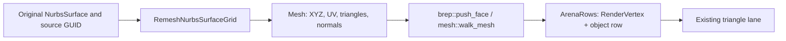

# 06 · Face data and source geometry

Start from checkpoint **05** in `/tmp/viewer-course`; stop its previous Trunk process before serving this checkpoint. The complete [06.patch](reconstruction/patches/06.patch) contains every import, replacement, fixture and parity change below.

`src/` paths are relative to `/tmp/viewer-course/session_viewer`; `COURSE_REPO` is the maintained viewer directory exported in checkpoint 00.

The workspace starts from these immutable shared-package bases; 06, 07 and 09 apply their supplied parity deltas, never the mutable parent checkout.

| Shared package | Original base commit |
| --- | --- |
| `session_rust` | `a59c4124637e16f6a55e9c179c6f6d3d9f58d7ce` |
| `session_cpp` | `be936e1cad8bfe49399a401881ebc4fc154d66a5` |
| `session_py` | `3cd630b717bacb7418986eeceedfba03c1fcc02f` |



Text equivalent: the original f64 surface produces a UV-labelled mesh; the producer copies face vertices and triangle indices into the existing arena while keeping the object row separate from source identities.

**COPY/PASTE — `06.patch` · create producer support modules.** The patch adds `src/app/{mod,knobs}.rs` and `src/app/walk/{mod,bounds,curves,encode,mesh,mesh_ink,mesh_topology}.rs`; their inputs are kernel geometry and lane tables, their outputs are prepared rows and bounds, and they create no GPU resources.

**TYPE BY HAND — `src/app/walk/mod.rs` · `WalkCx and Row` · Create the complete file.**

```rust
//! CPU-only producer contracts; lane buffers remain owned by the earlier GPU coordinator.
use crate::math::Aabb;
pub mod bounds;
pub mod brep;
pub mod brep_edges;
pub mod curves;
pub mod encode;
pub mod mesh;
pub mod mesh_ink;
pub mod mesh_topology;

/// Where one object's rows land: the arena rows already on the GPU (`walk_mesh` bases its
/// indices on it), the file's point-size override in px (0 = the pb's own) and the object row.
pub struct WalkCx {
    pub vert_base: u32,
    pub cloud_px: f32,
    pub row: u32,
}

/// What a producer reports for its object row: the local box, the point/vertex spacing and
/// the flags it earned.
pub struct Row {
    pub bounds: Aabb,
    pub spacing: f32,
    pub flags: u32,
    /// The row drew faces: the inside test (eye within the box) applies to it.
    pub faces: bool,
    /// The object's thickness in its own units, whatever its orientation: retained metadata
    /// the instance row carries.
    pub thickness: f32,
}

impl Row {
    /// Linework, points, frames: a box, no spacing, no flags, no faces; as thick as the box.
    pub fn thin(bounds: Aabb) -> Self {
        Self {
            bounds,
            spacing: 0.0,
            flags: 0,
            faces: false,
            thickness: bounds.thinnest(),
        }
    }
}
```

**TYPE BY HAND — `src/app/walk/brep_edges.rs` · `EdgeUse and EdgeChain` · Create the complete file.**

```rust
//! Source topology records; exact face sample chains are populated in checkpoint07.
use session_rust::brep::BRepOrientation;

/// One use of an edge by a face: which edge, which face, and the orientation of that use
/// (`BRep::edge_faces` composes it), which selects the pcurve on a seam.
pub struct EdgeUse {
    pub edge: usize,
    pub face: usize,
    pub orientation: BRepOrientation,
}

/// One edge's ink source: the face mesh it is read from, the keys along it, and the other
/// face that meets it (None on a seam, where both uses are the same face, or on a free edge).
pub struct EdgeChain {
    /// Index in the source BRep's edge table, independent of display subdivision.
    pub edge: usize,
    pub face: usize,
    pub keys: Vec<usize>,
    pub other: Option<usize>,
}
```

**TYPE BY HAND — `src/app/walk/brep.rs` · `Solid, push_face, walk_brep, walk_surface` · Create the complete file.**

```rust
//! CAD faces preserve their own positions, triangle indices and surface normals.
use super::bounds::mesh_thickness;
use super::mesh::{MeshCx, MeshOpts, mesh_spacing, walk_mesh};
use super::mesh_ink::Ink;
use super::{Row, WalkCx};
use crate::engine::gpu::Instance;
use crate::engine::gpu::arena::ArenaRows;
use crate::math::Aabb;
use session_rust::remesh_nurbssurface_grid::RemeshNurbsSurfaceGrid;
use session_rust::{BRep, NurbsSurface, RenderMesh};

/// How finely the VIEWER wants a surface tessellated: the normal may turn 5 degrees between
/// samples and a chord may sag a thousandth of the object. The kernel's own default is 20
/// degrees and 0.005, which turns a cylinder into an 18-sided prism with a visibly polygonal
/// silhouette - tessellation quality is a display decision, so the display makes it.
/// Measured on 25 extruded circles: 1650 -> 4050 faces, 1.6 -> 1.8 ms a frame.
pub const QUALITY: (f64, f64) = (5.0, 0.001);

/// The positions and the file-local triangle indices of every face uploaded so far: what the
/// thickness measure reads once all faces are in.
struct Solid {
    pos: Vec<[f32; 3]>,
    tris: Vec<u32>,
    bounds: Aabb,
}

/// One face mesh into the arena under `cx.row`: its own vertices, its normals as the kernel
/// evaluated them, its triangles based on the file's vertex base.
fn push_face(arena: &mut ArenaRows, rm: &RenderMesh, cx: &WalkCx, solid: &mut Solid) {
    let base = cx.vert_base + arena.verts.len() as u32;
    let local = solid.pos.len() as u32;
    arena.verts.reserve(rm.vertices.len());
    arena.vids.reserve(rm.vertices.len());
    for v in &rm.vertices {
        solid.bounds.grow(v.position);
        solid.pos.push(v.position);
        arena.verts.push(*v);
        arena.vids.push(cx.row);
    }
    arena.idx.reserve(rm.indices.len());
    for &i in &rm.indices {
        arena.idx.push(base + i);
        solid.tris.push(local + i);
    }
}

/// Upload authored face meshes independently; boundary extraction is introduced next.
pub fn walk_brep(arena: &mut ArenaRows, _ink: &mut Ink, brep: &BRep, cx: &WalkCx) -> Row {
    let mut solid = Solid {
        pos: Vec::new(),
        tris: Vec::new(),
        bounds: Aabb::empty(),
    };
    let mut vertices = 0;
    for mut face in brep.face_meshes_q(Some(QUALITY)) {
        face.set_objectcolor(brep.surfacecolor.clone());
        vertices += face.vertex.len();
        push_face(arena, &face.to_render(), cx, &mut solid);
    }
    Row {
        bounds: solid.bounds,
        spacing: mesh_spacing(&solid.bounds, vertices),
        flags: Instance::FLAG_SMOOTH
            | if brep.is_solid() {
                0
            } else {
                Instance::FLAG_OPEN
            },
        faces: true,
        thickness: mesh_thickness(&solid.pos, &solid.tris),
    }
}

/// The first checkpoint uses the natural UV domain; cached trims are introduced in08.
pub fn walk_surface(
    arena: &mut ArenaRows,
    ink: &mut Ink,
    surface: &NurbsSurface,
    cx: &WalkCx,
) -> Row {
    let mut mesh = RemeshNurbsSurfaceGrid::from_u_v_q(surface.clone(), 0, 0, QUALITY.0, QUALITY.1);
    if let Some(color) = surface.facecolors.first() {
        mesh.set_objectcolor(color.clone());
    }
    let options = MeshOpts {
        sheet_lanes: false,
        allow_open: true,
        smooth: true,
    };
    walk_mesh(arena, ink, &mesh, &MeshCx { cx, opts: &options })
}
```

The grid producer now validates finite analytic normals and duplicates shading vertices only at genuine C0 normal changes. Its f64 positions and UV attributes stay unchanged, so a later boundary chain can still address the exact tessellation.

**TYPE BY HAND — `../session_rust/src/remesh_nurbssurface_grid.rs` · `RemeshNurbsSurfaceGrid::from_u_v_q` · Replace.**

```rust
    pub fn from_u_v_q(
        s: NurbsSurface,
        max_u: usize,
        max_v: usize,
        max_angle_deg: f64,
        chord_factor: f64,
    ) -> Mesh {
        let usp = s.get_span_vector(0);
        let vsp = s.get_span_vector(1);
        let ns_u = usp.len() - 1;
        let ns_v = vsp.len() - 1;
        let deg_u = s.degree(0);
        let deg_v = s.degree(1);

        let (mut minx, mut miny, mut minz) = (1e30_f64, 1e30_f64, 1e30_f64);
        let (mut maxx, mut maxy, mut maxz) = (-1e30_f64, -1e30_f64, -1e30_f64);
        for i in 0..s.cv_count_dir(Some(0)) {
            for j in 0..s.cv_count_dir(Some(1)) {
                if let Some(p) = s.get_cv(i, j) {
                    if p[0] < minx {
                        minx = p[0];
                    }
                    if p[1] < miny {
                        miny = p[1];
                    }
                    if p[2] < minz {
                        minz = p[2];
                    }
                    if p[0] > maxx {
                        maxx = p[0];
                    }
                    if p[1] > maxy {
                        maxy = p[1];
                    }
                    if p[2] > maxz {
                        maxz = p[2];
                    }
                }
            }
        }
        let dx = maxx - minx;
        let dy = maxy - miny;
        let dz = maxz - minz;
        let bbox_diag = (dx * dx + dy * dy + dz * dz).sqrt();

        let span_subs = |dir: usize, sp: &[f64], osp: &[f64]| -> Vec<usize> {
            let n = sp.len() - 1;
            let mut subs = vec![1usize; n];
            let n_other = osp.len() - 1;
            let s_positions: Vec<f64> = (0..n_other).map(|k| (osp[k] + osp[k + 1]) * 0.5).collect();
            let degree_dir = if dir == 0 { deg_u } else { deg_v };
            for i in 0..n {
                let t0 = sp[i];
                let t1 = sp[i + 1];
                if degree_dir > 1 {
                    let mut max_angle = 0.0_f64;
                    for si in 0..n_other {
                        let sv = s_positions[si];
                        let mut fn3 = [0.0_f64; 3];
                        let mut ln3 = [0.0_f64; 3];
                        let mut has_first = false;
                        for k in 0..=4 {
                            let t = t0 + k as f64 * (t1 - t0) / 4.0;
                            let nrm = if dir == 0 {
                                s.normal_at(t, sv)
                            } else {
                                s.normal_at(sv, t)
                            };
                            let (nx, ny, nz) = (nrm[0], nrm[1], nrm[2]);
                            let len = (nx * nx + ny * ny + nz * nz).sqrt();
                            if len < 1e-10 {
                                continue;
                            }
                            let (nx, ny, nz) = (nx / len, ny / len, nz / len);
                            if !has_first {
                                fn3 = [nx, ny, nz];
                                has_first = true;
                            }
                            ln3 = [nx, ny, nz];
                        }
                        let total_angle = if has_first {
                            let dot = (fn3[0] * ln3[0] + fn3[1] * ln3[1] + fn3[2] * ln3[2])
                                .clamp(-1.0, 1.0);
                            dot.acos() * 180.0 / Tolerance::PI
                        } else {
                            0.0
                        };
                        if total_angle > max_angle {
                            max_angle = total_angle;
                        }
                    }
                    subs[i] = ((max_angle / max_angle_deg).ceil() as usize).clamp(1, 24);
                }

                let chord_tol = bbox_diag * chord_factor;
                let mut max_dev = 0.0_f64;
                let nc = n_other.min(3);
                for ci in 0..=nc {
                    let sv = osp[0] + ci as f64 * (osp[osp.len() - 1] - osp[0]) / nc.max(1) as f64;
                    let (p0, p1) = if dir == 0 {
                        (s.point_at(t0, sv), s.point_at(t1, sv))
                    } else {
                        (s.point_at(sv, t0), s.point_at(sv, t1))
                    };
                    if let (Some(p0), Some(p1)) = (p0, p1) {
                        let (px0, py0, pz0) = (p0[0], p0[1], p0[2]);
                        let (px1, py1, pz1) = (p1[0], p1[1], p1[2]);
                        for k in 1..=3 {
                            let frac = k as f64 / 4.0;
                            let tm = t0 + frac * (t1 - t0);
                            let pm = if dir == 0 {
                                s.point_at(tm, sv)
                            } else {
                                s.point_at(sv, tm)
                            };
                            if let Some(pm) = pm {
                                let lx = px0 + frac * (px1 - px0);
                                let ly = py0 + frac * (py1 - py0);
                                let lz = pz0 + frac * (pz1 - pz0);
                                let ddx = pm[0] - lx;
                                let ddy = pm[1] - ly;
                                let ddz = pm[2] - lz;
                                let dev = (ddx * ddx + ddy * ddy + ddz * ddz).sqrt();
                                if dev > max_dev {
                                    max_dev = dev;
                                }
                            }
                        }
                    }
                }
                if max_dev > chord_tol {
                    let chord_subs = ((max_dev / chord_tol).sqrt().ceil() as usize).clamp(2, 24);
                    if chord_subs > subs[i] {
                        subs[i] = chord_subs;
                    }
                }

                if degree_dir > 1 && subs[i] < 2 {
                    subs[i] = 2;
                }
            }
            subs
        };

        let mut u_subs = span_subs(0, &usp, &vsp);
        let mut v_subs = span_subs(1, &vsp, &usp);

        // Arc-length aspect ratio balancing
        {
            let total_u = u_subs.iter().sum::<usize>() + 1;
            let total_v = v_subs.iter().sum::<usize>() + 1;
            let v_mid = (vsp[0] + vsp[vsp.len() - 1]) * 0.5;
            let u_mid = (usp[0] + usp[usp.len() - 1]) * 0.5;
            let mut u_len = 0.0_f64;
            let n_sample_u = total_u.max(10);
            if let Some(p0) = s.point_at(usp[0], v_mid) {
                let mut prev = (p0[0], p0[1], p0[2]);
                for i in 1..=n_sample_u {
                    let u = usp[0] + i as f64 * (usp[usp.len() - 1] - usp[0]) / n_sample_u as f64;
                    if let Some(p1) = s.point_at(u, v_mid) {
                        let ddx = p1[0] - prev.0;
                        let ddy = p1[1] - prev.1;
                        let ddz = p1[2] - prev.2;
                        u_len += (ddx * ddx + ddy * ddy + ddz * ddz).sqrt();
                        prev = (p1[0], p1[1], p1[2]);
                    }
                }
            }
            let mut v_len = 0.0_f64;
            let n_sample_v = total_v.max(10);
            if let Some(p0) = s.point_at(u_mid, vsp[0]) {
                let mut prev = (p0[0], p0[1], p0[2]);
                for i in 1..=n_sample_v {
                    let v = vsp[0] + i as f64 * (vsp[vsp.len() - 1] - vsp[0]) / n_sample_v as f64;
                    if let Some(p1) = s.point_at(u_mid, v) {
                        let ddx = p1[0] - prev.0;
                        let ddy = p1[1] - prev.1;
                        let ddz = p1[2] - prev.2;
                        v_len += (ddx * ddx + ddy * ddy + ddz * ddz).sqrt();
                        prev = (p1[0], p1[1], p1[2]);
                    }
                }
            }
            if u_len > 1e-14 && v_len > 1e-14 && total_u > 0 && total_v > 0 {
                let spacing_u = u_len / total_u as f64;
                let spacing_v = v_len / total_v as f64;
                let ratio = spacing_u / spacing_v;
                if ratio > 2.0 && deg_u > 1 {
                    let scale = ratio.sqrt();
                    for sv in &mut u_subs {
                        *sv = ((*sv as f64 * scale).ceil() as usize).min(24);
                    }
                } else if ratio < 0.5 && deg_v > 1 {
                    let scale = (1.0 / ratio).sqrt();
                    for sv in &mut v_subs {
                        *sv = ((*sv as f64 * scale).ceil() as usize).min(24);
                    }
                }
            }
        }

        // Bilinear twist check (skip for singular surfaces — fan triangulation handles those)
        if deg_u == 1 && deg_v == 1 && !s.is_singular(0) && !s.is_singular(2) {
            let chord_tol = if bbox_diag > 0.0 {
                bbox_diag * chord_factor
            } else {
                1e-6
            };
            let mut max_twist = 0.0_f64;
            for i in 0..ns_u {
                for j in 0..ns_v {
                    let u0 = usp[i];
                    let u1 = usp[i + 1];
                    let v0 = vsp[j];
                    let v1 = vsp[j + 1];
                    let pm = s.point_at((u0 + u1) * 0.5, (v0 + v1) * 0.5);
                    let p00 = s.point_at(u0, v0);
                    let p11 = s.point_at(u1, v1);
                    if let (Some(pm), Some(p00), Some(p11)) = (pm, p00, p11) {
                        let mx = (p00[0] + p11[0]) * 0.5;
                        let my = (p00[1] + p11[1]) * 0.5;
                        let mz = (p00[2] + p11[2]) * 0.5;
                        let ddx = pm[0] - mx;
                        let ddy = pm[1] - my;
                        let ddz = pm[2] - mz;
                        let twist = (ddx * ddx + ddy * ddy + ddz * ddz).sqrt();
                        if twist > max_twist {
                            max_twist = twist;
                        }
                    }
                }
            }
            if max_twist > chord_tol {
                let twist_subs =
                    ((2.0 * (max_twist / chord_tol).sqrt()).ceil() as usize).clamp(4, 24);
                for sv in &mut u_subs {
                    if *sv < twist_subs {
                        *sv = twist_subs;
                    }
                }
                for sv in &mut v_subs {
                    if *sv < twist_subs {
                        *sv = twist_subs;
                    }
                }
            }
        }

        let closed_u = s.is_closed(0);
        let closed_v = s.is_closed(1);

        // Ensure odd total subdivisions for closed directions (seamless checkerboard triangulation)
        if closed_u && max_u == 0 {
            let total: usize = u_subs.iter().sum();
            if total % 2 == 0 {
                let m = (0..u_subs.len()).max_by_key(|&i| u_subs[i]).unwrap_or(0);
                u_subs[m] += 1;
            }
        }
        if closed_v && max_v == 0 {
            let total: usize = v_subs.iter().sum();
            if total % 2 == 0 {
                let m = (0..v_subs.len()).max_by_key(|&i| v_subs[i]).unwrap_or(0);
                v_subs[m] += 1;
            }
        }

        let v_mid = (vsp[0] + vsp[vsp.len() - 1]) * 0.5;
        let u_mid = (usp[0] + usp[usp.len() - 1]) * 0.5;

        let arclen_params = |n: usize, sp: &[f64], fixed: f64, is_u: bool| -> Vec<f64> {
            let nsample = (n * 20).max(200);
            let st: Vec<f64> = (0..=nsample)
                .map(|k| sp[0] + k as f64 * (sp[sp.len() - 1] - sp[0]) / nsample as f64)
                .collect();
            let mut sl = vec![0.0_f64; nsample + 1];
            let p0 = if is_u {
                s.point_at(sp[0], fixed)
            } else {
                s.point_at(fixed, sp[0])
            };
            let mut prev = p0.map(|p| (p[0], p[1], p[2])).unwrap_or((0.0, 0.0, 0.0));
            for k in 1..=nsample {
                let p1 = if is_u {
                    s.point_at(st[k], fixed)
                } else {
                    s.point_at(fixed, st[k])
                };
                if let Some(p1) = p1 {
                    let d = ((p1[0] - prev.0).powi(2)
                        + (p1[1] - prev.1).powi(2)
                        + (p1[2] - prev.2).powi(2))
                    .sqrt();
                    sl[k] = sl[k - 1] + d;
                    prev = (p1[0], p1[1], p1[2]);
                } else {
                    sl[k] = sl[k - 1];
                }
            }
            let total_len = sl[nsample];
            let mut params = vec![sp[0]];
            let mut j = 0usize;
            for i in 1..(n - 1) {
                let target = total_len * i as f64 / (n - 1) as f64;
                while j < nsample && sl[j] < target {
                    j += 1;
                }
                let ta = if j > 0 { st[j - 1] } else { st[0] };
                let tb = st[j];
                let la = if j > 0 { sl[j - 1] } else { sl[0] };
                let lb = sl[j];
                let frac = if lb > la {
                    (target - la) / (lb - la)
                } else {
                    0.0
                };
                params.push(ta + frac * (tb - ta));
            }
            params.push(*sp.last().unwrap());
            params
        };

        // Build parameter arrays
        let us: Vec<f64> = if max_u > 0 {
            arclen_params(max_u.max(2), &usp, v_mid, true)
        } else {
            let mut us = Vec::new();
            for i in 0..ns_u {
                for sv in 0..u_subs[i] {
                    us.push(usp[i] + sv as f64 * (usp[i + 1] - usp[i]) / u_subs[i] as f64);
                }
            }
            us.push(*usp.last().unwrap());
            us
        };
        let vs: Vec<f64> = if max_v > 0 {
            arclen_params(max_v.max(2), &vsp, u_mid, false)
        } else {
            let mut vs = Vec::new();
            for i in 0..ns_v {
                for sv in 0..v_subs[i] {
                    vs.push(vsp[i] + sv as f64 * (vsp[i + 1] - vsp[i]) / v_subs[i] as f64);
                }
            }
            vs.push(*vsp.last().unwrap());
            vs
        };

        let fix_closed_gap = |params: Vec<f64>, spans: &[f64], closed: bool| -> Vec<f64> {
            if !closed || params.len() < 3 {
                return params;
            }
            let mut params = params;
            params.pop();
            let domain_end = *spans.last().unwrap();
            let wrap_gap = domain_end - *params.last().unwrap();
            let mut max_gap = 0.0_f64;
            for i in 1..params.len() {
                let g = params[i] - params[i - 1];
                if g > max_gap {
                    max_gap = g;
                }
            }
            if max_gap > 0.0 && wrap_gap > max_gap * 1.5 {
                let extra = ((wrap_gap / max_gap).ceil() as usize).saturating_sub(1);
                let step = wrap_gap / (extra + 1) as f64;
                for _ in 1..=extra {
                    let last = *params.last().unwrap();
                    params.push(last + step);
                }
            }
            params
        };

        let us = fix_closed_gap(us, &usp, closed_u);
        let vs = fix_closed_gap(vs, &vsp, closed_v);
        let nu = us.len();
        let nv_count = vs.len();

        let sing_v0 = s.is_singular(0);
        let sing_v1 = s.is_singular(2);
        let j_start: usize = if sing_v0 { 1 } else { 0 };
        let j_end: usize = if sing_v1 { nv_count - 1 } else { nv_count };
        let nv_grid = j_end - j_start;

        let mut result = Mesh::new();
        let mut south_pole: usize = 0;
        let mut north_pole: usize = 0;
        if sing_v0 {
            if let Some(p) = s.point_at(us[0], vs[0]) {
                south_pole = result.add_vertex(p, None);
                if let Some(vd) = result.vertex.get_mut(&south_pole) {
                    vd.attributes.insert("u".to_string(), us[0]);
                    vd.attributes.insert("v".to_string(), vs[0]);
                }
            }
        }
        if sing_v1 {
            if let Some(p) = s.point_at(us[0], vs[nv_count - 1]) {
                north_pole = result.add_vertex(p, None);
                if let Some(vd) = result.vertex.get_mut(&north_pole) {
                    vd.attributes.insert("u".to_string(), us[0]);
                    vd.attributes.insert("v".to_string(), vs[nv_count - 1]);
                }
            }
        }
        let mut vkey_grid: Vec<Vec<usize>> = Vec::new();
        for i in 0..nu {
            let mut row: Vec<usize> = Vec::new();
            for j in j_start..j_end {
                let p = s
                    .point_at(us[i], vs[j])
                    .unwrap_or(Point::new(0.0, 0.0, 0.0));
                let vk = result.add_vertex(p, None);
                if let Some(vd) = result.vertex.get_mut(&vk) {
                    vd.attributes.insert("u".to_string(), us[i]);
                    vd.attributes.insert("v".to_string(), vs[j]);
                }
                row.push(vk);
            }
            vkey_grid.push(row);
        }

        let grid_idx = |i: usize, j: usize| -> usize { vkey_grid[i][j - j_start] };

        let nu_faces = if closed_u { nu } else { nu - 1 };

        // South pole fan
        if sing_v0 {
            for i in 0..nu_faces {
                let i1 = (i + 1) % nu;
                result.add_face(
                    vec![south_pole, grid_idx(i1, j_start), grid_idx(i, j_start)],
                    None,
                );
            }
        }

        // Interior grid faces
        let nv_interior = if closed_v && !sing_v0 && !sing_v1 {
            nv_grid
        } else {
            nv_grid - 1
        };
        for i in 0..nu_faces {
            for jj in 0..nv_interior {
                let j = jj + j_start;
                let i1 = (i + 1) % nu;
                let j1 = if closed_v && !sing_v0 && !sing_v1 {
                    (jj + 1) % nv_grid + j_start
                } else {
                    j + 1
                };
                let v00 = grid_idx(i, j);
                let v10 = grid_idx(i1, j);
                let v01 = grid_idx(i, j1);
                let v11 = grid_idx(i1, j1);
                if (i + jj) % 2 == 0 {
                    result.add_face(vec![v00, v10, v11], None);
                    result.add_face(vec![v00, v11, v01], None);
                } else {
                    result.add_face(vec![v00, v10, v01], None);
                    result.add_face(vec![v10, v11, v01], None);
                }
            }
        }

        // North pole fan
        if sing_v1 {
            let j_last = j_end - 1;
            for i in 0..nu_faces {
                let i1 = (i + 1) % nu;
                result.add_face(
                    vec![grid_idx(i, j_last), grid_idx(i1, j_last), north_pole],
                    None,
                );
            }
        }

        // Compute vertex normals from face normals
        let mut vn_map: HashMap<usize, (f64, f64, f64)> = HashMap::new();
        for vk in result.vertex.keys() {
            vn_map.insert(*vk, (0.0, 0.0, 0.0));
        }
        let mut face_keys: Vec<usize> = result.face.keys().cloned().collect();
        face_keys.sort_unstable();
        for fk in &face_keys {
            if let Some(vids) = result.face.get(fk) {
                if vids.len() < 3 {
                    continue;
                }
                let pos0 = result
                    .vertex
                    .get(&vids[0])
                    .map(|v| v.position())
                    .unwrap_or(Point::new(0.0, 0.0, 0.0));
                let pos1 = result
                    .vertex
                    .get(&vids[1])
                    .map(|v| v.position())
                    .unwrap_or(Point::new(0.0, 0.0, 0.0));
                let pos2 = result
                    .vertex
                    .get(&vids[2])
                    .map(|v| v.position())
                    .unwrap_or(Point::new(0.0, 0.0, 0.0));
                let e1x = pos1[0] - pos0[0];
                let e1y = pos1[1] - pos0[1];
                let e1z = pos1[2] - pos0[2];
                let e2x = pos2[0] - pos0[0];
                let e2y = pos2[1] - pos0[1];
                let e2z = pos2[2] - pos0[2];
                let fnx = e1y * e2z - e1z * e2y;
                let fny = e1z * e2x - e1x * e2z;
                let fnz = e1x * e2y - e1y * e2x;
                let vids_clone: Vec<usize> = vids.clone();
                for vi in vids_clone {
                    let e = vn_map.entry(vi).or_insert((0.0, 0.0, 0.0));
                    e.0 += fnx;
                    e.1 += fny;
                    e.2 += fnz;
                }
            }
        }
        let vkeys: Vec<usize> = result.vertex.keys().cloned().collect();
        for vk in vkeys {
            // Winding-consistent direction from the accumulated face normals.
            let (mut fx, mut fy, mut fz) = vn_map.get(&vk).copied().unwrap_or((0.0, 0.0, 1.0));
            let flen = (fx * fx + fy * fy + fz * fz).sqrt();
            if flen.is_finite() && flen > 0.0 {
                fx /= flen;
                fy /= flen;
                fz /= flen;
            } else {
                fx = 0.0;
                fy = 0.0;
                fz = 1.0;
            }
            // Prefer the ANALYTIC surface normal at this vertex's (u,v) — smooth shading
            // like Rhino, which stays smooth even on a coarse mesh — oriented to agree
            // with the mesh winding. Fall back to the face normal at poles / where the
            // analytic normal is degenerate.
            let uv = result.vertex.get(&vk).and_then(|vd| {
                match (vd.attributes.get("u"), vd.attributes.get("v")) {
                    (Some(&u), Some(&v)) => Some((u, v)),
                    _ => None,
                }
            });
            // At a singular pole (e.g. a cone apex or sphere pole) the analytic normal is
            // degenerate, so keep the face-averaged normal there — evaluating normal_at at
            // the pole produced a black/garbage tip.
            let is_pole = (sing_v0 && vk == south_pole) || (sing_v1 && vk == north_pole);
            let (mut nx, mut ny, mut nz) = (fx, fy, fz);
            if !is_pole {
                if let Some((u, v)) = uv {
                    let na = s.normal_at(u, v);
                    let nl = (na[0] * na[0] + na[1] * na[1] + na[2] * na[2]).sqrt();
                    if nl.is_finite() && nl > 0.0 {
                        let (mut ax, mut ay, mut az) = (na[0] / nl, na[1] / nl, na[2] / nl);
                        if ax * fx + ay * fy + az * fz < 0.0 {
                            ax = -ax;
                            ay = -ay;
                            az = -az;
                        }
                        nx = ax;
                        ny = ay;
                        nz = az;
                    }
                }
            }
            if let Some(vd) = result.vertex.get_mut(&vk) {
                vd.set_normal(nx, ny, nz);
            }
        }

        Self::split_crease_normals(&s, &mut result);
        result
    }
```

**TYPE BY HAND — `../session_rust/src/remesh_nurbssurface_grid.rs` · `RemeshNurbsSurfaceGrid::split_crease_normals` · Insert immediately after from_u_v_q, inside its impl.**

```rust
    pub(crate) fn split_crease_normals(s: &NurbsSurface, mesh: &mut Mesh) {
        let mut candidates = HashMap::<usize, u8>::new();
        for (&key, vd) in &mesh.vertex {
            let (Some(&u), Some(&v)) = (vd.attributes.get("u"), vd.attributes.get("v")) else {
                continue;
            };
            let uv = [u, v];
            let mut flags = 0;
            for dir in 0..2 {
                let Some((start, end)) = s.domain(dir) else {
                    continue;
                };
                let value = uv[dir];
                if value <= start || value >= end {
                    continue;
                }
                let multiplicity = s.m_nurbsknot[dir]
                    .iter()
                    .filter(|&&knot| knot == value)
                    .count();
                if multiplicity < s.degree(dir) {
                    continue;
                }
                let mut lo = uv;
                let mut hi = uv;
                lo[dir] = value.next_down();
                hi[dir] = value.next_up();
                let a = s.normal_at(lo[0], lo[1]);
                let b = s.normal_at(hi[0], hi[1]);
                let aa = a[0] * a[0] + a[1] * a[1] + a[2] * a[2];
                let bb = b[0] * b[0] + b[1] * b[1] + b[2] * b[2];
                let dot = (a[0] * b[0] + a[1] * b[1] + a[2] * b[2]) / (aa * bb).sqrt();
                if dot.is_finite() && dot < 1.0 - 64.0 * f64::EPSILON {
                    flags |= 1 << dir;
                }
            }
            if flags != 0 {
                candidates.insert(key, flags);
            }
        }
        if candidates.is_empty() {
            return;
        }
        let mut copies = HashMap::<(usize, u8), usize>::new();
        let mut used = std::collections::HashSet::new();
        let mut face_keys: Vec<usize> = mesh.face.keys().copied().collect();
        face_keys.sort_unstable();
        for face_key in face_keys {
            let vertices = mesh.face[&face_key].clone();
            let mut center = [0.0; 2];
            for key in &vertices {
                center[0] += mesh.vertex[key].attributes.get("u").copied().unwrap_or(0.0);
                center[1] += mesh.vertex[key].attributes.get("v").copied().unwrap_or(0.0);
            }
            center[0] /= vertices.len() as f64;
            center[1] /= vertices.len() as f64;
            let face_normal = mesh.face_normal(face_key);
            let mut split = vertices.clone();
            for (corner, &key) in vertices.iter().enumerate() {
                let Some(&flags) = candidates.get(&key) else {
                    continue;
                };
                let original = mesh.vertex[&key].clone();
                let mut uv = [
                    *original.attributes.get("u").unwrap(),
                    *original.attributes.get("v").unwrap(),
                ];
                let mut side = 0;
                for dir in 0..2 {
                    if flags & (1 << dir) == 0 {
                        continue;
                    }
                    if center[dir] > uv[dir] {
                        side |= 1 << dir;
                        uv[dir] = uv[dir].next_up();
                    } else {
                        uv[dir] = uv[dir].next_down();
                    }
                }
                let target = if let Some(&target) = copies.get(&(key, side)) {
                    target
                } else {
                    let target = if used.insert(key) {
                        key
                    } else {
                        let target = mesh.add_vertex(original.position(), None);
                        mesh.vertex.insert(target, original);
                        target
                    };
                    copies.insert((key, side), target);
                    target
                };
                let n = s.normal_at(uv[0], uv[1]);
                let length = (n[0] * n[0] + n[1] * n[1] + n[2] * n[2]).sqrt();
                if length.is_finite() && length > 0.0 {
                    let mut sign = 1.0;
                    if let Some(ref f) = face_normal {
                        if n[0] * f[0] + n[1] * f[1] + n[2] * f[2] < 0.0 {
                            sign = -1.0;
                        }
                    }
                    mesh.vertex.get_mut(&target).unwrap().set_normal(
                        sign * n[0] / length,
                        sign * n[1] / length,
                        sign * n[2] / length,
                    );
                }
                split[corner] = target;
            }
            mesh.face.insert(face_key, split);
        }
        mesh.rebuild_halfedges();
    }
```

**COPY/PASTE — `06.patch` · parallel producer changes and registry entries.** Apply the matching C++ `remesh_nurbssurface_grid.{h,cpp}` and Python `remesh_nurbssurface_grid.py` changes plus all three grid test files; Rust's `mini_test::get_all_tests` receives only `Analytic Normals` and `Crease Normals` here.

Expected browser: one grey source face with its natural boundary; orbit and zoom retain its source orientation. Checkpoints 06–08 intentionally use the supported zero-normal derivative fallback for a flat preview; the analytic vertex normals remain in the arena until 09 enables smooth transport. Expected kernel check: eleven grid tests, including finite unit normals at poles and distinct one-sided C0 normals without moved positions.

**TYPE BY HAND — `../session_rust/src/remesh_nurbssurface_grid_test.rs` · `run_remesh_nurbssurface_grid_analytic_normals` · Insert the complete regression test; its registry entry is supplied by the patch.**

```rust
pub fn run_remesh_nurbssurface_grid_analytic_normals() -> TestResult {
    MINI_TEST!("Analytic Normals", {
        use crate::remesh_nurbssurface_grid::RemeshNurbsSurfaceGrid;
        use crate::Primitives;

        let surfaces = [
            Primitives::sphere_surface(0.0, 0.0, 0.0, 1.0),
            Primitives::cylinder_surface(0.0, 0.0, 0.0, 1.0, 5.0),
            Primitives::cone_surface(0.0, 0.0, 0.0, 1.0, 5.0),
        ];
        for (index, s) in surfaces.into_iter().enumerate() {
            let m = RemeshNurbsSurfaceGrid::from_u_v_q(s, 0, 0, 30.0, 0.01);
            for vd in m.vertex.values() {
                let n = vd.normal().unwrap();
                let length = n[0] * n[0] + n[1] * n[1] + n[2] * n[2];
                MINI_CHECK!((length - 1.0).abs() < Tolerance::ZERO_TOLERANCE);
                if index < 2 {
                    let z = if index == 0 { vd.z } else { 0.0 };
                    let dot = vd.x * n[0] + vd.y * n[1] + z * n[2];
                    MINI_CHECK!((dot - 1.0).abs() < Tolerance::ZERO_TOLERANCE);
                }
            }
        }
    })
}
```

**TYPE BY HAND — `../session_rust/src/remesh_nurbssurface_grid_test.rs` · `run_remesh_nurbssurface_grid_crease_normals` · Insert the complete regression test; its registry entry is supplied by the patch.**

```rust
pub fn run_remesh_nurbssurface_grid_crease_normals() -> TestResult {
    MINI_TEST!("Crease Normals", {
        use crate::remesh_nurbssurface_grid::RemeshNurbsSurfaceGrid;
        use crate::{NurbsSurface, Point};
        let s = NurbsSurface::create(
            false,
            false,
            1,
            1,
            3,
            2,
            &[
                Point::new(0.0, 0.0, 0.0),
                Point::new(0.0, 1.0, 0.0),
                Point::new(1.0, 0.0, 0.0),
                Point::new(1.0, 1.0, 0.0),
                Point::new(2.0, 0.0, 1.0),
                Point::new(2.0, 1.0, 1.0),
            ],
        )
        .unwrap();
        let m = RemeshNurbsSurfaceGrid::from_u_v(s, 0, 0);
        MINI_CHECK!(m.vertex.len() == 8);
        MINI_CHECK!(m.face.len() == 4);
        let mut flat = 0;
        let mut tilted = 0;
        for vd in m.vertex.values() {
            if vd.x != 1.0 {
                continue;
            }
            let n = vd.normal().unwrap();
            if n[0].abs() < Tolerance::ZERO_TOLERANCE {
                flat += 1;
            }
            if (n[0] + 0.5f64.sqrt()).abs() < Tolerance::ZERO_TOLERANCE {
                tilted += 1;
            }
        }
        MINI_CHECK!(flat == 2 && tilted == 2);
    })
}
```

**TYPE BY HAND — `src/fixture.rs` · `CadFixture, SourceIdentity, add and push_row` · Replace the complete fixture file.**

```rust
//! Local source geometry and its prepared GPU rows; no fetch, credentials or baked transforms.
use crate::app::walk::brep::{walk_brep, walk_surface};
use crate::app::walk::mesh_ink::Ink;
use crate::app::walk::{Row, WalkCx};
use crate::engine::gpu::Upload;
use crate::engine::gpu::objects::ObjectRow;
use session_rust::{Color, Geometry, NurbsSurface, Point, Xform};
use std::rc::Rc;

/// Retain original f64 source objects independently from their GPU row addresses.
pub struct CadFixture {
    pub upload: Upload,
    pub sources: Vec<Geometry>,
    pub identities: Vec<SourceIdentity>,
    pub pipe_source_edges: Vec<u32>,
}

/// An object row is a display address; the source GUID belongs to the retained geometry.
#[derive(serde::Serialize)]
pub struct SourceIdentity {
    pub object_row: u32,
    pub guid: String,
    pub kind: &'static str,
}

impl CadFixture {
    /// Allocate no geometry until the selected local case appends its source objects.
    fn new() -> Self {
        Self {
            upload: Upload::default(),
            sources: Vec::new(),
            identities: Vec::new(),
            pipe_source_edges: Vec::new(),
        }
    }

    /// Prepare one source object, retaining its identity and source-space geometry together.
    fn add(&mut self, geometry: Geometry, place: Xform) {
        let row = self.upload.obj.rows.len() as u32;
        let first_pipe = self.upload.seg.pipes.len();
        let context = WalkCx {
            vert_base: 0,
            cloud_px: 0.0,
            row,
        };
        let mut ink = Ink {
            seg: &mut self.upload.seg,
            glyph: &mut self.upload.glyph,
        };
        let (prepared, guid, kind) = match &geometry {
            Geometry::BRep(source) => (
                walk_brep(&mut self.upload.arena, &mut ink, source, &context),
                source.guid().to_string(),
                "BRep",
            ),
            Geometry::NurbsSurface(source) => (
                walk_surface(&mut self.upload.arena, &mut ink, source, &context),
                source.guid().to_string(),
                "NurbsSurface",
            ),
            _ => unreachable!("the CAD fixture only constructs BRep and surface source objects"),
        };
        self.pipe_source_edges
            .extend_from_slice(&self.upload.seg.pipe_ids[first_pipe..]);
        self.push_row(prepared, place);
        self.identities.push(SourceIdentity {
            object_row: row,
            guid,
            kind,
        });
        self.sources.push(geometry);
    }

    /// Keep object-local bounds separate from the instance placement used for camera fitting.
    fn push_row(&mut self, prepared: Row, place: Xform) {
        let mut object = ObjectRow::new(place.m, prepared.flags);
        object.bounds = prepared.bounds;
        object.spacing = prepared.spacing;
        object.faces = prepared.faces;
        object.thickness = prepared.thickness;
        self.upload.bounds.union(&prepared.bounds.placed(&place.m));
        self.upload.obj.rows.push(object);
    }
}

/// A planar surface with one actual source face and four natural parameter boundaries.
fn planar_surface() -> NurbsSurface {
    let points = [
        Point::new(-200.0, -150.0, 0.0),
        Point::new(-200.0, 150.0, 0.0),
        Point::new(200.0, -150.0, 0.0),
        Point::new(200.0, 150.0, 0.0),
    ];
    let mut surface = NurbsSurface::create(false, false, 1, 1, 2, 2, &points).unwrap();
    surface.facecolors = vec![Color::grey()];
    surface.name = "local source face".into();
    surface
}
/// Build the first source-face checkpoint entirely from local geometry.
pub fn build() -> CadFixture {
    let mut scene = CadFixture::new();
    scene.add(
        Geometry::NurbsSurface(Rc::new(planar_surface())),
        Xform::identity(),
    );
    scene
}
```

**TYPE BY HAND — `src/lib.rs` · `Tutorial source owner and create/render integration` · Replace the complete teaching facade.**

```rust
//! Temporary direct-canvas teaching facade over the progressively assembled production lanes.
pub mod app;
pub mod camera;
pub mod engine;
pub mod fixture;
pub mod math;
use engine::gpu::{FrameInput, Gpu};
use wasm_bindgen::prelude::*;
/// Canvas and input ownership remain separate from GPU lane ownership.
#[wasm_bindgen]
pub struct Tutorial {
    canvas: web_sys::HtmlCanvasElement,
    gpu: Gpu,
    camera: camera::Camera,
    scale: f64,
    fixture: fixture::CadFixture,
}
#[wasm_bindgen]
impl Tutorial {
    /// Retain local CAD sources while handing only prepared lane tables to the GPU.
    pub async fn create(canvas: web_sys::HtmlCanvasElement) -> Result<Tutorial, JsValue> {
        console_error_panic_hook::set_once();
        let mut gpu = Gpu::new(canvas.clone()).await.map_err(js_error)?;
        let mut fixture = fixture::build();
        gpu.set_scene(&fixture.upload);
        fixture.upload.drop_uploaded();
        let mut camera = camera::Camera::new();
        camera.unit = camera::Unit::Millimeters;
        camera.set_view(camera::View::Iso);
        camera.fit(&gpu.bounds, 1.5);
        if app::route::query("top").is_some() {
            camera.set_view(camera::View::Top);
        }
        camera.perspective = app::route::query("perspective").is_some();
        if let Some(distance) = app::route::query("distance").and_then(parse_distance) {
            camera.distance *= distance;
            camera.update_position();
        }
        gpu.view.show_grid = false;
        Ok(Self {
            canvas,
            gpu,
            camera,
            scale: 1.0,
            fixture,
        })
    }
    /// Orbit or pan with the same production camera methods used by the final viewer.
    pub fn drag(&mut self, dx: f32, dy: f32, pan: bool) {
        if pan {
            self.camera.pan(dx, dy)
        } else {
            self.camera.orbit(dx, dy)
        }
    }
    /// Keep cursor and viewport in the physical coordinate system expected by zoom_at.
    pub fn zoom(&mut self, delta: f32, x: f64, y: f64) {
        self.camera.zoom_at(
            delta,
            (x * self.scale, y * self.scale),
            (self.gpu.config.width as f64, self.gpu.config.height as f64),
        );
    }
    /// Resize physical targets, share one precise anchor, then submit one invalidated frame.
    pub fn render(&mut self, width: u32, height: u32, scale: f64) -> Result<String, JsValue> {
        if !scale.is_finite() || scale <= 0.0 {
            return Err(JsValue::from_str("invalid scale"));
        }
        self.scale = scale;
        self.gpu.logical_size = [width.max(1) as f64, height.max(1) as f64];
        let w = (width.max(1) as f64 * scale).round() as u32;
        let h = (height.max(1) as f64 * scale).round() as u32;
        if self.canvas.width() != w || self.canvas.height() != h || self.gpu.config.width == 1 {
            self.canvas.set_width(w);
            self.canvas.set_height(h);
            self.gpu.resize(w, h);
        }
        let now = web_sys::window().and_then(window_time).unwrap_or(0.0);
        let rebase =
            self.gpu
                .rebase_anchor(&self.camera.origin(), self.camera.distance_world(), now);
        let input = FrameInput {
            view_proj: self
                .camera
                .view_proj_anchored(w as f64 / h as f64, &rebase.anchor),
            clear: wgpu::Color {
                r: 0.025,
                g: 0.035,
                b: 0.055,
                a: 1.0,
            },
            now_ms: now,
        };
        self.gpu.render(&input).map_err(js_error)?;
        Ok(serde_json::json!({"stage":6,"objects":self.gpu.objects.len(),"width":w,"height":h,"scale":scale,"drawn":true,"sourceObjects":self.fixture.identities,"sourceEdgeIds":self.fixture.pipe_source_edges,"samples":self.gpu.targets.samples,
            "meshVertices":self.gpu.arena.vert_count(),"segments":self.gpu.segments.ribbon_count(),"dots":self.gpu.glyphs.dot_count(),"cloudPoints":self.gpu.cloud.point_count}).to_string())
    }
}
/// Read a monotonic frame time from the browser when available.
fn window_time(window: web_sys::Window) -> Option<f64> {
    Some(window.performance()?.now())
}
/// Preserve a useful error string at the browser boundary.
fn js_error(error: impl std::fmt::Display) -> JsValue {
    JsValue::from_str(&error.to_string())
}

/// Limit the reproducible diagnostic distance knob to the verified range.
fn parse_distance(value: String) -> Option<f64> {
    let value = value.parse::<f64>().ok()?;
    (value.is_finite() && (1.0..=16.0).contains(&value)).then_some(value)
}
```

**TYPE BY HAND — `src/shaders/triangle.wgsl` · `vs_main` · Replace the vertex function; preserve its existing @vertex attribute.**

```wgsl
fn vs_main(in: VsIn) -> VsOut {
    let inst = instances[in.inst_id];
    if ((inst.flags & FLAG_HIDDEN) != 0u) {
        return dead_vertex();
    }
    let world = place(in.inst_id, in.position);
    let clip = mvp * vec4<f32>(world, 1.0);
    var o: VsOut;
    o.pos = clip;
    var color = in.color.rgb * inst.color.rgb;
    if ((inst.flags & FLAG_SELECTED) != 0u) {
        color = SELECT_COLOR;
    }
    o.color = color;
    o.world_pos = world;
    // Flat preview until09: keep source normals in the arena, use the finite face fallback.
    o.normal = vec3<f32>(0.0);
    o.mirrored = select(0u, 1u, dot(inst.model[0].xyz, cross(inst.model[1].xyz, inst.model[2].xyz)) < 0.0);
    o.print = select(0.0, 1.0, (inst.flags & FLAG_PRINT) != 0u);
    o.inst_id = in.inst_id;
    o.selected = inst.flags & FLAG_SELECTED;
    return o;
}
```

**COPY/PASTE — complete edit alternative.** Apply [06.patch](reconstruction/patches/06.patch) from the workspace parent; use this alternative or type the replacements, once.

```sh
cd /tmp/viewer-course
git apply "$COURSE_REPO/docs/reconstruction/patches/06.patch"
cd "$COURSE_REPO"
python3 "$COURSE_REPO/docs/reconstruction/replay.py" --output /tmp/viewer-course --adopt --through 06 --verify --target-dir "$COURSE_REPO/target"
```

**COPY/PASTE — verify and open this complete checkpoint.**

```sh
python3 "$COURSE_REPO/docs/reconstruction/replay.py" --output /tmp/viewer-course --advance --through 06 --verify --target-dir "$COURSE_REPO/target"
cd /tmp/viewer-course/session_viewer
REGEN_PROTO=0 NO_COLOR=true trunk serve --port 8770
```

