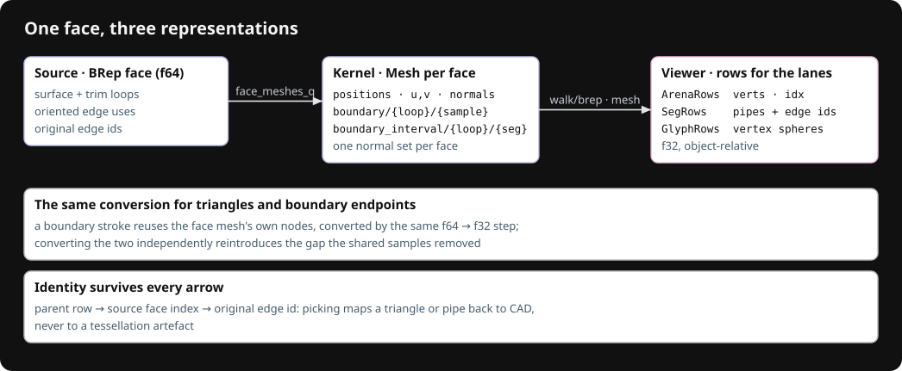

# 06 · CAD face rules

**Estimated study time: about 50–95 hours.** Includes reading, typing, tracing, testing and experiments. [How to use this estimate](map.md#time-estimates).

**This section:** Translate editable CAD geometry into display records with source identity.

**In the whole viewer:** The geometry kernel owns the source model. The walker makes the representation the GPU can draw without turning the GPU into a geometry editor.

**Follow the data:** Kernel object → walker → typed upload rows and bounds → GPU drawing path.

**Start with these files:** [`src/app/walk/mod.rs`](06-cad-contract.md#code-06-015), [`src/app/walk/brep.rs`](06-cad-contract.md#code-06-005).

**Aim to explain:** Which representation would you edit to change a face, and which would you rebuild afterwards?

[Whole-viewer map and course milestones](map.md)

The geometry kernel describes editable objects. The renderer needs compact records. A walker translates between them. For a point, it writes a marker, preserves the owning row, and returns bounds so the camera and selection can find it. The kernel remains the source of truth.



Start from the working result of [step 05](05-visibility.md).

**One buildable step:** type the additions below in `workspace/handwritten`, then build and test. This step adds 4,393 lines across 18 files and may take several sittings. Individual listings are parts of this step, not separate build checkpoints.

<span id="code-06-001"></span>

## `src/lib.rs`

Append **after line 29** of your current file.

Blank lines before: **1**; after: **0**. End with a newline.

```rust
--8<-- "typing/code/06-001.rs"
```

<span id="code-06-002"></span>

## `src/app/knobs.rs`

The application layer sits between browser events, document state and rendering. Identify which values this file owns and which it borrows from neighbouring modules. State changes should have a clear path to both redraw and user feedback.

Create this file. Type the complete listing, including comments and blank lines.

```rust
--8<-- "typing/code/06-002.rs"
```

<span id="code-06-003"></span>

## `src/app/mod.rs`

Create this file. Type the complete listing, including comments and blank lines.

```rust
--8<-- "typing/code/06-003.rs"
```

<span id="code-06-004"></span>

## `src/app/walk/bounds.rs`

The geometry kernel describes curves, faces and object structure. The walker turns those descriptions into buffers and rows the renderer understands. It preserves the connection to source identity so display details do not replace the editable document.

Create this file. Type the complete listing, including comments and blank lines.

```rust
--8<-- "typing/code/06-004.rs"
```

<span id="code-06-005"></span>

## `src/app/walk/brep.rs`

A boundary representation stores faces and their oriented boundaries. Tessellation must respect holes and trims, and neighbouring faces should agree along shared edges. Otherwise a watertight source can appear cracked or show unwanted diagonals.

Create this file. Type the complete listing, including comments and blank lines.

```rust
--8<-- "typing/code/06-005.rs"
```

<span id="code-06-006"></span>

## `src/app/walk/brep_edges.rs`

Create this file. Type the complete listing, including comments and blank lines.

```rust
--8<-- "typing/code/06-006.rs"
```

<span id="code-06-007"></span>

## `src/app/walk/brep_orient.rs`

Create this file. Type the complete listing, including comments and blank lines.

```rust
--8<-- "typing/code/06-007.rs"
```

<span id="code-06-008"></span>

## `src/app/walk/cloud.rs`

Create this file. Type the complete listing, including comments and blank lines.

```rust
--8<-- "typing/code/06-008.rs"
```

<span id="code-06-009"></span>

## `src/app/walk/curves.rs`

Create this file. Type the complete listing, including comments and blank lines.

```rust
--8<-- "typing/code/06-009.rs"
```

<span id="code-06-010"></span>

## `src/app/walk/encode.rs`

Create this file. Type the complete listing, including comments and blank lines.

```rust
--8<-- "typing/code/06-010.rs"
```

<span id="code-06-011"></span>

## `src/app/walk/frames.rs`

Create this file. Type the complete listing, including comments and blank lines.

```rust
--8<-- "typing/code/06-011.rs"
```

<span id="code-06-012"></span>

## `src/app/walk/mesh.rs`

Create this file. Type the complete listing, including comments and blank lines.

```rust
--8<-- "typing/code/06-012.rs"
```

<span id="code-06-013"></span>

## `src/app/walk/mesh_ink.rs`

Visible ink should describe boundaries and meaningful creases. Drawing every tessellation edge makes a smooth face look faceted. Use topology and orientation to distinguish geometry structure from the triangles used to display it.

Create this file. Type the complete listing, including comments and blank lines.

```rust
--8<-- "typing/code/06-013.rs"
```

<span id="code-06-014"></span>

## `src/app/walk/mesh_topology.rs`

A list of triangles gives positions but not all adjacency relationships. Topology records which vertices and edges belong together. Boundary and crease decisions use these relationships rather than guessing from one triangle alone.

Create this file. Type the complete listing, including comments and blank lines.

```rust
--8<-- "typing/code/06-014.rs"
```

<span id="code-06-015"></span>

## `src/app/walk/mod.rs`

Create this file. Type the complete listing, including comments and blank lines.

```rust
--8<-- "typing/code/06-015.rs"
```

<span id="code-06-016"></span>

## `src/app/walk/plane.rs`

Create this file. Type the complete listing, including comments and blank lines.

```rust
--8<-- "typing/code/06-016.rs"
```

<span id="code-06-017"></span>

## `src/app/walk/points.rs`

Create this file. Type the complete listing, including comments and blank lines.

```rust
--8<-- "typing/code/06-017.rs"
```

<span id="code-06-018"></span>

## `src/engine/gpu/vectors.rs`

Append **after line 660** of your current file.

Blank lines before: **1**; after: **0**. End with a newline.

```rust
--8<-- "typing/code/06-018.rs"
```

## Check the completed chapter

From `session_viewer`, compare everything you have typed:

```sh
npm --prefix ../session_tests run course -- reference-check 06
```

From `workspace/handwritten`:

```sh
cargo build --lib --locked -j4
cargo xtest --lib --locked -j4
```

Run the native walker tests. Explain why this function copies display data instead of replacing the editable kernel point.

If the point draws but cannot be framed or selected, compare its bounds and owner row with the marker position.

**Before moving on:** explain what changed, check the expected result above, and fix any build or test failure.

<details>
<summary>Check your explanation of the opening question</summary>

Edit the kernel source object. Then rebuild its display geometry and update the corresponding GPU records while retaining source identity.

</details>

[Next step: 07](07-boundaries.md)
