# 07 · Shared boundaries

## You are building

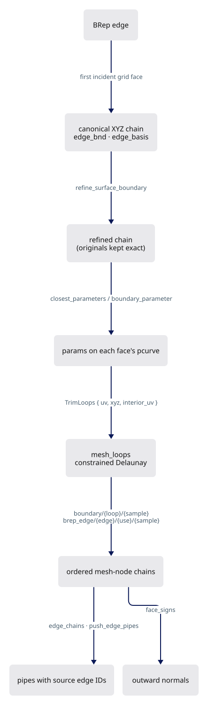

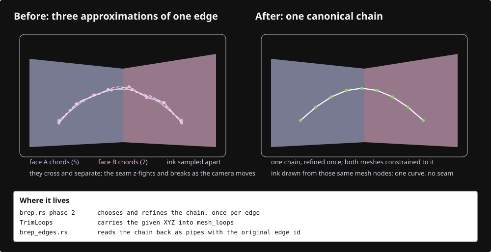

## Starting point

- Checkpoint 06: each BRep face is tessellated on its own; boundaries are records without geometry.
- Two faces that agree on an edge's endpoints can still chord the curve differently, so their seam z-fights and interior refinement can bury a coarse boundary chord.
- Fix: one XYZ polygon per edge, shared bit for bit by every incident face, then draw ink from the mesh nodes that polygon became.

<!-- supplied: 07 -->

<!-- step-status: start -->

**Does it compile yet?** `cargo check` passes after steps 2 and 4–9; step 1 fails and builds again at step 2; step 3 fails and builds again at step 4.

<!-- step-status: end -->

## Step 1 · Kernel: the trim-loop contract

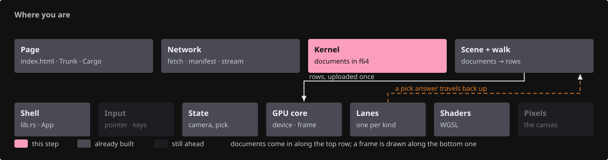{ .locator data-strip="illustrations/strip-9186989aed.svg" }

- `TrimLoops` is one face's handoff from BRep to mesher: UV polygons, the 3D point each polygon vertex must lift to, interior seeds.
- Loop vertices keep their positions exactly; a neighbouring face fed the same polygon lifts to the same bits.

<!-- file: 07 session_rust/src/nurbssurface_trimmed.rs type hunks=1-1 -->

<!-- file: 07 session_rust/src/lib.rs type -->

- One re-export: the contract has to be nameable from outside the kernel.

## Step 2 · Kernel: one triangulation body

{ .locator data-strip="illustrations/strip-9186989aed.svg" }

- `mesh_q` (the surface's own trim curves) and `mesh_loops` (polygons from BRep) share `triangulate`; the bounding-box diagonal becomes its own helper.
- `mesh_loops` answers invalid input or lost boundary provenance with an empty mesh, never a manufactured face.

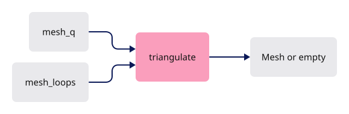

<!-- file: 07 session_rust/src/nurbssurface_trimmed.rs type hunks=2-6 -->

## Step 3 · Kernel: constrain boundaries and C0 knot lines

{ .locator data-strip="illustrations/strip-9186989aed.svg" }

- Every loop vertex keeps its Delaunay id: a 3D point plus a `boundary/{loop}/{sample}` tag reaches the vertex it becomes.
- A loop segment crossing an interior C0 knot line gains a node with a `boundary_interval/{loop}/{segment}` fraction: a polygon interval, not a curve parameter.
- Knot lines inside the trim are constrained too; the refinement test evaluates normals on the triangle's own side of a crease.

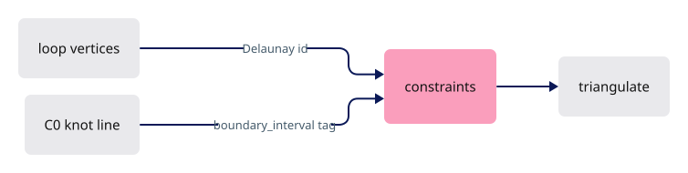

<!-- file: 07 session_rust/src/nurbssurface_trimmed.rs type hunks=7-8 -->

## Step 4 · Kernel: lift to the given points, tag, split creases

{ .locator data-strip="illustrations/strip-9186989aed.svg" }

- A triangle straddling a crease knot means the constraint failed: an empty mesh, never a smeared crease.
- With given XYZ the weld tolerance is zero; interval nodes interpolate on the supplied chord, so both faces insert the same point.

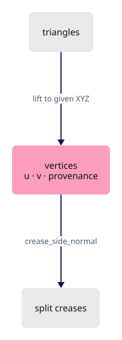

<!-- file: 07 session_rust/src/nurbssurface_trimmed.rs type hunks=9-10 -->

- Singular points take their fan's mean face normal in key order; every vertex records `u`, `v` and boundary provenance before the crease split.

<!-- file: 07 session_rust/src/nurbssurface_trimmed.rs type hunks=11-12 -->

## Step 5 · Kernel: BRep phases

{ .locator data-strip="illustrations/strip-9186989aed.svg" }

- Phase 2: the first incident grid face supplies the canonical polygon and its pcurve parameters; a grid whose samples differ is marked for rebuild, never left incompatible.
- Curved boundaries refine before interior refinement; every incident face is then rebuilt with the refined polygon.
- Phase 3: shared XYZ maps onto each face's actual pcurve, checked against edge/face tolerance.
- A wrong periodic branch falls back to a bounded search on that pcurve.

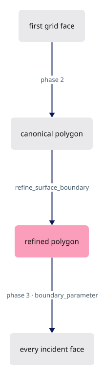

<!-- file: 07 session_rust/src/brep.rs type hunks=1-3 -->

- Helpers: bounded golden-section search on the lifted pcurve, one-sided boundary normals at singular ends, refinement that keeps original samples exact.

<!-- file: 07 session_rust/src/brep.rs type hunks=4 -->

<!-- check: 07 -->

## Step 6 · Viewer: chains from the face meshes

{ .locator data-strip="illustrations/strip-bb17a255a3.svg" }

- Grid faces give an iso-parametric chain read off `u`/`v`; constrained faces give the `brep_edge/{edge}/{use}/{sample}` nodes.

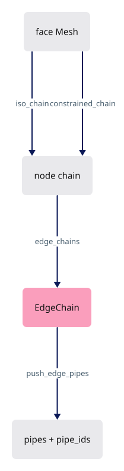

<!-- file: 07 session_viewer/src/app/walk/brep_edges.rs type whole lines=1-39 -->

- A grid face's pcurve is a straight iso line: its constant parameter names one sample column.
- The wrap of a closed direction is handled without tolerance.

<!-- file: 07 session_viewer/src/app/walk/brep_edges.rs type whole lines=40-99 -->

<!-- file: 07 session_viewer/src/app/walk/brep_edges.rs type whole lines=100-165 -->

- `constrained_chain` orders producer-tagged nodes by sample index plus interval fraction; a missing sample makes the chain unavailable rather than approximate.

<!-- file: 07 session_viewer/src/app/walk/brep_edges.rs type whole lines=166-239 -->

- One chain per edge, from the first use that can supply one; the other face lends the cull its normal.

<!-- file: 07 session_viewer/src/app/walk/brep_edges.rs type whole lines=240-297 -->

- The lending face's normal comes from its nearest face-mesh vertex: the facing cull needs two outward directions.

<!-- file: 07 session_viewer/src/app/walk/brep_edges.rs type whole lines=298-316 -->

- Pipes carry both faces' outward normals; `pipe_ids` records each pipe's source edge index.
- A collapsed f32 segment is skipped: it cannot become a pick target.

<!-- file: 07 session_viewer/src/app/walk/brep_edges.rs type whole lines=317-381 -->

<!-- file: 07 session_viewer/src/app/walk/brep_edges.rs copy whole lines=382-712 -->

## Step 7 · Viewer: outward orientation from the tessellation

{ .locator data-strip="illustrations/strip-bb17a255a3.svg" }

- Face-use flags are never read: two faces walking a shared edge in opposite directions agree, and a group enclosing negative volume is inside out.

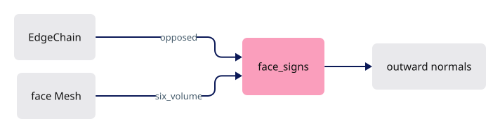

<!-- file: 07 session_viewer/src/app/walk/brep_orient.rs type lines=1-59 -->

- Matching a shared edge means finding where the other face sampled its start.
- Two grid faces agree bit for bit; a CDT face re-evaluates the surface and lands an ULP off.
- So the lookup is a nearest-vertex minimum: not an equality, and not a tolerance search.

<!-- file: 07 session_viewer/src/app/walk/brep_orient.rs type lines=60-78 -->

<!-- file: 07 session_viewer/src/app/walk/brep_orient.rs type lines=79-113 -->

- `opposed`: do the two faces walk their shared edge in opposite directions? `None` when either side cannot say — a refusal, not a guess.

<!-- file: 07 session_viewer/src/app/walk/brep_orient.rs type lines=114-162 -->

<!-- file: 07 session_viewer/src/app/walk/brep_orient.rs copy lines=163-277 -->

<!-- file: 07 session_viewer/src/app/walk/mod.rs type -->

- One line: `brep_orient`. No dispatcher until lesson 12, so a new file costs one declaration.

<!-- check: 07 -->

## Step 8 · Viewer: ink the solid's edges

{ .locator data-strip="illustrations/strip-bb17a255a3.svg" }

- A negative face sign flips normals and winding before upload, so shading, culling and boundary facing agree.
- An edge without a chain is drawn as a sampled ribbon and logged: a display fallback, not a CAD boundary.

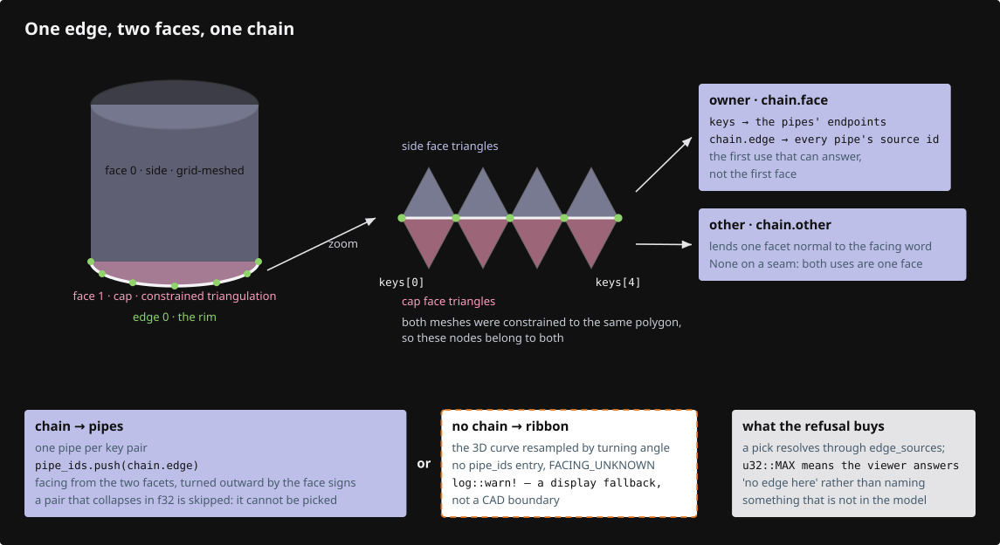

<!-- file: 07 session_viewer/src/app/walk/brep.rs type -->

## Step 9 · Fixture and status

{ .locator data-strip="illustrations/strip-460ff53e99.svg" }

A cylinder (closed seam, two circles) and a block with a hole (inner wire) exercise shared and trimmed boundaries.

<!-- file: 07 session_viewer/src/fixture.rs copy -->

<!-- file: 07 session_viewer/src/lib.rs type -->

- Only the status line changes: every lane reports its own count.
- The checkpoint test reads that JSON, not a screenshot.

<!-- file: 07 session_viewer/index.html copy -->

## Check

<!-- checkpoint: 07 -->

Expected:

- Two grey solids: a cylinder and a block with a through hole. Black ink on every CAD edge, including the hole rim and the cylinder's seam and circles.
- Orbit: each boundary stays attached to its face; no tessellation diagonal appears as an edge.
- The inspection JSON's `sourceEdgeIds` lists an edge index per pipe.

If a boundary floats or doubles, compare the f64 chains of both faces first, then the f32 endpoints, then visibility.

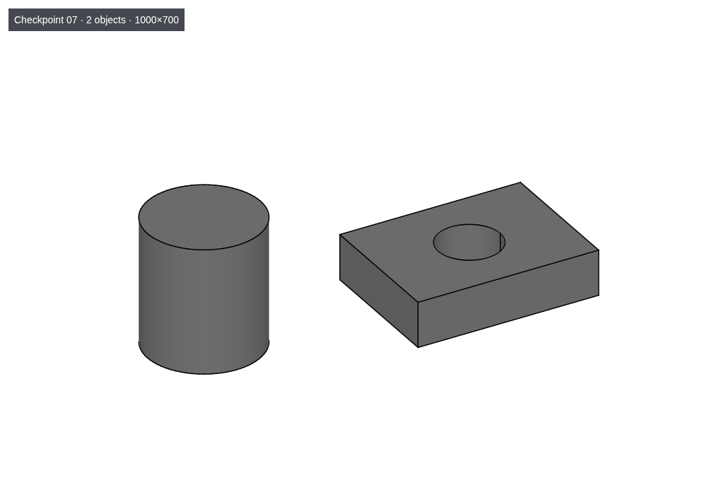

## What changed

<!-- tree: 07 session_viewer/src/app/walk -->

- Kernel: `TrimLoops`, `mesh_loops`, boundary refinement and pcurve mapping give every incident face the same boundary nodes with provenance.
- Viewer: chains are read from those nodes; pipes keep source edge IDs and both faces' outward normals.

**Production equivalent:** Production keeps this in `session_rust/src/{brep,nurbssurface_trimmed}.rs` and `src/app/walk/{brep,brep_edges,brep_orient}.rs`. The [CAD design record](cad-design.md) records the OCCT comparison behind this contract.

## Try

- Orbit until the cylinder's seam faces you: it is one line, not two, because both incident face meshes were built from the same chain. (`?top=1` is the wrong view — the axis is Z, so from above the seam projects to a point and the two rim circles sit face-on.)
- Append `?thickness=4` and orbit: the pipes widen but never detach from the faces, because their endpoints are mesh nodes.
- Zoom close to the hole rim, then orbit: the rim stays attached to the inner face at every scale; a separately sampled circle would float above or sink below it.

## Questions and answers

**Two faces agree on an edge's endpoints. Why is that not enough?**

*How to work it out.* Agreeing on the ends constrains two points. In between, each face chords the curve by *its own* refinement, from its own curvature and tolerance: two different polylines with the same endpoints.

*The answer.* The seam z-fights where the two chordings cross, and one face's coarse chord can be buried under the other's finer surface. Endpoints are too weak a contract; one canonical XYZ polygon, shared bit for bit, leaves nothing to disagree about.

**Why is the ink drawn from mesh nodes rather than sampled from the CAD curve?**

*How to work it out.* The ink outlines the tessellation, which is what the user sees. A curve sampled independently is a second approximation of the same edge, accurate to its own tolerance — and two approximations differ.

*The answer.* An independently sampled line visibly floats above or sinks below the surface it outlines as soon as you zoom. Drawing from the nodes the shared boundary polygon became makes line and surface the same geometry by construction, not by tolerance.

**When the constraint fails, the kernel returns an empty mesh. Defend that choice against "return the best mesh you can".**

*How to work it out.* A slightly-wrong face is inked, picked, measured, exported and trusted. An empty face is obviously broken, is reported, and nothing is built on it.

*The answer.* A smeared crease or a manufactured face looks plausible and is wrong; in a CAD kernel that is the expensive failure. A visible failure is cheaper than a quiet approximation — the same instinct as refusing a `200` answer to a range request in lesson 13.

**Face-use flags are never read when deciding which way is out. What is used instead, and why is that more robust?**

*How to work it out.* A flag was written by whichever tool produced the file and can be wrong or missing. The winding of the tessellation you compute from the geometry in your hand.

*The answer.* Two faces that walk a shared edge in opposite directions agree, and a group enclosing negative volume is inside out — both from the mesh. Prefer the invariant you can compute over the one you were told; the second has no error bar you can see.

**What you should be able to do now**

Explain why the fix is upstream of the viewer. Correct: the viewer receives two independently meshed faces and cannot recover the curve they both approximate, so any viewer-side fix would be a tolerance weld that guesses. The information needed — one canonical polygon, and the provenance tags saying which node came from which boundary sample — exists only inside the mesher. Recognising "this cannot be fixed where I am standing" is a skill worth naming.

## Next

[08 · Trims and seams](08-trimming.md): holes, natural boundaries and repeated seam uses keep correct geometry and source IDs.
