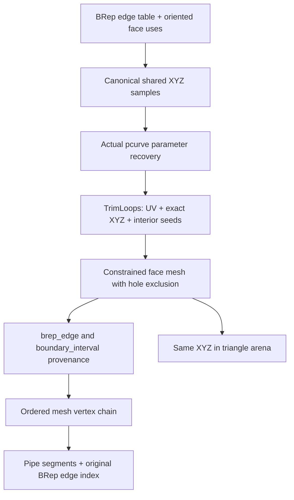

# 07 · Boundaries that belong to faces

Start from checkpoint **06** in `/tmp/viewer-course`; stop its previous Trunk process before serving this checkpoint. The complete [07.patch](reconstruction/patches/07.patch) contains every import, replacement, fixture and parity change below.

`src/` paths are relative to `/tmp/viewer-course/session_viewer`; `COURSE_REPO` is the maintained viewer directory exported in checkpoint 00.



Text equivalent: an edge's canonical XYZ samples are mapped to its actual incident-face pcurve, constrain that face's triangulation, and return labelled mesh nodes; the boundary pipes reuse those nodes and carry the original edge-table index.

**TYPE BY HAND — `../session_rust/src/nurbssurface_trimmed.rs` · `TrimLoops` · Insert before NurbsSurfaceTrimmed.**

```rust
#[derive(Debug, Clone, Default)]
pub struct TrimLoops {
    pub uv: Vec<Vec<Point>>,
    pub xyz: Vec<Vec<Point>>,
    pub interior_uv: Vec<Point>,
}
```

**TYPE BY HAND — `../session_rust/src/nurbssurface_trimmed.rs` · `NurbsSurfaceTrimmed::bbox_diagonal` · Insert before mesh_q.**

```rust
    fn bbox_diagonal(&self) -> f64 {
        let mut bmin = [1e30f64; 3];
        let mut bmax = [-1e30f64; 3];
        for i in 0..self.m_surface.cv_count_dir(Some(0)) {
            for j in 0..self.m_surface.cv_count_dir(Some(1)) {
                if let Some(p) = self.m_surface.get_cv(i, j) {
                    for k in 0..3 {
                        let c = p[k] as f64;
                        if c < bmin[k] {
                            bmin[k] = c;
                        }
                        if c > bmax[k] {
                            bmax[k] = c;
                        }
                    }
                }
            }
        }
        let bbox_diag = (0..3)
            .map(|k| (bmax[k] - bmin[k]).powi(2))
            .sum::<f64>()
            .sqrt();
        if bbox_diag < 1e-12 { 1.0 } else { bbox_diag }
    }
```

**TYPE BY HAND — `../session_rust/src/nurbssurface_trimmed.rs` · `NurbsSurfaceTrimmed::mesh_q` · Replace.**

```rust
    pub fn mesh_q(&self, max_angle_deg: f64, chord_factor: f64) -> Mesh {
        if !self.is_trimmed() {
            return self.m_surface.mesh();
        }

        let deflection = self.bbox_diagonal() * chord_factor;

        let eval3 = |u: f64, v: f64| -> [f64; 3] {
            let p = self
                .m_surface
                .point_at(u, v)
                .unwrap_or(Point::new(0.0, 0.0, 0.0));
            [p[0] as f64, p[1] as f64, p[2] as f64]
        };

        // ---- 1. Adaptive trim-wire discretization in UV ----
        let disc_loop = |crv: &NurbsCurve| -> Vec<Point> {
            let mut raw: Vec<[f64; 2]> = if crv.degree() <= 1 && !crv.is_rational() {
                (0..crv.cv_count())
                    .filter_map(|i| crv.get_cv(i))
                    .map(|p| [p[0] as f64, p[1] as f64])
                    .collect()
            } else {
                let n = (crv.cv_count() * 4).max(16);
                let (sampled, _) = crv.divide_by_count(n, true);
                sampled.iter().map(|p| [p[0] as f64, p[1] as f64]).collect()
            };
            while raw.len() > 1 {
                let dx = raw[0][0] - raw[raw.len() - 1][0];
                let dy = raw[0][1] - raw[raw.len() - 1][1];
                if dx * dx + dy * dy < 1e-20 {
                    raw.pop();
                } else {
                    break;
                }
            }
            if raw.len() < 2 {
                return raw.iter().map(|p| Point::new(p[0], p[1], 0.0)).collect();
            }
            // Recursively split each segment while its lifted 3D midpoint deviates from the chord.
            // Explicit stack, pushing right-then-left so points are emitted in boundary order.
            let mut out: Vec<Point> = Vec::with_capacity(raw.len() * 2);
            let m = raw.len();
            for i in 0..m {
                let a = raw[i];
                let b = raw[(i + 1) % m];
                let mut stack: Vec<([f64; 2], [f64; 2], i32)> = vec![(a, b, 0)];
                while let Some((sa, sb, depth)) = stack.pop() {
                    let mu = (sa[0] + sb[0]) * 0.5;
                    let mv = (sa[1] + sb[1]) * 0.5;
                    let pa = eval3(sa[0], sa[1]);
                    let pb = eval3(sb[0], sb[1]);
                    let pm = eval3(mu, mv);
                    let ex = pb[0] - pa[0];
                    let ey = pb[1] - pa[1];
                    let ez = pb[2] - pa[2];
                    let l2 = ex * ex + ey * ey + ez * ez;
                    let dev = if l2 > 1e-30 {
                        let t =
                            ((pm[0] - pa[0]) * ex + (pm[1] - pa[1]) * ey + (pm[2] - pa[2]) * ez)
                                / l2;
                        let cx = pa[0] + t * ex;
                        let cy = pa[1] + t * ey;
                        let cz = pa[2] + t * ez;
                        ((pm[0] - cx).powi(2) + (pm[1] - cy).powi(2) + (pm[2] - cz).powi(2)).sqrt()
                    } else {
                        0.0
                    };
                    if dev > deflection && depth < 6 {
                        stack.push(([mu, mv], sb, depth + 1));
                        stack.push((sa, [mu, mv], depth + 1));
                    } else {
                        out.push(Point::new(sa[0], sa[1], 0.0));
                    }
                }
            }
            out
        };

        let mut loops = TrimLoops::default();
        match self.m_outer_loop.as_ref() {
            Some(c) => loops.uv.push(disc_loop(c)),
            None => return self.m_surface.mesh(),
        }
        for inner in &self.m_inner_loops {
            loops.uv.push(disc_loop(inner));
        }
        self.triangulate(&loops, max_angle_deg, chord_factor)
    }
```

**TYPE BY HAND — `../session_rust/src/nurbssurface_trimmed.rs` · `NurbsSurfaceTrimmed::mesh_loops` · Insert after mesh_q.**

```rust
    pub fn mesh_loops(&self, loops: &TrimLoops, max_angle_deg: f64, chord_factor: f64) -> Mesh {
        if loops.uv.is_empty()
            || !max_angle_deg.is_finite()
            || max_angle_deg <= 0.0
            || !chord_factor.is_finite()
            || chord_factor <= 0.0
            || (!loops.xyz.is_empty() && loops.xyz.len() != loops.uv.len())
        {
            return Mesh::new();
        }
        for (li, points) in loops.uv.iter().enumerate() {
            if points.len() < 3 || (!loops.xyz.is_empty() && loops.xyz[li].len() != points.len()) {
                return Mesh::new();
            }
            for point in points {
                if !point[0].is_finite() || !point[1].is_finite() {
                    return Mesh::new();
                }
            }
            if let Some(positions) = loops.xyz.get(li) {
                for point in positions {
                    if !point[0].is_finite() || !point[1].is_finite() || !point[2].is_finite() {
                        return Mesh::new();
                    }
                }
            }
        }
        let result = self.triangulate(loops, max_angle_deg, chord_factor);
        let expected: usize = loops.uv.iter().map(Vec::len).sum();
        let actual = result
            .vertex
            .values()
            .flat_map(|vd| vd.attributes.keys())
            .filter(|name| name.starts_with("boundary/"))
            .collect::<std::collections::BTreeSet<_>>()
            .len();
        if actual == expected {
            result
        } else {
            Mesh::new()
        }
    }
```

**TYPE BY HAND — `../session_rust/src/nurbssurface_trimmed.rs` · `NurbsSurfaceTrimmed::triangulate` · Insert after mesh_loops.**

```rust
    fn triangulate(&self, loops: &TrimLoops, max_angle_deg: f64, chord_factor: f64) -> Mesh {
        if loops.uv.is_empty() || loops.uv[0].len() < 3 {
            return self.m_surface.mesh();
        }
        let outer_uv: Vec<[f64; 2]> = loops.uv[0].iter().map(|p| [p[0], p[1]]).collect();
        let hole_uvs: Vec<Vec<[f64; 2]>> = loops.uv[1..]
            .iter()
            .map(|h| h.iter().map(|p| [p[0], p[1]]).collect())
            .collect();
        let bbox_diag = self.bbox_diagonal();
        let deflection = bbox_diag * chord_factor;
        let cos_max_angle =
            (max_angle_deg.max(0.1).min(179.0) * std::f64::consts::PI / 180.0).cos();

        let eval3 = |u: f64, v: f64| -> [f64; 3] {
            let p = self
                .m_surface
                .point_at(u, v)
                .unwrap_or(Point::new(0.0, 0.0, 0.0));
            [p[0] as f64, p[1] as f64, p[2] as f64]
        };

        let mut bb_umin = 1e30_f64;
        let mut bb_vmin = 1e30_f64;
        let mut bb_umax = -1e30_f64;
        let mut bb_vmax = -1e30_f64;
        for p in &outer_uv {
            if p[0] < bb_umin {
                bb_umin = p[0];
            }
            if p[1] < bb_vmin {
                bb_vmin = p[1];
            }
            if p[0] > bb_umax {
                bb_umax = p[0];
            }
            if p[1] > bb_vmax {
                bb_vmax = p[1];
            }
        }

        let point_in_polygon = |u: f64, v: f64, poly: &[[f64; 2]]| -> bool {
            let n = poly.len();
            if n < 3 {
                return false;
            }
            let mut inside = false;
            let mut j = n - 1;
            for i in 0..n {
                let (xi, yi) = (poly[i][0], poly[i][1]);
                let (xj, yj) = (poly[j][0], poly[j][1]);
                if ((yi > v) != (yj > v)) && (u < (xj - xi) * (v - yi) / (yj - yi) + xi) {
                    inside = !inside;
                }
                j = i;
            }
            inside
        };
        let inside_trim = |u: f64, v: f64| -> bool {
            if !point_in_polygon(u, v, &outer_uv) {
                return false;
            }
            for h in &hole_uvs {
                if point_in_polygon(u, v, h) {
                    return false;
                }
            }
            true
        };

        // ---- 2. Constrained Delaunay of the trim wire ----
        // Every loop vertex keeps its Delaunay id, so a 3D point and a tag the caller gave it
        // reach the mesh vertex it becomes.
        let mut crease_knots = [Vec::new(), Vec::new()];
        for dir in 0..2 {
            let Some((start, end)) = self.m_surface.domain(dir) else {
                continue;
            };
            let knots = &self.m_surface.m_nurbsknot[dir];
            for &knot in knots {
                if knot <= start || knot >= end || crease_knots[dir].contains(&knot) {
                    continue;
                }
                if knots.iter().filter(|&&value| value == knot).count()
                    >= self.m_surface.degree(dir)
                {
                    crease_knots[dir].push(knot);
                }
            }
        }
        let mut dt = Delaunay2D::new(bb_umin, bb_vmin, bb_umax, bb_vmax);
        let mut loop_vids: Vec<Vec<i32>> = Vec::new();
        let mut boundary_intervals = std::collections::HashMap::<usize, (usize, usize, f64)>::new();
        for (li, pts) in loops.uv.iter().enumerate() {
            let vis: Vec<i32> = pts.iter().map(|p| dt.insert(p[0], p[1])).collect();
            for i in 0..vis.len() {
                let j = (i + 1) % vis.len();
                let mut events = vec![(0.0, vis[i]), (1.0, vis[j])];
                for dir in 0..2 {
                    let delta = pts[j][dir] - pts[i][dir];
                    if delta == 0.0 {
                        continue;
                    }
                    for &knot in &crease_knots[dir] {
                        let t = (knot - pts[i][dir]) / delta;
                        if t <= 0.0 || t >= 1.0 {
                            continue;
                        }
                        let mut uv = [
                            pts[i][0] + t * (pts[j][0] - pts[i][0]),
                            pts[i][1] + t * (pts[j][1] - pts[i][1]),
                        ];
                        uv[dir] = knot;
                        let vi = dt.insert(uv[0], uv[1]);
                        if vi >= 0 {
                            boundary_intervals.insert(vi as usize, (li, i, t));
                        }
                        events.push((t, vi));
                    }
                }
                events.sort_by(|a, b| a.0.total_cmp(&b.0));
                for pair in events.windows(2) {
                    if pair[0].1 >= 0 && pair[1].1 >= 0 && pair[0].1 != pair[1].1 {
                        dt.insert_constraint(pair[0].1, pair[1].1);
                    }
                }
            }
            loop_vids.push(vis);
        }
        for &u in &crease_knots[0] {
            for &v in &crease_knots[1] {
                if inside_trim(u, v) {
                    dt.insert(u, v);
                }
            }
        }
        for dir in 0..2 {
            for &knot in &crease_knots[dir] {
                let mut nodes = Vec::new();
                for (vi, vertex) in dt.vertices.iter().enumerate() {
                    let uv = [vertex.x, vertex.y];
                    if uv[dir] == knot {
                        nodes.push((uv[1 - dir], vi as i32));
                    }
                }
                nodes.sort_by(|a, b| a.0.total_cmp(&b.0));
                for pair in nodes.windows(2) {
                    let mut uv = [knot, knot];
                    uv[1 - dir] = (pair[0].0 + pair[1].0) * 0.5;
                    if inside_trim(uv[0], uv[1]) {
                        dt.insert_constraint(pair[0].1, pair[1].1);
                    }
                }
            }
        }
        for p in &loops.interior_uv {
            if inside_trim(p[0], p[1]) {
                dt.insert(p[0], p[1]);
            }
        }

        // ---- 3. Interior refinement by surface deflection ----
        // Interior seeds still undergo the same deflection and normal-angle checks.
        const MAX_ITERS: i32 = 8;
        const MAX_VERTS: usize = 200000;
        let iters = MAX_ITERS;
        for _iter in 0..iters {
            let mut to_insert: Vec<[f64; 2]> = Vec::new();
            for tri in &dt.triangles {
                if !tri.alive {
                    continue;
                }
                let a = &dt.vertices[tri.v[0] as usize];
                let b = &dt.vertices[tri.v[1] as usize];
                let c = &dt.vertices[tri.v[2] as usize];
                let cu = (a.x + b.x + c.x) / 3.0;
                let cv = (a.y + b.y + c.y) / 3.0;
                if !inside_trim(cu, cv) {
                    continue;
                }
                let pa = eval3(a.x, a.y);
                let pb = eval3(b.x, b.y);
                let pc = eval3(c.x, c.y);
                let pm = eval3(cu, cv);
                let ux = pb[0] - pa[0];
                let uy = pb[1] - pa[1];
                let uz = pb[2] - pa[2];
                let vx = pc[0] - pa[0];
                let vy = pc[1] - pa[1];
                let vz = pc[2] - pa[2];
                let nx = uy * vz - uz * vy;
                let ny = uz * vx - ux * vz;
                let nz = ux * vy - uy * vx;
                let nl = (nx * nx + ny * ny + nz * nz).sqrt();
                if nl < 1e-30 {
                    continue;
                }
                let dev = (((pm[0] - pa[0]) * nx + (pm[1] - pa[1]) * ny + (pm[2] - pa[2]) * nz)
                    / nl)
                    .abs();
                let mut refine = dev > deflection;
                if !refine {
                    let na =
                        crease_side_normal(&self.m_surface, &crease_knots, [cu, cv], [a.x, a.y]);
                    let nb =
                        crease_side_normal(&self.m_surface, &crease_knots, [cu, cv], [b.x, b.y]);
                    let nc2 =
                        crease_side_normal(&self.m_surface, &crease_knots, [cu, cv], [c.x, c.y]);
                    let d1 = na[0] * nb[0] + na[1] * nb[1] + na[2] * nb[2];
                    let d2 = nb[0] * nc2[0] + nb[1] * nc2[1] + nb[2] * nc2[2];
                    let d3 = na[0] * nc2[0] + na[1] * nc2[1] + na[2] * nc2[2];
                    let mind = d1.min(d2.min(d3)) as f64;
                    if mind < cos_max_angle {
                        refine = true;
                    }
                }
                if refine {
                    to_insert.push([cu, cv]);
                }
            }
            if to_insert.is_empty() {
                break;
            }
            for uv in &to_insert {
                if dt.vertices.len() >= MAX_VERTS {
                    break;
                }
                dt.insert(uv[0], uv[1]);
            }
            if dt.vertices.len() >= MAX_VERTS {
                break;
            }
        }

        // ---- 4. Trim, lift, normals ----
        dt.cleanup();
        for ti in 0..dt.triangles.len() {
            if !dt.triangles[ti].alive {
                continue;
            }
            let cu = (dt.vertices[dt.triangles[ti].v[0] as usize].x
                + dt.vertices[dt.triangles[ti].v[1] as usize].x
                + dt.vertices[dt.triangles[ti].v[2] as usize].x)
                / 3.0;
            let cv = (dt.vertices[dt.triangles[ti].v[0] as usize].y
                + dt.vertices[dt.triangles[ti].v[1] as usize].y
                + dt.vertices[dt.triangles[ti].v[2] as usize].y)
                / 3.0;
            if !inside_trim(cu, cv) {
                dt.triangles[ti].alive = false;
            }
        }
        let tris = dt.get_triangles();
        if tris.is_empty() {
            return Mesh::new();
        }
        for tri in &tris {
            for dir in 0..2 {
                let coordinates = tri.map(|vi| {
                    let p = &dt.vertices[vi as usize];
                    [p.x, p.y][dir]
                });
                let low = coordinates.iter().copied().fold(f64::INFINITY, f64::min);
                let high = coordinates
                    .iter()
                    .copied()
                    .fold(f64::NEG_INFINITY, f64::max);
                if crease_knots[dir]
                    .iter()
                    .any(|&knot| low < knot && knot < high)
                {
                    return Mesh::new();
                }
            }
        }

        // A loop vertex given a 3D point lifts to it, not through the surface: that point is the
        // edge polygon's and the neighbouring face lifts to the same bits.
        let nv = dt.vertices.len();
        let mut given: Vec<Option<(usize, usize)>> = vec![None; nv];
        for (li, vids) in loop_vids.iter().enumerate() {
            if li >= loops.xyz.len() {
                break;
            }
            for (k, &vi) in vids.iter().enumerate() {
                if vi >= 0 && k < loops.xyz[li].len() {
                    given[vi as usize] = Some((li, k));
                }
            }
        }

        let mut result = Mesh::new();
        let mut vert_map: Vec<Option<usize>> = vec![None; nv];

        // Lift to 3D, welding coincident vertices so a closed/periodic surface (cylinder, cone,
        // torus, sphere) stitches at its seam: distinct UV columns u0 and u1 (or rows v0/v1)
        // evaluate to the SAME 3D point, so they must share one mesh vertex. Spatial hash on a
        // weld-tolerance grid; new points scan the 3x3x3 neighbour cells.
        let weld_tol = if loops.xyz.is_empty() {
            bbox_diag * 1e-5
        } else {
            0.0
        };
        let cell = (bbox_diag * 1e-5).max(f64::MIN_POSITIVE);
        let mut cell_map: std::collections::HashMap<(i64, i64, i64), Vec<([f64; 3], usize)>> =
            std::collections::HashMap::new();
        for &[a, b, c] in &tris {
            for &vi in &[a, b, c] {
                if vert_map[vi as usize].is_none() {
                    let u = dt.vertices[vi as usize].x;
                    let v = dt.vertices[vi as usize].y;
                    let p3d = match given[vi as usize] {
                        Some((li, k)) => loops.xyz[li][k].clone(),
                        None => {
                            if let Some(&(li, k, t)) = boundary_intervals.get(&(vi as usize)) {
                                if let Some(points) = loops.xyz.get(li) {
                                    let a = &points[k];
                                    let b = &points[(k + 1) % points.len()];
                                    Point::new(
                                        a[0] + t * (b[0] - a[0]),
                                        a[1] + t * (b[1] - a[1]),
                                        a[2] + t * (b[2] - a[2]),
                                    )
                                } else {
                                    self.m_surface
                                        .point_at(u, v)
                                        .unwrap_or(Point::new(0.0, 0.0, 0.0))
                                }
                            } else {
                                self.m_surface
                                    .point_at(u, v)
                                    .unwrap_or(Point::new(0.0, 0.0, 0.0))
                            }
                        }
                    };
                    let x = p3d[0] as f64;
                    let y = p3d[1] as f64;
                    let z = p3d[2] as f64;
                    let ci = (x / cell).floor() as i64;
                    let cj = (y / cell).floor() as i64;
                    let ck = (z / cell).floor() as i64;
                    let mut found: Option<usize> = None;
                    'scan: for di in -1..=1 {
                        for dj in -1..=1 {
                            for dk in -1..=1 {
                                if let Some(bucket) = cell_map.get(&(ci + di, cj + dj, ck + dk)) {
                                    for &(p, wvk) in bucket {
                                        let dx = p[0] - x;
                                        let dy = p[1] - y;
                                        let dz = p[2] - z;
                                        if dx * dx + dy * dy + dz * dz <= weld_tol * weld_tol {
                                            found = Some(wvk);
                                            break 'scan;
                                        }
                                    }
                                }
                            }
                        }
                    }
                    let vk = match found {
                        Some(wvk) => wvk,
                        None => {
                            let vk = result.add_vertex(p3d, None);
                            cell_map
                                .entry((ci, cj, ck))
                                .or_default()
                                .push(([x, y, z], vk));
                            vk
                        }
                    };
                    vert_map[vi as usize] = Some(vk);
                }
            }
        }
        for &[a, b, c] in &tris {
            let v0 = vert_map[a as usize].unwrap();
            let v1 = vert_map[b as usize].unwrap();
            let v2 = vert_map[c as usize].unwrap();
            if v0 == v1 || v1 == v2 || v2 == v0 {
                continue;
            }
            result.add_face(vec![v0, v1, v2], None);
        }
        // A singular point (a pole, an apex) has no analytic normal: it takes the mean of its
        // fan's face normals, summed in face-key order so the bits never depend on map order.
        let mut fan: std::collections::HashMap<usize, [f64; 3]> = std::collections::HashMap::new();
        let mut fkeys: Vec<usize> = result.face.keys().copied().collect();
        fkeys.sort_unstable();
        for fk in fkeys {
            let verts = &result.face[&fk];
            let a = result.vertex[&verts[0]].position();
            let b = result.vertex[&verts[1]].position();
            let c = result.vertex[&verts[2]].position();
            let (e1, e2) = (
                [b[0] - a[0], b[1] - a[1], b[2] - a[2]],
                [c[0] - a[0], c[1] - a[1], c[2] - a[2]],
            );
            let n = [
                e1[1] * e2[2] - e1[2] * e2[1],
                e1[2] * e2[0] - e1[0] * e2[2],
                e1[0] * e2[1] - e1[1] * e2[0],
            ];
            for &vk in verts {
                let acc = fan.entry(vk).or_insert([0.0; 3]);
                acc[0] += n[0];
                acc[1] += n[1];
                acc[2] += n[2];
            }
        }
        for vi in 0..nv {
            if let Some(vk) = vert_map[vi] {
                let u = dt.vertices[vi].x;
                let v = dt.vertices[vi].y;
                let normal = self.m_surface.normal_at(u, v);
                let mut nrm = [normal[0], normal[1], normal[2]];
                let nl = (nrm[0] * nrm[0] + nrm[1] * nrm[1] + nrm[2] * nrm[2]).sqrt();
                if !nl.is_finite() || nl <= 0.0 {
                    let f = fan.get(&vk).copied().unwrap_or([0.0, 0.0, 1.0]);
                    let fl = (f[0] * f[0] + f[1] * f[1] + f[2] * f[2]).sqrt();
                    nrm = if fl.is_finite() && fl > 0.0 {
                        [f[0] / fl, f[1] / fl, f[2] / fl]
                    } else {
                        [0.0, 0.0, 1.0]
                    };
                }
                if let Some(vd) = result.vertex.get_mut(&vk) {
                    vd.set_normal(nrm[0], nrm[1], nrm[2]);
                    vd.attributes.insert("u".to_string(), u);
                    vd.attributes.insert("v".to_string(), v);
                }
            }
        }
        for (li, vids) in loop_vids.iter().enumerate() {
            for (k, &vi) in vids.iter().enumerate() {
                if vi < 0 {
                    continue;
                }
                if let Some(vk) = vert_map[vi as usize] {
                    if let Some(vd) = result.vertex.get_mut(&vk) {
                        vd.attributes.insert(format!("boundary/{li}/{k}"), 1.0);
                    }
                }
            }
        }
        for (&vi, &(li, k, t)) in &boundary_intervals {
            if let Some(vk) = vert_map[vi] {
                result
                    .vertex
                    .get_mut(&vk)
                    .unwrap()
                    .attributes
                    .insert(format!("boundary_interval/{li}/{k}"), t);
            }
        }
        crate::remesh_nurbssurface_grid::RemeshNurbsSurfaceGrid::split_crease_normals(
            &self.m_surface,
            &mut result,
        );
        result
    }
```

**TYPE BY HAND — `../session_rust/src/nurbssurface_trimmed.rs` · `crease_side_normal` · Insert at module scope after the existing trait implementations.**

```rust
fn crease_side_normal(
    surface: &NurbsSurface,
    knots: &[Vec<f64>; 2],
    center: [f64; 2],
    mut uv: [f64; 2],
) -> Vector {
    for dir in 0..2 {
        if knots[dir].contains(&uv[dir]) {
            if center[dir] < uv[dir] {
                uv[dir] = uv[dir].next_down();
            }
            if center[dir] > uv[dir] {
                uv[dir] = uv[dir].next_up();
            }
        }
    }
    surface.normal_at(uv[0], uv[1])
}
```

**TYPE BY HAND — `../session_rust/src/brep.rs` · `BRep::face_meshes_q` · Replace.**

```rust
    pub fn face_meshes_q(&self, quality: Option<(f64, f64)>) -> Vec<Mesh> {
        use crate::nurbssurface_trimmed::NurbsSurfaceTrimmed;
        let nf = self.m_faces.len();

        // Phase 1: a face whose outer wire is the full UV rectangle (straight pcurves enclosing the
        // whole domain area, no holes) is meshed directly on the surface grid; everything else goes
        // through the trimmed CDT.
        let mut face_direct = vec![false; nf];
        for fi in 0..nf {
            let face = &self.m_faces[fi];
            let srf = &self.m_surfaces[face.surface_index as usize];
            if face.wires.len() != 1 {
                continue;
            }
            let mut all_linear = true;
            for er in self.wire_edges(&face.wires[0]) {
                let ci = self.pcurve_index(er.index as usize, fi, er.orientation);
                if ci < 0 {
                    continue;
                }
                let c = &self.m_curves_2d[ci as usize];
                if c.degree() > 1 || c.is_rational() {
                    all_linear = false;
                }
            }
            if !all_linear {
                continue;
            }
            let outer = self.wire_uv_points(fi, &face.wires[0]);
            if outer.len() < 3 {
                continue;
            }
            let (u0, u1) = srf.domain(0).unwrap_or((0.0, 1.0));
            let (v0, v1) = srf.domain(1).unwrap_or((0.0, 1.0));
            let domain_area = (u1 - u0) * (v1 - v0);
            face_direct[fi] =
                (polygon_signed_area(&outer).abs() - domain_area).abs() < 1e-3 * domain_area;
        }

        // Phase 2: direct faces. The first incident grid supplies the canonical edge polygon.
        // Mismatching incident grids are rebuilt with these constraints and their interior UV seeds.
        let mut rebuild_grid = vec![false; nf];
        let mut fmesh: Vec<Mesh> = (0..nf).map(|_| Mesh::new()).collect();
        let mut edge_bnd: std::collections::HashMap<usize, Vec<Point>> =
            std::collections::HashMap::new();
        let mut edge_basis = std::collections::BTreeMap::<usize, (usize, usize, Vec<f64>)>::new();
        let mut edge_samples = std::collections::HashMap::<usize, Vec<(f64, Point)>>::new();
        for fi in 0..nf {
            if !face_direct[fi] {
                continue;
            }
            let face = &self.m_faces[fi];
            let srf = &self.m_surfaces[face.surface_index as usize];
            fmesh[fi] = match quality {
                Some((a, c)) => {
                    crate::remesh_nurbssurface_grid::RemeshNurbsSurfaceGrid::from_u_v_q(
                        srf.clone(),
                        0,
                        0,
                        a,
                        c,
                    )
                }
                None => srf.mesh(),
            };
            let (u0, u1) = srf.domain(0).unwrap_or((0.0, 1.0));
            let (v0, v1) = srf.domain(1).unwrap_or((0.0, 1.0));
            let utol = (u1 - u0) * 0.001;
            let vtol = (v1 - v0) * 0.001;
            for er in self.wire_edges(&face.wires[0]) {
                let eidx = er.index as usize;
                let shared = self
                    .edge_faces(eidx)
                    .iter()
                    .any(|fr| fr.index as usize != fi);
                if !shared {
                    continue;
                }
                let ci = self.pcurve_index(eidx, fi, er.orientation);
                if ci < 0 {
                    continue;
                }
                let c2d = &self.m_curves_2d[ci as usize];
                let (sp, ep) = match (c2d.get_cv(0), c2d.get_cv(c2d.cv_count().saturating_sub(1))) {
                    (Some(a), Some(b)) => (a, b),
                    _ => continue,
                };
                let at_v0 = (sp[1] - v0).abs() < vtol && (ep[1] - v0).abs() < vtol;
                let at_v1 = (sp[1] - v1).abs() < vtol && (ep[1] - v1).abs() < vtol;
                let at_u0 = (sp[0] - u0).abs() < utol && (ep[0] - u0).abs() < utol;
                let at_u1 = (sp[0] - u1).abs() < utol && (ep[0] - u1).abs() < utol;
                if !at_v0 && !at_v1 && !at_u0 && !at_u1 {
                    continue;
                }
                let mut pts: Vec<(f64, Point)> = Vec::new();
                for (_, vd) in fmesh[fi].vertex.iter() {
                    let (iu, iv) = match (vd.attributes.get("u"), vd.attributes.get("v")) {
                        (Some(&a), Some(&b)) => (a, b),
                        _ => continue,
                    };
                    if at_v0 && (iv - v0).abs() < vtol * 0.1 {
                        pts.push((iu, vd.position()));
                    } else if at_v1 && (iv - v1).abs() < vtol * 0.1 {
                        pts.push((iu, vd.position()));
                    } else if at_u0 && (iu - u0).abs() < utol * 0.1 {
                        pts.push((iv, vd.position()));
                    } else if at_u1 && (iu - u1).abs() < utol * 0.1 {
                        pts.push((iv, vd.position()));
                    }
                }
                pts.sort_by(|a, b| a.0.partial_cmp(&b.0).unwrap_or(std::cmp::Ordering::Equal));
                pts.dedup_by(|a, b| a.0 == b.0);
                if pts.len() >= 2 {
                    let varying = if at_v0 || at_v1 { 0 } else { 1 };
                    let (t0, t1) = c2d.domain();
                    let parameters: Vec<f64> = pts
                        .iter()
                        .map(|(t, _)| {
                            t0 + (t - sp[varying]) / (ep[varying] - sp[varying]) * (t1 - t0)
                        })
                        .collect();
                    let points: Vec<Point> = pts.into_iter().map(|(_, p)| p).collect();
                    if let Some(canonical) = edge_bnd.get(&eidx) {
                        let matches = canonical.len() == points.len()
                            && (canonical
                                .iter()
                                .zip(&points)
                                .all(|(a, b)| same_boundary_point(a, b))
                                || canonical
                                    .iter()
                                    .zip(points.iter().rev())
                                    .all(|(a, b)| same_boundary_point(a, b)));
                        rebuild_grid[fi] |= !matches;
                    } else {
                        edge_bnd.insert(eidx, points);
                        edge_basis.insert(eidx, (fi, ci as usize, parameters));
                    }
                }
            }
        }

        // A constrained triangle cannot reduce the angular error between fixed
        // boundary endpoints by inserting more interior centroids. Refine the
        // canonical polygon first, then rebuild every incident face with it.
        for (&edge, (face, pcurve, parameters)) in &edge_basis {
            let curved_cdt = self.edge_faces(edge).iter().any(|incident| {
                let fi = incident.index as usize;
                (!face_direct[fi] || rebuild_grid[fi])
                    && !self.m_surfaces[self.m_faces[fi].surface_index as usize].is_planar(0.0)
            });
            if !curved_cdt {
                continue;
            }
            let surface = &self.m_surfaces[self.m_faces[*face].surface_index as usize];
            let curve = &self.m_curves_2d[*pcurve];
            let points = &edge_bnd[&edge];
            let mut samples: Vec<_> = parameters
                .iter()
                .zip(points)
                .map(|(&t, p)| (t, curve.point_at(t), p.clone()))
                .collect();
            samples.sort_by(|a, b| a.0.total_cmp(&b.0));
            if self.m_edges[edge].start_vertex == self.m_edges[edge].end_vertex {
                let end = curve.domain().1;
                if samples.last().is_some_and(|sample| sample.0 < end) {
                    samples.push((end, curve.point_at(end), samples[0].2.clone()));
                }
            }
            let count = samples.len();
            let (angle, chord) = quality.unwrap_or((20.0, 0.005));
            let refined = refine_surface_boundary(surface, curve, samples, angle, chord);
            if refined.len() > count {
                edge_samples.insert(
                    edge,
                    refined
                        .iter()
                        .map(|sample| (sample.0, sample.1.clone()))
                        .collect(),
                );
                edge_bnd.insert(edge, refined.into_iter().map(|sample| sample.2).collect());
                for incident in self.edge_faces(edge) {
                    rebuild_grid[incident.index as usize] = true;
                }
            }
        }

        for fi in 0..nf {
            if rebuild_grid[fi] {
                face_direct[fi] = false;
            }
        }

        // Phase 3: CDT faces preserve their supplied boundary-node identities. Shared
        // XYZ samples are mapped onto the actual pcurve and checked in model space.
        for fi in 0..nf {
            if face_direct[fi] {
                continue;
            }
            let face = &self.m_faces[fi];
            let srf = &self.m_surfaces[face.surface_index as usize];
            let (angle, chord) = quality.unwrap_or((20.0, 0.005));
            let mut loops = crate::nurbssurface_trimmed::TrimLoops::default();
            if rebuild_grid[fi] {
                let (u0, u1) = srf.domain(0).unwrap();
                let (v0, v1) = srf.domain(1).unwrap();
                for vertex in fmesh[fi].vertex.values() {
                    if let (Some(&u), Some(&v)) =
                        (vertex.attributes.get("u"), vertex.attributes.get("v"))
                    {
                        if u > u0 && u < u1 && v > v0 && v < v1 {
                            loops.interior_uv.push(Point::new(u, v, 0.0));
                        }
                    }
                }
            }
            let mut uses: Vec<(usize, usize, usize, usize)> = Vec::new();
            let mut valid = true;
            for (wi, wr) in face.wires.iter().enumerate() {
                let mut uv = Vec::new();
                let mut xyz = Vec::new();
                for er in self.wire_edges(wr) {
                    let ei = er.index as usize;
                    let edge = &self.m_edges[ei];
                    let ci = self.pcurve_index(ei, fi, er.orientation);
                    if ci < 0 {
                        valid = false;
                        break;
                    }
                    let crv = &self.m_curves_2d[ci as usize];
                    let mut samples: Vec<(f64, Point, Point)> = Vec::new();
                    if let Some(points) = edge_bnd.get(&ei) {
                        for (index, p) in points.iter().enumerate() {
                            let cached = edge_basis
                                .get(&ei)
                                .filter(|basis| basis.0 == fi && basis.1 == ci as usize)
                                .and_then(|_| edge_samples.get(&ei))
                                .and_then(|samples| samples.get(index));
                            let (mut t, mut q) = if let Some(sample) = cached {
                                sample.clone()
                            } else {
                                let (u, v) = srf.closest_parameters(p);
                                let t = crv.closest_parameter(&Point::new(u, v, 0.0));
                                (t, crv.point_at(t))
                            };
                            let scale = p[0].abs().max(p[1].abs()).max(p[2].abs()).max(1.0);
                            let tolerance = edge
                                .tolerance
                                .max(face.tolerance)
                                .max(f64::EPSILON.sqrt() * scale);
                            if srf
                                .point_at(q[0], q[1])
                                .is_none_or(|lifted| lifted.distance(p, None) > tolerance)
                            {
                                t = boundary_parameter(srf, crv, p);
                                q = crv.point_at(t);
                                if srf
                                    .point_at(q[0], q[1])
                                    .is_none_or(|lifted| lifted.distance(p, None) > tolerance)
                                {
                                    valid = false;
                                    break;
                                }
                            }
                            samples.push((t, q, p.clone()));
                        }
                        samples.sort_by(|a, b| a.0.total_cmp(&b.0));
                        samples.dedup_by(|a, b| a.0 == b.0);
                    } else {
                        let count = (crv.cv_count() * 4)
                            .max((360.0 / angle.max(0.1)).ceil() as usize)
                            .min(4096);
                        let (points, parameters) =
                            if crv.degree() <= 1 && !crv.is_rational() && srf.is_planar(0.0) {
                                let points =
                                    (0..crv.cv_count()).filter_map(|k| crv.get_cv(k)).collect();
                                let parameters = (0..crv.cv_count())
                                    .map(|k| crv.greville_abcissa(k))
                                    .collect();
                                (points, parameters)
                            } else {
                                crv.divide_by_count(count, true)
                            };
                        for (q, t) in points.into_iter().zip(parameters) {
                            let Some(p) = srf.point_at(q[0], q[1]) else {
                                valid = false;
                                break;
                            };
                            samples.push((t, q, p));
                        }
                        samples = refine_surface_boundary(srf, crv, samples, angle, chord);
                        edge_bnd
                            .insert(ei, samples.iter().map(|sample| sample.2.clone()).collect());
                    }
                    if edge.start_vertex == edge.end_vertex && samples.len() > 1 {
                        let first = samples[0].clone();
                        let last = samples.last().unwrap();
                        if last.2[0] != first.2[0]
                            || last.2[1] != first.2[1]
                            || last.2[2] != first.2[2]
                        {
                            samples.push((crv.domain().1, first.1, first.2));
                        }
                    }
                    if er.orientation == BRepOrientation::Reversed {
                        samples.reverse();
                    }
                    if samples.len() < 2 {
                        valid = false;
                        break;
                    }
                    uses.push((ei, wi, uv.len(), samples.len()));
                    for (_, q, p) in samples.into_iter().take(uses.last().unwrap().3 - 1) {
                        uv.push(q);
                        xyz.push(p);
                    }
                }
                loops.uv.push(uv);
                loops.xyz.push(xyz);
            }
            if !valid {
                continue;
            }
            let mut ts = NurbsSurfaceTrimmed::new();
            ts.m_surface = srf.clone();
            // Hash-map order must not change constrained refinement or boundary visibility.
            loops
                .interior_uv
                .sort_by(|a, b| a[0].total_cmp(&b[0]).then(a[1].total_cmp(&b[1])));
            fmesh[fi] = ts.mesh_loops(&loops, angle, chord);
            // Each occurrence keeps both ends, including the next edge's starting vertex.
            for (use_id, &(edge, li, start, count)) in uses.iter().enumerate() {
                let length = loops.uv[li].len();
                if length == 0 {
                    continue;
                }
                for sample in 0..count {
                    let key = format!("boundary/{li}/{}", (start + sample) % length);
                    for vd in fmesh[fi].vertex.values_mut() {
                        if vd.attributes.contains_key(&key) {
                            vd.attributes
                                .insert(format!("brep_edge/{edge}/{use_id}/{sample}"), 1.0);
                        }
                    }
                    if sample + 1 < count {
                        let interval =
                            format!("boundary_interval/{li}/{}", (start + sample) % length);
                        for vd in fmesh[fi].vertex.values_mut() {
                            if let Some(&t) = vd.attributes.get(&interval) {
                                vd.attributes.insert(
                                    format!("brep_edge_interval/{edge}/{use_id}/{sample}"),
                                    t,
                                );
                            }
                        }
                    }
                }
            }
        }

        // A Reversed face has its outward normal opposite to the surface normal: flip winding
        // and stored normals together so shading agrees with the geometry.
        for fi in 0..nf {
            if self.face_orientation(fi) != BRepOrientation::Reversed {
                continue;
            }
            fmesh[fi].flip();
            for (_, vd) in fmesh[fi].vertex.iter_mut() {
                if let Some(n) = vd.normal() {
                    vd.set_normal(-n[0], -n[1], -n[2]);
                }
            }
        }
        fmesh
    }
```

**TYPE BY HAND — `../session_rust/src/brep.rs` · `same_boundary_point` · Insert at module scope after the existing trait implementations.**

```rust
fn same_boundary_point(a: &Point, b: &Point) -> bool {
    a[0] == b[0] && a[1] == b[1] && a[2] == b[2]
}
```

**COPY/PASTE — `07.patch` · imports, exports and equivalent producer ports.** The patch supplies `TrimLoops` exports, Rust registry entries, matching C++/Python public records and algorithms, and the `Mesh Loops`, `Crease Loops`, and `Shared Grid Boundary` tests; no schema or OCCT runtime dependency is introduced.

**TYPE BY HAND — `src/app/walk/brep_edges.rs` · `brep_edges complete production module` · Replace the complete non-test module; copy its supplied tests below.**

```rust
//! A BRep's edges as ink, taken from the tessellation itself. The kernel's grid mesher puts
//! every boundary of a grid-meshed face on an iso-parametric line and tags each vertex with
//! the exact `u`/`v` it was sampled at, so the chain of vertices along an edge IS the facet
//! boundary - no resampling, no tolerance. One chain per BRep edge, from the first face that
//! can supply one; the other adjacent face lends the facing cull its normal.

use session_rust::Mesh;
use session_rust::brep::{BRep, BRepOrientation};

use super::encode::{Pen, pack_facing};
use crate::engine::gpu::CylinderSegment;
use crate::engine::gpu::segments::SegRows;
use crate::math::Aabb;

/// Sort sampled parameters with the mesher's existing unordered-value tie behavior.
fn sample_order(a: &f64, b: &f64) -> std::cmp::Ordering {
    a.partial_cmp(b).unwrap_or(std::cmp::Ordering::Equal)
}

/// Order an isoparametric chain by parameter, breaking ties with its stable vertex key.
fn parameter_order(a: &(f64, usize), b: &(f64, usize)) -> std::cmp::Ordering {
    sample_order(&a.0, &b.0).then(a.1.cmp(&b.1))
}

/// Order constrained samples deterministically, including every floating-point representation.
fn total_parameter_order(a: &(f64, usize), b: &(f64, usize)) -> std::cmp::Ordering {
    a.0.total_cmp(&b.0).then(a.1.cmp(&b.1))
}

/// Collapse shading duplicates at the same producer parameter after stable key ordering.
fn same_parameter(a: &mut (f64, usize), b: &mut (f64, usize)) -> bool {
    a.0 == b.0
}

/// Parse a producer provenance suffix without manufacturing an unavailable source index.
fn parse_sample_index(value: &str) -> Option<usize> {
    value.parse().ok()
}

/// One use of an edge by a face: which edge, which face, and the orientation of that use
/// (`BRep::edge_faces` composes it), which selects the pcurve on a seam.
pub struct EdgeUse {
    pub edge: usize,
    pub face: usize,
    pub orientation: BRepOrientation,
}

/// A pcurve's two ends in UV, from its first and last control point. The primitives' pcurves
/// are straight iso lines, which is also the condition under which the kernel grid-meshes a
/// face; a curved pcurve never reaches here because its face has no `u`/`v` attributes.
fn pcurve_ends(b: &BRep, eu: &EdgeUse) -> Option<([f64; 2], [f64; 2])> {
    let ci = b.pcurve_index(eu.edge, eu.face, eu.orientation);
    if ci < 0 {
        return None;
    }
    let c = b.m_curves_2d.get(ci as usize)?;
    if c.degree() != 1 || c.is_rational() || c.cv_count() != 2 {
        return None;
    }
    let p0 = c.get_cv(0)?;
    let p1 = c.get_cv(c.cv_count().checked_sub(1)?)?;
    Some(([p0[0], p0[1]], [p1[0], p1[1]]))
}

/// The distinct values of attribute `name` over the face mesh, sorted: the mesher's own
/// sample array, recovered exactly (every vertex carries one of its entries).
fn sample_values(fm: &Mesh, name: &str) -> Vec<f64> {
    let mut vals = Vec::new();
    for vertex in fm.vertex.values() {
        if let Some(value) = vertex.attributes.get(name) {
            vals.push(*value);
        }
    }
    vals.sort_by(sample_order);
    vals.dedup();
    vals
}

/// Which sample value the pcurve's constant parameter `target` names. A closed direction has
/// no sample at its domain end (the mesher welds the wrap), so a pcurve sitting at the end -
/// the reversed use of a seam - is measured against the start as well; the nearest wins,
/// which needs no tolerance.
fn nearest_sample(vals: &[f64], target: f64, wrap: Option<(f64, f64)>) -> Option<f64> {
    let mut best: Option<(f64, f64)> = None;
    for &v in vals {
        let mut d = (v - target).abs();
        if let Some((start, end)) = wrap {
            d = d.min((v - (target - (end - start))).abs());
        }
        if match best {
            Some((bd, _)) => d < bd,
            None => true,
        } {
            best = Some((d, v));
        }
    }
    Some(best?.1)
}

/// The face-mesh vertex keys along edge use `eu`, ordered along the parameter that varies,
/// closed (first key repeated last) when the edge starts and ends at the same vertex.
pub fn iso_chain(b: &BRep, fm: &Mesh, eu: &EdgeUse) -> Option<Vec<usize>> {
    let e = b.m_edges.get(eu.edge)?;
    if e.degenerated {
        return None;
    }
    let (p0, p1) = pcurve_ends(b, eu)?;
    if !p0.into_iter().chain(p1).all(f64::is_finite) || (p0[0] != p1[0] && p0[1] != p1[1]) {
        return None;
    }
    // The constant parameter is the one that moves least between the pcurve's ends: u for a
    // meridian, v for a circle of latitude.
    let fixed = if (p1[0] - p0[0]).abs() <= (p1[1] - p0[1]).abs() {
        0
    } else {
        1
    };
    let (fixed_name, free_name) = if fixed == 0 { ("u", "v") } else { ("v", "u") };
    let vals = sample_values(fm, fixed_name);
    if vals.is_empty() {
        return None;
    }
    let face = b.m_faces.get(eu.face)?;
    let srf = b.m_surfaces.get(face.surface_index as usize)?;
    let wrap = if srf.is_closed(fixed) {
        srf.domain(fixed)
    } else {
        None
    };
    let at = nearest_sample(&vals, p0[fixed], wrap)?;
    let wrapped_start = match wrap {
        Some((start, end)) => p0[fixed] - (end - start) == at,
        None => false,
    };
    if at != p0[fixed] && !wrapped_start {
        return None;
    }

    let mut on_line: Vec<(f64, usize)> = Vec::new();
    for (&key, vd) in fm.vertex.iter() {
        let (Some(&f), Some(&t)) = (vd.attributes.get(fixed_name), vd.attributes.get(free_name))
        else {
            continue;
        };
        let lo = p0[1 - fixed].min(p1[1 - fixed]);
        let hi = p0[1 - fixed].max(p1[1 - fixed]);
        if f == at && t >= lo && t <= hi {
            on_line.push((t, key));
        }
    }
    if on_line.len() < 2 {
        return None;
    }
    // By parameter, then by key: the map's order must never reach the chain.
    on_line.sort_by(parameter_order);
    let mut keys = Vec::with_capacity(on_line.len());
    for (_, key) in on_line {
        keys.push(key);
    }
    if e.start_vertex == e.end_vertex {
        keys.push(keys[0]);
    }
    Some(keys)
}

/// One edge's ink source: the face mesh it is read from, the keys along it, and the other
/// face that meets it (None on a seam, where both uses are the same face, or on a free edge).
pub struct EdgeChain {
    /// Index in the source BRep's edge table, independent of display subdivision.
    pub edge: usize,
    pub face: usize,
    pub keys: Vec<usize>,
    pub other: Option<usize>,
}

/// Resolve a producer-labelled boundary occurrence to the mesh nodes that constrained CDT.
/// The occurrence number distinguishes repeated uses on a periodic face.
fn constrained_chain(fm: &Mesh, edge: usize) -> Option<Vec<usize>> {
    let prefix = format!("brep_edge/{edge}/");
    let mut uses =
        std::collections::BTreeMap::<usize, std::collections::BTreeMap<usize, usize>>::new();
    for (&key, vertex) in &fm.vertex {
        for name in vertex.attributes.keys() {
            let Some(suffix) = name.strip_prefix(&prefix) else {
                continue;
            };
            let Some((use_id, sample)) = suffix.split_once('/') else {
                continue;
            };
            let (Ok(use_id), Ok(sample)) = (use_id.parse::<usize>(), sample.parse::<usize>())
            else {
                continue;
            };
            let value = uses.entry(use_id).or_default().entry(sample).or_insert(key);
            *value = (*value).min(key);
        }
    }
    for (&use_id, samples) in &uses {
        if samples.len() < 2 {
            continue;
        }
        let mut keys = Vec::with_capacity(samples.len());
        for (expected, (&sample, &key)) in samples.iter().enumerate() {
            if expected != sample {
                return None;
            }
            keys.push(key);
        }
        let interval_prefix = format!("brep_edge_interval/{edge}/{use_id}/");
        let mut ordered = Vec::with_capacity(keys.len());
        for (sample, key) in keys.into_iter().enumerate() {
            ordered.push((sample as f64, key));
        }
        for (&key, vertex) in &fm.vertex {
            for name in vertex.attributes.keys() {
                if let Some(sample) = name
                    .strip_prefix(&interval_prefix)
                    .and_then(parse_sample_index)
                    && let Some(&t) = vertex.attributes.get(name)
                    && sample + 1 < samples.len()
                    && t.is_finite()
                    && t > 0.0
                    && t < 1.0
                {
                    ordered.push((sample as f64 + t, key));
                }
            }
        }
        ordered.sort_by(total_parameter_order);
        ordered.dedup_by(same_parameter);
        let mut keys = Vec::with_capacity(ordered.len());
        for (_, key) in ordered {
            keys.push(key);
        }
        return Some(keys);
    }
    None
}

/// A chain for every edge of `b`, from a producer-labelled CDT occurrence or exact grid
/// isocurve. Missing/degenerate occurrences remain unavailable; they acquire no invented ID.
pub fn edge_chains(b: &BRep, fms: &[Mesh]) -> Vec<Option<EdgeChain>> {
    let mut out = Vec::with_capacity(b.m_edges.len());
    for (ei, e) in b.m_edges.iter().enumerate() {
        if e.degenerated {
            out.push(None);
            continue;
        }
        let uses = b.edge_faces(ei);
        let mut found: Option<EdgeChain> = None;
        for (k, u) in uses.iter().enumerate() {
            let eu = EdgeUse {
                edge: ei,
                face: u.index as usize,
                orientation: u.orientation,
            };
            let keys = match constrained_chain(&fms[eu.face], ei) {
                Some(keys) => keys,
                None => match iso_chain(b, &fms[eu.face], &eu) {
                    Some(keys) => keys,
                    None => continue,
                },
            };
            // The other face is any use on a different face - a seam's second use is the
            // same face and lends nothing new.
            let mut other = None;
            for (j, candidate) in uses.iter().enumerate() {
                if j != k && candidate.index as usize != eu.face {
                    other = Some(candidate.index as usize);
                    break;
                }
            }
            found = Some(EdgeChain {
                edge: ei,
                face: eu.face,
                keys,
                other,
            });
            break;
        }
        out.push(found);
    }
    out
}

/// The unit sum of two vertex normals: the surface direction along one chain segment.
fn mean_normal(a: Option<[f64; 3]>, b: Option<[f64; 3]>) -> Option<[f64; 3]> {
    let (a, b) = (a?, b?);
    let s = [a[0] + b[0], a[1] + b[1], a[2] + b[2]];
    let l = (s[0] * s[0] + s[1] * s[1] + s[2] * s[2]).sqrt();
    if l > 0.0 {
        Some([s[0] / l, s[1] / l, s[2] / l])
    } else {
        None
    }
}

/// The normal of the face-mesh vertex nearest to `p`: the other face's surface direction at
/// the edge, without that face having sampled the edge the same way. A minimum, not a
/// threshold, so no tolerance enters; an exact-distance tie breaks by the smaller vertex key,
/// so the map's iteration order never reaches the rows.
fn nearest_normal(fm: &Mesh, p: [f64; 3]) -> Option<[f64; 3]> {
    let mut best: Option<(f64, usize, [f64; 3])> = None;
    for (&key, vd) in fm.vertex.iter() {
        let d = (vd.x - p[0]).powi(2) + (vd.y - p[1]).powi(2) + (vd.z - p[2]).powi(2);
        let closer = match best {
            Some((bd, bk, _)) => d < bd || (d == bd && key < bk),
            None => true,
        };
        if closer && let Some(n) = vd.normal() {
            best = Some((d, key, n));
        }
    }
    Some(best?.2)
}

/// What the pipe loop reads: every face mesh (for the other face's normals), the outward
/// sign of every face (`brep_orient::face_signs`) and the pen.
pub struct EdgePen<'a> {
    pub fms: &'a [Mesh],
    pub signs: &'a [f64],
    pub pen: Pen,
}

/// A normal turned outward by its face's sign.
fn scaled_normal(normal: Option<[f64; 3]>, sign: f64) -> Option<[f64; 3]> {
    let n = normal?;
    Some([n[0] * sign, n[1] * sign, n[2] * sign])
}

/// One pipe per chain segment. `facing` carries the owning face's normal along the segment
/// and the other face's normal nearest its midpoint, so the vertex-stage cull drops the edge
/// only when BOTH faces turn away - a cap's rim stays inked from above while the side below
/// it faces away.
pub fn push_edge_pipes(
    seg: &mut SegRows,
    chain: &EdgeChain,
    ep: &EdgePen,
    bounds: &mut Aabb,
) -> usize {
    let fm = &ep.fms[chain.face];

    seg.pipes.reserve(chain.keys.len().saturating_sub(1));
    let mut count = 0;
    for w in chain.keys.windows(2) {
        let (a, b) = (&fm.vertex[&w[0]], &fm.vertex[&w[1]]);
        let p0 = [a.x, a.y, a.z];
        let p1 = [b.x, b.y, b.z];
        let n0 = scaled_normal(mean_normal(a.normal(), b.normal()), ep.signs[chain.face]);
        let mid = [
            (p0[0] + p1[0]) * 0.5,
            (p0[1] + p1[1]) * 0.5,
            (p0[2] + p1[2]) * 0.5,
        ];
        let n1 = match chain.other {
            Some(other) => scaled_normal(nearest_normal(&ep.fms[other], mid), ep.signs[other]),
            None => n0,
        };
        let p0f = super::curves::render_position(p0);
        let p1f = super::curves::render_position(p1);
        // A valid f64 edge may collapse or overflow during display conversion.
        if p0f == p1f || !p0f.into_iter().chain(p1f).all(f32::is_finite) {
            continue;
        }
        bounds.grow(p0f);
        bounds.grow(p1f);
        seg.pipes.push(CylinderSegment {
            p0: p0f,
            radius: ep.pen.radius,
            p1: p1f,
            instance_id: ep.pen.row,
            color: ep.pen.color,
            facing: pack_facing(n0.as_ref(), n1.as_ref()),
        });
        seg.pipe_ids
            .push(u32::try_from(chain.edge).unwrap_or(u32::MAX));
        count += 1;
    }
    count
}
```

**TYPE BY HAND — `src/app/walk/brep_orient.rs` · `brep_orient complete production module` · Replace the complete non-test module; copy its supplied tests below.**

```rust
//! Which way each BRep face's stored normals point, read from the tessellation alone. Two
//! faces that share an edge and walk it in opposite directions agree; a group of faces that
//! encloses negative volume is inside out. The face-use flags are never read, so a file whose
//! uses are flipped inks exactly as one whose uses are not - the orbit_flipped check of the
//! ink suite - and a solid stored inside out is culled as if it were not.

use super::brep_edges::EdgeChain;
use session_rust::{BRep, Mesh};

/// Whether a face of `fm` walks the directed edge `s -> n`: Some(true) when one does and none
/// walks it back, Some(false) for the reverse, None when both or neither (an interior seam,
/// or two keys that are not neighbours).
fn walks(fm: &Mesh, s: usize, n: usize) -> Option<bool> {
    let fwd = occupied_halfedge(fm, s, n);
    let back = occupied_halfedge(fm, n, s);
    match (fwd, back) {
        (true, false) => Some(true),
        (false, true) => Some(false),
        _ => None,
    }
}

/// Whether the directed halfedge exists and belongs to a face.
fn occupied_halfedge(fm: &Mesh, from: usize, to: usize) -> bool {
    let Some(neighbours) = fm.halfedge.get(&from) else {
        return false;
    };
    matches!(neighbours.get(&to), Some(Some(_)))
}

/// The position of vertex `k` of `fm`.
fn at(fm: &Mesh, k: usize) -> [f64; 3] {
    let v = &fm.vertex[&k];
    [v.x, v.y, v.z]
}

/// The neighbour of `s` in `fm` that leaves it most nearly along `dir`: the next sample of the
/// same boundary curve. A maximum, not a threshold.
fn neighbour_along(fm: &Mesh, s: usize, dir: [f64; 3]) -> Option<usize> {
    let p = at(fm, s);
    let mut best: Option<(f64, usize)> = None;
    for &w in fm.halfedge.get(&s)?.keys() {
        let q = at(fm, w);
        let d = [q[0] - p[0], q[1] - p[1], q[2] - p[2]];
        let l = (d[0] * d[0] + d[1] * d[1] + d[2] * d[2]).sqrt();
        if l == 0.0 {
            continue;
        }
        let c = (d[0] * dir[0] + d[1] * dir[1] + d[2] * dir[2]) / l;
        if match best {
            Some((bc, bw)) => c > bc || (c == bc && w < bw),
            None => true,
        } {
            best = Some((c, w));
        }
    }
    Some(best?.1)
}

/// The vertex of `fm` nearest `p`: where the other face samples the shared edge's start. Two
/// grid faces put that vertex down bit for bit and the distance is zero, but a CDT face
/// re-evaluates the surface and lands an ULP off (the block with hole's rim: 80.0 against
/// 80.00000000000001), so a minimum is taken rather than an equality - and a minimum, with an
/// exact-distance tie broken by the smaller key, is still no tolerance.
fn vertex_at(fm: &Mesh, p: [f64; 3]) -> Option<usize> {
    let mut best: Option<(f64, usize)> = None;
    for (&k, v) in fm.vertex.iter() {
        let d = (v.x - p[0]).powi(2) + (v.y - p[1]).powi(2) + (v.z - p[2]).powi(2);
        if match best {
            Some((bd, bk)) => d < bd || (d == bd && k < bk),
            None => true,
        } {
            best = Some((d, k));
        }
    }
    Some(best?.1)
}

/// Do the owner and the other face walk the chain's first segment in opposite directions?
/// Opposite is what consistent winding means; None when either side cannot say.
fn opposed(fms: &[Mesh], c: &EdgeChain) -> Option<bool> {
    let other = c.other?;
    let (fa, fb) = (&fms[c.face], &fms[other]);
    let (s, n) = (c.keys[0], c.keys[1]);
    let away_a = walks(fa, s, n)?;
    let (ps, pn) = (at(fa, s), at(fa, n));
    let dir = [pn[0] - ps[0], pn[1] - ps[1], pn[2] - ps[2]];
    let sb = vertex_at(fb, ps)?;
    let nb = neighbour_along(fb, sb, dir)?;
    let away_b = walks(fb, sb, nb)?;
    Some(away_a != away_b)
}

/// Six times the signed volume the triangles of face mesh `fm` sweep about the origin. The
/// faces are summed in key order because float addition is not associative: taken in the
/// map's own order the total's bits, and near a flat group its sign, would depend on the
/// hashing - the kernel's `compute_halfedges` was hardened the same way.
fn six_volume(fm: &Mesh) -> f64 {
    let mut keys: Vec<usize> = fm.face.keys().copied().collect();
    keys.sort_unstable();
    let mut v = 0.0;
    for k in keys {
        let verts = &fm.face[&k];
        if verts.len() < 3 {
            continue;
        }
        let (a, b, c) = (at(fm, verts[0]), at(fm, verts[1]), at(fm, verts[2]));
        v += a[0] * (b[1] * c[2] - b[2] * c[1]) - a[1] * (b[0] * c[2] - b[2] * c[0])
            + a[2] * (b[0] * c[1] - b[1] * c[0]);
    }
    v
}

/// One `+1.0` or `-1.0` per face mesh: multiply the kernel's normal by it to point outward.
/// A breadth-first walk over the faces through their shared edges makes neighbours agree;
/// each connected group is then turned outward by the sign of the volume it encloses. Both
/// steps read the tessellation, never `BRepOrientation`.
pub fn face_signs(b: &BRep, fms: &[Mesh], chains: &[Option<EdgeChain>]) -> Vec<f64> {
    let nf = fms.len();
    // An open shell has no enclosed-volume orientation; retain its authored face uses.
    if !b.is_solid() {
        return vec![1.0; nf];
    }
    let mut adjacent: Vec<Vec<(usize, bool)>> = vec![Vec::new(); nf];
    for c in chains.iter().flatten() {
        if let (Some(other), Some(opp)) = (c.other, opposed(fms, c)) {
            adjacent[c.face].push((other, opp));
            adjacent[other].push((c.face, opp));
        }
    }
    let mut sign = vec![0.0f64; nf];
    for start in 0..nf {
        if sign[start] != 0.0 {
            continue;
        }
        sign[start] = 1.0;
        let mut group = vec![start];
        let mut head = 0;
        while head < group.len() {
            let f = group[head];
            head += 1;
            for &(g, opp) in &adjacent[f] {
                if sign[g] == 0.0 {
                    sign[g] = if opp { sign[f] } else { -sign[f] };
                    group.push(g);
                }
            }
        }
        // Volume as the group's own winding sweeps it: negative means every face is inside out.
        let mut volume = 0.0;
        for &face in &group {
            volume += sign[face] * six_volume(&fms[face]);
        }
        if volume < 0.0 {
            for &f in &group {
                sign[f] = -sign[f];
            }
        }
    }
    sign
}
```

**TYPE BY HAND — `src/app/walk/brep.rs` · `walk_brep and edge emission` · Replace the complete file.**

```rust
//! A BRep or a NURBS surface into the tables. A BRep's faces are uploaded one by one with the
//! kernel's own vertices and analytic normals - no weld across faces, which is what let the
//! shader fall back to flat derivative normals - and its edges are pipes read off the face
//! tessellations (`brep_edges`). No sheet lanes; `FLAG_OPEN` only when the BRep is not a
//! solid, from its own topology rather than from a welded mesh.

use super::bounds::mesh_thickness;
use super::brep_edges::{EdgeChain, EdgePen, edge_chains, push_edge_pipes};
use super::brep_orient::face_signs;
use super::curves::{push_polyline, sample_nurbscurve};
use super::encode::{Pen, encode_width, pack_rgba};
use super::mesh::{MeshCx, MeshOpts, mesh_spacing, walk_mesh};
use super::mesh_ink::Ink;
use super::{Row, WalkCx};
use crate::app::knobs;
use crate::engine::gpu::Instance;
use crate::engine::gpu::arena::ArenaRows;
use crate::math::Aabb;
use session_rust::remesh_nurbssurface_grid::RemeshNurbsSurfaceGrid;
use session_rust::{BRep, Color, NurbsSurface, RenderMesh};

/// How finely the VIEWER wants a surface tessellated: the normal may turn 5 degrees between
/// samples and a chord may sag a thousandth of the object. The kernel's own default is 20
/// degrees and 0.005, which turns a cylinder into an 18-sided prism with a visibly polygonal
/// silhouette - tessellation quality is a display decision, so the display makes it.
/// Measured on 25 extruded circles: 1650 -> 4050 faces, 1.6 -> 1.8 ms a frame.
pub const QUALITY: (f64, f64) = (5.0, 0.001);

/// The positions and the file-local triangle indices of every face uploaded so far: what the
/// thickness measure reads once all faces are in.
struct Solid {
    pos: Vec<[f32; 3]>,
    tris: Vec<u32>,
    bounds: Aabb,
}

/// One face mesh into the arena under `cx.row`: its own vertices, its normals as the kernel
/// evaluated them, its triangles based on the file's vertex base.
fn push_face(arena: &mut ArenaRows, rm: &RenderMesh, cx: &WalkCx, solid: &mut Solid) {
    let base = cx.vert_base + arena.verts.len() as u32;
    let local = solid.pos.len() as u32;
    arena.verts.reserve(rm.vertices.len());
    arena.vids.reserve(rm.vertices.len());
    for v in &rm.vertices {
        solid.bounds.grow(v.position);
        solid.pos.push(v.position);
        arena.verts.push(*v);
        arena.vids.push(cx.row);
    }
    arena.idx.reserve(rm.indices.len());
    for &i in &rm.indices {
        arena.idx.push(base + i);
        solid.tris.push(local + i);
    }
}

/// Tessellate a BRep face by face, upload each with its surface colour and normals, then ink
/// its edges. The row is one object; `FLAG_SMOOTH` tells the marker lane the vertices are
/// samples; `FLAG_OPEN` is the BRep's own `is_solid`, since an open shell shows its inside.
pub fn walk_brep(arena: &mut ArenaRows, ink: &mut Ink, b: &BRep, cx: &WalkCx) -> Row {
    let mut fms = b.face_meshes_q(Some(QUALITY));
    let chains = edge_chains(b, &fms);
    let signs = face_signs(b, &fms, &chains);
    let mut solid = Solid {
        pos: Vec::new(),
        tris: Vec::new(),
        bounds: Aabb::empty(),
    };
    let mut verts = 0;
    for (fi, fm) in fms.iter_mut().enumerate() {
        fm.set_objectcolor(b.surfacecolor.clone());
        verts += fm.vertex.len();
        let mut rm = fm.to_render();
        // Apply the same solid-orientation repair to shading, winding and boundary facing.
        if signs[fi] < 0.0 {
            for vertex in &mut rm.vertices {
                for component in &mut vertex.normal {
                    *component = -*component;
                }
            }
            for triangle in rm.indices.chunks_exact_mut(3) {
                triangle.swap(1, 2);
            }
        }
        push_face(arena, &rm, cx, &mut solid);
    }
    let mut flags = Instance::FLAG_SMOOTH;
    if !b.is_solid() {
        flags |= Instance::FLAG_OPEN;
    }
    let thickness = mesh_thickness(&solid.pos, &solid.tris);
    let mut row = Row {
        bounds: solid.bounds,
        spacing: mesh_spacing(&solid.bounds, verts),
        flags,
        faces: true,
        thickness,
    };
    if !knobs::no_edges() {
        let pen = Pen {
            row: cx.row,
            radius: encode_width(b.width),
            color: pack_rgba(Color::black().to_f32()),
        };
        let ep = EdgePen {
            fms: &fms,
            signs: &signs,
            pen,
        };
        walk_brep_edges(ink, b, &chains, (&ep, &mut row.bounds));
    }
    row
}

/// The solid's own edges, one chain per BRep edge off the tessellation (pipes, culled by the
/// two adjacent faces); an edge no grid face owns is sampled off its 3D curve as a ribbon,
/// today's path, until the kernel supplies every edge's polygon.
fn walk_brep_edges(
    ink: &mut Ink,
    b: &BRep,
    chains: &[Option<EdgeChain>],
    out: (&EdgePen, &mut Aabb),
) {
    let (ep, bounds) = out;
    for (ei, chain) in chains.iter().enumerate() {
        match chain {
            Some(c) => {
                push_edge_pipes(ink.seg, c, ep, bounds);
            }
            None => {
                if !b.m_edges[ei].degenerated && !b.edge_faces(ei).is_empty() {
                    log::warn!(
                        "BREP {:?} edge {ei}: missing tessellation boundary mapping; analytic display fallback is not a coherent CAD boundary",
                        b.name
                    );
                }
                push_curve_ribbon(ink, b, ei, (&ep.pen, bounds));
            }
        }
    }
}

/// The fallback for an edge with no grid face: the 3D curve sampled by turning angle, drawn as
/// a ribbon with no facing (nothing exact is known about its neighbours).
fn push_curve_ribbon(ink: &mut Ink, b: &BRep, ei: usize, out: (&Pen, &mut Aabb)) {
    let edge = &b.m_edges[ei];
    if edge.degenerated || edge.curve_3d_index < 0 {
        return;
    }
    let points: Vec<[f32; 3]> = sample_nurbscurve(&b.m_curves_3d[edge.curve_3d_index as usize])
        .into_iter()
        .map(super::curves::render_position)
        .collect();
    if points.len() < 2 {
        return;
    }
    push_polyline(ink.seg, &points, out.0, out.1);
}

/// The first checkpoint uses the natural UV domain; cached trims are introduced in08.
pub fn walk_surface(
    arena: &mut ArenaRows,
    ink: &mut Ink,
    surface: &NurbsSurface,
    cx: &WalkCx,
) -> Row {
    let mut mesh = RemeshNurbsSurfaceGrid::from_u_v_q(surface.clone(), 0, 0, QUALITY.0, QUALITY.1);
    if let Some(color) = surface.facecolors.first() {
        mesh.set_objectcolor(color.clone());
    }
    let options = MeshOpts {
        sheet_lanes: false,
        allow_open: true,
        smooth: true,
    };
    walk_mesh(arena, ink, &mesh, &MeshCx { cx, opts: &options })
}
```

**COPY/PASTE — `src/app/walk/mod.rs` · module declarations · insert `pub mod brep_orient;` directly after `pub mod brep_edges;`.** The patch also adds the complete maintained source-chain tests and the local cylinder/hole fixture.

The first incident grid defines a shared edge polygon; a later incompatible grid is rebuilt with those exact boundary XYZ and its retained interior seeds. Boundary sampling is bounded and heuristic, while exact incident-face polygon agreement is asserted; invalid loop dimensions, lost provenance or a failed C0 constraint return an empty mesh, and an unavailable viewer mapping emits an explicit analytic-fallback warning.

Expected browser: the cylinder rim and the block's inner hole boundary stay attached while orbiting; no tessellation triangle diagonals become CAD edges. The full native parity gate runs after checkpoint 16, when the native-capable production shell exists: Rust 53, C++ 61 and Python 53 tests, with eight extra preexisting trimmed-surface C++ cases. Checkpoints 06–09 are verified in the browser at each step.

**TYPE BY HAND — `../session_rust/src/brep_test.rs` · `run_brep_shared_grid_boundary` · Insert the complete regression test; copy its supplied registry entry.**

```rust
pub fn run_brep_shared_grid_boundary() -> TestResult {
    MINI_TEST!("Shared Grid Boundary", {
        use crate::brep::{BRepOrientation, BRepRef};
        use crate::remesh_nurbssurface_grid::RemeshNurbsSurfaceGrid;
        use crate::{BRep, Mesh, NurbsCurve, NurbsSurface, Point};
        let mut b = BRep::new();
        let mut surfaces = Vec::new();
        for face in 0..2 {
            let mut points = Vec::new();
            for i in 0..3 {
                for j in 0..2 {
                    let z = if i != 1 {
                        0.0
                    } else if j == 0 || face == 0 {
                        0.5
                    } else {
                        4.0
                    };
                    points.push(Point::new(
                        i as f64 * 0.5,
                        j as f64 * if face == 0 { 1.0 } else { -1.0 },
                        z,
                    ));
                }
            }
            let surface = NurbsSurface::create(false, false, 2, 1, 3, 2, &points).unwrap();
            let si = b.add_surface(&surface);
            let corners = [[0.0, 0.0], [1.0, 0.0], [1.0, 1.0], [0.0, 1.0]];
            let vertices: Vec<usize> = corners
                .iter()
                .map(|q| b.add_vertex(&surface.point_at(q[0], q[1]).unwrap(), 0.0))
                .collect();
            let mut edges = Vec::new();
            for side in 0..4 {
                let a = corners[side];
                let z = corners[(side + 1) % 4];
                let edge = if side == 0 && face == 1 {
                    0
                } else {
                    let dir = if a[0] != z[0] { 0 } else { 1 };
                    let mut curve = surface.iso_curve(dir, a[1 - dir]).unwrap();
                    if a[dir] > z[dir] {
                        curve.reverse();
                    }
                    let ci = b.add_curve_3d(&curve);
                    b.add_edge(
                        ci as i32,
                        vertices[side] as i32,
                        vertices[(side + 1) % 4] as i32,
                    )
                };
                let pc = NurbsCurve::create(
                    false,
                    1,
                    &[Point::new(a[0], a[1], 0.0), Point::new(z[0], z[1], 0.0)],
                );
                let ci = b.add_curve_2d(&pc);
                b.add_pcurve(edge, si, ci as i32, -1);
                edges.push(BRepRef::new(edge as i32, BRepOrientation::Forward));
            }
            let wi = b.add_wire(&edges);
            b.add_face(
                si as i32,
                &[BRepRef::new(wi as i32, BRepOrientation::Forward)],
                1e-8,
            );
            surfaces.push(surface);
        }
        let boundary = |mesh: &Mesh| {
            let mut points: Vec<[f64; 3]> = mesh
                .vertex
                .values()
                .filter(|v| v.attributes.get("v") == Some(&0.0))
                .map(|v| [v.x, v.y, v.z])
                .collect();
            points.sort_by(|a, b| a[0].total_cmp(&b[0]));
            points
        };
        let original: Vec<Mesh> = surfaces
            .iter()
            .map(|s| RemeshNurbsSurfaceGrid::from_u_v_q(s.clone(), 0, 0, 20.0, 0.005))
            .collect();
        MINI_CHECK!(boundary(&original[0]).len() == 7 && boundary(&original[1]).len() == 11);
        let meshes = b.face_meshes_q(Some((20.0, 0.005)));
        let first = boundary(&meshes[0]);
        let second = boundary(&meshes[1]);
        MINI_CHECK!(first == second && first.len() == 7);
        MINI_CHECK!(meshes[0].face.len() == original[0].face.len() && !meshes[1].face.is_empty());
        let mut maximum = 0.0f64;
        for pair in first.windows(2) {
            let (a, z) = (pair[0], pair[1]);
            let u = (a[0] + z[0]) * 0.5;
            let actual = surfaces[0].point_at(u, 0.0).unwrap();
            let sag = (0..3)
                .map(|d| (actual[d] - (a[d] + z[d]) * 0.5).powi(2))
                .sum::<f64>()
                .sqrt();
            maximum = maximum.max(sag);
        }
        MINI_CHECK!(maximum <= 0.005 * 1.5);
        let original = RemeshNurbsSurfaceGrid::from_u_v_q(surfaces[0].clone(), 0, 0, 5.0, 0.001);
        let meshes = b.face_meshes_q(Some((5.0, 0.001)));
        let first = boundary(&meshes[0]);
        MINI_CHECK!(
            first == boundary(&meshes[1])
                && !meshes[0].face.is_empty()
                && !meshes[1].face.is_empty()
        );
        MINI_CHECK!(boundary(&original).iter().all(|p| first.contains(p)));
        let cosine = 5.0f64.to_radians().cos();
        for pair in first.windows(2) {
            let a = surfaces[0].normal_at(pair[0][0], 0.0);
            let z = surfaces[0].normal_at(pair[1][0], 0.0);
            MINI_CHECK!(a.dot(&z) >= cosine - 64.0 * f64::EPSILON);
        }
    })
}
```

**TYPE BY HAND — `../session_rust/src/nurbssurface_trimmed_test.rs` · `run_nurbssurface_trimmed_mesh_loops` · Insert the complete regression test; copy its supplied registry entry.**

```rust
pub fn run_nurbssurface_trimmed_mesh_loops() -> TestResult {
    MINI_TEST!("Mesh Loops", {
        use crate::{NurbsSurface, NurbsSurfaceTrimmed, Point, Primitives, TrimLoops};
        let planar = NurbsSurface::create(
            false,
            false,
            1,
            1,
            2,
            2,
            &[
                Point::new(0.0, 0.0, 0.0),
                Point::new(0.0, 4.0, 0.0),
                Point::new(4.0, 0.0, 0.0),
                Point::new(4.0, 4.0, 0.0),
            ],
        )
        .unwrap();
        for surface in [planar, Primitives::wave_surface(1.0, 0.5)] {
            let mut ts = NurbsSurfaceTrimmed::new();
            ts.m_surface = surface;
            let mut loops = TrimLoops::default();
            for (low, high) in [(0.0, 1.0), (0.25, 0.75)] {
                let mut uv = Vec::new();
                let corners = [(low, low), (high, low), (high, high), (low, high)];
                for side in 0..4 {
                    let a = corners[side];
                    let b = corners[(side + 1) % 4];
                    for sample in 0..8 {
                        let t = sample as f64 / 8.0;
                        uv.push(Point::new(
                            a.0 + t * (b.0 - a.0),
                            a.1 + t * (b.1 - a.1),
                            0.0,
                        ));
                    }
                }
                let xyz = uv
                    .iter()
                    .map(|p| ts.m_surface.point_at(p[0], p[1]).unwrap())
                    .collect();
                loops.uv.push(uv);
                loops.xyz.push(xyz);
            }
            let mesh = ts.mesh_loops(&loops, 20.0, 0.005);
            MINI_CHECK!(!mesh.face.is_empty());
            for (li, points) in loops.xyz.iter().enumerate() {
                for (sample, p) in points.iter().enumerate() {
                    let key = format!("boundary/{li}/{sample}");
                    let vd = mesh
                        .vertex
                        .values()
                        .find(|vd| vd.attributes.contains_key(&key))
                        .unwrap();
                    MINI_CHECK!(vd.x == p[0] && vd.y == p[1] && vd.z == p[2]);
                }
            }
            for vertices in mesh.face.values() {
                let mut u = 0.0;
                let mut v = 0.0;
                for key in vertices {
                    u += mesh.vertex[key].attributes.get("u").unwrap();
                    v += mesh.vertex[key].attributes.get("v").unwrap();
                }
                u /= vertices.len() as f64;
                v /= vertices.len() as f64;
                MINI_CHECK!(!(u > 0.25 && u < 0.75 && v > 0.25 && v < 0.75));
            }
            loops.xyz[0].pop();
            MINI_CHECK!(ts.mesh_loops(&loops, 20.0, 0.005).face.is_empty());
        }
    })
}
```

**TYPE BY HAND — `../session_rust/src/nurbssurface_trimmed_test.rs` · `run_nurbssurface_trimmed_crease_loops` · Insert the complete regression test; copy its supplied registry entry.**

```rust
pub fn run_nurbssurface_trimmed_crease_loops() -> TestResult {
    MINI_TEST!("Crease Loops", {
        use crate::{NurbsSurface, NurbsSurfaceTrimmed, Point, TrimLoops};
        let mut ts = NurbsSurfaceTrimmed::new();
        ts.m_surface = NurbsSurface::create(
            false,
            false,
            1,
            1,
            3,
            2,
            &[
                Point::new(0., 0., 0.),
                Point::new(0., 1., 0.),
                Point::new(1., 0., 0.),
                Point::new(1., 1., 0.),
                Point::new(2., 0., 1.),
                Point::new(2., 1., 1.),
            ],
        )
        .unwrap();
        let mut loops = TrimLoops::default();
        for corners in [
            [(0.1, 0.1), (1.9, 0.1), (1.9, 0.9), (0.1, 0.9)],
            [(0.8, 0.4), (1.2, 0.4), (1.2, 0.6), (0.8, 0.6)],
        ] {
            loops.uv.push(
                corners
                    .iter()
                    .map(|&(u, v)| Point::new(u, v, 0.0))
                    .collect(),
            );
        }
        let mesh = ts.mesh_loops(&loops, 20.0, 0.005);
        MINI_CHECK!(mesh.vertex.len() == 16 && mesh.face.len() == 12);
        let (mut flat, mut tilted) = (0, 0);
        for vd in mesh.vertex.values() {
            if vd.attributes.get("u") == Some(&1.0) {
                MINI_CHECK!(
                    vd.attributes
                        .keys()
                        .any(|key| key.starts_with("boundary_interval/"))
                );
                MINI_CHECK!(vd.z == 0.0);
                let normal = vd.normal().unwrap();
                if normal[0].abs() < 1e-12 {
                    flat += 1;
                }
                if (normal[0] + 0.5f64.sqrt()).abs() < 1e-12 {
                    tilted += 1;
                }
            }
        }
        MINI_CHECK!(flat == 4 && tilted == 4);
        for face in mesh.face.values() {
            let us: Vec<f64> = face
                .iter()
                .map(|key| *mesh.vertex[key].attributes.get("u").unwrap())
                .collect();
            let vs: Vec<f64> = face
                .iter()
                .map(|key| *mesh.vertex[key].attributes.get("v").unwrap())
                .collect();
            MINI_CHECK!(
                !(us.iter().copied().fold(f64::INFINITY, f64::min) < 1.0
                    && us.iter().copied().fold(f64::NEG_INFINITY, f64::max) > 1.0)
            );
            let u = us.iter().sum::<f64>() / 3.0;
            let v = vs.iter().sum::<f64>() / 3.0;
            MINI_CHECK!(!(u > 0.8 && u < 1.2 && v > 0.4 && v < 0.6));
        }
    })
}
```

**COPY/PASTE — `src/fixture.rs` · `build` · replace the complete local fixture.**

```rust
//! Local source geometry and its prepared GPU rows; no fetch, credentials or baked transforms.
use crate::app::walk::brep::{walk_brep, walk_surface};
use crate::app::walk::mesh_ink::Ink;
use crate::app::walk::{Row, WalkCx};
use crate::engine::gpu::Upload;
use crate::engine::gpu::objects::ObjectRow;
use session_rust::{BRep, Color, Geometry, Xform};
use std::rc::Rc;

/// Retain original f64 source objects independently from their GPU row addresses.
pub struct CadFixture {
    pub upload: Upload,
    pub sources: Vec<Geometry>,
    pub identities: Vec<SourceIdentity>,
    pub pipe_source_edges: Vec<u32>,
}

/// An object row is a display address; the source GUID belongs to the retained geometry.
#[derive(serde::Serialize)]
pub struct SourceIdentity {
    pub object_row: u32,
    pub guid: String,
    pub kind: &'static str,
}

impl CadFixture {
    /// Allocate no geometry until the selected local case appends its source objects.
    fn new() -> Self {
        Self {
            upload: Upload::default(),
            sources: Vec::new(),
            identities: Vec::new(),
            pipe_source_edges: Vec::new(),
        }
    }

    /// Prepare one source object, retaining its identity and source-space geometry together.
    fn add(&mut self, geometry: Geometry, place: Xform) {
        let row = self.upload.obj.rows.len() as u32;
        let first_pipe = self.upload.seg.pipes.len();
        let context = WalkCx {
            vert_base: 0,
            cloud_px: 0.0,
            row,
        };
        let mut ink = Ink {
            seg: &mut self.upload.seg,
            glyph: &mut self.upload.glyph,
        };
        let (prepared, guid, kind) = match &geometry {
            Geometry::BRep(source) => (
                walk_brep(&mut self.upload.arena, &mut ink, source, &context),
                source.guid().to_string(),
                "BRep",
            ),
            Geometry::NurbsSurface(source) => (
                walk_surface(&mut self.upload.arena, &mut ink, source, &context),
                source.guid().to_string(),
                "NurbsSurface",
            ),
            _ => unreachable!("the CAD fixture only constructs BRep and surface source objects"),
        };
        self.pipe_source_edges
            .extend_from_slice(&self.upload.seg.pipe_ids[first_pipe..]);
        self.push_row(prepared, place);
        self.identities.push(SourceIdentity {
            object_row: row,
            guid,
            kind,
        });
        self.sources.push(geometry);
    }

    /// Keep object-local bounds separate from the instance placement used for camera fitting.
    fn push_row(&mut self, prepared: Row, place: Xform) {
        let mut object = ObjectRow::new(place.m, prepared.flags);
        object.bounds = prepared.bounds;
        object.spacing = prepared.spacing;
        object.faces = prepared.faces;
        object.thickness = prepared.thickness;
        self.upload.bounds.union(&prepared.bounds.placed(&place.m));
        self.upload.obj.rows.push(object);
    }
}

/// A cylinder and a block's inner wire exercise shared and hole boundaries.
pub fn build() -> CadFixture {
    let mut scene = CadFixture::new();
    let mut cylinder = BRep::create_cylinder(100.0, 220.0);
    cylinder.surfacecolor = Color::grey();
    scene.add(
        Geometry::BRep(Rc::new(cylinder)),
        Xform::translation(-250.0, 0.0, 0.0),
    );
    let mut hole = BRep::create_block_with_hole(320.0, 240.0, 80.0, 55.0);
    hole.surfacecolor = Color::grey();
    scene.add(
        Geometry::BRep(Rc::new(hole)),
        Xform::translation(220.0, 0.0, 0.0),
    );
    scene
}
```

**COPY/PASTE — checkpoint labels.** In `src/lib.rs`, `Tutorial::render`, change the inspection field `"stage":6` to `"stage":7`; in `index.html`, change the title, initial status and `render` status label from checkpoint 06 to 07.

**COPY/PASTE — complete edit alternative.** Apply [07.patch](reconstruction/patches/07.patch) from the workspace parent; use this alternative or type the replacements, once.

```sh
cd /tmp/viewer-course
git apply "$COURSE_REPO/docs/reconstruction/patches/07.patch"
cd "$COURSE_REPO"
python3 "$COURSE_REPO/docs/reconstruction/replay.py" --output /tmp/viewer-course --adopt --through 07 --verify --target-dir "$COURSE_REPO/target"
```

**COPY/PASTE — verify and open this complete checkpoint.**

```sh
python3 "$COURSE_REPO/docs/reconstruction/replay.py" --output /tmp/viewer-course --advance --through 07 --verify --target-dir "$COURSE_REPO/target"
cd /tmp/viewer-course/session_viewer
REGEN_PROTO=0 NO_COLOR=true trunk serve --port 8770
```


A boundary can be an exact triangle edge and still be hidden by another triangle from the same patch. The teapot exposed this: refining only interior centroids curved the surface ahead of a coarse boundary chord. The shared producer now refines the boundary itself before constrained triangulation, using lifted midpoint chord error and adjacent surface-normal angles.

Original grid nodes stay exact. Refinement is restricted to boundaries incident to curved constrained faces; already coherent cylinder/cone grids remain direct grids. Added samples are bounded to 4096 per interval group and eight subdivision levels. Producer pcurve parameters are retained, and another incident face validates its inverse mapping against the same XYZ before using a bounded closest-pcurve fallback. Interior UV seeds are sorted for deterministic triangulation.

**COPY/PASTE — matching C++/Python helpers and tests from 07.patch.** They preserve the same tolerances, iteration limits, point ordering and failure behavior. The `Shared Grid Boundary` fixture checks both the original seven-node grid and the five-degree refinement case.

**TYPE BY HAND — `../session_rust/src/brep.rs`: insert/replace the complete `boundary_parameter` function at its matching patch location.**

```rust
fn boundary_parameter(surface: &NurbsSurface, curve: &NurbsCurve, point: &Point) -> f64 {
    let (start, end) = curve.domain();
    let distance = |t: f64| {
        let uv = curve.point_at(t);
        surface
            .point_at(uv[0], uv[1])
            .map_or(f64::INFINITY, |p| p.distance(point, None))
    };
    let count = (curve.cv_count() * 4).clamp(32, 4096);
    let step = (end - start) / count as f64;
    let mut best = start;
    let mut error = distance(start);
    for index in 1..=count {
        let t = if index == count {
            end
        } else {
            start + index as f64 * step
        };
        let candidate = distance(t);
        if candidate < error {
            best = t;
            error = candidate;
        }
    }
    let mut left = (best - step).max(start);
    let mut right = (best + step).min(end);
    let ratio = (5.0f64.sqrt() - 1.0) * 0.5;
    let mut a = right - ratio * (right - left);
    let mut b = left + ratio * (right - left);
    let mut da = distance(a);
    let mut db = distance(b);
    for _ in 0..64 {
        if da < db {
            right = b;
            b = a;
            db = da;
            a = right - ratio * (right - left);
            da = distance(a);
        } else {
            left = a;
            a = b;
            da = db;
            b = left + ratio * (right - left);
            db = distance(b);
        }
    }
    if da < error {
        best = a;
        error = da;
    }
    if db < error {
        best = b;
    }
    best
}
```

**TYPE BY HAND — `../session_rust/src/brep.rs`: insert/replace the complete `boundary_normal` function at its matching patch location.**

```rust
fn boundary_normal(
    surface: &NurbsSurface,
    curve: &NurbsCurve,
    t: f64,
    toward: f64,
) -> Option<Vector> {
    for at in [t, t + (toward - t) * 1e-6] {
        let uv = curve.point_at(at);
        let derivatives = surface.evaluate(uv[0], uv[1], 1);
        if derivatives.len() < 3 {
            continue;
        }
        let mut n = derivatives[1].cross(&derivatives[2]);
        let scale = n[0].abs().max(n[1].abs()).max(n[2].abs());
        if !scale.is_finite() || scale == 0.0 {
            continue;
        }
        n = n / scale;
        let length = n.magnitude();
        if length.is_finite() && length > 0.0 {
            return Some(n / length);
        }
    }
    None
}
```

**TYPE BY HAND — `../session_rust/src/brep.rs`: insert/replace the complete `refine_surface_boundary` function at its matching patch location.**

```rust
fn refine_surface_boundary(
    surface: &NurbsSurface,
    curve: &NurbsCurve,
    samples: Vec<(f64, Point, Point)>,
    angle: f64,
    chord: f64,
) -> Vec<(f64, Point, Point)> {
    if samples.len() < 2 {
        return samples;
    }
    let mut low = [f64::INFINITY; 3];
    let mut high = [f64::NEG_INFINITY; 3];
    for u in 0..surface.cv_count_dir(Some(0)) {
        for v in 0..surface.cv_count_dir(Some(1)) {
            if let Some(p) = surface.get_cv(u, v) {
                for axis in 0..3 {
                    low[axis] = low[axis].min(p[axis]);
                    high[axis] = high[axis].max(p[axis]);
                }
            }
        }
    }
    let diagonal =
        ((high[0] - low[0]).powi(2) + (high[1] - low[1]).powi(2) + (high[2] - low[2]).powi(2))
            .sqrt();
    let tolerance = diagonal * chord;
    let cosine = angle.clamp(0.1, 179.0).to_radians().cos();
    let mut result = Vec::with_capacity(samples.len());
    let mut added = 0;
    for pair in samples.windows(2) {
        let mut stack = vec![(pair[0].clone(), pair[1].clone(), 0)];
        while let Some((a, b, depth)) = stack.pop() {
            let t = (a.0 + b.0) * 0.5;
            let uv = curve.point_at(t);
            let Some(point) = surface.point_at(uv[0], uv[1]) else {
                result.push(a);
                continue;
            };
            let center = Point::new(
                (a.2[0] + b.2[0]) * 0.5,
                (a.2[1] + b.2[1]) * 0.5,
                (a.2[2] + b.2[2]) * 0.5,
            );
            let normals = [
                boundary_normal(surface, curve, a.0, b.0),
                boundary_normal(surface, curve, t, a.0),
                boundary_normal(surface, curve, b.0, a.0),
            ];
            let mut angular = false;
            for i in 0..3 {
                for j in i + 1..3 {
                    if let (Some(a), Some(b)) = (&normals[i], &normals[j]) {
                        angular |= a[0] * b[0] + a[1] * b[1] + a[2] * b[2] < cosine;
                    }
                }
            }
            if (point.distance(&center, None) > tolerance || angular) && depth < 8 && added < 4096 {
                added += 1;
                let middle = (t, uv, point);
                stack.push((middle.clone(), b, depth + 1));
                stack.push((a, middle, depth + 1));
            } else {
                result.push(a);
            }
        }
    }
    result.push(samples.last().unwrap().clone());
    result
}
```

