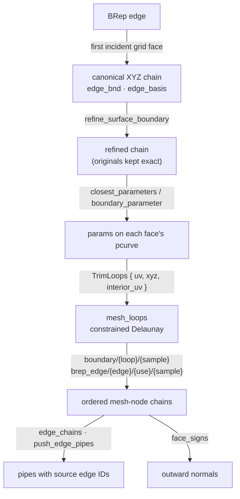
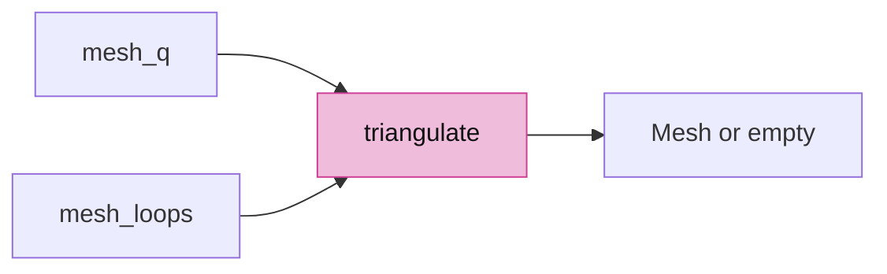
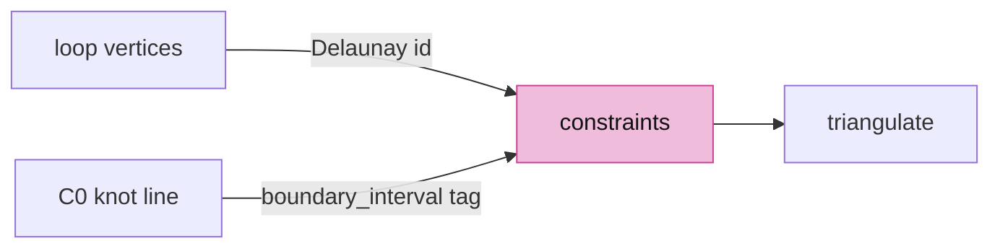
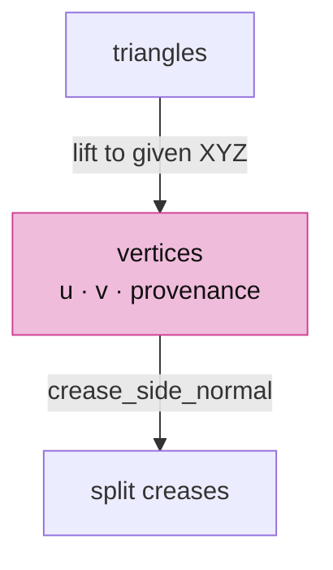
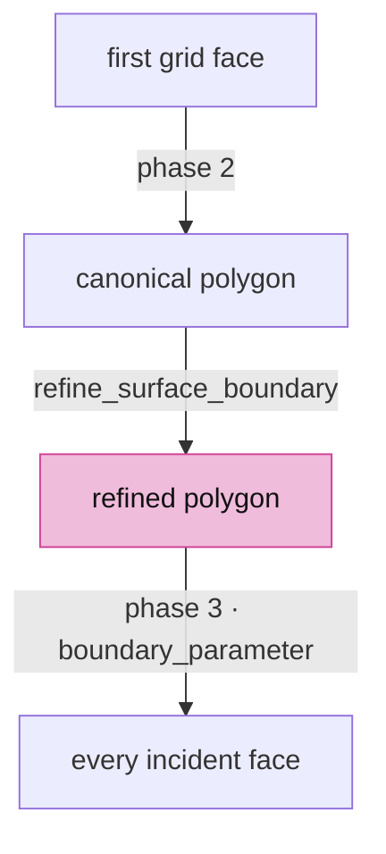
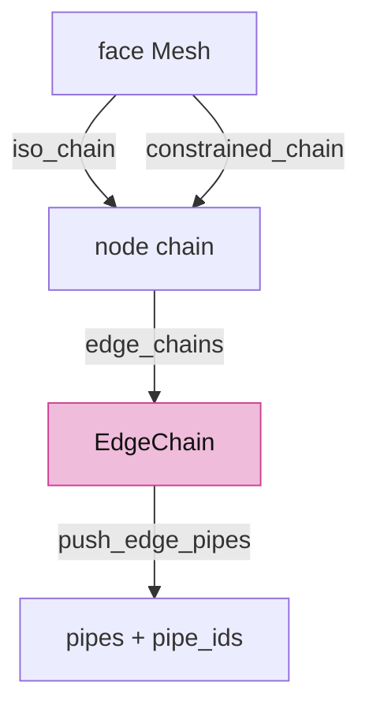
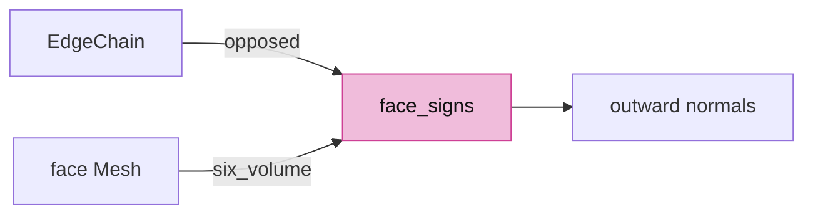
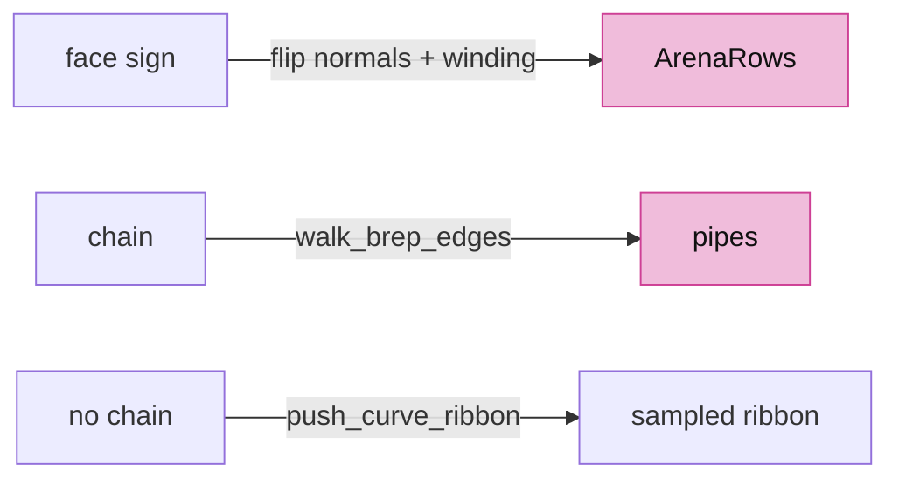
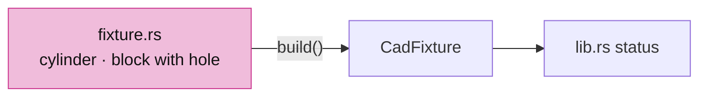

# 07 · Shared boundaries

## You are building

## Starting point

- Checkpoint 06: each BRep face is tessellated on its own; boundaries are records without geometry.
- Two faces that agree on an edge's endpoints can still chord the curve differently, so their seam z-fights and interior refinement can bury a coarse boundary chord.
- Fix: one XYZ polygon per edge, shared bit for bit by every incident face, then draw ink from the mesh nodes that polygon became.

<!-- supplied: 07 -->

## Step 1 · Kernel: the trim-loop contract

- `TrimLoops` is what a BRep hands the mesher for one face: UV polygons, the 3D point each polygon vertex must lift to, and interior seeds.
- Loop vertices keep their positions exactly; a neighbouring face fed the same polygon lifts to the same bits.

<!-- file: 07 session_rust/src/nurbssurface_trimmed.rs type hunks=1-1 -->

<!-- file: 07 session_rust/src/lib.rs type -->

## Step 2 · Kernel: one triangulation body

- `mesh_q` (untrimmed entry) and `mesh_loops` (BRep entry) share `triangulate`; the bounding-box diagonal moves into its own helper.
- `mesh_loops` rejects invalid input and lost boundary provenance with an empty mesh instead of manufacturing a face.

<!-- file: 07 session_rust/src/nurbssurface_trimmed.rs type hunks=2-6 -->

## Step 3 · Kernel: constrain boundaries and C0 knot lines

- Every loop vertex keeps its Delaunay id, so a given 3D point and a `boundary/{loop}/{sample}` tag reach the vertex it becomes.
- Where a loop segment crosses an interior C0 knot line, a node is inserted with a `boundary_interval/{loop}/{segment}` fraction: a polygon interval, not a curve parameter.
- Knot lines inside the trim are constrained too; the refinement test evaluates normals on the triangle's own side of a crease.

<!-- file: 07 session_rust/src/nurbssurface_trimmed.rs type hunks=7-8 -->

## Step 4 · Kernel: lift to the given points, tag, split creases

- A triangle straddling a crease knot means the constraint failed: the result is an empty mesh, never a smeared crease.
- With given XYZ the weld tolerance is zero; interval nodes interpolate on the supplied chord, so both faces see the same inserted point.

<!-- file: 07 session_rust/src/nurbssurface_trimmed.rs type hunks=9-10 -->

- Singular points take the mean of their fan's face normals in key order; every vertex records `u`, `v` and its boundary provenance before the crease split.

<!-- file: 07 session_rust/src/nurbssurface_trimmed.rs type hunks=11-12 -->

## Step 5 · Kernel: BRep phases

- Phase 2: the first incident grid face supplies the canonical polygon and its pcurve parameters; any other grid whose samples differ is marked for rebuild rather than left incompatible.
- Curved boundaries are refined before any interior refinement, then every incident face is rebuilt with the refined polygon.
- Phase 3: shared XYZ is mapped onto each face's actual pcurve and checked against edge/face tolerance; a wrong periodic branch falls back to a bounded search on that pcurve.

<!-- file: 07 session_rust/src/brep.rs type hunks=1-3 -->

- The helpers: bounded golden-section search on the lifted pcurve, one-sided boundary normals at singular ends, and refinement that keeps original samples exact.

<!-- file: 07 session_rust/src/brep.rs type hunks=4 -->

<!-- check: 07 -->

## Step 6 · Viewer: chains from the face meshes

- Grid faces give an iso-parametric chain read straight off `u`/`v` attributes; constrained faces give the `brep_edge/{edge}/{use}/{sample}` nodes.

<!-- file: 07 session_viewer/src/app/walk/brep_edges.rs type whole lines=1-39 -->

- A pcurve of a grid face is a straight iso line; its constant parameter names one sample column, with the wrap of a closed direction handled without tolerance.

<!-- file: 07 session_viewer/src/app/walk/brep_edges.rs type whole lines=40-99 -->

<!-- file: 07 session_viewer/src/app/walk/brep_edges.rs type whole lines=100-165 -->

- `constrained_chain` orders producer-tagged nodes by sample index plus interval fraction; a missing sample makes the chain unavailable rather than approximate.

<!-- file: 07 session_viewer/src/app/walk/brep_edges.rs type whole lines=166-239 -->

- One chain per edge from the first use that can supply one; the other face lends the facing cull its normal.

<!-- file: 07 session_viewer/src/app/walk/brep_edges.rs type whole lines=240-316 -->

- Pipes carry both faces' outward normals; a collapsed f32 segment is skipped so it cannot become a pick target. `pipe_ids` records the source edge index per pipe.

<!-- file: 07 session_viewer/src/app/walk/brep_edges.rs type whole lines=317-381 -->

<!-- file: 07 session_viewer/src/app/walk/brep_edges.rs copy whole lines=382-712 -->

## Step 7 · Viewer: outward orientation from the tessellation

- Face-use flags are never read: two faces that walk a shared edge in opposite directions agree, and a group enclosing negative volume is inside out.

<!-- file: 07 session_viewer/src/app/walk/brep_orient.rs type lines=1-78 -->

<!-- file: 07 session_viewer/src/app/walk/brep_orient.rs type lines=79-113 -->

<!-- file: 07 session_viewer/src/app/walk/brep_orient.rs type lines=114-162 -->

<!-- file: 07 session_viewer/src/app/walk/brep_orient.rs copy lines=163-277 -->

<!-- file: 07 session_viewer/src/app/walk/mod.rs type -->

<!-- check: 07 -->

## Step 8 · Viewer: ink the solid's edges

- A negative face sign flips normals and winding before upload, so shading, culling and boundary facing agree.
- An edge without a chain is drawn as a sampled ribbon and logged: a display fallback, not a coherent CAD boundary.

<!-- file: 07 session_viewer/src/app/walk/brep.rs type -->

## Step 9 · Fixture and status

A cylinder (closed seam, two circles) and a block with a hole (inner wire) exercise shared and trimmed boundaries.

<!-- file: 07 session_viewer/src/fixture.rs copy -->

<!-- file: 07 session_viewer/src/lib.rs type -->

<!-- file: 07 session_viewer/index.html copy -->

## Check

<!-- checkpoint: 07 -->

Expected:

- Two grey solids: a cylinder and a block with a through hole. Black ink on every CAD edge, including the hole rim and the cylinder's seam and circles.
- Orbit: each boundary stays attached to its face; no tessellation diagonal appears as an edge.
- The inspection JSON's `sourceEdgeIds` lists an edge index per pipe.

If a boundary floats or doubles, compare the f64 chains of both faces first, then the f32 endpoints, then visibility.

## What changed

<!-- tree: 07 session_viewer/src/app/walk -->

- Kernel: `TrimLoops`, `mesh_loops`, boundary refinement and pcurve mapping give every incident face the same boundary nodes with provenance.
- Viewer: chains are read from those nodes; pipes keep source edge IDs and both faces' outward normals.

**Production equivalent:** Production keeps this in `session_rust/src/{brep,nurbssurface_trimmed}.rs` and `src/app/walk/{brep,brep_edges,brep_orient}.rs`. The [CAD design record](cad-design.md) records the OCCT comparison behind this contract.

## Try

- Append `?top=1`: the cylinder's seam and both circles are seen edge-on; the seam is still one line, because both incident face meshes were built from the same chain.
- Append `?thickness=4` and orbit: the pipes widen but never detach from the faces, which only holds because their endpoints are mesh nodes.
- Zoom close to the hole rim with `?distance=0.4`: the rim stays attached to the inner face; a separately sampled circle would float above or sink below it.

## Recall

??? question "Two faces agree on an edge's endpoints. Why is that not enough?"
    Because agreeing on the ends says nothing about the middle: each face may chord the curve differently, so the seam z-fights and one face's coarse chord can be buried under the other's refinement. The fix is stronger than agreement — one canonical XYZ polygon, shared bit for bit, so there is nothing left to disagree about.

??? question "Why is the ink drawn from mesh nodes rather than sampled from the CAD curve?"
    Because a separately sampled curve is a *different* approximation of the same edge, and it will float above or sink below the tessellation it is meant to outline — visibly, as soon as you zoom in. Drawing from the nodes the boundary polygon became makes the line and the surface the same geometry by construction, not by tolerance.

??? question "When the constraint fails, the kernel returns an empty mesh. Defend that choice against 'return the best mesh you can'."
    A smeared crease or a manufactured face looks plausible and is wrong: it would be inked, picked, measured and trusted. An empty face is obviously broken, is reported, and cannot silently propagate into a drawing someone builds from. In a CAD kernel, a visible failure is cheaper than a quiet approximation.

??? question "Face-use flags are never read when deciding which way is out. What is used instead, and why is that more robust?"
    The tessellation itself: two faces that walk a shared edge in opposite directions agree, and a group enclosing negative volume is inside out. Flags are metadata that an upstream tool can get wrong; the geometry cannot lie about its own winding. Prefer the invariant you can compute over the one you were told.

**Rebuild from memory:** explain, in three sentences and without the page, why this lesson's fix is *upstream* of the viewer at all — what would have to be true for the viewer to fix it alone, and why that is not true here. This is the first lesson where the right change was not in the renderer, and recognising that situation is a skill of its own.

## Next

[08 · Trims and seams](08-trimming.md): holes, natural boundaries and repeated seam uses keep correct geometry and source IDs.
