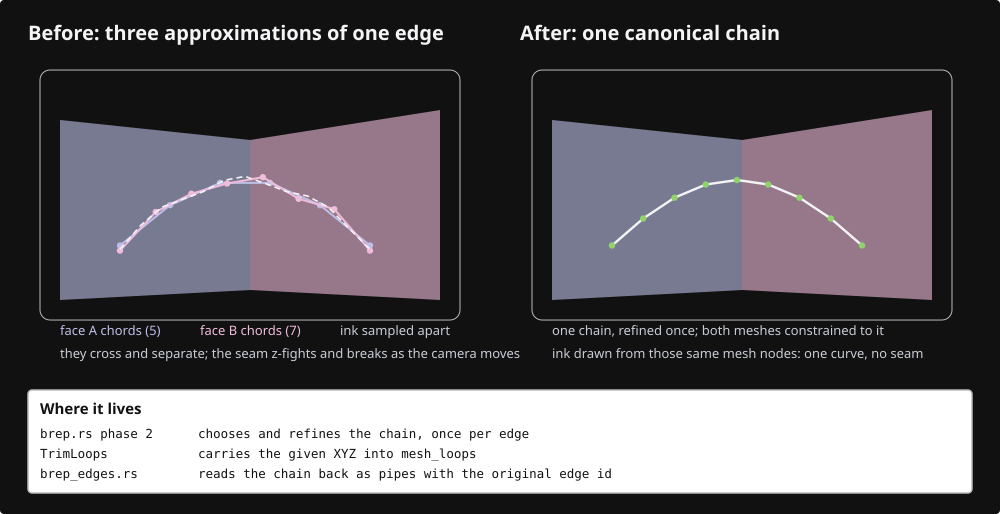

# 07 · Shared boundaries

**Estimated study time: about 1–3 hours.** Includes reading, typing, tracing, testing and experiments. [How to use this estimate](map.md#time-estimates).

**This section:** Follow the sampling and ordering of a shared CAD boundary.

**In the whole viewer:** This explains how neighbouring surface producers agree before their triangles reach the renderer.

**Follow the data:** One source edge → ordered samples → both adjacent face boundaries → matching display edges.

**Start with these files:** [`src/app/walk/brep_edges.rs`](06-cad-contract.md#code-06-006).

**Aim to explain:** Why can independently sampling two mathematically identical edges leave a crack?

[Whole-viewer map and course milestones](map.md)

Two faces meeting at an edge must use matching boundary samples. Otherwise a tiny crack may appear even when both faces describe the same mathematical edge. Before we join samples, we need a predictable order and a clear rule for coincident parameters.



Start from the working result of [step 06](06-cad-contract.md).

This is a review step. Keep your existing code and use the experiment below to check your understanding.

## Check the completed chapter

From `session_viewer`, compare everything you have typed:

```sh
npm --prefix ../session_tests run course -- reference-check 07
```

From `workspace/handwritten`:

```sh
cargo build --lib --locked -j4
cargo xtest --lib --locked -j4
```

Run the native boundary tests. Follow the sorting helpers into the edge-chain builder you typed and locate where neighbouring faces share a sample.

If a seam appears, inspect the sample identifiers and ordering before increasing the tessellation density. More mismatched samples still leave a mismatch.

**Before moving on:** explain what changed, check the expected result above, and fix any build or test failure.

<details>
<summary>Check your explanation of the opening question</summary>

The two samplers may choose different positions or ordering. Shared boundary samples make the displayed faces meet consistently.

</details>

[Next step: 08](08-trimming.md)
