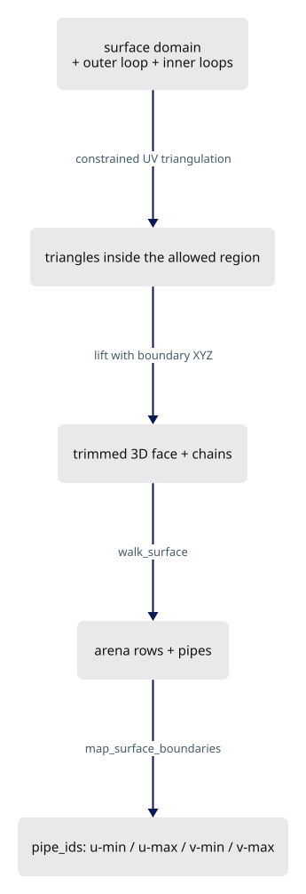
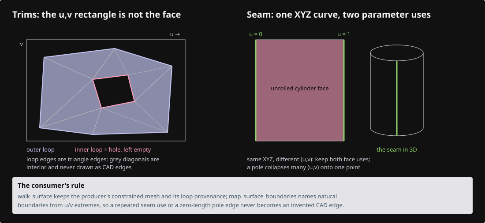
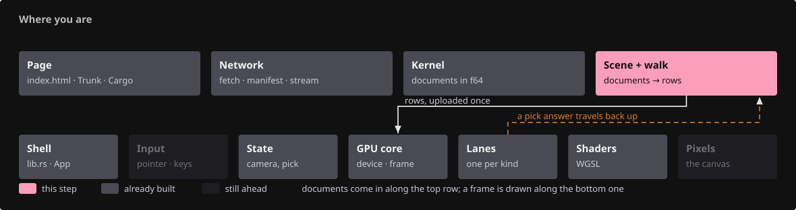
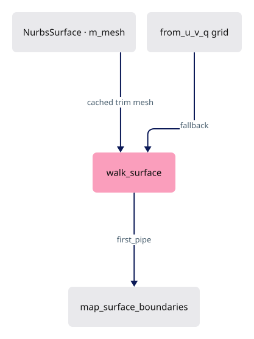
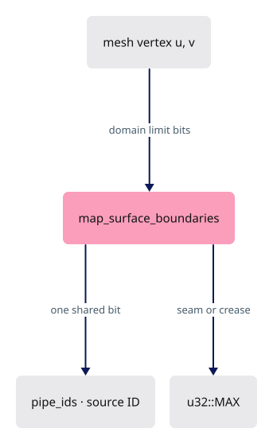
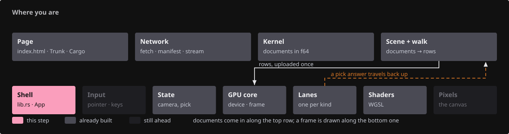
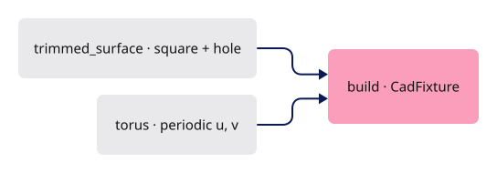
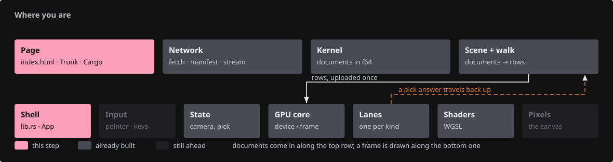
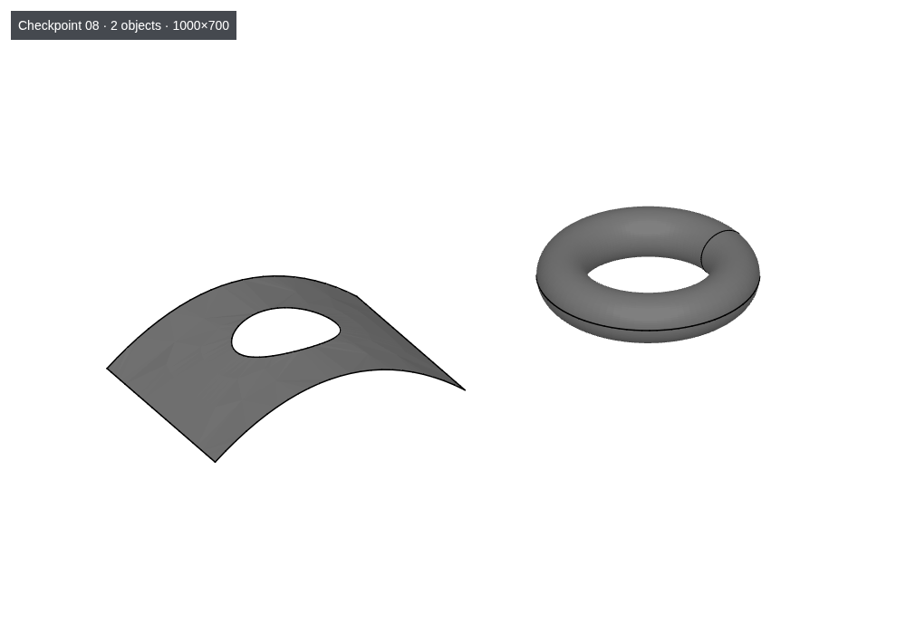

# 08 · Trims, holes and periodic seams

## You are building

## Starting point

- Checkpoint 07: BRep faces share one canonical boundary polygon; every pipe of a BRep edge carries its source edge ID.
- A standalone NURBS surface still tessellates its whole natural UV rectangle and its pipes have no source IDs.
- This lesson changes only the viewer consumer; the kernel's constrained mesher and `TrimLoops` supply the trimmed mesh.

<!-- step-status: start -->

**Does it compile yet?** Yes, after every step of this lesson — `cargo check` was run at the end of each one to make sure. A step that writes a file Rust has not been told about yet compiles without checking any of it, so keep going to the checkpoint: that build is the real test.

<!-- step-status: end -->

## Step 1 · Prefer the producer's cached trim mesh

{ .locator data-strip="illustrations/strip-bb17a255a3.svg" }

- Triangulating the full rectangle and drawing a hole curve on top does not make a hole. The fill must exclude the region, so the constrained mesh cached on the surface wins over a fresh grid.
- `first_pipe` remembers where this surface's pipes start so only those get boundary IDs.

<!-- file: 08 session_viewer/src/app/walk/brep.rs type hunks=1-1 -->

## Step 2 · Name natural boundaries from UV, not from triangle order

{ .locator data-strip="illustrations/strip-bb17a255a3.svg" }

- A natural boundary is a domain limit: `u == start`, `u == end`, `v == start`, `v == end`. A closed direction has no physical edge there, so a periodic seam never gets a boundary ID.
- Two vertices of one pipe share exactly one boundary bit → that bit is the source ID. Interior creases and seams stay `u32::MAX`: unavailable, never invented from a triangulation index.
- Keys are exact position bits; no weld tolerance enters.
- Everything from `#[cfg(test)]` down is the module's unit tests: COPY.

<!-- file: 08 session_viewer/src/app/walk/brep.rs type hunks=2-2 -->

<!-- check: 08 -->

## Step 3 · Fixture: a curved trimmed patch and a torus

{ .locator data-strip="illustrations/strip-3bd0a898de.svg" }

- The patch is a degree-2 surface with a square outer loop and a circular inner loop, meshed once by the constrained mesher and cached in `m_mesh`.
- The torus is periodic in both directions: same XYZ curve, two face uses, different UV.

<!-- file: 08 session_viewer/src/fixture.rs copy -->

## Step 4 · Stage bump

{ .locator data-strip="illustrations/strip-460ff53e99.svg" }

<!-- file: 08 session_viewer/src/lib.rs type -->

<!-- file: 08 session_viewer/index.html copy -->

## Check

<!-- checkpoint: 08 -->

Expected:

- The patch shows a real hole in the fill, not a drawn circle over a filled surface.
- Orbit: boundary ink stays attached to the patch and to the torus.
- The torus seam is visible as ink on a geometrically smooth surface; the surface has no lighting break there.
- Status shows **2 objects**.

If a periodic boundary crosses the wrong part of the surface, inspect the UV branch and the oriented use mapping before touching stroke depth.

## What changed

<!-- tree: 08 session_viewer/src/app -->

- Data flow: cached `m_mesh` → `walk_mesh` → pipes → `map_surface_boundaries` → `pipe_ids`.
- A seam and a shading crease are different things: a seam is repeated parameter coordinates, a crease is a lighting discontinuity, and this lesson touches only the first.

**Production equivalent:** Production keeps this in `src/app/walk/brep.rs` (`walk_surface`, `map_surface_boundaries`) and the kernel's `session_rust/src/nurbssurface_trimmed.rs`.

## Try

- Append `?top=1` and look through the hole: the fill is absent there, not merely covered by a curve.
- Orbit around the torus seam with `?thickness=3`: the seam stays one line, drawn from one face use, although two parameter uses share it.
- Zoom in on a natural boundary of the trimmed patch with the wheel: the rim is still ink from the mesh nodes, so it cannot detach however close you get.

## Questions and answers

**Why does drawing the hole's curve on top of a full rectangle not make a hole?**

*How to work it out.* Ask what a hole has to do, beyond looking right from one angle. You must be able to see through it, it must not occlude, and clicking through it must hit whatever is behind. A painted circle fails all three, because the face is still there.

*The answer.* The fill still writes depth, still occludes, still answers a pick. A hole is an absence in the *mesh*, which is why the constrained mesh cached on the surface has to win over a freshly triangulated grid.

**A natural boundary gets a source ID; a periodic seam does not. What distinguishes them?**

*How to work it out.* Ask, for each, whether the surface continues past it. At `u == start` the domain ends — there is nothing beyond, so there is a real edge. At a periodic seam the surface wraps and continues; the seam is where the parameterisation was cut, not where the shape stops.

*The answer.* A natural boundary is a limit of the domain and a real edge of a real face. A seam is bookkeeping. Giving the seam an ID would invent a CAD edge, which is the same refusal as tessellation seams in lesson 06.

**A seam and a shading crease sound alike. State the difference in one sentence each.**

*How to work it out.* Ask which quantity is discontinuous. At a seam, the parameter jumps while position and normal are continuous. At a crease, the normal jumps while position is continuous.

*The answer.* A seam is repeated parameter coordinates — the same XYZ reached at `u = 0` and `u = 1`. A crease is a discontinuity in the normal, a genuine fold. A torus has seams and no creases; a folded plane has a crease and no seam.

**Boundary keys use exact position bits with no weld tolerance. Why is a tolerance the wrong tool here?**

*How to work it out.* Ask where the two sets of points came from. Lesson 07 arranged for both faces to be *given* the same points, so equality is exact by construction. A tolerance can then only do damage: it can merge two boundaries that genuinely differ.

*The answer.* A tolerance is for reconciling independent approximations. When you have arranged for the bits to be identical, compare the bits — and if they ever differ, that is a real bug you want to hear about rather than smooth over.

**What you should be able to do now**

Predict what a *user* sees if `map_surface_boundaries` gets the wrong `first_pipe`. Correct: boundary source IDs land on the wrong pipes — some of this surface's edges report no id and become unselectable, while pipes belonging to an earlier object get ids that are not theirs, so clicking one edge highlights a different one. Translating a bookkeeping mistake into a symptom is most of debugging.

## Next

[09 · Normals and shading](09-normals.md): analytic normals, singular fallbacks, C0 splits and the affine normal transform.
